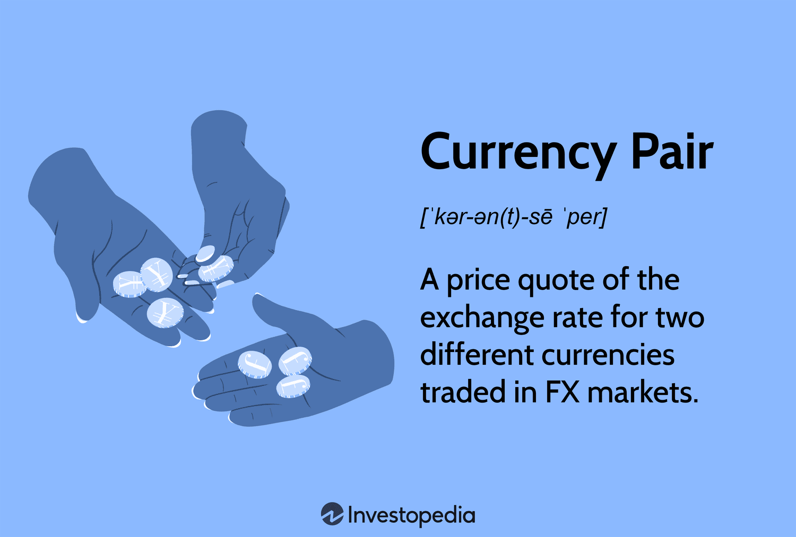

## Table of Contents

## What is a currency pair?

A currency pair is when you compare the value of one country's money to another country's money. It's like a price tag that shows how much of one currency you need to buy another currency. For example, if you see "EUR/USD," it means you're looking at how many US dollars (USD) you need to get one Euro (EUR).

In trading, people use currency pairs to buy and sell different currencies. They might think one currency will become stronger or weaker compared to another. When they trade, they're hoping to make money from these changes in value. The first currency in the pair is called the "base currency," and the second one is the "quote currency." So, if you're looking at EUR/USD, the Euro is the base and the US dollar is the quote.

## How are currency pairs categorized?

Currency pairs are sorted into three main groups: major pairs, minor pairs, and exotic pairs. Major pairs are the most traded and include currencies from big economies like the US, Europe, and Japan. These pairs are usually very liquid, meaning they're easy to buy and sell without big price changes. Examples are EUR/USD, USD/JPY, and GBP/USD.

Minor pairs, also called cross-currency pairs, don't include the US dollar. They're less traded than major pairs but still have good [liquidity](/wiki/liquidity-risk-premium). Examples include EUR/GBP, EUR/CHF, and GBP/JPY. These pairs can be a bit more volatile than major pairs because they're traded less often.

Exotic pairs include one major currency and one from a smaller or emerging economy. These pairs can be riskier because they're not traded as much, so they can have bigger price swings. Examples are USD/TRY (US dollar vs Turkish lira) and EUR/CZK (Euro vs Czech koruna). Trading these pairs might offer more chances for big gains, but also comes with more risk.

## What are the most common major currency pairs?

The most common major currency pairs are the ones that get traded the most around the world. These pairs have the US dollar on one side because it's a big and important currency. Some of the most common ones are EUR/USD, which is the Euro against the US dollar, USD/JPY, which is the US dollar against the Japanese yen, and GBP/USD, which is the British pound against the US dollar. These pairs are called "major" because they're very popular and lots of people trade them.

Other common major pairs include USD/CHF, which is the US dollar against the Swiss franc, AUD/USD, which is the Australian dollar against the US dollar, and USD/CAD, which is the US dollar against the Canadian dollar. These pairs are also very liquid, meaning you can easily buy and sell them without big price changes. They're important because they show how the US dollar is doing compared to other big currencies around the world.

## Can you explain the difference between major and minor currency pairs?

Major currency pairs are the ones that people trade the most. They always have the US dollar on one side and another big currency on the other side. Examples are EUR/USD, which is the Euro against the US dollar, and USD/JPY, which is the US dollar against the Japanese yen. These pairs are very popular and easy to trade because lots of people want to buy and sell them. This means they're very liquid, so the prices don't jump around too much.

Minor currency pairs, also called cross-currency pairs, don't have the US dollar in them. They're made up of other big currencies, like EUR/GBP, which is the Euro against the British pound, or EUR/CHF, which is the Euro against the Swiss franc. These pairs are traded less often than major pairs, so they can be a bit harder to buy and sell. Because fewer people trade them, the prices can move around more, which means they can be more risky but also offer chances for bigger gains.

## What defines an exotic currency pair?

An exotic currency pair is made up of one major currency and one from a smaller or less developed country. These pairs are not traded as much as major or minor pairs. Because fewer people trade them, they can be harder to buy and sell. Examples of exotic pairs include USD/TRY, which is the US dollar against the Turkish lira, and EUR/CZK, which is the Euro against the Czech koruna.

Exotic pairs can be riskier to trade because they can have bigger price swings. This is because they're not as liquid, meaning there aren't as many people buying and selling them. While this can offer chances for bigger profits, it also means there's a higher chance of losing money. So, people who trade exotic pairs need to be careful and understand the risks involved.

## How do liquidity and volatility differ among major, minor, and exotic pairs?

Liquidity and volatility are different for major, minor, and exotic currency pairs. Major pairs, like EUR/USD and USD/JPY, are the most liquid because lots of people trade them. This means you can easily buy and sell them without big price changes. They're less volatile, so the prices don't jump around too much. This makes them a safer choice for trading because you can predict the price movements better.

Minor pairs, like EUR/GBP and EUR/CHF, don't have the US dollar in them. They're less liquid than major pairs because fewer people trade them. Because of this, they can be more volatile, which means the prices can move around more. This adds some risk, but it also gives a chance for bigger gains if you can predict the price movements correctly.

Exotic pairs, like USD/TRY and EUR/CZK, are the least liquid because they include currencies from smaller or less developed countries. Very few people trade them, so it can be hard to buy and sell them. They're the most volatile, with the biggest price swings. Trading exotic pairs can be very risky, but if you get it right, the rewards can be big. It's important to be careful and know what you're doing when trading these pairs.

## What are some examples of minor currency pairs?

Minor currency pairs, also called cross-currency pairs, are pairs that don't have the US dollar in them. They're made up of other big currencies like the Euro, the British pound, and the Japanese yen. Some common examples of minor pairs are EUR/GBP, which is the Euro against the British pound, and EUR/CHF, which is the Euro against the Swiss franc. Another example is GBP/JPY, which is the British pound against the Japanese yen.

These pairs are not traded as much as major pairs, so they're less liquid. This means it can be a bit harder to buy and sell them compared to major pairs. Because fewer people trade them, the prices can move around more, making them more volatile. So, trading minor pairs can be riskier but also offers chances for bigger gains if you can predict the price movements correctly.

## Can you list some exotic currency pairs?

Exotic currency pairs have one big currency and one from a smaller or less developed country. Some examples are USD/TRY, which is the US dollar against the Turkish lira, and USD/MXN, which is the US dollar against the Mexican peso. Another example is EUR/CZK, which is the Euro against the Czech koruna. These pairs are not traded as much as major or minor pairs.

Because fewer people trade exotic pairs, they can be harder to buy and sell. This makes them less liquid, and their prices can jump around a lot, which means they're more volatile. Trading these pairs can be riskier because of the big price swings, but if you guess right, you could make bigger profits. It's important to be careful and know the risks when trading exotic pairs.

## How does trading in major pairs differ from trading in exotic pairs in terms of strategy?

Trading major pairs like EUR/USD and USD/JPY is usually safer and easier than trading exotic pairs. Because lots of people trade major pairs, they are very liquid. This means you can buy and sell them easily without big price changes. Traders often use strategies that focus on small, steady profits because the prices don't move around too much. They might use technical analysis, which looks at past price movements to predict future ones, or they might follow economic news to see how it affects the currency's value.

Trading exotic pairs like USD/TRY and EUR/CZK is riskier and requires different strategies. These pairs are not traded as much, so they are less liquid and their prices can jump around a lot. Because of this, traders might look for bigger price moves to make bigger profits, but they also face a higher chance of losing money. Strategies for exotic pairs often involve keeping a close eye on the smaller country's economy, politics, and news events, as these can cause big changes in the currency's value. Traders need to be ready for more volatility and might need to use stop-loss orders to limit their losses if the price moves against them.

## What are the typical spreads for major, minor, and exotic currency pairs?

Major currency pairs like EUR/USD and USD/JPY usually have the smallest spreads. A spread is the difference between the price to buy and the price to sell a currency pair. Because lots of people trade major pairs, the spreads are often very small, maybe just a few pips. A pip is a small unit of price movement. For example, the spread for EUR/USD might be 1 to 2 pips. This makes it cheaper to trade major pairs because you don't lose much money just to enter and [exit](/wiki/exit-strategy) a trade.

Minor currency pairs, like EUR/GBP and GBP/JPY, have bigger spreads than major pairs. These pairs are not traded as much, so the spreads might be around 2 to 5 pips. The spreads are bigger because fewer people are buying and selling these pairs, so it's harder to find someone to trade with. This can make trading minor pairs a bit more expensive because you pay more to enter and exit a trade.

Exotic currency pairs, like USD/TRY and EUR/CZK, have the biggest spreads. Because very few people trade these pairs, the spreads can be much larger, sometimes 50 pips or more. Trading exotic pairs can be very costly because of these big spreads. It's important to think about the spread when you're deciding to trade an exotic pair, as it can eat into your profits or make your losses bigger.

## How do geopolitical events impact different types of currency pairs?

Geopolitical events can shake up currency pairs a lot, but how much depends on the type of pair. Major pairs like EUR/USD or USD/JPY feel the impact less because they are very liquid and lots of people trade them. Big events like elections or trade deals can move their prices, but the changes are usually smaller and more predictable. Traders watch the news closely and might adjust their trades based on what they expect to happen, but the overall market stays pretty stable because so many people are involved.

Minor pairs like EUR/GBP or GBP/JPY can be more affected by geopolitical events because fewer people trade them. When something big happens, like a political crisis or a change in policy, the prices of these pairs can jump around more. This is because there are fewer traders to balance out the market, so the impact of the news can be stronger. Traders need to be extra careful and might need to use strategies that help them deal with the bigger price swings.

Exotic pairs like USD/TRY or EUR/CZK can be hit the hardest by geopolitical events. These pairs have one currency from a smaller or less developed country, so news about that country can cause huge price changes. For example, if there's a big political change or economic news in Turkey, the USD/TRY pair might move a lot. Because so few people trade exotic pairs, the market can be very volatile. Traders who deal with exotic pairs need to be ready for big surprises and often have to react quickly to new information.

## What advanced trading techniques are used specifically for exotic currency pairs?

When trading exotic currency pairs, traders often use advanced techniques that help them deal with the big price swings and low liquidity. One common technique is using wider stop-loss orders. Because exotic pairs can move a lot, traders set their stop-losses further away from their entry price. This helps them avoid getting kicked out of a trade too soon because of a sudden price jump. They also use larger take-profit targets to aim for bigger gains, since the price moves can be significant.

Another technique is called "[scalping](/wiki/gamma-scalping)," where traders make lots of small trades to take advantage of quick price changes. Since exotic pairs can be very volatile, scalping can be a good way to make money from these short-term movements. Traders also pay close attention to news and events in the smaller country's economy, using "event-driven trading" to predict how these might affect the currency's value. This means they're always ready to act fast when big news comes out, hoping to profit from the market's reaction.

## What are exotic currency pairs?

Exotic currency pairs in forex trading involve the pairing of one major currency with a currency from a developing or emerging market. Unlike their major counterparts, which consist of currency pairs like EUR/USD and GBP/USD, exotic pairs usually feature currencies from smaller economies which are not as widely exchanged on global markets. For instance, USD/SGD (US Dollar/Singapore Dollar) and EUR/TRY (Euro/Turkish Lira) are considered exotic pairs due to the inclusion of the Singapore Dollar and the Turkish Lira, respectively.

These pairs are defined by certain characteristics that distinguish them from major and minor currency pairs. Foremost among these is liquidity. Exotic currency pairs are generally less liquid than major and minor pairs, meaning there is usually a lesser [volume](/wiki/volume-trading-strategy) of trading activity. This reduced liquidity contributes to wider spreads—the difference between the bid and ask prices in trading—making the transaction costs higher for traders.

Volatility is another hallmark of exotic currency pairs. Due to the economic and political conditions of emerging markets, these pairs tend to experience greater price fluctuations. This volatility can be attributed to factors such as political instability, fluctuating growth rates, inflation, and other economic indicators specific to the countries involved. As a result, while exotic pairs offer the potential for higher profits due to their price swings, they also pose increased risks for traders who must navigate these factors without the relative stability associated with major currencies.

In mathematical terms, the [volatility](/wiki/volatility-trading-strategies) $\sigma$ of an exotic currency pair can be expressed by the standard deviation of its price changes over a specific period:

$$
\sigma = \sqrt{\frac{1}{N-1} \sum_{i=1}^{N} (X_i - \mu)^2}
$$

where $X_i$ is each individual price change, $\mu$ is the mean of these changes, and $N$ is the total number of observations.

Overall, understanding the characteristics of exotic currency pairs—encompassing their high volatility, wider spreads, and diverse influencing factors—is essential for any [forex](/wiki/forex-system) trader aiming to engage effectively with this segment of the market.

## References & Further Reading

[1]: ["Foreign Exchange Option Pricing: A Practitioner's Guide"](https://onlinelibrary.wiley.com/doi/book/10.1002/9781119208679) by Iain J. Clark

[2]: "Algorithmic Trading and DMA: An introduction to direct access trading strategies" by Barry Johnson

[3]: ["Forex Analysis and Trading: Effective Top-Down Strategies Combining Fundamental, Position, and Technical Analyses"](https://archive.org/details/forexanalysistra0000mart) by T.J. Marta and Joseph Brusuelas

[4]: ["High-Frequency Trading and Probability Theory"](https://worldscientific.com/worldscibooks/10.1142/9233) by Ulrich Horst and Michael Rothel in the journal Applied Mathematics and Optimization

[5]: ["The Foreign Exchange Matrix: A New Framework for Understanding Currency Movements"](https://www.amazon.com/Foreign-Exchange-Matrix-framework-understanding/dp/0857191306) by Barbara Rockefeller

[6]: ["The Economics of Foreign Exchange and Global Finance"](https://link.springer.com/book/10.1007/978-3-662-59271-7) by Peijie Wang