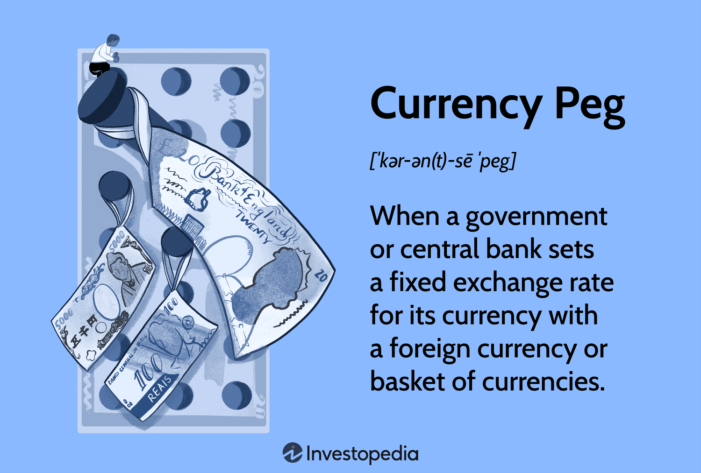

## Table of Contents

## What is a currency peg?

A currency peg is when a country decides to fix the value of its own money to the value of another country's money or to a basket of currencies. This means that the exchange rate between the two currencies stays the same. For example, if a country pegs its currency to the US dollar, it will always be worth the same amount of US dollars. This can help make trade and investment easier because people know exactly how much their money is worth.

Countries might choose to peg their currency for different reasons. One reason is to control inflation, which is when prices go up a lot. By pegging to a stable currency, a country can keep its own prices from rising too fast. Another reason is to make it easier to do business with other countries, especially the one whose currency they are pegging to. However, maintaining a currency peg can be hard because the country has to keep enough of the other currency to make the peg work, and sometimes this can lead to problems if the economy changes a lot.

## Why do countries choose to peg their currency?

Countries choose to peg their currency mainly to make their economy more stable and to make it easier to trade with other countries. When a country pegs its currency to a stronger and more stable currency, like the US dollar, it can help control inflation. Inflation is when prices keep going up, and it can make life harder for people. By pegging to a stable currency, a country can keep its own prices from rising too fast, which helps everyone.

Another reason countries peg their currency is to make trade and investment easier. When the value of a country's money stays the same compared to another country's money, businesses know exactly how much their money is worth. This makes it easier for them to buy and sell things across borders. It also makes investors feel more confident because they know their money won't suddenly lose value. But keeping a currency peg can be tough, because the country needs to have enough of the other currency to make the peg work, and this can be hard if the economy changes a lot.

## What are the different types of currency pegs?

There are different types of currency pegs, but the main ones are fixed pegs and crawling pegs. A fixed peg means a country ties its currency to another currency at a set rate. For example, if a country pegs its currency to the US dollar, it will always be worth the same amount of US dollars. This makes trade and investment easier because people know exactly how much their money is worth. However, keeping a fixed peg can be hard because the country needs to have enough of the other currency to make the peg work, and this can be tricky if the economy changes a lot.

A crawling peg is different because the exchange rate can change slowly over time. Instead of staying at one fixed rate, the currency's value might go up or down a little bit each day or month. This can help a country adjust to changes in the economy without having big sudden changes in the value of its money. Crawling pegs can be useful for countries that want some stability but also need to adapt to economic changes. Both fixed and crawling pegs have their own challenges, but they can help countries manage their economies better.

## How does a currency peg affect a country's economy?

A currency peg can help a country's economy by making it more stable. When a country pegs its currency to a stronger and more stable currency, like the US dollar, it can help keep prices from rising too fast. This is good because high prices can make life harder for people. A currency peg also makes trade and investment easier. When the value of a country's money stays the same compared to another country's money, businesses know exactly how much their money is worth. This makes it easier for them to buy and sell things across borders and makes investors feel more confident.

However, keeping a currency peg can also be tough. The country needs to have enough of the other currency to make the peg work, and this can be hard if the economy changes a lot. If the country doesn't have enough of the other currency, it might have to borrow money or change the peg, which can cause problems. Sometimes, a currency peg can make a country's economy too dependent on another country's economy. If the country it's pegged to has problems, those problems can affect the pegged country too. So, while a currency peg can bring stability, it also comes with risks that need to be managed carefully.

## What is the difference between a hard peg and a soft peg?

A hard peg is when a country fixes its currency very tightly to another currency or a basket of currencies. It means the exchange rate stays the same all the time. Countries with hard pegs often use a lot of their money reserves to keep the peg strong. A good example of a hard peg is when a country uses a currency board, where the country's money is backed by the foreign currency it's pegged to. Hard pegs are very strict and can make a country's economy very stable, but they can also be hard to keep if the economy changes a lot.

A soft peg is not as strict as a hard peg. The exchange rate can move a little bit, but it stays within a certain range. This gives a country more flexibility to adjust to changes in the economy. Soft pegs can be useful for countries that want some stability but also need to be able to change their money's value if things change. Soft pegs are less risky than hard pegs because they allow for some movement, but they can still make trade and investment easier by keeping the exchange rate from changing too much.

## Can you explain the process of pegging a currency to another?

When a country wants to peg its currency to another, it decides to fix the value of its own money to the value of another country's money. For example, if a country wants to peg its currency to the US dollar, it will set a fixed exchange rate, like 1 US dollar equals 10 of its own currency units. To make this work, the country needs to have enough US dollars in its reserves. Whenever people want to exchange the country's currency for US dollars, the country uses its reserves to give them the US dollars at the fixed rate.

Keeping the peg in place can be tricky. The country has to keep buying and selling its own currency to make sure the exchange rate stays the same. If more people want to exchange the country's currency for US dollars than the country has in its reserves, it might have to borrow more US dollars or change the peg. This can be hard, especially if the country's economy is not doing well or if the US dollar's value changes a lot. But if the country can keep the peg stable, it can help make trade and investment easier and keep prices from rising too fast.

## What are some historical examples of currency pegs?

One famous example of a currency peg is when Hong Kong pegged its currency, the Hong Kong dollar, to the US dollar in 1983. They did this to stop their currency from losing value and to make trade easier with the US. Hong Kong uses a system called a currency board, which means they keep a lot of US dollars in reserve to make sure the peg works. This has helped Hong Kong keep its economy stable and made it a big place for business.

Another example is when Argentina pegged its currency, the peso, to the US dollar in the 1990s. They wanted to stop high inflation and make their economy more stable. At first, it worked well, and inflation went down. But later, Argentina ran into problems because it didn't have enough US dollars to keep the peg going. This led to a big economic crisis in 2001, and they had to stop the peg. This shows that while pegging a currency can help, it can also be risky if things don't go as planned.

## What are the risks associated with maintaining a currency peg?

Maintaining a currency peg can be risky for a country. One big risk is that the country needs to keep a lot of the other currency in its reserves to make the peg work. If it doesn't have enough, it might have to borrow money or change the peg. This can be hard if the country's economy is not doing well or if the value of the other currency changes a lot. If the country can't keep the peg, it can lead to big problems like a financial crisis.

Another risk is that a currency peg can make a country's economy too dependent on another country's economy. If the country it's pegged to has problems, those problems can affect the pegged country too. For example, if the US dollar loses value and a country is pegged to it, the pegged country's money might lose value too. This can hurt the country's trade and make it harder for people to buy things. So, while a currency peg can bring stability, it also comes with risks that need to be managed carefully.

## How do currency pegs impact international trade?

Currency pegs can make international trade easier because they keep the exchange rate between two countries the same. When a country pegs its money to another country's money, businesses know exactly how much their money is worth. This makes it simpler for them to buy and sell things across borders. For example, if a country pegs its currency to the US dollar, businesses can plan their trade without worrying about sudden changes in the exchange rate. This can help boost trade because it's easier to do business with other countries.

However, there are also risks that can affect international trade. If a country can't keep its currency peg, it might have to change the exchange rate suddenly. This can cause big problems for businesses that were planning to trade based on the old rate. Also, if the country it's pegged to has economic problems, those problems can affect the pegged country's trade too. So, while a currency peg can make trade easier, it's important for countries to manage the risks carefully to keep their trade going smoothly.

## What role do central banks play in managing a currency peg?

Central banks are very important when it comes to managing a currency peg. They are the ones who make sure the exchange rate stays the same by buying and selling their own currency. If too many people want to exchange the country's money for the currency it's pegged to, the central bank uses its reserves of the other currency to give them what they need. This helps keep the peg strong and stable.

But it's not always easy for central banks. They have to keep a close eye on the economy and be ready to act if things change. If the country doesn't have enough of the other currency in its reserves, the central bank might have to borrow more or change the peg. This can be tricky, especially if the economy is not doing well or if the value of the other currency changes a lot. So, central banks need to be careful and smart to keep the currency peg working well.

## How can a country decide when to abandon a currency peg?

A country might decide to abandon a currency peg when it becomes too hard to keep it going. If the country doesn't have enough of the other currency in its reserves, it can't keep giving people the money they want at the fixed rate. This can happen if the economy is not doing well or if the value of the other currency changes a lot. When the central bank can't keep the peg, it might have to borrow more money or change the exchange rate, which can lead to big problems like a financial crisis. So, if keeping the peg is causing more harm than good, the country might decide it's time to let go.

Another reason a country might abandon a currency peg is if it wants more control over its own economy. When a country's money is pegged to another country's money, it can be hard to make its own decisions about things like interest rates and inflation. If the country thinks it can do better by letting its currency's value change freely, it might decide to stop the peg. This can be a big decision, but sometimes it's the best way for a country to take care of its own economy and make things better for its people.

## What advanced strategies can be used to defend a currency peg during economic crises?

During an economic crisis, a country can use different strategies to defend its currency peg. One way is by using its foreign currency reserves to buy its own currency and keep the exchange rate stable. If the country has a lot of the other currency saved up, it can keep selling it to people who want to exchange their money. Another strategy is to raise interest rates. By making it more expensive to borrow money, the country can make people want to keep their money at home instead of exchanging it for another currency. This can help stop too many people from trying to exchange their money all at once.

Another advanced strategy is to use currency swaps or get help from international organizations like the International Monetary Fund (IMF). Currency swaps let the country borrow the currency it's pegged to from other countries, which can help it keep the peg going. The IMF can also give the country money to help it through the crisis. These strategies can be really helpful, but they need good planning and teamwork with other countries. By using these methods, a country can have a better chance of keeping its currency peg strong, even when the economy is going through tough times.

## References & Further Reading

[1]: ["Exchange Rate Dynamics: Good Practice Guide for Economists Modelling Exchange Rates"](https://www.economicshelp.org/macroeconomics/exchangerate/) by the International Monetary Fund

[2]: ["Exchange Rates and International Finance"](https://link.springer.com/chapter/10.1007/978-3-031-14232-1_10) by Laurence Copeland

[3]: ["Monetary Policy, Inflation, and the Business Cycle"](https://press.princeton.edu/books/hardcover/9780691164786/monetary-policy-inflation-and-the-business-cycle) by Jordi Galí

[4]: ["Fixed or Flexible? Getting the Exchange Rate Right in the 1990s"](https://www.imf.org/external/pubs/ft/issues13/) by Rudiger Dornbusch and Y.C. Park

[5]: ["Algorithmic Trading and DMA"](https://www.amazon.com/Algorithmic-Trading-DMA-introduction-strategies/dp/0956399207) by Barry Johnson

[6]: ["High-Frequency Trading: A Practical Guide to Algorithmic Strategies and Trading Systems"](https://www.wiley.com/en-us/High+Frequency+Trading%3A+A+Practical+Guide+to+Algorithmic+Strategies+and+Trading+Systems-p-9780470579770) by Irene Aldridge