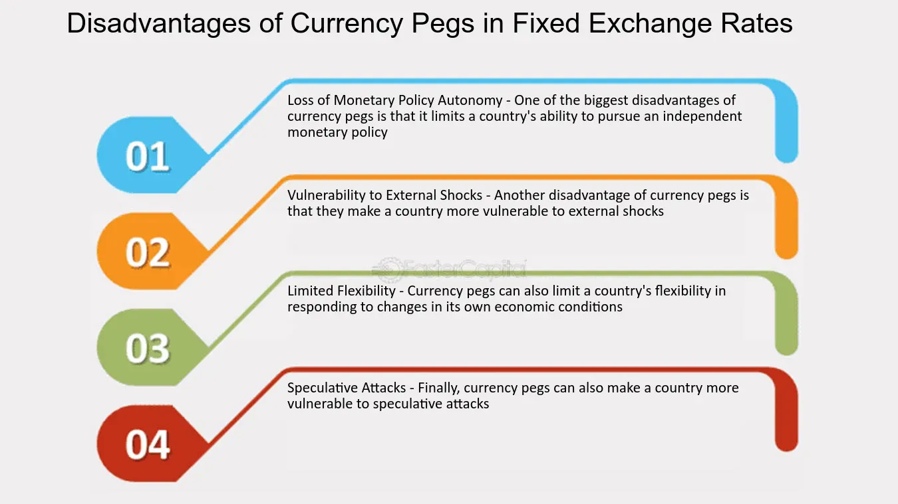

## Table of Contents

## What is currency pegging?

Currency pegging is when a country decides to fix the value of its own money to another country's money or to something like gold. This means that if you have one type of money, you can always trade it for a set amount of the other money or gold. Countries do this to make their money more stable and to help with trading things with other countries.

Sometimes, keeping the money pegged can be hard. If a lot of people want to trade the pegged money for the other money, the country might run out of the other money. To stop this, the country might need to change rules or use its savings to keep the peg going. If they can't do this, they might have to let the money's value change freely, which can be scary and cause problems for the country's economy.

## How does currency pegging work?

Currency pegging works by a country deciding to tie the value of its money to another country's money or to something like gold. For example, if Country A pegs its money to the US dollar, it means that 1 of Country A's dollars will always be worth the same as, say, 0.5 US dollars. This helps make the value of Country A's money more predictable and stable. When people or businesses want to trade between the two currencies, they know exactly how much they will get, which makes trading easier and more reliable.

Keeping the peg in place can be tricky. If a lot of people suddenly want to change their Country A dollars into US dollars, Country A needs to have enough US dollars to give to everyone. If it runs out, it might have to change its rules or use its savings to buy more US dollars. If it can't do this, the peg might break, and the value of Country A's money could start to change on its own. This can cause big problems for the country's economy, so countries try hard to keep their pegs working.

## What are the different types of currency pegging?

There are a few different ways countries can peg their currency. One way is called a fixed peg, where a country decides to always keep its money worth the same amount of another country's money or gold. For example, if a country pegs its money to the US dollar, it might say that 1 of its dollars will always be worth 0.5 US dollars. This is the most common type of pegging and it helps keep the value of the money steady.

Another way is called a crawling peg. This is when a country decides to slowly change the value of its money over time. Instead of keeping it the same, the country might say that every month, its money will be worth a little bit more or a little bit less of the other money. This can help if a country's economy is changing a lot, and it needs its money's value to change a little bit to keep up.

The last type is a currency board. This is a very strong kind of peg where a country makes a special rule that says it must always have enough of the other country's money to trade for its own money. If people want to trade their money, the country has to give them the other money right away. This makes the peg very safe and hard to break, but it can be hard for the country to control its own money's value.

## Can you give examples of countries that use currency pegging?

Some countries use currency pegging to keep their money stable. For example, Hong Kong pegs its money, called the Hong Kong dollar, to the US dollar. They do this by always making sure 1 Hong Kong dollar is worth about 0.13 US dollars. This helps Hong Kong's money stay steady and makes it easier for people to trade with the US. Another example is Saudi Arabia, which pegs its money, the Saudi riyal, to the US dollar too. They keep 1 Saudi riyal worth about 0.27 US dollars. This helps Saudi Arabia because they sell a lot of oil, and they want their money to be stable when they trade with other countries.

Another country that uses currency pegging is Denmark. They peg their money, the Danish krone, to the euro. They keep 1 Danish krone worth about 0.13 euros. This helps Denmark because they trade a lot with countries that use the euro, and it makes their money more predictable. Also, some small countries like those in the Eastern Caribbean use a currency board to peg their money to the US dollar. This makes their money very stable, but it can be hard for them to change their money's value if they need to.

## What are the main advantages of currency pegging for a country?

Currency pegging can help a country by making its money more stable. When a country pegs its money to another country's money or to something like gold, people know exactly how much their money is worth. This makes it easier for them to trade with other countries because they don't have to worry about their money's value changing suddenly. For example, if a country pegs its money to the US dollar, businesses in that country can buy and sell things with the US without worrying about the exchange rate changing.

Another advantage is that currency pegging can help control inflation. Inflation is when prices go up over time, and it can make life harder for people. By pegging their money to a stable currency, a country can keep its own money's value steady, which can help keep prices from going up too fast. This can make the economy more predictable and help people and businesses plan for the future. For countries that trade a lot with the country they peg to, this can be especially helpful because it makes their trade more reliable.

## What are the potential disadvantages of currency pegging?

Currency pegging can be hard to keep up. If a lot of people want to change their money into the currency it's pegged to, the country might run out of that other currency. If this happens, they might have to change their rules or use their savings to keep the peg going. If they can't do this, the peg might break, and the value of their money could start to change on its own. This can be scary and cause big problems for the country's economy. It's like trying to keep a balloon from flying away when everyone is letting go of it at the same time.

Another problem is that currency pegging can limit a country's control over its own money. When a country pegs its money, it has to follow the rules of the currency it's pegged to. This means they might not be able to change their money's value when they need to. For example, if their economy is growing fast and they need to make their money worth more, they might not be able to because of the peg. This can make it harder for the country to do what's best for its own people and businesses. It's like wearing a jacket that's too tight and not being able to move freely.

## How does currency pegging affect inflation and economic stability?

Currency pegging can help keep inflation under control. Inflation is when prices go up over time, and it can make life harder for people. By pegging their money to a stable currency, a country can keep its own money's value steady. This helps keep prices from going up too fast. When people know their money's value won't change suddenly, they can plan better for the future. This makes the economy more predictable and can help businesses and people feel more secure.

However, currency pegging can also make it harder for a country to control its own money. If the country's economy changes a lot, they might need to change their money's value to keep up. But because of the peg, they can't do this easily. This can lead to problems if the country needs to make its money worth more or less. If too many people want to change their money into the currency it's pegged to, the country might run out of that other currency. This can cause the peg to break, which can be scary and lead to big problems for the country's economy. It's like trying to keep a boat steady in a storm, but the waves are too strong.

## What role does the central bank play in maintaining a currency peg?

The central bank is really important for keeping a currency peg going. It's like the boss of the country's money. When a country decides to peg its money to another country's money, the central bank has to make sure it always has enough of that other money to trade. If a lot of people want to change their money into the currency it's pegged to, the central bank uses its savings to give them that other money. This helps keep the value of the country's money steady and stops the peg from breaking.

But it can be hard for the central bank to keep the peg going. If too many people want to change their money, the central bank might run out of the other money. Then, it might have to change the rules or use more savings to keep the peg. If it can't do this, the peg might break, and the value of the country's money could start to change on its own. This can cause big problems for the country's economy. So, the central bank has to be very careful and ready to do whatever it takes to keep the peg working.

## How can currency pegging impact international trade and investment?

Currency pegging can make international trade easier and more predictable. When a country pegs its money to another country's money, businesses know exactly how much their money is worth when they trade. This means they don't have to worry about the value of their money changing suddenly, which can make trading with other countries smoother. For example, if a country pegs its money to the US dollar, businesses in that country can buy and sell things with the US without worrying about the exchange rate. This can help the country's economy grow because it makes it easier for them to trade with other countries.

But currency pegging can also affect investment. When a country's money is pegged to a stable currency, it can make investors feel safer. They know the value of their money won't change suddenly, so they might be more willing to invest in that country. This can help the country's economy grow because more money is coming in. However, if the peg breaks, it can scare investors away. They might lose trust in the country's money and take their money out, which can cause big problems for the country's economy. So, while currency pegging can attract investment, it also comes with risks.

## What are the risks associated with de-pegging a currency?

When a country decides to stop pegging its money, it can be really risky. De-pegging means the country's money is no longer tied to another country's money or to something like gold. This can make the value of the country's money change a lot, and that can scare people. If the value of the money goes down a lot, people might not want to use it anymore. They might start using other money instead, which can make the country's economy go bad. It's like a boat that was tied to a dock suddenly being let go in the middle of a storm.

Also, de-pegging can make investors nervous. When a country's money is pegged, investors feel safe because they know how much their money is worth. But if the peg breaks, they might think the country's money is not safe anymore. This can make them take their money out of the country, which can hurt the economy a lot. It's like pulling money out of a piggy bank that you thought was safe, but now you're not so sure. So, de-pegging can cause big problems for a country's economy and make it hard for them to get back on track.

## How do global economic factors influence the success of a currency peg?

Global economic factors can make it harder or easier for a country to keep its currency peg. If the world's economy is doing well, it can help a country keep its peg because more people might want to trade with them. But if the world's economy is not doing well, it can be harder for a country to keep its peg. For example, if the country's money is pegged to the US dollar and the US economy is doing badly, it can make it harder for the country to keep enough US dollars to trade. This can put a lot of pressure on the peg and make it more likely to break.

Also, things like interest rates and inflation in other countries can affect a currency peg. If the country that the money is pegged to raises its interest rates, it might make more people want to change their money into that country's money. This can make it harder for the country with the peg to keep up because they need to have enough of that other money to trade. And if inflation is high in the country with the peg, it can make their money worth less, which can also put pressure on the peg. So, what happens in the world's economy can really affect whether a country can keep its currency peg or not.

## What advanced strategies can countries employ to manage a currency peg effectively?

Countries can use smart ways to keep their currency peg strong. One way is by having a lot of savings in the currency they are pegged to. This means if a lot of people want to change their money, the country can give them the other money right away. Another way is by changing the rules about money, like making it more expensive to borrow money or making it easier for people to save money. This can help keep the value of their money steady and stop too many people from wanting to change it all at once.

Another strategy is to work with other countries or big groups like the International Monetary Fund (IMF). These groups can give the country money or advice to help keep the peg going. Also, countries can use something called a crawling peg, where they slowly change the value of their money over time. This can help if their economy is changing a lot and they need their money's value to change a little bit to keep up. By using these smart ways, countries can make it easier to keep their currency peg working well.

## References & Further Reading

[1]: Bergstra, J., Bardenet, R., Bengio, Y., & Kégl, B. (2011). ["Algorithms for Hyper-Parameter Optimization."](https://papers.nips.cc/paper/4443-algorithms-for-hyper-parameter-optimization) Advances in Neural Information Processing Systems 24.

[2]: ["Advances in Financial Machine Learning"](https://www.amazon.com/Advances-Financial-Machine-Learning-Marcos/dp/1119482089) by Marcos Lopez de Prado

[3]: ["Evidence-Based Technical Analysis: Applying the Scientific Method and Statistical Inference to Trading Signals"](https://www.amazon.com/Evidence-Based-Technical-Analysis-Scientific-Statistical/dp/0470008741) by David Aronson

[4]: ["Machine Learning for Algorithmic Trading"](https://github.com/PacktPublishing/Machine-Learning-for-Algorithmic-Trading-Second-Edition) by Stefan Jansen

[5]: ["Quantitative Trading: How to Build Your Own Algorithmic Trading Business"](https://books.google.com/books/about/Quantitative_Trading.html?id=j70yEAAAQBAJ) by Ernest P. Chan