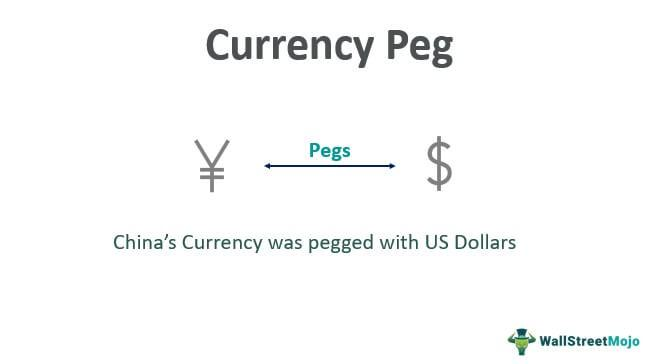

Exchange rate mechanisms hold significant influence over international trade and economic stability, serving as a critical pillar in the global economy. Exchange rates determine how much one currency is worth relative to another, affecting prices of goods and services across borders. This dynamic establishes the playing field for international trade, influencing decisions by exporters and importers, and impacting foreign investment flows. Consequently, understanding exchange rate mechanisms is essential for market participants, policymakers, and investors alike.

Monetary policy, a tool used by central banks, influences exchange rates by adjusting interest rates and controlling the money supply. These decisions can stabilize or destabilize a currency's value. When a central bank adjusts interest rates, it can attract or deter foreign investment, impacting demand for its currency. For example, a higher interest rate generally attracts foreign capital, increasing currency demand and value.



Currency pegging, another significant factor, involves a country fixing its currency's value to another, often more stable, currency. This strategy is utilized to maintain financial stability and reduce exchange rate volatility, fostering an environment conducive to stable international trade relations. However, pegging can compromise a nation's monetary policy independence, tying its economic health to the fortunes of the anchor currency's country.

The landscape of exchange rates is also transformed by technological advancements such as algorithmic trading. This involves using computer algorithms to automate and optimize trade execution in financial markets, including Forex. Algorithmic trading capitalizes on speed and data analysis capabilities to predict and respond to market movements, thereby enabling efficient navigation of currency markets.

In exploring these elements—monetary policy, currency pegging, and algorithmic trading—we gain a comprehensive understanding of how they interact to shape exchange rate dynamics. Each element plays a distinct role yet is intertwined within the larger financial ecosystem, influencing decision-making and strategies in the global marketplace. As technology evolves, particularly in algorithmic trading, these relationships will continue to evolve, presenting new opportunities and challenges for stakeholders across the financial spectrum.

## Table of Contents

## Exchange Rate and Monetary Policy

Exchange rates reflect the value of one currency in relation to another and are influenced by a multitude of factors. Key among these are economic indicators, inflation rates, and monetary policy. Exchange rates are pivotal in determining international trade competitiveness, influencing consumers' and businesses' decisions on what to buy from abroad.

Monetary policy is primarily enacted by central banks to manage economic objectives, chiefly by controlling the money supply and adjusting interest rates. These adjustments are tools to maintain price stability and foster economic growth. For instance, when a central bank lowers interest rates, borrowing becomes cheaper, potentially stimulating investment and consumption. This can lead to a depreciation of the nation’s currency, as investors might seek higher returns elsewhere, reducing demand for the lower-yielding currency.

The central bank's decisions on interest rates play a critical role in exchange rate stability. When a central bank raises interest rates, it often leads to an appreciation of the national currency. This is because higher interest rates offer higher returns to investors, increasing demand for that currency. Conversely, if rates are lowered, the currency's value might depreciate as investors look towards currencies with higher yields, destabilizing exchange rates.

A stabilizing effect of [interest rate](/wiki/interest-rate-trading-strategies) decisions can be significant, especially in economies with substantial inflation differences compared to their trading partners. When inflation is high, depreciation pressures on the currency can arise, leading central banks to raise interest rates to support the currency's value. This balance helps mitigate the risk of uncontrollable inflation and maintains external competitiveness.

The effects of these policies are not isolated. For instance, a robust economic indicator, signaling growth, might lead to expected increases in interest rates. Similarly, inflation data can prompt preemptive monetary policy actions to either counteract inflationary pressures or stimulate growth if inflation is below target.

In summary, the interaction between exchange rates and monetary policy is complex, where central banks employ interest rates as a mechanism to stabilize or influence currency values. These decisions are crucial in maintaining both domestic economic stability and competitive exchange rates, impacting international trade and financial flows significantly.

## Understanding Currency Pegging

Currency pegging is a monetary policy strategy where a country links the value of its currency to that of another currency, typically a more stable and widely-used one like the U.S. dollar or the euro. This arrangement is primarily adopted to achieve financial stability by creating a predictable exchange rate environment, which can be particularly beneficial for smaller or emerging economies susceptible to exchange rate [volatility](/wiki/volatility-trading-strategies).

One of the primary advantages of currency pegging is the reduction in exchange rate fluctuations. By stabilizing the exchange rate, pegging helps create a more predictable environment for international trade and investment. Businesses operating in countries with pegged currencies experience less uncertainty about foreign exchange risks, thereby facilitating smoother and more secure trade relations. Additionally, pegging can help curb inflation in countries where hyperinflation is a risk, as it effectively imports the monetary policy of the anchor currency's country, often resulting in more disciplined economic management.

However, currency pegging also has its downsides. A significant drawback is the potential loss of monetary policy independence. When a country pegs its currency, it must align its interest rates with those of the anchor currency's central bank to maintain the peg. This alignment can be detrimental if the anchored currency's economic conditions are not suitable for the domestic economy, potentially leading to suboptimal economic outcomes.

Moreover, pegging exposes the domestic economy to the volatility of the anchor currency. If the anchor currency experiences substantial fluctuations or economic instability, the pegged country might also suffer from these disturbances, without having the tools to combat them independently. Furthermore, maintaining a peg requires large reserves of the anchor currency to defend the fixed rate, which can be costly and economically demanding.

Historically, these factors underscore why some nations opt to float their currency instead, allowing market forces to dictate exchange rates and retaining full control over monetary policy measures. Nonetheless, for countries that seek greater economic predictability and trade stability, the benefits of currency pegging often outweigh its risks.

## Pros and Cons of Pegged Exchange Rates

Pegged exchange rates refer to the practice where a country aligns its currency value to a major currency or a basket of currencies. There are distinct advantages and disadvantages associated with this approach.

One of the primary benefits of pegged exchange rates is trade stability. By maintaining a fixed exchange rate, countries can provide a predictable environment for exporters and importers, which helps in planning and executing long-term trade agreements. This predictability is particularly beneficial for foreign investors, as it reduces the exchange rate risk associated with their investments, fostering confidence and potentially leading to increased foreign direct investment.

However, there are notable drawbacks to pegged exchange rates. A significant disadvantage is the inability to absorb domestic economic shocks. When a country's currency is pegged, it loses the ability to fluctuate according to the country's economic conditions, making it less adaptable to economic changes. For instance, in a scenario where domestic inflation rises, a pegged currency cannot depreciate to help offset the increased prices, potentially leading to economic instability.

Another disadvantage is the cost of maintaining currency reserves. To keep the currency value fixed, countries need substantial foreign exchange reserves. This requirement can strain national financial resources, particularly during periods of economic uncertainty or if the pegged currency comes under speculative attack. The commitment to defend the currency peg might involve costly interventions in foreign exchange markets.

Case studies, such as the experiences of Hong Kong and countries in the Arabian Peninsula, provide clear examples of how pegged exchange rates function in practice. Hong Kong has maintained a currency peg to the U.S. dollar since 1983. This peg has provided economic stability but has also limited Hong Kong's monetary policy autonomy, making the economy heavily reliant on U.S. monetary policy decisions. Similarly, countries like Saudi Arabia and the United Arab Emirates maintain a fixed peg to the U.S. dollar, reflecting their trade dependency on oil, which is globally priced in dollars. These arrangements provide stability but also expose these economies to external economic conditions over which they have little control.

In summary, while pegged exchange rates offer trade predictability and reduce exchange rate volatility, they also impose significant economic limitations, including reduced policy independence and the financial burden of maintaining currency reserves. These factors must be carefully weighed by policymakers when deciding to implement or sustain a currency peg.

## Algorithmic Trading and Currency Markets

Algorithmic trading involves the use of computer algorithms to execute trades in financial markets automatically. In the context of foreign exchange (Forex) markets, [algorithmic trading](/wiki/algorithmic-trading) has become a cornerstone, allowing market participants to efficiently process large volumes of trades. This technology leverages computational power to analyze vast datasets at high speeds, identifying trading opportunities that would be impossible for a human trader to detect in real time.

One of the primary advantages of algorithmic trading in currency markets is its ability to predict and execute trades based on complex, multi-variable analyses. The algorithms can incorporate various economic indicators, statistical models, and historical trading data to forecast currency movements. This predictive capability is enhanced by speed; trades can be executed in fractions of a second, allowing traders to capitalize on even the smallest market fluctuations.

The integration of [artificial intelligence](/wiki/ai-artificial-intelligence) (AI) and [machine learning](/wiki/machine-learning) (ML) has further revolutionized algorithmic trading strategies. AI and ML enable the development of more sophisticated models that can dynamically adapt to changing market conditions. These technologies facilitate the processing and interpretation of unstructured data sources, such as news articles and social media posts, which can provide insights into market sentiment and potential currency movements.

For instance, machine learning models can be trained to recognize patterns associated with currency valuations. Given sufficient historical data, these models can accurately predict probable outcomes, adjusting trading strategies in real time. Python, a versatile programming language widely used in financial technology, offers a plethora of libraries such as `pandas` for data analysis and `TensorFlow` or `scikit-learn` for developing machine learning models. A basic Python function utilizing `scikit-learn` for predicting currency trends might look like this:

```python
import pandas as pd
from sklearn.model_selection import train_test_split
from sklearn.ensemble import RandomForestRegressor

# Load and prepare data
data = pd.read_csv('currency_data.csv')
X = data.drop('currency_value', axis=1)
y = data['currency_value']

# Split data into training and testing sets
X_train, X_test, y_train, y_test = train_test_split(X, y, test_size=0.2, random_state=42)

# Initialize and train model
model = RandomForestRegressor(n_estimators=100, random_state=42)
model.fit(X_train, y_train)

# Predict currency trends
y_pred = model.predict(X_test)
```

This code snippet demonstrates a basic implementation where a Random Forest regression model is trained to predict currency values based on historical data. Such models, when applied in algorithmic trading, enhance the precision of trades by providing quantitative backing to trading decisions.

Overall, algorithmic trading, enhanced by AI and machine learning, not only streamlines currency trading processes but also delivers heightened accuracy and efficiency in managing exchange rate fluctuations. As technological advancements continue, these trading systems will likely evolve to offer even more robust tools for market analysis and execution.

## The Interplay of Currency Pegging and Algo Trading

Currency pegging and algorithmic trading form a complex yet cohesive relationship in modern financial markets. When a country's currency is pegged to another, typically more stable currency, the resulting reduced volatility can significantly impact algorithmic trading strategies.

**Benefits to Traders**

One primary advantage of pegged currencies in algorithmic trading is the decreased volatility. With exchange rates experiencing fewer fluctuations, traders can develop simplified algorithms that require less frequent recalibrations. The predictability of pegged currencies also presents opportunities for traders to execute [carry](/wiki/carry-trading) trade strategies. These are strategies in which traders borrow in a currency with a low interest rate and invest in one with a higher rate, exploiting the interest differences. The stability of a pegged currency reduces the exchange rate risk inherent in such trades.

Algorithmic models can take advantage of stable spreads and predictable pricing patterns in pegged currencies. For example, when a currency is tightly pegged, an algorithm might detect minor deviations from the pegged exchange rate as potential [arbitrage](/wiki/arbitrage) opportunities. Python libraries such as NumPy and pandas can be employed to create algorithms that efficiently process and analyze time-series data for such trades.

```python
import numpy as np
import pandas as pd

# Sample DataFrame with exchange rate data
data = {'date': pd.date_range(start='1/1/2023', periods=5, freq='D'),
        'exchange_rate': [1.0, 1.001, 1.002, 1.0005, 1.003]}
df = pd.DataFrame(data)

# Calculation of simple moving average (SMA) for detecting small rate changes
df['SMA'] = df['exchange_rate'].rolling(window=3).mean()

print(df)
```

**Challenges**

Despite these advantages, algorithmic models face challenges due to potential policy shifts by central banks. A central bank's decision to adjust the peg can abruptly alter market dynamics, necessitating rapid adaptation by algorithms. This requires high responsiveness and recalibration to avoid potential losses resulting from sudden value shifts in the pegged currency.

Moreover, traders may need to incorporate elements of machine learning in their strategies to enhance adaptability. For instance, algorithms can be designed to learn from market reactions to central bank announcements, thus improving predictive accuracy over time.

In conclusion, while currency pegging provides a simplified backdrop for algorithmic trading, the need for flexibility and quick adjustments remains crucial. Traders and algorithms must stay vigilant to central bank policies that could disrupt pegged exchange rates.

## Conclusion

In today's financial environment, exchange rates, monetary policy, and algorithmic trading are intricately interconnected, shaping the landscape of international finance. Exchange rates are a crucial determinant of economic performance as they influence trade balances, investment flows, and inflationary pressures. Central banks, by manipulating monetary policy tools such as interest rates, play a pivotal role in stabilizing these rates and, by extension, the broader economy. Decisions made by central banks can either stabilize financial markets by ensuring predictable and low inflation or, conversely, increase volatility if policies are unexpected or poorly communicated.

Algorithmic trading further intertwines with these financial mechanisms, particularly in the foreign exchange (Forex) market, by enhancing the speed and efficiency of trades. It leverages statistical algorithms to process vast datasets, identify patterns, and execute trades at high speed, often capitalizing on minute fluctuations in currency values. The interaction between exchange rates and algorithmic trading is two-fold. On one hand, algorithmic trading has the potential to reduce market inefficiencies and provide [liquidity](/wiki/liquidity-risk-premium). On the other, it can exacerbate volatility if algorithmic strategies mirror each other excessively, creating herding behavior.

Understanding these interconnected elements is critical for traders, policymakers, and investors. Traders can optimize their strategies by aligning them with anticipated policy shifts or economic reports, while policymakers can formulate better decisions by comprehensively understanding market feedback. Investors, on their part, can better hedge against risks associated with currency fluctuations.

Looking to the future, technological advancements suggest that algorithmic trading will play an even more pronounced role in shaping currency market dynamics. With the integration of artificial intelligence and machine learning, trading strategies are poised to become even more sophisticated, allowing for more precise predictions and potentially enhancing market stability. However, this evolution will require enhanced regulatory frameworks to ensure market integrity and prevent systemic risks. Thus, continuous adaptation and understanding of these financial mechanisms remain imperative for all market participants.

## FAQs

What is a currency peg and why do countries adopt it?

A currency peg is a policy strategy where a country maintains its currency's value at a fixed exchange rate to a major foreign currency, such as the U.S. dollar or the euro. This fixed rate is often achieved by the central bank actively buying and selling its own currency in exchange for the foreign currency to which it is pegged. One primary reason countries adopt a currency peg is to achieve financial stability by minimizing exchange rate fluctuations. Such stability is particularly beneficial for economies heavily reliant on export or import processes, as a stable exchange rate reduces the risk associated with currency value fluctuations in international trade. Additionally, pegging a currency can help control inflation rates and attract foreign investment by providing a predictable business environment.

How does monetary policy influence exchange rates?

Monetary policy, primarily governed by central banks, influences exchange rates through the manipulation of interest rates and the money supply. When a central bank adjusts interest rates, it affects the return on investments denominated in that currency. For instance, if a central bank raises interest rates, investments in that currency become more attractive due to higher yields, potentially leading to an increased demand for the currency, which can appreciate its value. Conversely, lowering interest rates can have the opposite effect, decreasing demand and potentially depreciating the currency's value. The central bank's actions regarding the money supply can also impact inflation rates, which in turn affect the currency's purchasing power and its relative value on the international market. These monetary policy tools allow central banks to influence economic stability and growth, which are intricately linked to exchange rate dynamics.

What are some risks associated with algorithmic trading in Forex markets?

Algorithmic trading, while offering speed and precision in the execution of trades, also presents certain risks in the Forex markets. One notable risk is the potential for unintended market impact due to the high-frequency nature of the trades. If an algorithm behaves unexpectedly or misinterprets market data, it can execute a large number of trades within a short timeframe, causing sudden market disruptions or "flash crashes." Another risk is model inaccuracies. Algorithms rely on historical data; thus, if the data is outdated or does not accurately predict future market conditions, trading strategies may fail. Moreover, the complexity of these algorithms means they may not always adapt quickly to unforeseen macroeconomic events or policy changes, such as sudden central bank interventions. Finally, algorithmic trading systems are susceptible to technical failures, including software bugs and connectivity issues, which could prevent the timely execution of trades and lead to significant financial losses.

## References & Further Reading

[1]: Bergstra, J., Bardenet, R., Bengio, Y., & Kégl, B. (2011). ["Algorithms for Hyper-Parameter Optimization."](https://papers.nips.cc/paper/4443-algorithms-for-hyper-parameter-optimization) Advances in Neural Information Processing Systems 24.

[2]: ["Advances in Financial Machine Learning"](https://www.amazon.com/Advances-Financial-Machine-Learning-Marcos/dp/1119482089) by Marcos Lopez de Prado

[3]: ["Evidence-Based Technical Analysis: Applying the Scientific Method and Statistical Inference to Trading Signals"](https://www.amazon.com/Evidence-Based-Technical-Analysis-Scientific-Statistical/dp/0470008741) by David Aronson

[4]: ["Machine Learning for Algorithmic Trading"](https://github.com/PacktPublishing/Machine-Learning-for-Algorithmic-Trading-Second-Edition) by Stefan Jansen

[5]: ["Quantitative Trading: How to Build Your Own Algorithmic Trading Business"](https://books.google.com/books/about/Quantitative_Trading.html?id=j70yEAAAQBAJ) by Ernest P. Chan