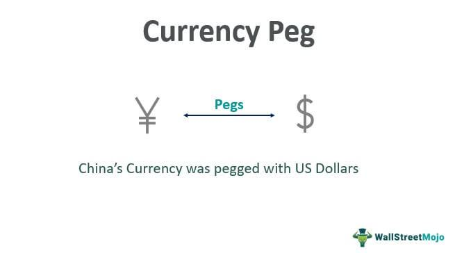

Exchange rates, foreign exchange (forex), currency pegs, and algorithmic trading are pivotal elements of the global financial market. These components not only underpin international economic interactions but also influence the strategic decisions of investors, policymakers, and businesses worldwide. 

Exchange rates play a crucial role in international economics. They dictate the value of one currency relative to another, impacting everything from import and export prices to the performance of multinational corporations. The foreign exchange market, a complex, decentralized global arena where currencies are traded, stands as the largest and most liquid market in the world. This vastness reflects its critical function in facilitating international trade and investment, with trillions of dollars exchanged daily.



Currency pegs involve a country's government setting a fixed exchange rate between its currency and another, typically more stable or widely-used currency like the US dollar or euro. This strategy aims to stabilize a nation’s economy by reducing fluctuations in exchange rates, thus fostering a predictable environment for international trade and investment. However, maintaining such pegs requires careful economic management to avoid potential pitfalls such as reduced monetary policy flexibility.

Algorithmic trading in forex markets, on the other hand, represents a technological evolution in trading practices. By employing pre-programmed instructions to execute trades, this approach enhances efficiency, speed, and precision. It allows traders to capitalize on market fluctuations with minimal human intervention. Mastery of such techniques necessitates a deep understanding of market data and the implementation of robust predictive analytics and risk management strategies.

This article will explore these aspects comprehensively, examining their definitions, operations, effects on the economy, and relevance in today's financial landscape. We will further explore the potential advantages and challenges associated with currency pegs and delve into algorithmic trading strategies within the forex markets. Readers will gain valuable insights into these significant financial concepts, enabling them to navigate the complexities of the global financial market more effectively.

## Table of Contents

## Understanding Exchange Rates and Foreign Exchange

Exchange rates serve as a key indicator in international economics, influencing a wide range of activities from consumer prices to the formulation of monetary policy. The foreign exchange (forex) market, where these currencies are traded, is recognized as the largest and most liquid market worldwide. The determination and influence on exchange rates are critical areas of understanding for individuals and businesses engaged in international trade.

Exchange rates are typically determined by the interplay of demand and supply of currencies in the [forex](/wiki/forex-system) market. A simplified formula representing the exchange rate $E$ between two currencies, currency A and currency B, can be expressed as:

$$
E = \frac{D_A}{S_B}
$$

where $D_A$ is the demand for currency A and $S_B$ is the supply of currency B. The exchange rate fluctuates based on changes in these two variables, driven by various factors.

Key determinants influencing exchange rates include:

1. **Interest Rates**: Differential interest rates between countries influence capital flows. Higher interest rates offer lenders in an economy a higher return relative to other countries. Consequently, higher interest rates attract foreign capital, causing the home currency to appreciate.

2. **Economic Indicators**: These include metrics such as GDP growth rates, unemployment figures, manufacturing output, and retail sales which serve as indicators of economic health. Strong economic performance often leads to investor confidence, resulting in currency appreciation.

3. **Geopolitical Stability**: Political stability and economic performance influence currency strength. Countries with less risk for conflict or economic turmoil appeal to foreign investors, which enhances currency strength.

The forex market plays a central role in setting exchange rates by facilitating currency transactions. It operates through an over-the-counter (OTC) mechanism, meaning transactions take place electronically between traders around the world rather than on a centralized exchange. This global connectivity contributes to the market's [liquidity](/wiki/liquidity-risk-premium), allowing for rapid execution of trades and minimizing the bid-ask spread.

In summary, understanding the mechanics of exchange rate determination and the factors influencing them is vital for anyone involved in the global economy. These rates reflect the relative value of currencies, dictated by market forces in the forex market, illustrating the dynamic nature of global trade and investment environments.

## Currency Pegs: Definition and Purpose

A currency peg, also known as a fixed exchange rate, represents a policy whereby a national government sets and maintains its currency's exchange rate at a fixed level to another currency. The primary objective of such a policy is to create a stable environment for the country’s economy, which often aids in fostering predictable trade and investment conditions, as well as reducing foreign exchange risk.

Currency pegs can serve as a tool for economic stabilization. By linking their currency to a stable and often stronger foreign currency, countries aim to control inflation and inflationary expectations. This pinned exchange rate offers consistency in pricing for international trade, which can be beneficial for businesses and investors by providing a level of certainty for their financial planning and contracting.

Historically, many nations have pegged their currencies to the US dollar—a practice driven by the dollar's status as the world reserve currency. For example, under the Bretton Woods System, most countries pegged their currencies to the US dollar, which was convertible to gold. Although the Bretton Woods System ended in the early 1970s, several countries continue to peg their currencies to the US dollar to this day. For instance, Saudi Arabia maintains a riyal-to-dollar peg, which has contributed to a relatively stable economic environment in the context of its oil-driven economy.

The mechanics of currency pegs involve a commitment by a country's central bank to buy and sell its currency at the fixed rate demanded by the peg. This requires substantial foreign exchange reserves, as the central bank must intervene in the currency market to maintain the peg, especially in the face of speculative attacks. Without adequate reserves, maintaining the peg can become exceedingly challenging, which could lead to a currency crisis.

There are various types of currency pegs. A hard peg is a strict type of exchange rate system where the currency value is tightly bound to another currency or a basket of currencies. An example is the currency board arrangement, as seen in Hong Kong, where the local currency issuance is fully backed by foreign reserves. On the other hand, a soft peg allows more flexibility and has a band within which the exchange rate can fluctuate.

The economic rationale behind implementing a currency peg often includes promoting trade incitement and encouraging investment by removing exchange rate unpredictability, which minimizes business risks associated with currency fluctuations. Moreover, a currency peg can help instill fiscal discipline by anchoring inflation, provided that the fixed exchange rate regime is credible and backed by sound macroeconomic policies.

Examples of countries employing currency pegs span across different economic contexts. The United Arab Emirates has pegged its currency to the US dollar to ensure stability given its significant oil exports, while Denmark maintains a peg to the euro under the Exchange Rate Mechanism II, benefiting from economic integration with the European Union without adopting the euro.

In conclusion, currency pegs can provide both stability and discipline to financial systems, although they require careful management of monetary and fiscal policies. Succesfully maintaining a currency peg necessitates a balance of international reserves, a robust economic framework, and vigilant monitoring of global economic trends to ensure long-term economic benefits.

## The Role of Algorithmic Trading in Forex Markets

Algorithmic trading employs automated systems for executing trades based on pre-programmed instructions and algorithms. In forex markets, which are not centralized, this approach can greatly enhance efficiency, speed, and accuracy, offering a strategic advantage to traders. The use of algorithms allows for rapid analysis of vast amounts of data, enabling traders to execute orders at optimal times based on current market conditions. This speed and precision are critical in forex markets due to their dynamic nature and round-the-clock trading activity.

Algorithmic trading necessitates a comprehensive understanding of market data, predictive analytics, and risk management strategies. Traders must develop algorithms that can process real-time data streams and identify profitable trading opportunities. These algorithms need to adapt to changing market conditions, requiring constant monitoring and refinement to maintain their efficacy and profitability. This involves not only technical programming skills but also a profound knowledge of financial markets and trading strategies.

In the context of forex trading, [algorithmic trading](/wiki/algorithmic-trading) impacts market liquidity and [volatility](/wiki/volatility-trading-strategies). By executing trades instantly, algorithms contribute to tighter spreads and increased liquidity, allowing for smoother market operations. However, they can also amplify volatility during times of market stress if many algorithms react to the same market signals simultaneously, potentially leading to rapid price swings.

Popular algorithmic trading strategies in forex include [arbitrage](/wiki/arbitrage) and [trend following](/wiki/trend-following). Arbitrage seeks to exploit price discrepancies between different currency pairs or markets, often taking advantage of momentary inefficiencies. For example, if a currency pair is priced differently on two exchanges, an algorithm can execute simultaneous buy and sell orders to profit from the difference. Here’s a simple Python function illustrating the concept of triangular arbitrage:

```python
def triangular_arbitrage(exchange_rates):
    # Exchange rates dict in the form {'USD/EUR': 0.9, 'EUR/GBP': 1.1, 'GBP/USD': 1.3}
    usd_to_eur = exchange_rates['USD/EUR']
    eur_to_gbp = exchange_rates['EUR/GBP']
    gbp_to_usd = exchange_rates['GBP/USD']

    # Calculating arbitrage
    capital = 1  # Starting with 1 USD
    eur_amount = capital * usd_to_eur
    gbp_amount = eur_amount * eur_to_gbp
    final_usd = gbp_amount * gbp_to_usd

    # If the final amount in USD is greater than the initial, arbitrage opportunity exists
    return final_usd > capital
```

Trend following, on the other hand, leverages [momentum](/wiki/momentum) in price movements. It involves algorithms that enter trades matching the prevailing market tendency, assuming that trends will continue over short to medium terms. This strategy requires advanced data analysis to identify trends and determine entry and [exit](/wiki/exit-strategy) points effectively.

In conclusion, algorithmic trading in forex markets offers substantial benefits in terms of efficiency and precision. However, it also requires robust systems capable of handling complex analyses and adapting to rapid changes. Successful implementation hinges on the traders' ability to develop sophisticated algorithms informed by comprehensive risk management and data analysis strategies.

## Evaluating the Benefits and Risks of Currency Pegs

Currency pegs, or fixed exchange rate systems, have historically been used by countries to achieve several economic objectives, including promoting trade stability, reducing exchange rate volatility, and boosting real incomes. A currency peg involves the government or central bank maintaining its currency's value at a fixed exchange rate to another currency, typically a major one like the US dollar. This setup can be particularly beneficial in fostering predictable trade and investment conditions. However, it is not without its challenges and risks.

**Benefits of Currency Pegs**

1. **Expanded Trade**: By eliminating the uncertainty of fluctuating exchange rates, currency pegs can make international trade more predictable. Businesses can engage in cross-border transactions with a clearer understanding of exchange costs, fostering an environment that encourages trade expansion.

2. **Reduced Exchange Rate Volatility**: Currency pegging can minimize the fluctuations in exchange rates, which can otherwise affect international contracts and economic planning. This stability is especially valuable for countries heavily reliant on exports or imports.

3. **Increased Real Incomes**: With more consistent trade conditions, businesses can plan long-term investments more effectively, potentially leading to economic growth and increased real incomes for a country's residents.

**Risks of Currency Pegs**

1. **Reduced Monetary Policy Flexibility**: A fixed exchange rate can limit a country's ability to adjust its monetary policy to respond to economic shocks. For instance, during a recession, a country may need to implement expansionary monetary policies, but these may conflict with the requirements of maintaining a peg.

2. **Economic Instability**: If a currency peg becomes unsustainable due to shifts in economic fundamentals, it can lead to severe economic instability. This was seen during the Asian Financial Crisis of 1997, where speculative attacks on pegged currencies led to several economies experiencing drastic adjustments.

**Case Study: The Saudi Riyal's Peg to the US Dollar**

The Saudi riyal has been pegged to the US dollar at a fixed rate since 1986. This policy was designed to ensure economic stability, given Saudi Arabia's significant oil exports priced in dollars. The peg helps stabilize the country's revenue and government spending plans, which are heavily dependent on oil prices. However, the downside is reduced monetary policy flexibility, as Saudi policymakers must align interest rates closely with those set by the US Federal Reserve, sometimes at the expense of domestic economic conditions.

In recent years, fluctuations in oil prices have tested the sustainability of this peg. The government has had to consider various fiscal measures to support the peg under economic pressures such as reduced oil revenues and mounting public expenditure.

Overall, the dynamics of currency pegs underscore their dual nature—they can be powerful tools for economic stabilization and growth if managed properly, but they also pose risks that require careful and strategic management. For policymakers and investors, understanding these nuances is essential for navigating the complexities of currency markets.

## Integrating Currency Pegs and Algorithmic Trading

The integration of currency pegs and algorithmic trading represents a strategic amalgamation in the forex market, often leading to the development of refined trading strategies. Currency pegs ensure a fixed exchange rate between two currencies, typically maintained by the central bank of a country to promote economic stability and predictability. This stability is particularly appealing to traders and investors, who often seek to incorporate such predictability into their trading algorithms.

Currency pegs offer a stable environment where exchange rates remain relatively constant, minimizing the risk associated with currency fluctuations. This stability enables traders to focus on exploiting differences in interest rates ([carry](/wiki/carry-trading) trade) or other market anomalies without worrying about adverse movements in exchange rates. However, the utility of currency pegs extends beyond mere stability. They create an ideal backdrop for algorithmic trading, which thrives on liquidity and price patterns.

Algorithmic trading utilizes pre-programmed instructions and quantitative models to execute trades at speeds impossible for human traders. By analyzing large datasets and market [statistics](/wiki/bayesian-statistics), algorithms can detect patterns or inefficiencies in the market, creating opportunities for profit. In the context of pegged currencies, algorithmic trading can be particularly effective. The algorithms can be programmed to identify and capitalize on moments when the peg might experience pressures due to macroeconomic conditions or geopolitical events, temporarily disrupting its stability.

For example, during instances when a central bank is forced to defend its currency peg due to speculative attacks, sharp fluctuations in the market can arise. Algorithms can be designed to detect these fluctuations, allowing traders to capitalize on short-term volatility while remaining anchored by the long-term stability of the peg.

Moreover, the synchronization of currency pegs with algorithmic trading can promote greater efficiency in forex markets. Algorithms can be tailored to leverage arbitrage opportunities that arise from the slow adjustments or rigidities in pegged exchange rates. Furthermore, trend-following algorithms, such as those based on moving averages or momentum indicators, can effectively operate in markets where pegged currencies create predictable trends.

To implement such integrated strategies, traders must incorporate robust risk management systems within their algorithms. Considerations such as stop-loss orders, position sizing, and maximum drawdowns should be pre-emptively managed to mitigate the inherent risks of speculative trading. Given the regulatory frameworks that govern forex markets, traders must also ensure compliance with international trading standards to avoid potential legal and financial repercussions.

### Python Code Example for Algorithmic Trading Strategy
A simplified example of a Python-based algorithmic trading strategy that could be used within a pegged currency context is as follows:

```python
import pandas as pd
import numpy as np

# Load historical exchange rates data
data = pd.read_csv('exchange_rates.csv')
data['Moving_Average'] = data['Exchange_Rate'].rolling(window=5).mean()

# Trading algorithm based on crossing moving averages
def trading_signal(data):
    signals = []
    for i in range(1, len(data)):
        if data['Exchange_Rate'][i] > data['Moving_Average'][i] and data['Exchange_Rate'][i-1] <= data['Moving_Average'][i-1]:
            signals.append('Buy')
        elif data['Exchange_Rate'][i] < data['Moving_Average'][i] and data['Exchange_Rate'][i-1] >= data['Moving_Average'][i-1]:
            signals.append('Sell')
        else:
            signals.append('Hold')
    return signals

signals = trading_signal(data)
data['Signals'] = ['Hold'] + signals
print(data)

# Displays the first few signals
print(data.head())
```

In this example, the algorithm generates buy or sell signals based on when the exchange rate crosses its moving average, a common strategy in algorithmic trading. While simplistic, such a model can be expanded with additional factors or adjusted to better reflect the nuances of trading with pegged currencies.

The synergy between currency pegs and algorithmic trading promises to unlock innovative strategies for forex traders. By harnessing the stability of pegs with the analytical power of algorithms, market participants can craft advanced strategies tailored to both stable and dynamic market conditions. This intersection not only broadens the horizons of forex strategy development but also reinforces the importance of technological adaptation in financial markets globally.

## Conclusion

Understanding exchange rates, currency pegs, and algorithmic trading is essential for navigating the complex forex markets. These elements interplay to shape the dynamics of international finance and trade. Currency pegs can offer stability by maintaining a fixed exchange rate between a national currency and a more stable foreign currency, such as the US dollar. This stability can help reduce the risk of exchange rate volatility, fostering predictable trade and investment conditions. However, maintaining a currency peg requires careful management and robust foreign currency reserves to avoid potential economic pitfalls, such as inflation or reduced monetary policy flexibility.

Algorithmic trading, on the other hand, represents a cutting-edge approach to forex by enhancing the efficiency and precision of trading operations. By utilizing pre-programmed instructions based on quantitative models, algorithmic trading allows for rapid execution of trades, taking advantage of even the slightest market fluctuations. This technology-driven trading strategy requires a thorough understanding of market data and analytics but has proven to be a significant driver of liquidity and reduced transaction costs in the forex market.

When combined, currency pegs and algorithmic trading present a robust framework for developing sophisticated trading strategies. The stability offered by currency pegs can complement the advanced capabilities of algorithmic trading, resulting in strategies that can maximize returns while minimizing risks. For instance, the stability of a pegged currency can be leveraged to apply high-frequency trading strategies, exploiting small price discrepancies for profit.

As global economics continue to evolve, staying informed about these concepts will be crucial for financial success and stability. Policymakers, investors, and traders must remain vigilant and adaptive to changes in the forex markets, ensuring that their strategies incorporate the benefits while mitigating the risks associated with exchange rates, currency pegs, and algorithmic trading. Through such informed and strategic efforts, participants in the forex market can navigate its complexities and capitalize on its opportunities.

## References & Further Reading

[1]: ["Exchange Rate Economics: Theories and Evidence"](https://www.taylorfrancis.com/books/mono/10.4324/9780203380185/exchange-rate-economics-ronald-macdonald) by Charles Engel and Kenneth D. West, Journal of Economic Perspectives, 2010.

[2]: ["The Economics of Exchange Rates"](https://www.jstor.org/stable/2728909) by Lucio Sarno and Mark P. Taylor.

[3]: ["Fixed Exchange Rates and the Autonomy of Monetary Policy"](https://www.researchgate.net/publication/239755740_Fixed_Exchange_Rate_and_the_Autonomy_of_Monetary_Policy_The_Franc_Zone_Case) by Maurice Obstfeld, Journal of Economic Dynamics and Control, 1998.

[4]: ["Algorithmic Trading: Winning Strategies and Their Rationale"](https://www.wiley.com/en-us/Algorithmic+Trading%3A+Winning+Strategies+and+Their+Rationale-p-9781118460146) by Ernie Chan.

[5]: ["The Impact of High-Frequency Trading on Volatility"](https://papers.ssrn.com/sol3/papers.cfm?abstract_id=2573677) by Jonathan Brogaard, Terrence Hendershott, and Ryan Riordan, Journal of Financial Economics, 2017.

[6]: ["Manias, Panics, and Crashes: A History of Financial Crises"](https://link.springer.com/book/10.1057/9780230628045) by Charles P. Kindleberger and Robert Z. Aliber.