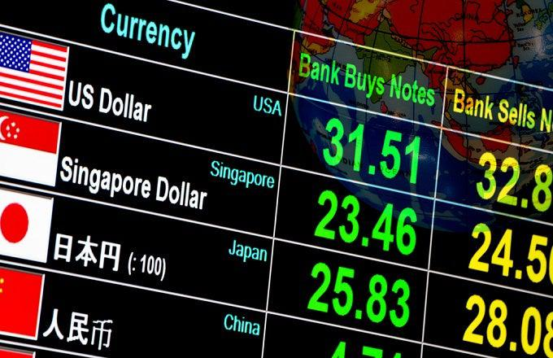

## Table of Contents

## What is currency production?

Currency production is the process of making money. This includes printing paper money and making coins. Governments or special organizations usually do this. They use special machines and materials to make sure the money is hard to copy. The amount of money they make depends on what the country needs.

When a country decides to produce more currency, it can affect the economy. If too much money is made, it can lead to inflation, where prices go up. But if the right amount is produced, it helps keep the economy stable. The process involves a lot of planning and careful work to make sure the money is safe and trusted by people.

## Who is responsible for producing currency in the United States?

In the United States, the job of making money falls to the U.S. Department of the Treasury. Inside the Treasury, there is a special part called the Bureau of Engraving and Printing. This bureau is in charge of printing all the paper money, like dollar bills. They have big machines and special inks to make sure the money is hard to copy.

The U.S. Mint is another important group within the Treasury. The Mint's job is to make all the coins, like pennies, nickels, dimes, and quarters. They use special metals and machines to create these coins. Both the Bureau of Engraving and Printing and the U.S. Mint work together to make sure there is enough money for everyone in the country to use.

## What is the role of the U.S. Department of the Treasury in currency production?

The U.S. Department of the Treasury is in charge of making all the money in the United States. It has two main parts that help with this job: the Bureau of Engraving and Printing and the U.S. Mint. The Bureau of Engraving and Printing makes all the paper money, like dollar bills. They use special machines and inks to make sure the money is hard to copy. The U.S. Mint makes all the coins, like pennies, nickels, and quarters. They use special metals and machines to create these coins.

The Treasury decides how much money needs to be made based on what the country needs. They work hard to make sure there is enough money for everyone to use. If they make too much money, it can cause prices to go up, which is called inflation. But if they make the right amount, it helps keep the economy stable. The Treasury's role is very important because it helps keep the money safe and trusted by people.

## What is the Bureau of Engraving and Printing and what does it do?

The Bureau of Engraving and Printing is a part of the U.S. Department of the Treasury. Its main job is to print all the paper money that people use in the United States, like dollar bills. They have special machines and use special inks to make sure the money is hard to copy. This is important because it helps keep the money safe and trusted by everyone.

The Bureau works hard to make sure there is enough money for everyone to use. They decide how much money to print based on what the country needs. If they print too much money, it can cause prices to go up, which is called inflation. But if they print the right amount, it helps keep the economy stable. Their work is very important for making sure the money in the United States is good and safe to use.

## How is the U.S. Mint involved in currency production?

The U.S. Mint is a part of the U.S. Department of the Treasury. Its main job is to make all the coins that people use in the United States, like pennies, nickels, dimes, and quarters. They use special metals and machines to create these coins. This is important because it helps make sure the coins are good quality and hard to copy.

The U.S. Mint decides how many coins to make based on what the country needs. They work hard to make sure there are enough coins for everyone to use. If they make too many coins, it can cause problems with the economy. But if they make the right amount, it helps keep things stable. Their work is very important for making sure the money in the United States is safe and trusted by everyone.

## What materials are used to produce U.S. currency?

U.S. currency is made from special materials to make sure it is hard to copy and lasts a long time. Paper money, like dollar bills, is made from a special kind of paper that is mostly cotton and linen. This paper is very strong and doesn't tear easily. The Bureau of Engraving and Printing uses special inks that change color and have other features to make the money hard to copy. They also use tiny security threads and watermarks that you can see when you hold the bill up to the light.

Coins, on the other hand, are made from different metals. Pennies are made from zinc with a thin layer of copper on the outside. Nickels are made from a mix of nickel and copper. Dimes and quarters are made from a mix of copper and nickel. The U.S. Mint uses these metals to make sure the coins are strong and last a long time. They also have special designs and edges that make them hard to copy.

Both paper money and coins are made with a lot of care to make sure they are safe and trusted by everyone. The materials used are chosen to make the money hard to fake and to make sure it can be used for a long time.

## What are the different denominations of U.S. currency and how are they produced?

U.S. currency comes in different denominations for both paper money and coins. The paper money includes $1, $2, $5, $10, $20, $50, and $100 bills. These bills are made by the Bureau of Engraving and Printing, which is part of the U.S. Department of the Treasury. They use a special kind of paper made from cotton and linen, which is very strong. They also use special inks that change color and have other features to make the money hard to copy. They add tiny security threads and watermarks that you can see when you hold the bill up to the light.

The coins come in different denominations too, like pennies, nickels, dimes, quarters, half dollars, and dollar coins. The U.S. Mint, which is also part of the Treasury, makes these coins. Pennies are made from zinc with a thin layer of copper on the outside. Nickels are made from a mix of nickel and copper. Dimes and quarters are made from a mix of copper and nickel. The Mint uses these metals to make sure the coins are strong and last a long time. They also have special designs and edges that make them hard to copy. Both the Bureau of Engraving and Printing and the U.S. Mint work hard to make sure the money is safe and trusted by everyone.

## What security features are included in U.S. currency to prevent counterfeiting?

U.S. currency has many special features to stop people from making fake money. Paper money, like dollar bills, has a security thread that you can see when you hold it up to the light. This thread has tiny printing on it that tells you the bill's value. There's also a watermark, which is a picture that shows up when you hold the bill up to the light. The ink used on the bills can change color and has other tricks to make it hard to copy. For example, the number on the bill might look one color when you look at it straight on but a different color when you tilt it.

Coins also have special features to stop counterfeiting. They are made from special mixes of metals that are hard to copy. The edges of the coins have special designs that make them unique. For example, quarters have ridges on the edge, and pennies have a smooth edge. The designs on the coins are very detailed and hard to make exactly the same if someone tries to fake them. Both paper money and coins are made with a lot of care to make sure they are safe and trusted by everyone.

## How has the design of U.S. currency evolved over time?

The design of U.S. currency has changed a lot over time. In the early days, the first paper money was made during the Civil War in the 1860s. These bills were called "greenbacks" because they had a lot of green ink. The designs were simple, with pictures of people and buildings. Over the years, the designs got more detailed and started to include more security features. For example, in the early 1900s, they added watermarks and special inks to make the money harder to copy. The designs also changed to show different important people and events in American history.

Coins have also changed a lot over time. The first U.S. coins were made in the late 1700s. They were made of silver and copper and had simple designs with words and pictures. Over time, the designs became more detailed and started to show important people and symbols, like the eagle and the Statue of Liberty. In the 20th century, they started using different metals to make the coins, like zinc and nickel. The designs also started to include more details and special edges to make them harder to fake. Today, both paper money and coins have very detailed designs and many security features to keep them safe and trusted by everyone.

## What is the process for designing and approving new currency designs?

The process of designing and approving new currency designs in the United States involves many steps and different groups. It starts with the U.S. Department of the Treasury and the Federal Reserve working together. They decide when it's time to change the design of the money, usually to add new security features or to honor new people or events. The Bureau of Engraving and Printing and the U.S. Mint then start working on new designs. They use special artists and designers to create the new looks for the bills and coins. The designs have to be very detailed and include all the security features to make sure the money is hard to copy.

After the designs are made, they need to be approved. The Secretary of the Treasury has the final say on approving new designs for paper money. For coins, the designs need to be approved by the Secretary of the Treasury and the Congress. This can take a long time because they want to make sure the new designs are good and safe. Once the designs are approved, the Bureau of Engraving and Printing starts printing the new bills, and the U.S. Mint starts making the new coins. It's a big job that takes a lot of planning and careful work to make sure the new money is ready for everyone to use.

## How does the production volume of U.S. currency correlate with economic conditions?

The amount of U.S. currency produced each year is closely tied to how the economy is doing. When the economy is growing and people are spending more money, the U.S. Department of the Treasury needs to make more money to keep up with demand. This means the Bureau of Engraving and Printing will print more paper money, and the U.S. Mint will make more coins. If the economy is doing well, people might need more money to buy things, so the government makes sure there is enough money for everyone to use.

On the other hand, if the economy is not doing well and people are spending less money, the Treasury might not need to produce as much currency. If too much money is made when the economy is slow, it can cause inflation, which means prices go up. The Treasury has to be careful and watch the economy closely to decide how much money to make. They want to make sure there is enough money for people to use, but not so much that it causes problems with prices.

## What are the future trends and technologies expected to impact U.S. currency production?

Future trends and technologies will change how U.S. currency is made. One big change might be the use of digital money. More and more people are using digital payments with their phones and computers. This could mean less need for paper money and coins. But even with digital money, the U.S. will still need to make some physical money. They might use new technology to make the money even harder to copy. For example, they might use special materials or new printing methods that make the money safer.

Another trend is making money more eco-friendly. Right now, paper money is made from cotton and linen, but in the future, they might use materials that are better for the environment. Coins might be made from different metals that are easier to recycle. The U.S. Mint and the Bureau of Engraving and Printing are always looking for new ways to make money that is good for the planet. These changes will help keep the money safe and trusted by everyone, while also being kinder to the environment.

## References & Further Reading

[1]: Gürkaynak, R. S., Sack, B., & Swanson, E. (2005). ["Do Actions Speak Louder Than Words? The Response of Asset Prices to Monetary Policy Actions and Statements."](https://www.ijcb.org/journal/ijcb05q2a2.pdf) American Economic Review, 95(1), 44-62.

[2]: Hendershott, T., Jones, C. M., & Menkveld, A. J. (2011). ["Does Algorithmic Trading Improve Liquidity?"](https://onlinelibrary.wiley.com/doi/full/10.1111/j.1540-6261.2010.01624.x) The Journal of Finance, 66(1), 1-33.

[3]: ["Principles of Financial Engineering"](https://www.sciencedirect.com/book/9780123869685/principles-of-financial-engineering) by Salih N. Neftci

[4]: Bernanke, B. S., & Kuttner, K. N. (2005). ["What Explains the Stock Market's Reaction to Federal Reserve Policy?"](https://onlinelibrary.wiley.com/doi/abs/10.1111/j.1540-6261.2005.00760.x) The Journal of Finance, 60(3), 1221-1257.

[5]: Cartea, Á., Jaimungal, S., & Penalva, J. (2015). ["Algorithmic and High-Frequency Trading."](https://assets.cambridge.org/97811070/91146/frontmatter/9781107091146_frontmatter.pdf) Cambridge University Press.