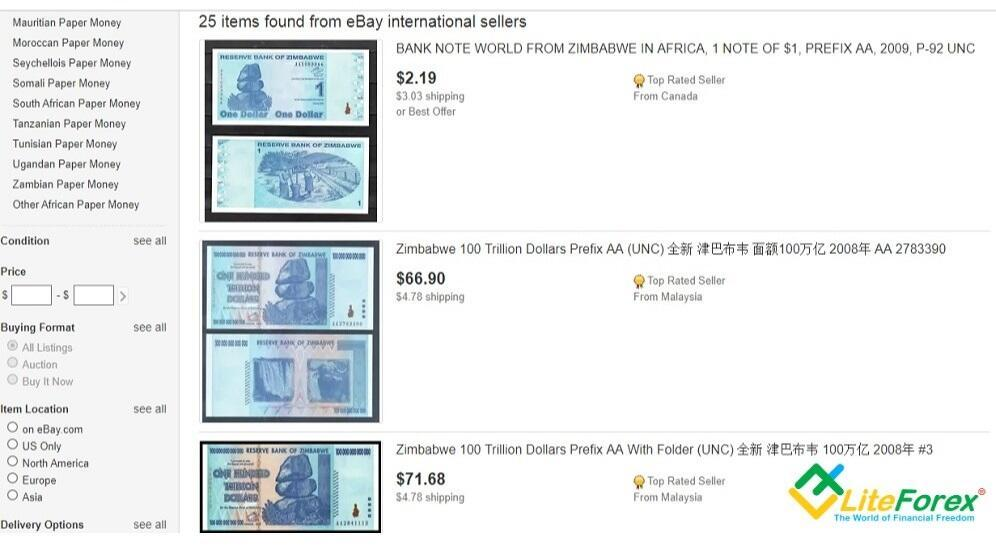

## Table of Contents

## What is currency redenomination?

Currency redenomination is when a country changes the face value of its money. It means they take away some zeros from their currency. For example, if a country had a 10,000 note, after redenomination, it might become a 10 note. This is done to make money easier to use and understand, especially if inflation made the old money confusing.

Countries do redenomination when their money loses a lot of value because of high inflation. It helps people feel more confident in their money again. But, redenomination doesn't fix the real problems that caused inflation. It's like changing the labels on things, but not the things themselves. So, it's important for a country to also fix the bigger economic issues.

## Why do countries redenominate their currency?

Countries redenominate their currency when it has lost a lot of value due to high inflation. This happens when prices go up so much that the numbers on the money get really big and hard to use. For example, if a loaf of bread costs 10,000 units of currency, it's easier to change the currency so the bread costs 10 units instead. Redenomination helps make money easier to handle and understand for everyone.

However, redenomination by itself doesn't solve the bigger problems that caused the inflation in the first place. It's like changing the labels on things but not fixing what's wrong inside. Countries need to work on other economic issues, like controlling inflation and improving their economy, to make sure their money stays valuable. Redenomination can help people feel better about their money, but it's only a first step.

## Can you explain the difference between redenomination and revaluation?

Redenomination is when a country changes the face value of its money by removing zeros. For example, if a country had a 10,000 note, after redenomination, it might become a 10 note. This is done to make money easier to use when high inflation has made the numbers on the money very big and confusing. Redenomination doesn't change how much the money is really worth; it just changes how it looks.

Revaluation, on the other hand, is when a country officially changes the value of its currency compared to other currencies. If a country revalues its currency, it makes it worth more compared to other countries' money. This can happen if a country wants to make its exports more expensive or if it wants to control inflation. Unlike redenomination, revaluation directly changes how much the money is worth in the global market.

Both redenomination and revaluation are ways countries can manage their money, but they do different things. Redenomination is about making the numbers on the money easier to handle, while revaluation is about changing the actual value of the money in relation to other currencies.

## What are some common reasons for currency rebalancing?

Currency rebalancing is when a country changes its money to fix problems with its value or to make it easier to use. A common reason for rebalancing is high inflation, which makes the numbers on money very big and hard to handle. For example, if a loaf of bread costs 10,000 units, rebalancing might change it to 10 units. This makes money simpler for everyone to use and understand. Another reason is to restore trust in the money when people start to doubt it because of big economic problems.

Rebalancing can also happen when a country wants to change how much its money is worth compared to other countries' money. This is called revaluation, and it makes the country's money worth more on the world stage. It can help make the country's products more expensive for other countries to buy, which might be good for the country's economy. But rebalancing, whether it's redenomination or revaluation, is only a part of the solution. Countries need to work on other economic issues to really fix the problems with their money.

## How does currency redenomination affect the economy?

Currency redenomination can make money easier to use and understand. When a country's money loses a lot of value because of high inflation, the numbers on the money get very big. This can be confusing for people. By taking away zeros, redenomination makes the numbers smaller and easier to handle. For example, if a loaf of bread costs 10,000 units, redenomination might change it to 10 units. This helps people feel more confident in their money again because it's simpler to use.

However, redenomination by itself doesn't fix the bigger problems that caused the inflation. It's like changing the labels on things but not fixing what's wrong inside. If a country only does redenomination without working on other economic issues, the money might lose value again. So, while redenomination can help in the short term by making money easier to use, it's important for countries to also work on controlling inflation and improving their economy to make sure their money stays valuable in the long run.

## What are the steps involved in a currency redenomination process?

When a country decides to redenominate its currency, the first step is planning and announcing the change. The government and central bank work together to figure out how many zeros to take away from the money. They need to make sure everyone knows about the change, so they tell the public through news, TV, and other ways. This helps people get ready for the new money. They also set a date when the new money will start being used.

After the announcement, the next step is to actually make the new money. The central bank prints new notes and coins with the new values. They also change the computer systems and machines that handle money, like ATMs and cash registers, to work with the new currency. During this time, the old money and the new money might be used together for a while. This gives people time to get used to the new money. Once the new money is fully in use, the old money is slowly taken out of circulation.

The final step is making sure the redenomination goes smoothly. The government and central bank keep an eye on how people are using the new money and fix any problems that come up. They also work on other economic issues to make sure the money stays valuable. Redenomination can help make money easier to use, but it's important to fix the bigger problems that caused the inflation in the first place.

## Can you provide an example of a country that has successfully redenominated its currency?

Turkey is a good example of a country that successfully redenominated its currency. In 2005, Turkey decided to take away six zeros from its money. Before the change, they had a currency called the Turkish Lira. After redenomination, they kept the name but made it much simpler. For example, if something cost 1,000,000 old Lira, it now cost 1 new Lira. This made money easier for people to use and understand.

The redenomination in Turkey helped people feel more confident in their money. It was part of a bigger plan to fix their economy. Turkey worked on other things like controlling inflation and making their money more stable. By doing this, they were able to make their currency stronger and more reliable. The success of Turkey's redenomination shows that when done right, it can really help a country's money and economy.

## What are the potential risks and challenges associated with currency redenomination?

Currency redenomination can be tricky because it's a big change and not everyone might understand it right away. People might get confused about the new money, especially if they're used to the old money with lots of zeros. If the government doesn't explain the change well, people might lose trust in the money. Also, businesses need to update their systems and machines to work with the new currency, which can be expensive and take time. If they don't do this right, it can cause problems with buying and selling things.

Another challenge is that redenomination doesn't fix the real problems that made the money lose value in the first place. If a country only changes the numbers on the money but doesn't work on controlling inflation or fixing the economy, the money might lose value again. This can make people feel like the redenomination didn't help at all. So, it's important for a country to have a good plan to make sure the redenomination works well and that the money stays valuable after the change.

## How does currency rebalancing impact international trade?

When a country changes its money through rebalancing, it can affect how much its goods and services cost in other countries. If a country revalues its money to make it worth more, its products become more expensive for other countries to buy. This might make other countries buy less from that country, which could hurt its exports. On the other hand, if the money is made easier to use by taking away zeros, it doesn't directly change the price for other countries, but it can make the country's economy seem more stable. This might encourage other countries to trade more with them.

Rebalancing can also change how much a country's money is worth compared to other currencies. If a country's money becomes worth more because of revaluation, it might have to pay more for things it imports. This could make imports more expensive and affect the country's trade balance. But if the rebalancing is done well and the country's economy gets stronger, it might attract more foreign investment. This can help the country grow and make its products more competitive in the global market.

## What role do central banks play in currency redenomination and rebalancing?

Central banks are really important when a country decides to change its money through redenomination or rebalancing. They plan everything and make sure everyone knows about the change. The central bank decides how many zeros to take away from the money and when to start using the new money. They also make the new money, like printing new notes and making new coins. They work with the government to tell people about the change through news and other ways, so everyone is ready for the new money.

Central banks also make sure the change goes smoothly. They change the computer systems and machines that use money, like ATMs and cash registers, to work with the new money. They keep an eye on how people are using the new money and fix any problems that come up. The central bank also works on other things to make sure the money stays valuable, like controlling inflation and making the economy stronger. Their job is to make sure the change helps the country's money and economy in the long run.

## How can redenomination and rebalancing influence inflation and deflation?

Redenomination and rebalancing can affect inflation and deflation, but they work in different ways. Redenomination is when a country takes away zeros from its money to make it easier to use. It doesn't change how much the money is really worth, so it doesn't directly cause inflation or deflation. But if people feel more confident in their money after redenomination, they might spend more. This could lead to more demand for things, which might push prices up a bit. On the other hand, if people still don't trust the money, they might keep saving it instead of spending, which could help keep prices from going up too fast.

Rebalancing, like revaluation, can have a bigger effect on inflation and deflation. When a country revalues its money to make it worth more compared to other countries' money, it can make imports cheaper. This might help keep prices from going up too much, which fights inflation. But if the country's products become more expensive for other countries to buy, it might sell less abroad. This could mean less money coming into the country, which might slow down the economy and lead to deflation if prices start to fall. So, rebalancing can be a tool to help control inflation and deflation, but it needs to be part of a bigger plan to really work.

## What advanced strategies can be used to manage the transition during currency redenomination?

To manage the transition during currency redenomination, a country can use advanced strategies like setting up a strong communication plan. The government and central bank need to tell everyone about the change well before it happens. They can use TV, radio, newspapers, and the internet to explain how the new money will work and when it will start being used. They should also set up special places where people can ask questions and get help with the new money. By making sure everyone understands the change, the country can reduce confusion and keep people's trust in the money.

Another strategy is to use a dual currency period. This means that for a while, both the old money and the new money can be used at the same time. This gives people time to get used to the new money without feeling rushed. During this time, the government can slowly take the old money out of use. They also need to update all the machines and systems that handle money, like ATMs and cash registers, to work with the new currency. By doing this carefully, the country can make sure the change goes smoothly and that businesses and people can keep using money without big problems.

## References & Further Reading

[1]: Bergstra, J., Bardenet, R., Bengio, Y., & Kégl, B. (2011). ["Algorithms for Hyper-Parameter Optimization."](https://dl.acm.org/doi/10.5555/2986459.2986743) Advances in Neural Information Processing Systems 24.

[2]: ["Advances in Financial Machine Learning"](https://www.amazon.com/Advances-Financial-Machine-Learning-Marcos/dp/1119482089) by Marcos Lopez de Prado

[3]: ["Evidence-Based Technical Analysis: Applying the Scientific Method and Statistical Inference to Trading Signals"](https://www.amazon.com/Evidence-Based-Technical-Analysis-Scientific-Statistical/dp/0470008741) by David Aronson

[4]: ["Machine Learning for Algorithmic Trading"](https://github.com/stefan-jansen/machine-learning-for-trading) by Stefan Jansen

[5]: ["Quantitative Trading: How to Build Your Own Algorithmic Trading Business"](https://github.com/LucindaYa/quant-resources/blob/master/Quantitative%20Trading%20How%20to%20Build%20Your%20Own%20Algorithmic%20Trading%20Business.pdf) by Ernest P. Chan