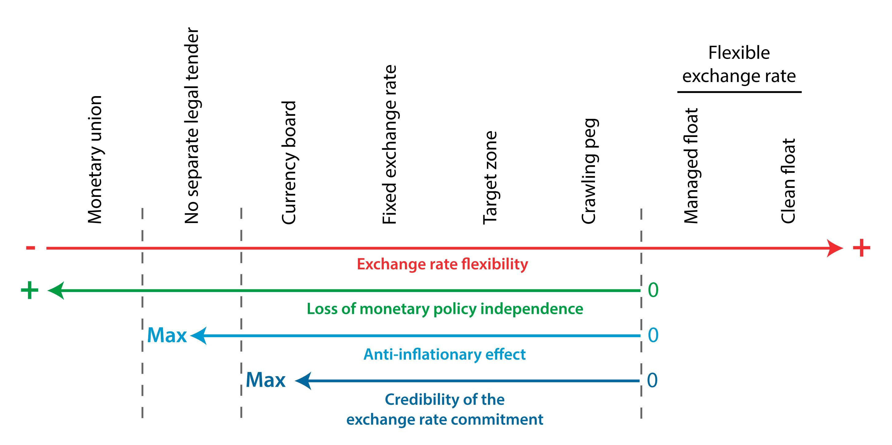

## Table of Contents

## What is a currency regime?

A currency regime is a set of rules and policies that a country uses to manage its currency. It decides how the value of the country's money is set compared to other currencies. There are different types of currency regimes, like letting the market decide the value, pegging the currency to another currency, or using a mix of these methods.

Countries choose their currency regime based on what they think will help their economy the most. For example, some countries might want a stable currency to make trade easier, while others might want their currency to be able to change value freely to respond to economic changes. The choice of currency regime can affect things like inflation, trade, and how much foreign investment a country gets.

## What are the main types of currency regimes?

There are several main types of currency regimes that countries can use. One type is called a floating exchange rate, where the value of the currency is determined by the forces of supply and demand in the foreign exchange market. This means the currency can go up or down based on what people are willing to pay for it. Another type is a fixed exchange rate, where the government or central bank sets the value of the currency to a specific level, often pegging it to another major currency like the US dollar or to a basket of currencies.

A third type is a pegged float or managed float, which is a mix of the first two. In this system, the currency is mostly allowed to float, but the government or central bank can step in to influence its value if it moves too much. This helps keep the currency stable but still allows some flexibility. Lastly, there's a currency board, where the country's currency is backed by foreign currency reserves, and the exchange rate is fixed strictly according to the amount of foreign currency held. Each of these regimes has its own advantages and challenges, depending on the country's economic goals and conditions.

## How do fixed exchange rate regimes work?

A fixed exchange rate regime is when a country decides to set its currency's value at a certain level and keep it there. They usually do this by pegging their currency to another strong currency, like the US dollar or the Euro. To keep the exchange rate fixed, the country's central bank will buy or sell its own currency in the foreign exchange market. If the value of their currency starts to go down, the central bank will use its foreign currency reserves to buy its own currency and push the value back up. If the value starts to go up too much, they will sell their currency to bring the value back down.

This system can help make trade easier because businesses know exactly how much their money is worth in another country. It can also help keep prices stable because it stops big changes in the currency's value from causing inflation. But, it can be hard to keep the exchange rate fixed all the time. The central bank needs to have enough foreign currency reserves to keep buying and selling its own currency. If they run out of reserves, they won't be able to keep the exchange rate fixed, and the whole system could fall apart.

## What is a floating exchange rate regime and how does it function?

A floating exchange rate regime is when a country lets the value of its currency change freely based on what people want to buy and sell in the foreign exchange market. This means that the price of the currency goes up and down depending on how much people want it. If more people want to buy the currency, its value goes up. If fewer people want it, the value goes down. The government or central bank does not try to keep the currency at a specific value but lets the market decide.

This type of system can be good because it allows the currency to adjust to changes in the economy. For example, if a country's economy is doing well, the demand for its currency might go up, making it more valuable. On the other hand, if the economy is struggling, the currency might become less valuable. This flexibility can help the economy adjust to different situations. However, it can also make things uncertain for businesses and people because they never know exactly how much their money will be worth from one day to the next.

## Can you explain the concept of a pegged exchange rate?

A pegged exchange rate is when a country decides to fix the value of its currency to another currency, like the US dollar or the Euro. They do this to make their currency stable and to help with trade. For example, if a country pegs its currency to the US dollar, they say that one unit of their currency will always be worth a certain amount of US dollars. To keep this peg, the country's central bank will buy or sell its own currency in the foreign exchange market.

If the value of the country's currency starts to drop, the central bank will use its reserves of the other currency, like US dollars, to buy its own currency and push the value back up. If the value starts to go up too much, they will sell their own currency to bring the value down. This way, they can keep the exchange rate steady. But, it can be hard to keep the peg if the central bank runs out of the foreign currency it needs to buy and sell. If that happens, they might not be able to keep the value fixed, and the peg could fail.

## What historical events have significantly influenced currency regimes?

One big event that changed currency regimes was the end of the Bretton Woods system in 1971. Before that, many countries had their currencies pegged to the US dollar, and the US dollar was pegged to gold. But the US had a lot of problems, like spending too much money on the Vietnam War and having inflation. So, President Richard Nixon decided to stop pegging the dollar to gold. This made a lot of countries switch to floating exchange rates because they couldn't rely on the dollar anymore.

Another important event was the Asian Financial Crisis in 1997. It started in Thailand when they could not keep their currency, the baht, pegged to the US dollar anymore. They ran out of US dollars to buy their own currency, and the baht's value dropped a lot. This caused a big problem because many other countries in Asia had similar currency pegs, and they were worried about their own currencies. Some countries had to change their currency regimes to floating rates or managed floats to stop the crisis from getting worse. These events showed how hard it can be to keep a currency peg and how important it is to have enough foreign currency reserves.

## How did the Bretton Woods system affect global currency regimes?

The Bretton Woods system, set up after World War II, was a big deal for how countries managed their money. It made a lot of countries peg their currencies to the US dollar, and the US dollar was pegged to gold. This meant that the value of each country's money was tied to the dollar, and the dollar was tied to a set amount of gold. This system helped make trade easier and more stable because everyone knew how much their money was worth compared to the dollar and gold. It also helped countries work together better because they had to follow the same rules about their currencies.

But the Bretton Woods system didn't last forever. By the late 1960s, the US was having problems because it was spending a lot of money on things like the Vietnam War and had a lot of inflation. In 1971, President Richard Nixon decided to stop pegging the dollar to gold. This was a big change because it meant that the whole system of fixed exchange rates based on the dollar and gold fell apart. After that, a lot of countries switched to floating exchange rates, where the value of their money could change freely based on what people wanted to buy and sell. This change showed how important it is for countries to be able to adjust their currency regimes when things change in the world economy.

## What are the economic impacts of adopting a specific currency regime?

When a country picks a currency regime, it can really change how its economy works. If a country goes with a fixed exchange rate, it can make trade easier because businesses know exactly how much their money is worth in another country. This can help keep prices stable because the value of the money doesn't change a lot. But, it can be hard to keep the exchange rate fixed. The central bank needs to have enough foreign money to buy and sell its own money. If it runs out, the whole system could fall apart, and that can cause big problems for the economy.

On the other hand, if a country chooses a floating exchange rate, the value of its money can change based on what people want to buy and sell. This can be good because it lets the money's value adjust to what's happening in the economy. If the economy is doing well, the money might become more valuable. If it's not doing well, the money might become less valuable. This can help the economy fix itself. But, it can also make things uncertain for businesses and people because they never know exactly how much their money will be worth from one day to the next.

In the middle, there's the managed float or pegged float, where the currency mostly floats but the central bank can step in to keep it stable. This mix can give some of the benefits of both fixed and floating rates. It can help keep the money stable for trade but still let it adjust to big changes in the economy. But, it still needs the central bank to have enough foreign money to step in when needed. So, [picking](/wiki/asset-class-picking) the right currency regime is a big decision that can affect a lot of things in the economy, like trade, inflation, and how much foreign investment the country gets.

## How do currency regimes affect international trade and investment?

Currency regimes can really change how countries trade with each other. If a country uses a fixed exchange rate, it makes trade easier because businesses know exactly how much their money is worth in another country. This can help them plan better and make deals without worrying about the money changing value suddenly. But, if the fixed rate breaks, it can cause big problems for trade because everything becomes uncertain. On the other hand, a floating exchange rate can make trade harder because the value of the money can change a lot. This can make it tough for businesses to plan because they don't know how much their money will be worth tomorrow. But, if the economy is doing well, the money might become more valuable, which can help the country sell more things to other countries.

Currency regimes also affect how much foreign money comes into a country. If a country has a stable currency, like with a fixed or managed float regime, it can attract more foreign investors because they know their money will be safe. This can help the country grow because more money coming in can be used to build things and create jobs. But, if the currency is too stable and doesn't change at all, it might not be able to adjust to big changes in the economy, which can scare investors away. With a floating exchange rate, the value of the money can change a lot, which can be risky for investors. But, if the economy is doing well and the money becomes more valuable, it can attract more foreign money because investors want to be part of a growing economy. So, picking the right currency regime is important for getting more trade and investment.

## What are the advantages and disadvantages of a currency board?

A currency board is a system where a country's money is backed by another country's money, usually a strong currency like the US dollar. The main advantage of this system is that it makes the country's money very stable. Because it's backed by another strong currency, businesses and people know exactly how much their money is worth. This can make trade easier and help keep prices from going up too fast. Another good thing is that it stops the government from printing too much money, which can cause inflation. This can make people trust the money more and attract more foreign investors.

But, there are also some big problems with a currency board. One big problem is that the country can't use its own money to help the economy when it's not doing well. If the economy is struggling, the government can't just print more money to help because it's tied to the other currency. This can make it hard to fix economic problems. Another problem is that the country needs to have a lot of the other currency saved up to keep the system working. If it runs out of the other currency, the whole system can fall apart, and that can cause big problems for the economy. So, while a currency board can make the money very stable, it can also make it hard for the country to deal with economic troubles.

## How do emerging markets choose their currency regimes, and what challenges do they face?

Emerging markets choose their currency regimes based on what they think will help their economy grow and stay stable. They might look at other countries to see what worked for them. Some emerging markets might choose a fixed exchange rate to make their money stable and attract more foreign investors. Others might go for a floating exchange rate to let their money adjust to changes in the economy. Some might pick a mix, like a managed float, to get the benefits of both. It's a big decision because it can affect how much they can trade with other countries and how much foreign money comes in.

But choosing a currency regime can be really hard for emerging markets. If they pick a fixed exchange rate, they need to have a lot of foreign money saved up to keep it working. If they run out, the whole system can fall apart, and that can cause big problems for their economy. If they choose a floating exchange rate, the value of their money can change a lot, which can scare away foreign investors and make trade harder. Plus, emerging markets often have economies that change a lot, so they need a currency regime that can handle those changes. Picking the right one is tough because they have to balance stability with the ability to grow and adjust to new situations.

## What role do central banks play in managing different currency regimes?

Central banks are really important for managing currency regimes. They are like the bosses of a country's money. If a country has a fixed exchange rate, the central bank has to buy and sell its own money to keep the value steady. They use foreign money they have saved up to do this. If the value of their money starts to go down, they use the foreign money to buy their own money and push the value back up. If the value goes up too much, they sell their own money to bring it down. This helps keep the money stable, but it can be hard if they run out of foreign money.

For floating exchange rates, central banks don't try to keep the value of the money at a certain level. They let the market decide how much the money is worth. But they still watch the money closely. If the value changes too much, they might step in to help calm things down. With a managed float, central banks do a bit of both. They let the money mostly float, but they can buy and sell it to keep it stable if it changes too much. So, no matter what kind of currency regime a country has, the central bank plays a big role in making sure the money works well for the economy.

## What are the economic impacts of currency regimes?

Currency regimes play a significant role in shaping both national and global economies due to their influence on exchange rate stability, trade balances, and overall economic performance. These regimes determine how exchange rates are managed, influencing the flow of goods, services, and capital across borders. This section explores the economic impacts of different currency regimes with a focus on sovereign debt, GDP, and the interaction with fiscal and monetary policies, as well as implications for risk management and investment strategies.

### Currency Regimes, Sovereign Debt, and GDP

Currency regimes directly affect a country's ability to manage its sovereign debt and GDP growth. Countries with fixed exchange rate regimes, such as currency pegs, often enjoy enhanced stability, which can reduce the risk premium required by international investors. This stability can lead to lower borrowing costs and more predictable debt servicing. However, maintaining a fixed exchange rate requires substantial reserves of foreign currency, which can become challenging during economic downturns.

In contrast, floating exchange rate systems offer more flexibility, allowing currencies to adjust in response to economic conditions. This can help absorb external shocks, potentially aiding in GDP stability. However, these regimes can also lead to increased [volatility](/wiki/volatility-trading-strategies), impacting export performance and potentially raising the cost of sovereign borrowing.

#### Relationship Equation

An equation representing the implied relationship between exchange rate volatility (σ), GDP growth (g), and sovereign debt servicing costs (C) can be conceptualized as:

$$
C = \alpha - \beta \times g + \gamma \times \sigma
$$

Where:
- $\alpha, \beta, \gamma$ are constants representing the sensitivity of debt costs to GDP growth and exchange rate volatility.
- $g$ is the GDP growth rate.
- $\sigma$ is the exchange rate volatility.

### Fiscal and Monetary Policies

Fiscal and monetary policies are crucial in managing the economic impacts of currency regimes. In a fixed regime, governments and central banks must ensure that fiscal policies do not create unsustainable budget deficits, as these can lead to a depletion of reserves and potential devaluation pressures. Such environments often demand tight fiscal discipline, limiting the government's ability to stimulate the economy in downturns.

Conversely, countries with floating currencies often have more monetary policy autonomy, allowing central banks to adjust interest rates to influence economic activity and inflation. However, such regimes require careful calibration to avoid excessive exchange rate fluctuations, which can destabilize inflation expectations and impact trade competitiveness.

### Implications for Risk Management and Investment Strategies

Investors and corporations must consider the implications of currency regimes when managing risk and developing investment strategies. In fixed or pegged regimes, exchange rate stability can provide a favorable environment for long-term investments, reducing uncertainty in cash flow projections and revenue forecasts. However, the risk of sudden devaluation in response to external pressures necessitates careful hedging strategies.

In floating regimes, the higher volatility can create opportunities for speculative trading and [arbitrage](/wiki/arbitrage) but also demands robust risk management practices, including currency hedging techniques such as forwards, futures, and options. Algorithmic trading systems, often employed in these volatile environments, must incorporate real-time data analysis and adaptive strategies to navigate swiftly changing market conditions effectively.

Overall, the choice of currency regime has profound implications for economic stability and performance. Countries and businesses must carefully consider these impacts to optimize economic outcomes and mitigate potential risks.

## References & Further Reading

[1]: ["The Exchange Rate System and the IMF: A Review"](https://www.imf.org/en/Publications/Occasional-Papers/Issues/2016/12/30/The-Exchange-Rate-System-Lessons-of-the-Past-and-Options-for-the-Future-100) by Barry Eichengreen, International Monetary Fund Working Paper, 1999.

[2]: ["Monetary Regimes and Inflation: History, Economic and Political Relationships"](https://www.amazon.com/Monetary-Regimes-Inflation-Political-Relationships/dp/1784717649) by Peter Bernholz

[3]: ["Algorithmic Trading: Winning Strategies and Their Rationale"](https://www.amazon.com/Algorithmic-Trading-Winning-Strategies-Rationale-ebook/dp/B00CY5HC0U) by Ernest P. Chan

[4]: ["The New Trading for a Living: Psychology, Discipline, Trading Tools and Systems, Risk Control, Trade Management"](https://www.amazon.com/New-Trading-Living-Psychology-Discipline/dp/1118443926) by Dr. Alexander Elder

[5]: ["Digital Currencies: Principles, Trends, Opportunities, and Risks"](https://papers.ssrn.com/sol3/papers.cfm?abstract_id=2657598) by Fabian Lipinsky, International Monetary Fund Working Paper, 2020. 

[6]: ["Exchange Rate Regimes in the Modern Era"](https://direct.mit.edu/books/monograph/3202/Exchange-Rate-Regimes-in-the-Modern-Era) by Jeffrey A. Frankel and Shang-Jin Wei, National Bureau of Economic Research Working Paper, 2006.