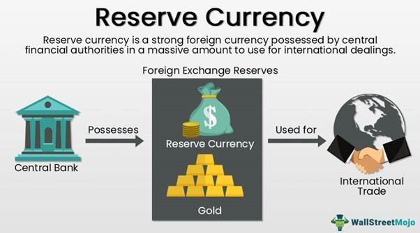

In global finance, the interaction between foreign exchange reserves, currency reserves, and monetary policy is crucial for maintaining economic stability. Central banks utilize these reserves strategically to minimize financial risks and support monetary policy objectives. This involves a careful balance between holding currency reserves and implementing monetary policies that foster economic resilience.

Algorithmic trading, which employs complex algorithms to execute trades rapidly, has transformed financial markets. It presents opportunities to enhance liquidity and market efficiency, but also poses challenges in terms of transparency and regulation. Understanding the influence of algorithmic trading on financial dynamics is vital in modern finance.

A thorough comprehension of how these components interact is essential for countries seeking economic resilience. This article will define key concepts and explain their significance before examining their interconnected roles in today's financial landscape.

## Table of Contents

## Understanding Foreign Exchange and Currency Reserves

Foreign exchange reserves are crucial assets held by central banks predominantly in foreign currencies. These reserves serve as a foundational support for national liabilities and play a significant role in the execution of monetary policy. The typical composition of these reserves includes a mix of banknotes, financial deposits, and government securities, each chosen for their liquidity and stability.

The diversification of currency holdings within foreign exchange reserves is a strategic practice employed by central banks. This diversification acts as a buffer against economic shocks and minimizes the risks associated with fluctuations in both domestic and international markets. An illustrative example is the widespread holding of reserves in U.S. dollars (USD) by many countries. The USD is favored due to its global stability and high convertibility, which provide a reliable protection mechanism during economic turbulence.

Maintaining adequate foreign exchange reserves is a delicate balancing act. Central banks must ensure that reserves are sufficient to assure liquidity in times of financial stress, thereby safeguarding a country’s financial health and stability. The optimal level of reserves varies depending on a country's economic size, trade relationships, and financial openness. Calculating the appropriate amount involves assessing the potential shortfall in foreign currency needed to cover future obligations under adverse circumstances.

To further understand this balancing act, consider the adequacy metric for foreign exchange reserves. The metric may include measures such as the import cover ratio, which is calculated as:

$$
\text{Import Cover Ratio} = \frac{\text{Total Foreign Exchange Reserves}}{\text{Average Monthly Imports}}
$$

This ratio evaluates how many months a country's reserves can cover its imports, serving as an indicator of reserve adequacy.

The strategic holding and management of foreign exchange reserves require precision and an understanding of global financial dynamics. The goal is not merely to accumulate these assets but to manage them effectively, ensuring that they can serve the country’s needs in stabilizing the economy and foreseeing financial challenges.

## Foreign Exchange Reserves and Economic Stability

Foreign exchange reserves are an essential component of a nation's economic framework, acting as a buffer against financial disturbances. These reserves ensure that a country can stabilize its currency value when faced with financial uncertainty. During balance of payment crises, where there is a negative difference between the money flowing into and out of a country, foreign exchange reserves provide the necessary [liquidity](/wiki/liquidity-risk-premium) to prevent excessive depreciation of the national currency. This process involves utilizing these reserves to manage short-term economic [volatility](/wiki/volatility-trading-strategies) and maintain exchange rate stability.

Moreover, a well-managed portfolio of foreign exchange reserves significantly enhances a nation's creditworthiness. By maintaining a substantial level of reserves, a country reduces its vulnerability to speculative attacks that can destabilize its currency. For instance, speculative attacks often occur when investors sell off a nation's currency en masse, betting that its value will decline. A robust reserve can discourage such speculative movements by signaling that the country has ample liquidity to defend its currency value.

China serves as a prime example of strategic reserve management. With vast foreign exchange reserves, China has effectively stabilized its economy, using these resources to manage its exchange rates and to support its broader economic policies. This strategic management also extends to investments that foster national economic interests, thereby reinforcing economic resilience.

Ultimately, foreign exchange reserves are crucial for maintaining both market confidence and national economic stability. They provide the financial security necessary to absorb economic shocks and allow for the implementation of monetary policies that promote sustainable economic growth. As countries continue to navigate an interconnected global economy, maintaining substantial reserves remains a strategic imperative for economic stability.

## Algorithmic Trading in the Foreign Exchange Market

Algorithmic trading employs sophisticated algorithms to execute trades at exceptionally high speeds, thereby significantly reshaping the landscape of the foreign exchange ([forex](/wiki/forex-system)) market. These algorithms are designed to process vast amounts of data in real-time, allowing them to identify trading opportunities that are devoid of human emotional biases and error-prone decisions. By relying on data-driven methodologies, [algorithmic trading](/wiki/algorithmic-trading) endeavors to achieve greater precision and efficiency in trade executions, enhancing overall market performance.

A key feature of algorithmic trading is its ability to introduce enhanced speed and liquidity into the markets. High-Frequency Trading ([HFT](/wiki/high-frequency-trading-strategies)), a subset of algorithmic trading, involves executing a large number of orders at extremely rapid speeds, usually in fractions of a second. This rapidity increases the turnover of trading positions and ensures that markets are more liquid, thereby facilitating smoother and more continuous trading.

However, alongside the benefits of speed and liquidity, algorithmic trading introduces crucial concerns regarding transparency and fairness. The opacity in algorithmic decision-making processes may cause market participants and regulators to question the fairness of these technologies, especially in instances where algorithms lead to market anomalies or "flash crashes." As a result, maintaining transparency while ensuring that algorithmic trading does not disadvantage specific market players remains a critical regulatory challenge.

Studies indicate that algorithmic trading, despite fears of potential destabilization, can in fact reduce market volatility in the long run. This is attributed to its ability to efficiently absorb market information and react to it in real-time, thus curbing excessive price fluctuations. The hypothesis is that algorithms, by acting on new information more rapidly than human traders, can preemptively moderate significant market swings, consequently reducing overall volatility levels.

The profound impact of algorithmic trading technologies on market dynamics necessitates stringent regulatory oversight. Market regulators worldwide grapple with ensuring that the benefits of algorithmic trading are harnessed while mitigating risks associated with technological failures or unethical practices. Regulatory frameworks are evolving to address these challenges, seeking to preserve market integrity without stifling innovation.

Algorithmic trading's transformation of the forex market underscores the need for ongoing vigilance and adaptive strategies to foster a conducive trading environment that bolsters economic resilience and maintains equitable access for all market participants.

## The Intersection of Economic Stability and Algo Trading

Algorithmic trading intersects with economic stability by utilizing real-time data insights and market agility to enhance the efficiency and resilience of financial markets. These systems leverage automated processes to swiftly adjust to market changes, thereby absorbing shocks and mitigating market volatility. This capability is crucial for maintaining stability in the face of sudden economic shifts.

The integration of [machine learning](/wiki/machine-learning) and big data analytics in algorithmic trading facilitates more accurate predictions of market trends. Machine learning algorithms, by analyzing large datasets, can detect patterns and extrapolate future market movements with higher precision than traditional methods. For instance, the use of neural networks and regression models allows for adaptive strategies that can evolve based on new information, thus improving the robustness of trading systems.

In addition to trend prediction, algorithmic trading systems are adept at identifying [arbitrage](/wiki/arbitrage) opportunities. Arbitrage plays a vital role in ensuring market efficiency as it involves taking advantage of price differentials in different markets or instruments. By executing trades that capitalize on these discrepancies, algorithmic systems help align prices across markets, contributing to overall market stability.

This technological fusion represents a paradigm shift towards data-driven decision-making in economic policy and financial markets. Algorithmic trading provides a framework for central banks and financial institutions to analyze vast quantities of economic data, facilitating informed policy decisions. The adoption of such technologies necessitates robust regulatory frameworks to manage potential risks, such as systemic errors or market manipulation.

Overall, the intersection of algorithmic trading with economic stability underscores the importance of technological innovation in modern financial systems. By harnessing the power of advanced analytics and automation, financial markets can achieve greater stability and efficiency, aligning with broader economic objectives.

## Future Trends and Challenges

As digital currencies, such as the digital Chinese Yuan, gain wider acceptance, central banks are compelled to reassess traditional reserve management strategies. This shift toward digitalization marks a significant transformation in how central banks might approach not only reserves but also broader financial policy frameworks. Central Bank Digital Currencies (CBDCs) stand at the forefront of this change, with the potential to revolutionize reserve management and enhance the efficiency of cross-border transactions. The implementation of CBDCs may streamline transaction processes, reduce costs, and offer real-time payment capabilities, challenging the existing financial systems.

However, alongside these opportunities, several challenges arise. Cybersecurity emerges as a paramount concern, given the increased threat surface that digital currencies present. Protecting against cyber threats requires robust security protocols and constant vigilance, as breaches could lead to significant financial and reputational losses. Moreover, central banks need to ensure the digital currencies' adaptability within existing monetary policies. This includes maintaining control over inflation rates and preventing any destabilizing effects on national and global economies.

Another critical challenge is managing exchange rate stability in a digitized financial environment. As digital currencies transcend traditional boundaries, fluctuations in their value can impact exchange rates dramatically. Central banks must develop innovative approaches to monitor and adjust to these changes, ensuring that currency value remains stable. 

To tackle these challenges, significant investment in technology is crucial. This encompasses advancements in data analytics, [artificial intelligence](/wiki/ai-artificial-intelligence), and blockchain technology, which collectively can offer better oversight and predictability in managing digital currencies. Additionally, international collaboration becomes essential. Joint efforts among countries can help establish global standards and protocols, facilitating smoother implementation and management of digital currencies and their impacts on exchange rates and reserve strategies.

In summary, while digital currencies present a pathway to modernize financial systems and enhance transaction efficiencies, they also require careful consideration and strategic planning to manage potential risks and ensure successful integration into the global financial architecture.

## Conclusion

Foreign exchange reserves, economic stability, and algorithmic trading form a crucial triad in global finance. The interconnectedness of these elements necessitates skillful management and integration with cutting-edge technologies. Properly managed foreign exchange reserves are essential for stabilizing national economies, buffered against potential global financial disturbances. Algorithmic trading introduces both opportunities and challenges, requiring robust regulatory frameworks to ensure transparency and fairness.

As global economies undergo continuous transformation, there is an imperative to adapt to both traditional financial instruments and new emergent technologies such as Central Bank Digital Currencies (CBDCs) and algorithmic trading systems. Strategic management of these components will be essential for nurturing economic resilience and fostering growth. This involves maintaining a delicate balance between capitalizing on the advantages of sophisticated trading technologies while mitigating associated risks.

In conclusion, the strategic integration and management of foreign exchange reserves, economic policies, and algorithmic trading stand as pillars for future-proofing economies against uncertainties. Policymakers and financial institutions must prioritize this integration to harness the benefits of technological advancements fully and maintain economic stability in an increasingly complex financial landscape.

## References & Further Reading

- Chaboud, A. P., et al. 'Rise of the Machines: Algorithmic Trading in the Foreign Exchange Market.' The Journal of Finance. This paper examines the increasing prevalence of algorithmic trading in the forex market, discussing how such technologies have reshaped trading practices and impacted market volatility.

- Dominguez, K. M. E. 'Central Bank Intervention and Exchange Rate Volatility.' Journal of International Money and Finance. This article explores the role of central bank interventions in currency markets and their effects on exchange rate fluctuations, offering insights into the dynamic interplay between policy measures and market responses.

- Ito, T., & McCauley, R. N. 'Exchange Rate Regimes in East Asia.' National Bureau of Economic Research. The authors analyze the various exchange rate regimes across East Asian economies, investigating how these frameworks impact regional and global financial stability.

- Lopez de Prado, M. 'Advances in Financial Machine Learning.' Wiley. This book provides a comprehensive overview of how machine learning techniques are being applied in financial markets, focusing on the advancements and challenges in implementing these methods in trading and investment strategies.

- Lyons, R. K. 'The Microstructure Approach to Exchange Rates.' The MIT Press. This work investigates into the microstructures that govern foreign exchange markets, offering a detailed examination of how market mechanisms affect currency prices and exchange rate movements.