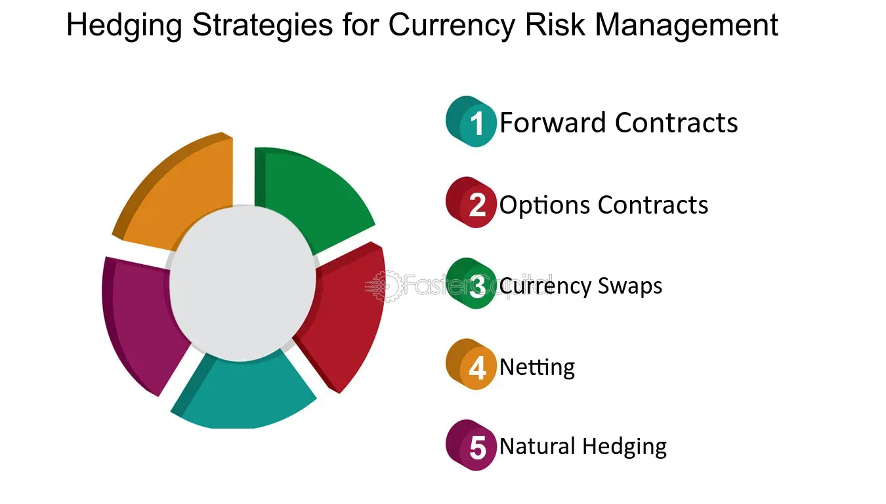

## Table of Contents

## What is currency risk?

Currency risk, also known as exchange rate risk, is the possibility that changes in currency exchange rates will affect the value of your investments or business dealings. When you have money or assets in a foreign currency, the value of that currency can go up or down compared to your own country's currency. If the foreign currency loses value, your investment could be worth less when you convert it back to your home currency.

For example, if you are a U.S. company doing business in Europe and the euro weakens against the dollar, the money you earn in euros will buy fewer dollars when you bring it back home. This can reduce your profits. To manage currency risk, businesses and investors might use financial tools like forward contracts or options to lock in exchange rates ahead of time. Understanding and managing currency risk is important for anyone involved in international trade or investing in foreign markets.

## How does currency risk affect businesses and investors?

Currency risk can have a big impact on businesses that work in different countries. If a business sells things in another country, it gets paid in that country's money. If that money becomes worth less compared to the business's home country money, the business will get less money when it changes it back. This can make the business's profits smaller. For example, if a U.S. company sells things in Europe and the euro gets weaker against the dollar, the money the company earns in euros will buy fewer dollars when it brings it back to the U.S. This can make the business less profitable and might even cause it to lose money.

Investors also feel the effects of currency risk. When investors buy things like stocks or bonds in another country, they get paid in that country's money. If that money loses value compared to their home country's money, the investment will be worth less when they change it back. This can lower the investor's returns. For example, if an investor from Japan buys U.S. stocks and the dollar weakens against the yen, the money the investor gets from the stocks will buy fewer yen when they bring it back to Japan. This can make the investment less valuable and might make the investor think twice about investing in other countries.

## What are the main types of currency risk?

There are three main types of currency risk: transaction risk, translation risk, and economic risk. Transaction risk happens when a business or investor has to change money from one currency to another. If the exchange rate changes between the time a deal is made and when the money is actually changed, the business or investor might lose money. For example, if a U.S. company agrees to buy something in euros and the euro gets stronger before the payment is made, the company will have to pay more dollars.

Translation risk is about how a business's financial statements look when they are changed from one currency to another. If a company has offices in different countries, it has to change all the money amounts to one main currency for its financial reports. If the exchange rates change, the numbers in the financial statements can look very different. This can make the company seem more or less profitable than it really is. For example, if a Canadian company has a branch in the U.S. and the U.S. dollar gets weaker, the profits from the U.S. branch will look smaller when changed to Canadian dollars.

Economic risk is the biggest type of currency risk because it affects a business's overall value and future earnings. This risk comes from changes in exchange rates that can make a company's products more or less competitive in different markets. If a country's currency gets stronger, its exports become more expensive for other countries to buy, which can hurt sales. On the other hand, if the currency gets weaker, it can make imports more expensive, which can raise costs for the business. For example, if the Japanese yen gets stronger, Japanese cars will cost more in the U.S., which might make fewer people want to buy them.

## What are some common indicators of currency risk?

One common indicator of currency risk is changes in interest rates. When a country's central bank changes its interest rates, it can affect the value of its currency. If interest rates go up, people might want to invest more in that country because they can earn more from their investments. This can make the currency stronger. On the other hand, if interest rates go down, the currency might get weaker because people might take their money out of the country to find better investment opportunities elsewhere.

Another indicator is the country's economic performance. If a country's economy is doing well, with strong growth and low unemployment, its currency is likely to be strong. This is because investors see the country as a good place to put their money. But if the economy is struggling, with slow growth or high unemployment, the currency might weaken because investors might not want to invest there. Also, big events like political changes or natural disasters can cause sudden changes in a country's currency value, which can increase currency risk.

Inflation rates can also signal currency risk. If a country has high inflation, its currency might lose value because the prices of goods and services are going up quickly. This makes the currency less attractive to investors. On the other hand, if a country has low inflation, its currency might be seen as more stable and could become stronger. Keeping an eye on these indicators can help businesses and investors understand and manage their currency risk better.

## How can individuals and businesses measure their exposure to currency risk?

Individuals and businesses can measure their exposure to currency risk by looking at how much of their money or investments are in foreign currencies. They need to see if they have money coming in or going out in different currencies. For example, if a business sells things in another country, it should look at how much money it expects to get in that country's currency. If an individual has investments in foreign stocks or bonds, they should check how much of their total investments are in those foreign currencies. By adding up all the money they have in different currencies, they can see how much they could lose if those currencies change in value.

To get a clearer picture, they can also use tools like currency risk calculators or financial software. These tools help them see how changes in exchange rates might affect their money. For example, a business might use a forward contract to see what would happen if the exchange rate changes by a certain amount. An individual might use a currency converter to see how much their foreign investments would be worth if the exchange rate changed. By doing these calculations, they can understand their currency risk better and make plans to protect themselves from big losses.

## What are the basic strategies for managing currency risk?

One basic strategy for managing currency risk is to use financial tools like forward contracts and options. A forward contract lets you lock in an exchange rate for a future date, so you know exactly how much money you'll get or pay, no matter what happens to the exchange rate. Options give you the right, but not the obligation, to buy or sell a currency at a set rate. This can be useful if you want to protect yourself from a big drop in the value of a currency, but you're okay with keeping things as they are if the currency stays strong. By using these tools, businesses and investors can reduce the risk of losing money because of changes in exchange rates.

Another strategy is to diversify your investments or business activities across different currencies. This means not putting all your money or business in one country or currency. If you have investments in several countries, a drop in one currency might be balanced out by gains in another. Businesses can do the same by selling things in different countries. This way, if one currency gets weaker, they can still make money from other countries where the currency is strong. Diversifying helps spread out the risk and can make it easier to handle changes in exchange rates.

## How do forward contracts help in managing currency risk?

Forward contracts help in managing currency risk by letting you lock in an exchange rate for a future date. This means you know exactly how much money you will get or have to pay, no matter what happens to the exchange rate later. For example, if a U.S. company knows it will have to pay for something in euros in three months, it can use a forward contract to set the exchange rate now. This way, if the euro gets stronger against the dollar in those three months, the company won't have to pay more dollars. It's like making a deal to buy or sell currency at today's rate, even though the actual exchange will happen later.

Using forward contracts can give businesses and investors peace of mind. They don't have to worry about sudden changes in exchange rates that could hurt their profits or investments. It's a way to plan ahead and know what to expect. This can be really helpful for businesses that do a lot of international trade or for investors who have money in different countries. By using forward contracts, they can focus on other parts of their business or investments without worrying as much about currency risk.

## What role do options play in currency risk management?

Options are another tool that can help manage currency risk. They give you the right, but not the obligation, to buy or sell a currency at a set rate before a certain date. This means you can protect yourself from big drops in a currency's value, but you don't have to use the option if the currency stays strong or goes up. For example, if you think the euro might get weaker against the dollar, you can buy an option to sell euros at today's rate. If the euro does get weaker, you can use the option and sell at the better rate. But if the euro stays the same or goes up, you can just let the option expire and not use it.

Using options can be a good way to manage currency risk because they give you flexibility. You can decide whether to use the option based on what happens to the exchange rate. This can be really helpful for businesses that want to protect themselves from big losses but are okay with keeping things as they are if the currency stays strong. By using options, businesses and investors can feel more secure and focus on other parts of their work without worrying as much about sudden changes in exchange rates.

## How can natural hedging be used as a strategy to mitigate currency risk?

Natural hedging is a way for businesses to reduce currency risk without using financial tools like forward contracts or options. It involves matching up money coming in and going out in the same currency. For example, if a U.S. company sells things in Europe and gets paid in euros, it can try to buy things it needs in Europe too, so it spends those euros. This way, if the euro gets weaker against the dollar, the company loses money on the euros it earns, but it also saves money on the euros it spends. By balancing income and expenses in the same currency, the company can reduce the impact of changes in exchange rates.

This strategy can be really helpful for businesses that work in many countries. It doesn't cost extra money like some financial tools do, and it can make a business's money flow more stable. But natural hedging isn't perfect. It might not be possible to match up all income and expenses perfectly, and it can limit a business's options. Still, when used well, natural hedging can be a smart way to manage currency risk and keep a business's finances more secure.

## What advanced tools and techniques are available for sophisticated currency risk management?

For businesses and investors looking for more advanced ways to manage currency risk, there are tools like currency swaps and exotic options. A currency swap is when two parties agree to exchange currencies for a certain time and then swap back later. This can help businesses lock in exchange rates for a long time, which is good for big projects or long-term plans. Exotic options are special kinds of options that can be set up to fit a business's specific needs. They can be used to protect against big changes in exchange rates in ways that regular options can't.

Another advanced technique is using algorithms and machine learning to predict how exchange rates might change. These tools look at a lot of data, like economic reports, news, and past exchange rates, to guess what might happen next. By using these predictions, businesses and investors can make smarter choices about when to buy or sell currencies. This can help them manage currency risk better and maybe even make more money. But these advanced tools need a lot of knowledge and can be hard to use, so they're usually for people who really know what they're doing.

## How do multinational corporations typically approach currency risk management?

Multinational corporations often use a mix of different strategies to manage currency risk. They might use financial tools like forward contracts and options to lock in exchange rates and protect themselves from big changes. For example, if a company knows it will have to pay for something in another currency in the future, it can use a forward contract to set the exchange rate now. This way, the company knows exactly how much it will have to pay, no matter what happens to the exchange rate later. They might also use options, which give them the right to buy or sell a currency at a set rate, but they don't have to if the rate stays the same or goes the other way.

Another approach multinational corporations take is natural hedging, where they try to match up their income and expenses in the same currency. For example, if a company sells things in Europe and gets paid in euros, it can try to buy things it needs in Europe too, so it spends those euros. This way, if the euro gets weaker against the company's home currency, the company loses money on the euros it earns, but it also saves money on the euros it spends. Some big companies also use advanced tools like currency swaps and exotic options, which can be set up to fit their specific needs. They might even use algorithms and machine learning to predict how exchange rates might change and make smarter choices about when to buy or sell currencies.

## What are the latest trends and innovations in currency risk management strategies?

The latest trends in currency risk management include more use of technology and data. Companies are using algorithms and machine learning to predict how exchange rates might change. These tools look at a lot of information, like economic reports, news, and past exchange rates, to make guesses about what might happen next. By using these predictions, businesses can make smarter choices about when to buy or sell currencies. This can help them manage currency risk better and maybe even make more money. But these tools need a lot of knowledge and can be hard to use, so they're usually for big companies with experts who know how to use them.

Another trend is the use of blockchain and cryptocurrencies in managing currency risk. Some companies are starting to use cryptocurrencies like Bitcoin to do business in different countries. Cryptocurrencies can help businesses avoid some of the problems that come with using regular money, like high fees and slow transactions. But they also come with their own risks, like big changes in value. Some companies are also using blockchain technology to make their financial deals safer and easier to track. This can help them manage currency risk by making sure their money is safe and they can see where it's going. These new ways of managing currency risk are still growing and changing, so it's important for businesses to keep learning and trying new things.

## References & Further Reading

[1]: Bergstra, J., Bardenet, R., Bengio, Y., & Kégl, B. (2011). ["Algorithms for Hyper-Parameter Optimization."](https://papers.nips.cc/paper/4443-algorithms-for-hyper-parameter-optimization) Advances in Neural Information Processing Systems 24.

[2]: ["Advances in Financial Machine Learning"](https://www.amazon.com/Advances-Financial-Machine-Learning-Marcos/dp/1119482089) by Marcos Lopez de Prado

[3]: ["Evidence-Based Technical Analysis: Applying the Scientific Method and Statistical Inference to Trading Signals"](https://www.amazon.com/Evidence-Based-Technical-Analysis-Scientific-Statistical/dp/0470008741) by David Aronson

[4]: ["Machine Learning for Algorithmic Trading"](https://github.com/stefan-jansen/machine-learning-for-trading) by Stefan Jansen

[5]: ["Quantitative Trading: How to Build Your Own Algorithmic Trading Business"](https://www.amazon.com/Quantitative-Trading-Build-Algorithmic-Business/dp/1119800064) by Ernest P. Chan