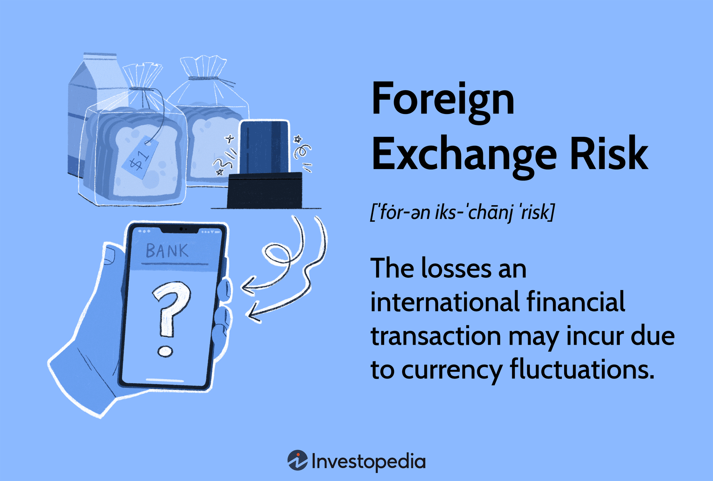

## Table of Contents

## What is currency risk in the context of foreign investments?

Currency risk, also known as exchange rate risk, is the possibility that the value of your investment in a foreign country could decrease because of changes in the exchange rate between your home country's currency and the foreign country's currency. For example, if you invest in a company in Europe and the euro weakens against your home currency, the value of your investment in your home currency will go down, even if the value of the company stays the same in euros.

This risk is important for anyone investing in foreign markets because it can affect the returns on your investment. To manage this risk, investors can use different strategies like hedging, which involves using financial instruments to protect against unfavorable currency movements. Understanding and managing currency risk is crucial for making informed decisions about foreign investments and protecting your financial interests.

## Why is it important to mitigate currency risk when investing abroad?

It's important to mitigate currency risk when investing abroad because it can affect how much money you make or lose. If the currency of the country you invested in gets weaker compared to your own country's currency, your investment might be worth less when you convert it back. This can happen even if the investment itself is doing well in the foreign country. So, by managing currency risk, you can help protect the value of your investment and make sure you don't lose money just because of changes in exchange rates.

There are ways to reduce currency risk, like using financial tools called hedges. These can help balance out any losses from currency changes. By doing this, you can focus more on the performance of your investment itself, rather than worrying about currency movements. Managing currency risk helps you keep more control over your investments and can lead to better overall returns, making your investment strategy more stable and predictable.

## What are the basic strategies for managing currency risk?

One basic way to manage currency risk is by using a strategy called hedging. Hedging means you use financial tools, like currency futures or options, to protect your investment from big changes in exchange rates. For example, if you think the currency of the country you invested in might get weaker, you can buy a futures contract that lets you exchange money at today's rate in the future. This way, even if the currency does get weaker, you won't lose as much money.

Another strategy is to diversify your investments across different countries and currencies. By spreading your money around, you reduce the risk that a big change in one currency will hurt all your investments. If one currency gets weaker, another might get stronger, which can help balance things out. This approach can make your overall investment more stable and less affected by currency changes.

A third way to manage currency risk is by matching your investments with your liabilities. If you have expenses in a foreign currency, like paying for a house in another country, you can invest in that country's currency. This way, if the currency gets weaker, your investment might lose value, but the money you need to pay your expenses will also be less. This strategy helps to keep things balanced and reduces the impact of currency changes on your overall financial situation.

## How does currency hedging work, and what are its benefits?

Currency hedging is like buying insurance for your money when you invest in another country. It helps protect your investment from losing value if the currency of that country changes. Imagine you invest in a company in Europe and you're worried the euro might get weaker compared to your home currency. You can use something called a currency futures contract, which lets you agree to exchange euros for your home currency at today's rate in the future. So, even if the euro does get weaker, you can still exchange it at the better rate you locked in earlier.

The benefits of currency hedging are pretty clear. It helps you sleep better at night because it reduces the risk that currency changes will hurt your investment. If you hedged your investment and the currency does get weaker, you won't lose as much money. This can make your overall investment strategy more predictable and stable. Plus, it lets you focus more on how well the company or asset you invested in is doing, rather than worrying about unpredictable currency movements.

## What are the common financial instruments used for currency risk mitigation?

One common financial instrument for managing currency risk is the currency forward contract. This is like a promise between you and a bank or another financial institution. You agree to exchange a certain amount of one currency for another at a set rate on a future date. This helps because it locks in the exchange rate, so you know exactly how much your investment will be worth in your home currency, no matter what happens to the exchange rate later.

Another tool is the currency option. This gives you the right, but not the obligation, to exchange currencies at a specific rate before a certain date. It's a bit like buying insurance. If the currency moves in a way that's bad for your investment, you can use the option to exchange at the better rate you locked in. But if the currency moves in your favor, you don't have to use it, and you can just exchange at the better current rate.

Currency futures are also used a lot. These are similar to forward contracts but are traded on exchanges. They work by agreeing to buy or sell a currency at a set price on a future date. They're useful because they're standardized and can be easily bought and sold. This makes them a good choice if you want to hedge your investment and also have the flexibility to change your mind later.

## How can diversification help in reducing currency risk?

Diversification means spreading your investments across different countries and currencies. When you do this, you're not putting all your eggs in one basket. If one currency gets weaker, it might hurt the value of your investment in that country. But if you also have investments in other countries, their currencies might stay strong or even get stronger. This can help balance out any losses from the weaker currency, making your overall investment less risky.

For example, imagine you invest in companies in both the US and Japan. If the Japanese yen gets weaker compared to the US dollar, your investment in Japan might lose value. But if the US dollar stays strong or gets even stronger, your investment in the US could gain value. By having investments in both places, you reduce the chance that a big change in one currency will hurt all your investments. Diversification helps smooth out the ups and downs caused by currency changes, making your investment strategy more stable and less risky.

## What role do currency forwards and futures play in managing currency risk?

Currency forwards and futures are like tools that help you manage the risk of currency changes when you invest in another country. A currency forward is an agreement between you and a bank or another financial institution. You both agree to exchange a certain amount of one currency for another at a set rate on a future date. This is useful because it locks in the exchange rate, so you know exactly how much your investment will be worth in your home currency, no matter what happens to the exchange rate later. It's like making a plan ahead of time to protect your investment from unexpected changes.

Currency futures work in a similar way, but they are traded on exchanges. When you use a currency future, you agree to buy or sell a currency at a set price on a future date. These are standardized and can be easily bought and sold, which gives you more flexibility. If you think the currency might get weaker and hurt your investment, you can use a future to lock in a better rate now. This way, even if the currency does get weaker, you can exchange it at the rate you locked in earlier, protecting your investment from losing too much value. Both forwards and futures help you manage the uncertainty of currency changes and keep your investment more stable.

## How can options be used effectively for currency risk mitigation?

Options are like a safety net for your investments when you're worried about currency changes. They give you the right, but not the obligation, to exchange one currency for another at a specific rate before a certain date. This means if the currency moves in a way that's bad for your investment, you can use the option to exchange at the better rate you locked in earlier. It's like having insurance; if things go wrong, you're protected, but if things go well, you don't have to use the option and can just exchange at the better current rate.

Using options effectively means you can protect your investment without locking yourself into a deal. For example, if you think the euro might get weaker compared to your home currency, you can buy an option to exchange euros at today's rate. If the euro does get weaker, you can use the option to minimize your loss. But if the euro stays strong or gets even stronger, you don't have to use the option and can benefit from the better exchange rate. This flexibility makes options a smart choice for managing currency risk, helping you balance protection with the potential for gains.

## What are the tax implications of using currency risk mitigation strategies?

Using strategies to manage currency risk can affect your taxes. When you use tools like currency forwards, futures, or options, you might have to pay taxes on any gains or losses you make from these transactions. The tax rules can be different depending on where you live and the specific financial instruments you use. For example, in some places, gains from currency futures might be taxed as capital gains, while in other places, they might be treated as regular income. It's important to understand how these rules apply to you so you can plan your investments and taxes better.

Another thing to think about is how these strategies might change the overall value of your investment. If you use a currency forward to lock in a better exchange rate and it helps your investment grow, that growth could be taxed. On the other hand, if using these strategies results in a loss, you might be able to use that loss to reduce your taxes. Talking to a tax professional can help you figure out the best way to handle these situations and make sure you're following the tax laws correctly.

## How do multinational companies typically approach currency risk management?

Multinational companies often use a mix of strategies to manage currency risk because they do business in many different countries. One common approach is hedging, where they use financial tools like currency forwards, futures, and options to protect their profits from big changes in exchange rates. For example, if a company knows it will need to pay for something in euros in the future, it might use a forward contract to lock in today's exchange rate. This way, even if the euro gets weaker, the company won't lose as much money. Another strategy is diversification, where the company spreads its investments and operations across different countries. This helps balance out any losses from a weaker currency in one place with gains from a stronger currency in another.

In addition to these financial tools, multinational companies also look at their overall business strategy to manage currency risk. They might match their income and expenses in different currencies, so if one currency gets weaker, it affects both their income and their costs in a similar way. This helps keep things balanced. Companies also keep a close eye on currency markets and use their predictions to decide when to use hedging tools. By combining these different approaches, multinational companies can better handle the ups and downs of currency changes and protect their profits.

## What advanced techniques can be employed for dynamic currency risk management?

Dynamic currency risk management involves using more advanced techniques to adapt quickly to changes in currency markets. One such technique is dynamic hedging, which means adjusting your hedging strategies as currency rates change. Instead of setting a hedge and leaving it, you keep an eye on the market and make changes to your hedges as needed. This can help you take advantage of good currency movements while still protecting against bad ones. For example, if you see that a currency is getting stronger, you might reduce your hedge to benefit from that change, but if it starts to weaken, you can increase your hedge to protect your investment.

Another advanced technique is using algorithms and automated trading systems. These systems can analyze lots of data quickly and make trades based on that analysis. They can spot trends and patterns in currency markets that might be hard for a person to see. By using these systems, companies can make faster and more informed decisions about when to hedge and how much to hedge. This can help them manage currency risk more effectively and react to market changes in real time. While these techniques can be more complex, they offer a way to be more proactive and flexible in managing currency risk.

## How can predictive analytics and machine learning be utilized to optimize currency risk mitigation strategies?

Predictive analytics and machine learning can help make better decisions about managing currency risk by looking at lots of data and finding patterns. These technologies can look at past currency movements, economic reports, and other information to guess what might happen next. For example, they can predict if a currency is likely to get stronger or weaker. By using these predictions, companies can decide when to use hedging tools like currency forwards or options. This helps them protect their investments from bad currency changes and take advantage of good ones.

Machine learning can also make these predictions more accurate over time. As it gets more data, it learns and gets better at spotting trends. This means companies can adjust their currency risk strategies more quickly and accurately. For instance, if machine learning sees that a certain economic event often leads to a currency getting weaker, it can warn the company to hedge more before that event happens. This way, companies can be more proactive and flexible in managing currency risk, making their overall investment strategy more stable and successful.

## References & Further Reading

[1]: Shapiro, A.C., & Moles, P. (2014). ["International Financial Management."](https://archive.org/details/internationalfin0000shap) Wiley.

[2]: Lopez de Prado, M. (2018). ["Advances in Financial Machine Learning."](https://www.amazon.com/Advances-Financial-Machine-Learning-Marcos/dp/1119482089) Wiley.

[3]: Chan, E.P. (2008). ["Quantitative Trading: How to Build Your Own Algorithmic Trading Business."](https://github.com/ftvision/quant_trading_echan_book) Wiley.

[4]: Aronson, D.R. (2007). ["Evidence-Based Technical Analysis: Applying the Scientific Method and Statistical Inference to Trading Signals."](https://www.amazon.com/Evidence-Based-Technical-Analysis-Scientific-Statistical/dp/0470008741) Wiley.

[5]: Hull, J.C. (2018). ["Options, Futures, and Other Derivatives."](https://www.semanticscholar.org/paper/Options%2C-Futures%2C-and-Other-Derivatives-Hull/89bdee500c8623864fc9eb7a471546aa713acc44) Pearson.

[6]: Jansen, S. (2020). ["Machine Learning for Algorithmic Trading: Predictive models to extract signals from market and alternative data for systematic trading strategies with Python."](https://github.com/stefan-jansen/machine-learning-for-trading) Packt Publishing.