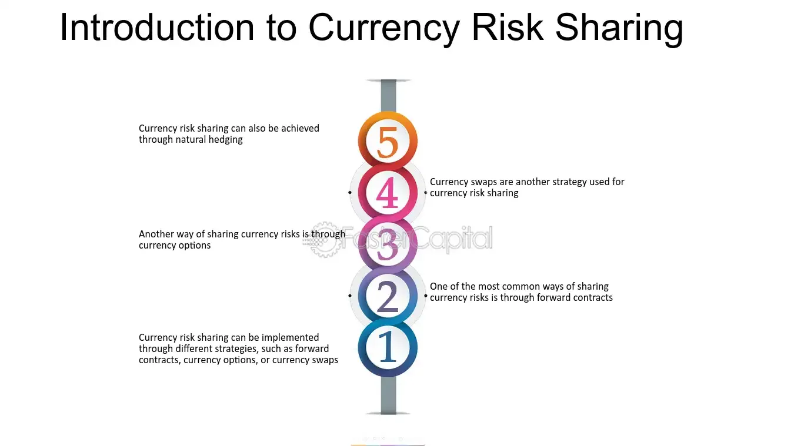

## Table of Contents

## What is currency risk sharing?

Currency risk sharing is a way for businesses to manage the risks that come from changes in exchange rates between different currencies. When a company does business in different countries, it has to deal with money in different currencies. If the value of one currency goes up or down compared to another, it can affect how much money the company makes or spends. To handle this, companies can use currency risk sharing agreements. These agreements help spread out the risk between the buyer and the seller, so both sides share the impact of currency changes.

In a currency risk sharing agreement, the buyer and seller agree on a base exchange rate for their transactions. If the actual exchange rate changes, the difference is split between them according to a pre-agreed formula. This helps both parties feel more secure because they know they won't face the full impact of currency fluctuations alone. By sharing the risk, companies can plan their budgets better and avoid big surprises from sudden changes in currency values.

## Why is currency risk sharing important for businesses?

Currency risk sharing is important for businesses because it helps them manage the uncertainty that comes from changes in exchange rates. When a business deals with different currencies, the value of money can go up or down. This can make it hard for the business to know how much money it will make or spend. By using currency risk sharing, a business can share the risk of these changes with its partners. This means that if the exchange rate changes, both the buyer and the seller will feel the impact, but it won't be as big for either of them.

This sharing of risk helps businesses plan better and feel more secure. When a business knows that it won't face the full impact of currency changes alone, it can make better decisions about pricing, budgeting, and investing. This can lead to more stable profits and less worry about sudden changes in the market. Overall, currency risk sharing makes it easier for businesses to work across different countries and currencies, helping them grow and succeed in a global market.

## How does currency risk sharing differ from traditional currency hedging?

Currency risk sharing and traditional currency hedging are two different ways businesses handle the risk of changes in exchange rates. In traditional currency hedging, a business uses financial tools like forward contracts or options to lock in a specific exchange rate for future transactions. This means the business knows exactly how much it will pay or receive, no matter what happens to the exchange rate later. It's like buying insurance against big changes in currency values.

On the other hand, currency risk sharing involves an agreement between the buyer and seller to split any changes in the exchange rate. Instead of one side taking all the risk, both sides agree to share it. If the exchange rate moves, the difference is divided according to a pre-agreed formula. This method can make both parties feel more secure because they know they won't face the full impact of currency changes alone. It's more about cooperation and sharing the ups and downs together.

## What are the common methods used in currency risk sharing?

In currency risk sharing, businesses use different ways to share the risk of changes in exchange rates. One common method is the shared pricing mechanism. This means that the buyer and seller agree on a base exchange rate for their transactions. If the actual exchange rate changes, the difference is split between them based on a pre-agreed formula. For example, if the rate goes up, the seller might get a bit more money, but the buyer pays a bit less than they would have if the rate had not changed. This way, both sides share the impact of the currency change.

Another method is the currency band approach. In this method, the buyer and seller agree on a range of acceptable exchange rates. If the exchange rate stays within this band, nothing changes. But if it moves outside the band, the difference is shared between them. This helps keep things stable when the exchange rate changes a little, but still shares the risk if the changes are big. Both of these methods help businesses work together to handle the ups and downs of currency values without one side facing all the risk.

## Can you explain the concept of natural hedging in the context of currency risk sharing?

Natural hedging is a way for businesses to lower their currency risk without using special financial tools like forward contracts or options. Instead, it involves matching up costs and income in the same currency. For example, if a company in the US sells products in Europe and gets paid in euros, it could also try to have some of its costs, like buying materials or paying employees, in euros too. This way, if the value of the euro changes compared to the US dollar, the company's income and costs will change together, helping to balance out the risk.

In the context of currency risk sharing, natural hedging can be part of the agreement between a buyer and a seller. They might decide to use natural hedging to share the risk of currency changes. For instance, if a US company is selling to a European company, they might agree that the US company will pay some of its suppliers in euros, while the European company will pay some of its costs in dollars. This way, both companies are naturally hedging their currency risk, and they share the impact of any changes in the exchange rate. It's a cooperative way to manage risk without relying on financial instruments.

## What are the potential benefits of implementing a currency risk sharing agreement?

Implementing a currency risk sharing agreement can help businesses feel more secure when they deal with different currencies. When the value of money changes, it can be hard for companies to know how much they will make or spend. By sharing the risk of these changes with their partners, businesses can avoid big surprises. If the exchange rate moves, both the buyer and the seller will feel the impact, but it won't be as big for either of them. This makes it easier for companies to plan their budgets and make decisions without worrying too much about sudden changes in currency values.

Another benefit is that currency risk sharing can help businesses work better together across different countries. When companies agree to share the risk, it builds trust and cooperation. They can focus on growing their business instead of worrying about currency changes. This can lead to more stable profits and better relationships with partners. Overall, currency risk sharing helps businesses manage the ups and downs of working in a global market, making it easier for them to succeed.

## What challenges might companies face when setting up a currency risk sharing arrangement?

When companies try to set up a currency risk sharing arrangement, they might run into a few challenges. One big challenge is agreeing on the details of the sharing formula. Both the buyer and the seller need to feel that the way they split the risk is fair. This can be hard because what seems fair to one side might not seem fair to the other. They have to talk a lot and maybe even use experts to help them figure out a formula that works for everyone.

Another challenge is making sure that both sides understand and follow the agreement. Currency markets can change quickly, so keeping track of the exchange rates and making sure the sharing formula is used correctly can be tricky. Companies need good systems and clear communication to make sure everything goes smoothly. If one side feels like the other isn't following the agreement, it can lead to problems and even hurt their business relationship.

## How can currency risk sharing impact the financial statements of a company?

Currency risk sharing can affect a company's financial statements by changing how much money it reports as income or expenses. When a company shares the risk of currency changes with its partners, it might see its income go up or down depending on how the exchange rate moves. If the rate changes and the company gets more money from its sales because of the sharing agreement, it will show higher revenue in its financial statements. On the other hand, if the rate changes in a way that means the company pays more for its costs, its expenses will go up.

This sharing of risk can also make a company's financial statements more stable. Because the impact of currency changes is split between the buyer and the seller, the company won't see big swings in its income or expenses from one period to the next. This can make it easier for the company to plan and predict its financial performance. Overall, currency risk sharing helps a company manage its finances better by spreading out the risk of currency changes, which can lead to more predictable and stable financial statements.

## What role do financial instruments play in currency risk sharing strategies?

Financial instruments don't play a direct role in currency risk sharing strategies because currency risk sharing is about agreements between buyers and sellers to split the risk of exchange rate changes. Instead of using financial tools like forward contracts or options, which are common in traditional currency hedging, currency risk sharing focuses on cooperation. The buyer and seller agree on a base exchange rate and a formula to share any changes in the rate. This way, they work together to handle the ups and downs of currency values without relying on special financial products.

However, financial instruments can still be important for companies that use currency risk sharing. For example, a company might use financial tools to manage other risks that aren't covered by the sharing agreement. Or, they might use these instruments to hedge against big changes that could happen outside the agreed-upon sharing formula. By combining currency risk sharing with smart use of financial instruments, companies can create a strong plan to handle currency risk and keep their finances stable.

## How do multinational companies typically structure their currency risk sharing policies?

Multinational companies usually set up their currency risk sharing policies by making clear agreements with their partners about how to handle changes in exchange rates. They agree on a base rate for their transactions and a way to split any changes in the rate. This helps both sides feel more secure because they know they won't face the full impact of currency changes alone. The company might also use experts to help them figure out a fair way to share the risk. They talk a lot with their partners to make sure everyone understands and agrees to the plan.

To make sure the policy works well, multinational companies need good systems to keep track of exchange rates and make sure the sharing formula is used correctly. They need clear communication with their partners to avoid any problems. Sometimes, they might also use other ways to manage currency risk, like natural hedging, where they match up their costs and income in the same currency. This can help them handle currency changes even better. Overall, setting up a good currency risk sharing policy helps multinational companies work smoothly across different countries and currencies.

## What advanced techniques can be used to optimize currency risk sharing?

To optimize currency risk sharing, companies can use a technique called dynamic risk sharing. This means they keep changing the way they split the risk based on how the exchange rate is moving. If the rate changes a lot, they might decide to share the risk differently to make sure both sides are still happy with the deal. This can help them handle big changes in the market better. To do this, they need good systems to watch the exchange rates and talk a lot with their partners to agree on the new sharing plan.

Another technique is to use data analytics to make better decisions about how to share the risk. Companies can look at past data to see how exchange rates have changed before and use this information to predict what might happen next. This can help them set up their sharing formula in a way that works well for both sides. By using data to plan ahead, they can make their currency risk sharing more effective and avoid big surprises from currency changes.

## How does currency risk sharing integrate with overall corporate risk management strategies?

Currency risk sharing is a big part of how companies handle risks when they do business in different countries. It fits into the bigger picture of managing all kinds of risks by helping companies deal with changes in exchange rates. When a company shares the risk of currency changes with its partners, it makes its overall plan to handle risks stronger. This is because the company knows it won't face all the ups and downs of currency values alone. By working together with partners, the company can focus on other risks, like changes in the market or problems with supplies, and feel more secure about its money.

To make sure currency risk sharing works well with the company's overall risk management, it's important to keep everything connected. The company needs to talk a lot with its partners to make sure everyone understands and follows the sharing agreement. They also need good systems to keep track of exchange rates and make sure the sharing formula is used correctly. By combining currency risk sharing with other ways to manage risks, like using financial tools or natural hedging, the company can create a strong plan to handle all kinds of risks and keep its finances stable. This helps the company grow and succeed in a global market.

## References & Further Reading

[1]: Bergstra, J., Bardenet, R., Bengio, Y., & Kégl, B. (2011). ["Algorithms for Hyper-Parameter Optimization."](https://dl.acm.org/doi/10.5555/2986459.2986743) Advances in Neural Information Processing Systems 24.

[2]: ["Advances in Financial Machine Learning"](https://www.amazon.com/Advances-Financial-Machine-Learning-Marcos/dp/1119482089) by Marcos Lopez de Prado

[3]: ["Evidence-Based Technical Analysis: Applying the Scientific Method and Statistical Inference to Trading Signals"](https://www.amazon.com/Evidence-Based-Technical-Analysis-Scientific-Statistical/dp/0470008741) by David Aronson

[4]: ["Machine Learning for Algorithmic Trading"](https://github.com/stefan-jansen/machine-learning-for-trading) by Stefan Jansen

[5]: ["Quantitative Trading: How to Build Your Own Algorithmic Trading Business"](https://www.amazon.com/Quantitative-Trading-Build-Algorithmic-Business/dp/1119800064) by Ernest P. Chan