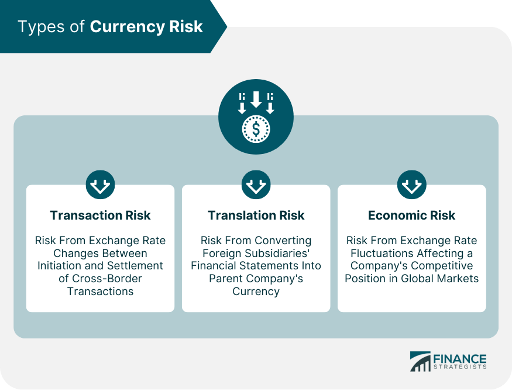

## Table of Contents

## What is currency substitution?

Currency substitution happens when people in a country start using another country's money instead of their own. This can happen for different reasons, like if their own money is not stable or if it's losing value quickly. For example, if a country's money is worth less and less each day, people might decide to use a stronger currency, like the US dollar, for buying things and saving.

When this happens, it can affect the country's economy in big ways. The local money might be used less and less, which can make it harder for the government to control the economy. It can also make it tough for businesses that need to use the local currency. On the other hand, using a stronger foreign currency can help people feel more secure about their money, especially if they are worried about inflation or economic problems at home.

## Why do countries experience currency substitution?

Countries experience currency substitution when their own money loses value or becomes unstable. People might start using a stronger foreign currency, like the US dollar or the euro, because it keeps its value better. This can happen if a country is going through tough economic times, like high inflation or a financial crisis. When people see their money becoming worth less and less, they look for a more reliable option to buy things and save.

When a country's money is not trusted anymore, using another country's money can seem like a good solution. It can make people feel safer about their savings and daily transactions. However, this can cause problems for the country's economy. The government might find it harder to manage the economy because fewer people are using the local currency. Businesses that rely on the local money might struggle too. So, while currency substitution can help people in the short term, it can create bigger challenges for the country's economy in the long run.

## What are the different types of currency substitution?

There are three main types of currency substitution: internal, external, and official. Internal currency substitution happens when people inside a country start using foreign money for everyday buying and selling. This can happen if the local money is losing value fast, so people use a more stable foreign currency like the US dollar to feel safer about their money.

External currency substitution is when a country's money is used in another country. For example, if a nearby country's money is more trusted, people might use it instead of their own. This can happen if the nearby country has a stronger economy. Official currency substitution is when a country's government decides to use another country's money as its official currency. This is called "dollarization" if they use the US dollar. It can help make the economy more stable, but it also means the country gives up control over its own money.

## Can you explain official currency substitution?

Official currency substitution happens when a country's government decides to use another country's money as its official currency. This is often called "dollarization" if the country chooses to use the US dollar. A country might do this if its own money is not stable or if it's losing value quickly. By using a stronger foreign currency, the government hopes to make the economy more stable and give people more trust in their money.

When a country officially adopts another country's currency, it gives up control over its own money. This means the country can't print more money or change interest rates to help its economy. While this can help stop high inflation and make the economy more stable, it also means the country depends on the policies of the country whose currency they are using. So, official currency substitution can be a big step for a country, with both benefits and challenges.

## What is semi-official currency substitution and how does it work?

Semi-official currency substitution is when a country's government allows the use of a foreign currency alongside its own money. This is different from official currency substitution, where the foreign money becomes the only official currency. In semi-official currency substitution, both the local and foreign currencies can be used for everyday buying and selling, but the local currency is still the main one.

This kind of currency substitution can help a country's economy in tough times. If people are worried about their local money losing value, they can use the foreign currency to feel more secure. The government might allow this to stop people from switching completely to the foreign money. But it can also make things more complicated because businesses and people have to deal with two different currencies.

## How does unofficial currency substitution occur?

Unofficial currency substitution happens when people in a country start using another country's money without the government saying it's okay. This can happen when people don't trust their own money anymore. If their money is losing value fast or they're worried about inflation, they might choose to use a more stable foreign currency, like the US dollar, to buy things and save. It's like a choice people make on their own because they think it's better for them.

This kind of currency substitution can create problems for the country's economy. When people use foreign money more and more, the local money might be used less. This can make it harder for the government to control things like inflation and interest rates. Businesses might also find it tough because they have to deal with two different currencies. Even though unofficial currency substitution can help people feel safer about their money, it can cause bigger issues for the country's economy in the long run.

## What are the benefits of currency substitution for an economy?

Currency substitution can help an economy by making people feel more secure about their money. If a country's own money is losing value fast, using a stronger foreign currency can stop people from losing their savings. This can make everyday buying and selling easier and more predictable. When people trust the money they use, they are more likely to spend and invest, which can help the economy grow.

Another benefit is that currency substitution can help control high inflation. If a country's money is becoming worth less and less, switching to a stable foreign currency can slow down or stop this from happening. This can make prices more stable, which is good for both people and businesses. Overall, using a stronger foreign currency can bring more stability and trust to an economy that is struggling with its own money.

## What risks are associated with currency substitution?

Currency substitution can bring some risks to a country's economy. When people start using another country's money, it can make the local money less important. This can make it harder for the government to control the economy. If the government can't use things like interest rates to help the economy, it can lead to bigger problems. Also, if everyone switches to foreign money, it can make the local money even less valuable, which can hurt the country's businesses and people who still need to use it.

Another risk is that the country loses control over its own money. When a country uses another country's currency, it has to follow the rules and policies of that other country. This means the country can't make its own decisions about things like printing more money or changing interest rates. This can make it harder for the country to fix its own economic problems. So, while currency substitution can help in the short term, it can create bigger challenges for the country's economy in the long run.

## How does currency substitution affect monetary policy?

Currency substitution can make it hard for a country to control its own money. When people start using another country's money, they might not use the local money as much. This makes it tough for the government to use tools like interest rates to help the economy. If the government can't change interest rates or print more money, it can't do things like fight inflation or help the economy grow. So, the country loses some power over its own money, which can lead to bigger problems.

Using another country's money can also make the local money less important. If people use the foreign money more, the local money might lose value even faster. This can hurt businesses and people who still need to use the local money. It can also make the economy less stable because the government has less control. So, while currency substitution might help in the short term, it can create bigger challenges for the country's economy in the long run.

## What impact does currency substitution have on a country's exchange rate?

Currency substitution can affect a country's exchange rate in a big way. When people start using another country's money instead of their own, they might not want to use the local money as much. This can make the local money less valuable compared to the foreign money. If lots of people switch to the foreign currency, there will be more local money around and less demand for it. This can make the exchange rate between the local money and the foreign money worse, meaning the local money will be worth even less.

This change in the exchange rate can make things harder for the country's economy. If the local money loses value quickly, it can make imports more expensive. This can lead to higher prices for things people need every day. Also, if businesses in the country need to buy things from other countries, they might have to pay more because their money is worth less. So, currency substitution can make the exchange rate go down, which can cause more problems for the country's economy.

## How can a country mitigate the risks of currency substitution?

A country can try to stop currency substitution by making its own money more stable and trusted. If people see that the local money is not losing value fast and they can trust it, they might not want to switch to another country's money. The government can do this by controlling inflation and keeping the economy strong. They can also make rules that encourage people to use the local money for everyday buying and selling. By showing that the local money is reliable, the government can keep people from using foreign money.

Another way to lower the risks of currency substitution is to have good economic policies. If the government can keep interest rates steady and make sure there's enough money in the economy, people might feel safer using the local money. The country can also work with other countries to get help with their economy. By doing these things, the country can make its money more attractive to use, which can stop people from switching to foreign money. This can help the country keep control over its own money and make the economy more stable.

## What are some real-world examples of currency substitution and their outcomes?

In Zimbabwe, people started using the US dollar instead of their own money because their money was losing value very fast. This happened around 2008 when Zimbabwe had very high inflation. People couldn't trust their money anymore, so they switched to the US dollar to buy things and save. The government later made it official and said the US dollar was the main money to use. This helped stop the high inflation, but it also meant Zimbabwe couldn't control its own money anymore. They had to follow the US's rules about money, which made things harder for their economy.

Another example is Ecuador, which officially switched to using the US dollar in 2000. They did this because their money was not stable and they had a big financial crisis. Using the US dollar helped make their economy more stable and stopped the high inflation they were facing. People felt safer about their money, and it made buying things easier. But like Zimbabwe, Ecuador lost control over its own money. They couldn't print more money or change interest rates to help their economy. So, while using the US dollar helped in the short term, it also created new challenges for Ecuador's economy in the long run.

## References & Further Reading

[1]: Edwards, S., & Levy Yeyati, E. (2005). ["Flexible Exchange Rates as Shock Absorbers"](https://www.nber.org/papers/w9867). Journal of International Economics.

[2]: Mishkin, F. S. (2004). ["The Economics of Money, Banking, and Financial Markets"](https://www.pearsonhighered.com/assets/preface/0/1/3/4/0134855388.pdf). Pearson Education.

[3]: Rajan, R. S. (2003). ["Economic Crises and the Crisis of Dollarization in Ecuador."](https://papers.ssrn.com/sol3/papers.cfm?abstract_id=2728740) Review of World Economics, 139(3), 476-500.

[4]: Hull, J. C. (2018). ["Risk Management and Financial Institutions"](https://books.google.com/books/about/Risk_Management_and_Financial_Institutio.html?id=1J1QDwAAQBAJ) (5th ed.). Wiley.

[5]: Easley, D., López de Prado, M. M., & O'Hara, M. (2012). ["The Microstructure of the 'Flash Crash': Flow Toxicity, Liquidity Crashes, and the Probability of Informed Trading."](https://www.semanticscholar.org/paper/Flow-Toxicity-and-Liquidity-in-a-High-Frequency-Easley-Prado/9369430bd005d194f9332ae7cbd5a57ace5e9ab3) The Review of Financial Studies, 25(6), 1513-1533.