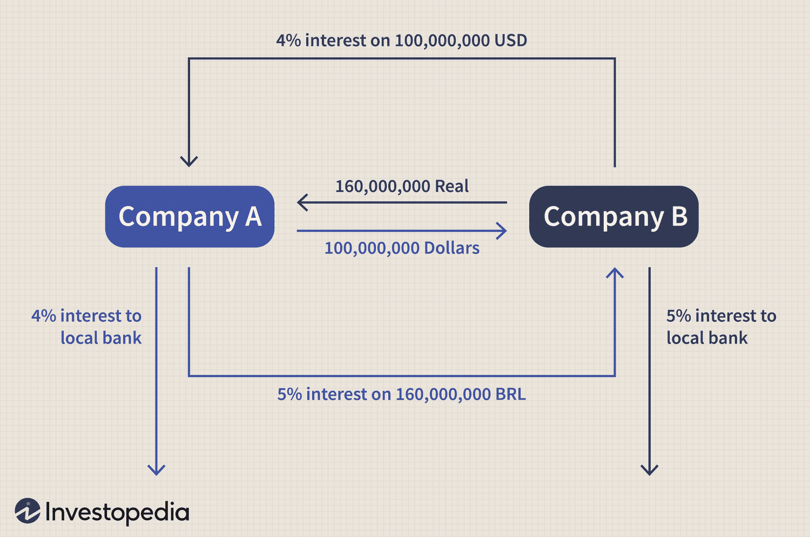

## Table of Contents

## What is a currency swap?

A currency swap is a financial agreement between two parties to exchange amounts of money in different currencies. They agree to swap the principal and interest payments on a loan in one currency for a loan in another currency. This helps companies and investors manage risks related to currency exchange rates and interest rates.

For example, if a U.S. company wants to expand its business in Europe, it might need euros. The company can enter into a currency swap with a European company that needs dollars. They agree to exchange the needed currencies at the start of the swap. Over time, they also exchange interest payments in their respective currencies. At the end of the swap, they exchange the principal amounts back, hopefully benefiting from more stable and predictable cash flows.

## How does a currency swap differ from a foreign exchange swap?

A currency swap and a foreign exchange swap both involve exchanging currencies, but they are used for different purposes and have different structures. A currency swap is a long-term agreement where two parties exchange principal and interest payments in different currencies. This helps them manage risks related to interest rates and currency exchange rates over time. For example, a company might use a currency swap to get a loan in a foreign currency while paying interest in its home currency.

On the other hand, a foreign exchange swap is a shorter-term transaction, often used for immediate needs. It involves exchanging one currency for another at the start and then reversing the exchange at a later date. This is often used by businesses to manage their short-term cash flow needs or to hedge against short-term currency fluctuations. For instance, a company might use a foreign exchange swap to temporarily convert dollars to euros for a short period before converting back to dollars.

In summary, the main differences are the duration and purpose. Currency swaps are long-term and focus on managing ongoing financial risks, while foreign exchange swaps are short-term and focus on immediate currency needs. Both are important tools in international finance, but they serve different needs.

## What are the main reasons companies engage in currency swaps?

Companies use currency swaps mainly to manage their money better when they work in different countries. If a company from the U.S. wants to build a factory in Germany, it needs euros. By using a currency swap, the U.S. company can get euros now and agree to pay back in dollars later. This helps the company avoid the risk of the euro becoming more expensive compared to the dollar. It makes planning easier because the company knows how much it will need to pay back in its own currency.

Another big reason for using currency swaps is to save money on loans. Interest rates can be different in different countries. A company might find that borrowing money in one country is cheaper than in another. By doing a currency swap, the company can borrow money where it's cheaper and then swap it into the currency it needs. This can lower the cost of borrowing and help the company make more profit. So, currency swaps are a smart way for companies to manage their money across borders.

## Can you explain the basic mechanics of a currency swap?

A currency swap is like a deal between two people where they swap money in different currencies. Imagine a U.S. company needs euros to build a factory in Europe, and a European company needs dollars for a project in the U.S. They can agree to swap their money at the start. The U.S. company gives dollars to the European company, and the European company gives euros to the U.S. company. This way, both companies get the money they need in the right currency.

After the initial swap, the companies also swap interest payments on the money they borrowed. If the U.S. company got euros, it pays interest in euros to the European company, and the European company pays interest in dollars to the U.S. company. These interest payments happen regularly, like every month or every year, until the end of the swap. At the end, they swap the original amounts of money back. The U.S. company gives the euros back to the European company, and the European company gives the dollars back to the U.S. company. This helps both companies manage their money better and avoid risks from changing exchange rates.

## What are the typical terms and conditions in a currency swap agreement?

A currency swap agreement is like a deal where two companies agree to swap money in different currencies. The agreement will say how much money each company will swap at the start. For example, a U.S. company might swap $1 million for €800,000 with a European company. The agreement also sets the date when they will swap the money back at the end. This could be in a few years, like 5 or 10 years. They will also agree on what will happen if one company can't pay back the money, like what kind of penalties or fees they will have to pay.

The agreement also includes how often the companies will swap interest payments. This could be every month, every three months, or every year. The [interest rate](/wiki/interest-rate-trading-strategies) for each currency will be set in the agreement, and it might be fixed or it could change over time. The agreement will also say what happens if the exchange rate between the two currencies changes a lot. There might be rules about how to handle big changes in the value of the money. This helps both companies feel safe and know what to expect during the whole swap.

## How do currency swaps affect the balance sheets of the involved parties?

When companies do a currency swap, it changes what they show on their balance sheets. At the start, the U.S. company gives dollars and gets euros, so its balance sheet will show less dollars and more euros. The European company does the opposite, showing less euros and more dollars. This swap affects their assets and liabilities because they now have money in a different currency. They need to keep track of these changes and report them correctly on their balance sheets.

Over time, as the companies swap interest payments, their balance sheets keep changing. The U.S. company pays interest in euros and gets interest in dollars, so its balance sheet will show these payments as they happen. The same goes for the European company, which pays interest in dollars and gets interest in euros. At the end of the swap, when they swap the original amounts back, their balance sheets will go back to how they were before, but with all the interest payments recorded. This helps them manage their money better and know exactly where they stand financially.

## What are the risks associated with currency swaps?

Currency swaps can be risky because they depend on exchange rates. If the exchange rate changes a lot, one company might end up paying more than it expected. For example, if the U.S. dollar gets weaker compared to the euro, the U.S. company will need more dollars to pay back the euros it borrowed. This can make the swap more expensive and less profitable. Both companies need to watch the exchange rates closely and have a plan for what to do if the rates change a lot.

Another risk is that one company might not be able to pay back the money it borrowed. If a company gets into financial trouble, it might not have enough money to make the interest payments or return the principal at the end of the swap. This can cause big problems for the other company, which was counting on getting its money back. To protect against this, companies often include terms in the swap agreement that say what happens if one side can't pay, like penalties or fees. But even with these protections, there's still a chance that things could go wrong.

## How are currency swaps priced and what factors influence their pricing?

Currency swaps are priced based on the exchange rates between the two currencies involved and the interest rates in each country. At the start of the swap, the companies agree on how much money to exchange, using the current exchange rate. They also agree on the interest rates for the loans in each currency. These rates can be fixed or change over time, depending on what the companies agree to. The price of the swap is influenced by how much the exchange rate might change in the future and the difference in interest rates between the two countries.

Other things that can affect the price of a currency swap include how long the swap will last and how much risk the companies are willing to take. If the swap is for a long time, like 10 years, it might be priced differently than a shorter swap because there's more time for exchange rates and interest rates to change. The companies also think about how likely it is that one of them might not be able to pay back the money. If there's a higher risk, they might agree to a higher price to cover that risk. All these factors together help decide the final price of the currency swap.

## What role do currency swaps play in global financial markets?

Currency swaps are important in global financial markets because they help companies and countries manage their money better when they work across borders. When a company from one country wants to do business in another country, it might need money in a different currency. By using a currency swap, the company can get the money it needs without worrying too much about changes in exchange rates. This makes it easier for companies to plan their finances and do business in different parts of the world.

Currency swaps also help countries manage their money. Central banks and governments can use currency swaps to keep their economies stable. For example, if a country's currency is getting weaker, it can use a currency swap to get stronger currencies and help support its own currency. This can prevent big problems in the economy and keep things running smoothly. Overall, currency swaps are a key tool that helps keep the global financial system working well.

## Can you discuss a real-world example of a currency swap and its outcomes?

In 2008, during the global financial crisis, the U.S. Federal Reserve and several other central banks, including the European Central Bank, used currency swaps to help stabilize the world's financial system. The Federal Reserve agreed to swap dollars with these other banks in exchange for their currencies, like euros. This helped banks in Europe and other places get the dollars they needed to keep their economies running smoothly. Without these swaps, many banks might have faced big problems because they didn't have enough dollars.

The outcome of these swaps was very positive. They helped prevent a bigger financial crisis by making sure banks had enough money to keep lending and doing business. The swaps also showed how important it is for central banks to work together during tough times. By helping each other out, they were able to keep the global financial system stable and avoid even more problems. This example shows how currency swaps can be a powerful tool in managing financial risks on a global scale.

## How do regulatory frameworks impact the use of currency swaps?

Regulatory frameworks play a big role in how companies and banks use currency swaps. Governments and financial watchdogs make rules to keep the financial system safe and fair. These rules can say things like how much money a company needs to have before it can do a swap, or what kind of information they need to share with the regulators. Sometimes, these rules can make it harder for smaller companies to use currency swaps because they might not have enough money or resources to meet all the requirements.

Even though regulations can make things more complicated, they also help keep the financial system stable. For example, after the 2008 financial crisis, many countries made new rules to make sure banks and companies were using currency swaps safely. These rules helped prevent big problems and made sure that everyone was playing by the same rules. So, while regulatory frameworks can limit who can use currency swaps and how they use them, they also help protect the economy and make sure that currency swaps are used in a responsible way.

## What advanced strategies can be employed using currency swaps in complex financial operations?

Companies and banks can use currency swaps in smart ways to handle big financial projects. One way is to use currency swaps to change the currency of their debts. Imagine a company has a loan in dollars but wants to pay it back in euros because the interest rate is better. They can do a currency swap to change the loan into euros and pay back in euros, saving money on interest. This can help the company manage its money better and make more profit. Another advanced strategy is to use currency swaps to protect against big changes in exchange rates. If a company knows it will need to pay for something in another currency in the future, it can use a currency swap to lock in the exchange rate now, so it doesn't have to worry if the rate changes later.

Currency swaps can also be used to create new financial products. For example, banks can use currency swaps to create new types of loans or investments that are tied to different currencies. This can attract more customers who want to invest or borrow in different currencies. By mixing currency swaps with other financial tools, banks can offer more options to their clients and help them manage their money in new ways. This makes the financial market more flexible and helps companies and investors reach their goals more easily.

## What are Financial Instruments in Currency Swaps?

Currency swaps are versatile financial instruments that play a critical role in risk management and financial optimization for corporations and financial institutions. They facilitate the exchange of cash flows in different currencies, thereby enabling entities to secure favorable terms in foreign exchange markets. This strategic function aids in financial strategy implementation by reducing risks associated with currency fluctuations.

The primary mechanism of a currency swap involves the mutual agreement between two parties to exchange principal amounts and interest payments in their respective currencies. This setup helps companies manage their interest rate exposure and stabilize their financial operations. When companies engage in currency swaps, they effectively hedge against adverse exchange rate movements, allowing them to maintain consistency in their cash flows.

The valuation of currency swaps is a complex process that requires an understanding of key financial factors such as interest rates, exchange rates, and prevailing market conditions. The valuation can be expressed mathematically using the formula for the present value of cash flows:

$$
\text{PV} = \sum \left( \frac{C_i}{(1 + r_i)^t} \right)
$$

where $C_i$ represents the cash flow at time $t$, and $r_i$ is the discount rate applicable to that cash flow. This formula helps in determining the present value of future cash flows, making it possible to assess the financial benefit or cost associated with a currency swap.

Moreover, the ability to secure favorable terms through swaps allows businesses to optimize financial outcomes. For example, a company may access lower loan rates available in international markets or exploit differences in interest rates between currencies to reduce overall financing costs.

Overall, the use of currency swaps as financial instruments can lead to significant improvements in the financial standing of a firm through enhanced control over exchange rate and interest rate risks. This is instrumental in supporting robust and dynamic financial management strategies.

## References & Further Reading

[1]: ["Exchange-Rate Dynamics" (NBER Working Paper No. 19846)](https://www.nber.org/papers/w1230) by Charles Engel and Kenneth D. West

[2]: ["Currency Swaps and Exchange Rate Risk" (International Monetary Fund Staff Papers, Vol. 33, no. 1)](https://www.jstor.org/stable/26753060) by Jacob A. Frenkel and Boyan Jovanovic

[3]: ["Algorithmic Trading and DMA: An introduction to direct access trading strategies"](https://archive.org/details/algorithmictradi0000john) by Barry Johnson

[4]: ["Inside the Black Box: The Simple Truth About Quantitative Trading"](https://www.amazon.com/Inside-Black-Box-Quantitative-Trading/dp/0470432063) by Rishi K. Narang

[5]: ["Trading and Exchanges: Market Microstructure for Practitioners"](https://www.amazon.com/Trading-Exchanges-Market-Microstructure-Practitioners/dp/0195144708) by Larry Harris