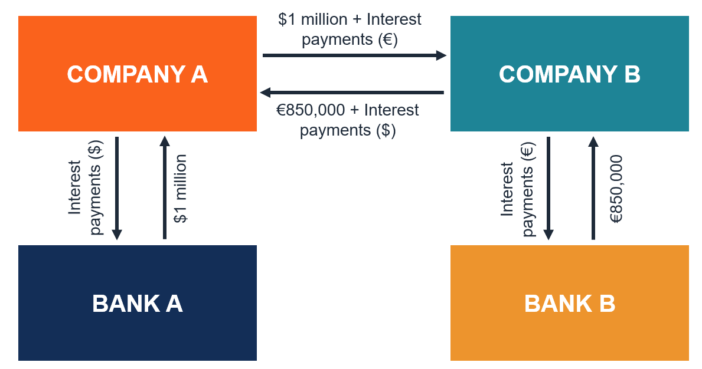

In the world of finance, managing the complexities of global economic activities requires strategic tools. Companies and institutions employ various mechanisms to navigate this intricate landscape, among which exchange agreements involving financial instruments stand out prominently. Currency swaps and algorithmic trading are two such tools that play a critical role in international finance.

Currency swaps are agreements between two parties to exchange cash flows in different currencies. They help manage currency risks by allowing entities to secure more favorable terms in foreign exchange markets. By exchanging interest payments and, in some cases, principal amounts in different currencies, these swaps facilitate smoother international transactions. This flexibility is essential for multinational businesses that operate across various currencies and face exposure to fluctuating exchange rates.



Algorithmic trading, on the other hand, automates trading processes using pre-programmed strategies. It optimizes trade execution by determining the exact timing, price, and quantity of orders, thus enhancing efficiency. In the context of currency swaps, algorithmic trading can significantly impact pricing accuracy and risk management. As a result, it enables financial professionals to execute complex transactions with increased precision and reduced human error.

The convergence of currency swaps and algorithmic trading represents a new dimension in financial management. By integrating these tools, organizations can enhance their ability to manage financial exposures and improve their operational efficiency in global markets. This article will explore these pivotal financial mechanisms, emphasizing their significance in modern finance and highlighting their potential to transform international financial operations.

## Table of Contents

## Understanding Exchange Agreements

Exchange agreements in finance are structured contracts that facilitate the swapping of financial instruments between parties, aligning with predefined terms. These agreements are crucial tools for organizations aiming to enhance their financial strategies and reduce associated risks. They encompass a wide range of financial products, including currency swaps and derivatives, allowing entities to tailor the agreement to meet their specific needs.

The primary objective of exchange agreements is to optimize financial performance. They serve as strategic instruments, enabling entities to manage various financial aspects, such as currency risk and interest rate exposure. For instance, a corporation with cash flow obligations in a foreign currency can utilize an exchange agreement to swap its currency cash flows with another entity. This allows the corporation to secure cash flows in its preferred currency, thereby stabilizing its financial outlook amid fluctuating foreign exchange rates.

Currency swaps represent a significant component of these agreements, particularly in their capacity to mitigate foreign exchange risk. By exchanging interest payments and sometimes the principal amounts in different currencies, entities can achieve more favorable terms. For example, if a U.S. company is required to make payments in euros, it can engage in a currency swap with a European counterpart. This swap facilitates an exchange of payment obligations between U.S. dollars and euros, hedging against adverse movements in exchange rates.

Beyond currency swaps, exchange agreements often incorporate other derivatives to offer a more comprehensive risk management solution. These derivatives, such as futures, options, and forwards, enhance the versatility of exchange agreements by allowing entities to lock in interest rates or foreign exchange rates. Customizing these agreements involves selecting the appropriate mix of financial instruments that align with the organization's financial objectives.

The customization aspect is pivotal, as it allows entities to construct agreements that specifically address their financial challenges and goals. By doing so, organizations can harness the flexibility of exchange agreements to maintain stability and sustain growth in the uncertain and dynamic financial markets. With these tools, businesses not only optimize financial operations but also create a robust framework for navigating complex financial landscapes.

## The Role of Financial Instruments in Currency Swaps

Currency swaps are a sophisticated financial tool enabling the exchange of cash flows in different currencies between two parties. These swaps serve primarily as a mechanism to hedge against foreign exchange risk, allowing entities to safeguard their financial operations from adverse currency fluctuations. In a typical currency swap arrangement, the involved parties agree to exchange principal and interest payments denominated in their respective currencies. The exchange of principal usually occurs at the inception and maturity of the swap, while interest payments are exchanged periodically over the duration of the contract.

Currency swaps are particularly advantageous for entities seeking more favorable lending terms in international markets. By entering into a currency swap, a company can gain access to lower interest rates available in a foreign market, thereby reducing its overall cost of capital. For example, a company located in the United States, with its functional currency in USD, may find that borrowing in euros (EUR) through a swap offers a lower [interest rate](/wiki/interest-rate-trading-strategies) than borrowing directly in USD.

The mechanics of a currency swap involve three key components:

1. **Principal Exchange:** At the inception and maturity of the swap, parties exchange specific amounts of two different currencies. This exchange establishes the notional principal, which remains unaffected by exchange rate fluctuations during the swap's life.

2. **Interest Payments:** Throughout the duration of the swap, parties exchange interest payments computed on the notional principal amounts. These payments can be fixed or floating, depending on the agreement terms. The formula for calculating interest payments typically follows:
$$
   \text{Interest Payment} = \text{Principal} \times \left(\frac{\text{Interest Rate}}{\text{Payment Frequency}}\right)

$$

3. **Final Principal Re-exchange:** Upon the swap's maturity, the initial principal amounts are re-exchanged at the pre-determined rate, reversing the initial exchange.

Consider, for instance, a hypothetical currency swap between a U.S.-based firm and a European company. The U.S. firm requires EUR for a project in Europe, whereas the European company needs USD for its business operations in the U.S. Through a currency swap, the U.S. firm could effectively "borrow" euros at a lower interest rate prevailing in the Eurozone, while the European firm "borrows" dollars under similar advantageous conditions, yielding cost benefits for both parties.

Overall, currency swaps offer a strategic option for multinational corporations to optimize their financial operations by capitalizing on international interest rate differentials and managing their exposure to foreign exchange risk efficiently.

## Algorithmic Trading and Its Integration with Currency Swaps

Algorithmic trading utilizes automated, pre-programmed trading instructions to execute orders efficiently and swiftly across various financial instruments, including currency swaps. This technological advancement is pivotal in the ever-evolving landscape of financial markets, where the speed and precision of executing trades significantly enhance an entity's competitive edge.

In currency swaps, [algorithmic trading](/wiki/algorithmic-trading) plays a crucial role by optimizing the timing and execution of trades. Currency swaps involve exchanging principal and interest in different currencies, which inherently requires precise timing and execution to mitigate risks associated with fluctuating exchange rates. Algorithmic trading systems can analyze vast amounts of market data in real time, identifying the optimal moments to initiate or [exit](/wiki/exit-strategy) a swap position. This minimizes potential slippage and ensures that trades occur close to desired price levels, ultimately contributing to cost-effectiveness.

The integration of algorithmic trading with currency swaps substantially enhances pricing accuracy and risk management. Algorithms can be designed to incorporate complex mathematical models that predict exchange rate movements and assess risks associated with different swap structures. By continuously monitoring market trends and [volatility](/wiki/volatility-trading-strategies), these systems can adjust trading strategies dynamically, achieving better alignment with market conditions and pricing mechanisms.

For instance, in a currency swap transaction, two parties agree to exchange cash flows in different currencies at specified intervals. Algorithmic models can calculate the Net Present Value (NPV) of these cash flows, factoring in current market interest rates and anticipated exchange rate changes. The ability to integrate predictive analytics into the pricing of currency swaps ensures that parties engage in swaps with a thorough understanding of potential cost implications.

The use of algorithmic trading extends to risk management within currency swaps. By pre-programming risk parameters and limits, organizations can automatically monitor and manage exposure levels, ensuring adherence to internal risk policies. Moreover, such integration allows for real-time stress testing and scenario analysis, providing insights into how adverse market conditions might impact currency swap portfolios.

Algorithmic trading also facilitates the back-testing of currency swap trading strategies. This entails using historical data to simulate the performance of various swap strategies, refining them before actual implementation. By employing [machine learning](/wiki/machine-learning) techniques and historical market data, trading algorithms can evolve, learning from past patterns to enhance future performance in currency swap markets.

In conclusion, the integration of algorithmic trading with currency swaps offers enhanced execution capabilities, pricing accuracy, and risk management. As financial markets continue to embrace technological advancements, the symbiosis between algorithmic trading and traditional financial instruments like currency swaps will likely drive further innovation and efficiency gains within the industry.

## Case Study: Practical Application of Currency Swaps

To gain insights into the practical application of currency swaps, consider the following scenario involving multinational corporations. A U.S.-based company, for example, may find itself needing to mitigate currency risk due to its operations in Europe. Simultaneously, a European entity might be looking for a similar arrangement to optimize its exposure to the U.S. dollar.

In a typical currency swap agreement, these two entities agree to exchange principal and interest payments in different currencies. Suppose the U.S. company (Company A) and the European entity (Company B) enter into a three-year currency swap. Company A agrees to pay euros to Company B, while receiving U.S. dollars in return. This arrangement allows Company A to finance its European operations more cost-effectively, leveraging the typically lower interest rates associated with the euro.

In terms of balance sheets, the effect of such an arrangement is noteworthy. Initially, both parties record the exchanged principal amounts as financial assets. Over the swap's duration, each party benefits from the cash flow generated by interest payments. Company A would receive euros, thus securing the necessary foreign currency to support its European activities. Conversely, Company B, by receiving U.S. dollars, can optimize its operations influenced by U.S. financial conditions.

Interest rate exposure also plays a significant role. Suppose Company A's obligation is tied to a floating euro interest rate, such as the Euro Interbank Offered Rate (Euribor), plus a spread. At the same time, Company A receives U.S. dollar payments based on a fixed rate. This swap not only exposes Company A to fluctuations in the Euribor rate but also allows it to capitalize on potential interest rate differentials that might emerge over the deal's term.

Here is a simplified representation of how the cash flows might look using Python code:

```python
# Example of simplified cash flow calculation in Python

def calculate_cash_flows(principal, fixed_rate, floating_rate_index, spread, years):
    fixed_payment = principal * fixed_rate
    floating_payments = [(principal * (floating_rate_index[i] + spread)) for i in range(years)]
    return fixed_payment, floating_payments

# Parameters
principal = 1000000  # Principal amount
fixed_rate_usd = 0.03  # Fixed rate for USD payments
floating_rate_eur = [0.01, 0.012, 0.015]  # An example of yearly Euribor rates
spread = 0.005  # Spread over Euribor

fixed_payment, floating_payments = calculate_cash_flows(principal, fixed_rate_usd, floating_rate_eur, spread, 3)

print(f"Fixed USD Payment per year: {fixed_payment}")
print(f"Floating EUR Payments per year: {floating_payments}")
```

In this code sample, we defined a function to calculate cash flows from principal, fixed rate, and floating rate index inputs over a span of years. Adjusting these inputs based on actual market data would allow both Company A and Company B to evaluate their financial positions accurately, ultimately determining the currency swap's commercial viability.

Such swaps offer strategic financial benefits, enabling multinational corporations to manage balance sheet impacts and mitigate interest rate exposure effectively. They exemplify currency swaps' role in facilitating cross-border financial management and highlight their importance in global financial strategy.

## Risks Involved in Currency Swaps

Currency swaps, while offering significant benefits, also present several risks that participants must carefully manage. Among the most notable risks are counterparty risk, exchange rate risk, and interest rate risk.

Counterparty risk arises from the possibility that one party involved in the swap may default on its contractual obligations. This risk is especially pertinent in swaps due to their long-term nature, which can span several years. The longer the duration of the swap, the greater the uncertainty surrounding the financial stability of the counterparties involved. To mitigate such risks, parties often use credit support measures such as collateral agreements or seek partners with high creditworthiness to enter into swaps with.

Exchange rate risk refers to the potential for fluctuating currency exchange rates to negatively impact the cash flows exchanged between parties. Since currency swaps involve transactions in different currencies, any adverse movement in exchange rates can lead to financial losses. For instance, if a company is obligated to make payments in a foreign currency that appreciates significantly against its domestic currency, the cost of these payments can rise unexpectedly. Accurate exchange rate forecasting and the use of hedging strategies such as forward contracts can help manage this risk.

Interest rate risk is associated with changes in interest rates that can affect the value of future cash flows in a currency swap. This risk is particularly important when the swap involves different interest rate regimes, such as a fixed rate in one currency and a floating rate in the other. A rise in interest rates could increase the cost of servicing a swap, especially for parties with floating rate obligations. Participants can manage interest rate risk through the use of interest rate derivatives, such as options and futures, which can provide protection against volatile interest rate movements.

Proper understanding and management of these risks are essential for entities considering participation in currency swaps. By implementing robust risk management strategies and maintaining a comprehensive understanding of the financial landscape, entities can harness the benefits of currency swaps while minimizing their exposure to potential adverse outcomes.

## Future of Algorithmic Trading in Financial Markets

Algorithmic trading is poised to assume a progressively significant role in financial markets, an evolution driven by advancements in technology and increased market complexity. As computational power and data processing capabilities continue to grow, algorithmic trading strategies are expected to evolve, becoming more sophisticated and nuanced. This will have a substantial impact on currency markets, where rapid fluctuations and high-frequency trading opportunities necessitate advanced approaches to both trade execution and risk management.

The sophistication of algorithmic trading strategies can be attributed to several technological advancements. Machine learning algorithms, for example, have the potential to enhance predictive modeling by analyzing large datasets to identify patterns and make data-driven decisions. Predictive models can evaluate historical data and market indicators to forecast market movements, thereby improving the accuracy of trading strategies and optimizing trade entry and exit points.

Another significant development is the use of high-frequency trading ([HFT](/wiki/high-frequency-trading-strategies)) in currency markets. HFT leverages complex algorithms to assess multiple markets and execute a large number of orders at extremely high speeds. The ability to manage and execute trades almost instantaneously allows traders to capitalize on small price discrepancies that may only exist for fractions of a second.

The increased adoption of algorithmic trading also paves the way for fully automated trading systems, which can operate independently based on predefined parameters and adaptive learning mechanisms. These systems can test various trading strategies against real-time data to continuously refine their approach. This adaptability is crucial in dynamic markets, where conditions can change within moments.

Despite its advantages, the future of algorithmic trading also poses certain challenges and risks. One area of concern is market volatility, which can be exacerbated by automated trades executing en masse during periods of market stress. This underscores the importance of robust risk management protocols and regulatory frameworks to ensure market stability.

Understanding the trajectory of algorithmic trading is imperative for financial industry professionals aiming to maintain a competitive edge. Staying informed about technological advancements, regulatory changes, and novel strategies will be essential for leveraging algorithmic trading's full potential in optimizing trade executions and financial performance in an increasingly automated world.

## Conclusion

Exchange agreements using financial instruments like currency swaps play a critical role in modern financial operations. These tools provide entities with the means to optimize their financial resources, manage currency risk, and access more favorable interest rates globally. Currency swaps allow corporations to effectively navigate international markets by exchanging interest payments and principal amounts between different currencies, thus protecting them from exchange rate fluctuations and enhancing their financial stability.

The integration of algorithmic trading with currency swaps heralds a promising frontier for achieving higher efficiency and precision in financial transactions. Algorithmic trading employs automated systems based on set parameters to execute trades quickly and accurately. By integrating this technology with currency swaps, financial institutions can enjoy improved pricing accuracy, enhanced [liquidity](/wiki/liquidity-risk-premium), and better risk management. This combination allows for the rapid assessment and execution of trades, ensuring that entities can capitalize on favorable market conditions and mitigate potential risks.

Financial professionals must remain adept at utilizing these advanced tools to manage risks effectively and leverage emerging opportunities in the ever-evolving global finance landscape. Continuous learning and adaptation are crucial as financial markets become more interconnected and complex. By harnessing the power of exchange agreements and algorithmic trading, professionals can strengthen their strategic financial management capabilities and secure a competitive edge in the international arena. This proactive approach not only positions them to better serve their organizations but also contributes to the overall efficiency and stability of the financial system.

## References & Further Reading

[1]: ["Interest Rate Swaps and Other Derivatives"](https://cup.columbia.edu/book/interest-rate-swaps-and-other-derivatives/9780231159647) by Howard Corb

[2]: ["Currency Swaps and Derivatives: Definition and Analysis"](https://www.investopedia.com/terms/c/currencyswap.asp) by Mark J. P. Anson

[3]: Alphandéry, B., Brück, M., & Hogg, B. (2009). ["Currency Swaps and Exchange Rate Risk Management: How Multinationals Deal with Currency Volatility."](https://pubmed.ncbi.nlm.nih.gov/19459692/)

[4]: "Algorithmic Trading: Winning Strategies and Their Rationale"](https://onlinelibrary.wiley.com/doi/pdf/10.1002/9781118676998.fmatter) by Ernest P. Chan

[5]: Pogue, M., & Lee, E. (2007). ["Algorithmic Trading and Market Dynamics: A Literature Review on Real-Time Decision Systems in Finance."](https://pubmed.ncbi.nlm.nih.gov/31036890/) Cambridge University Press.