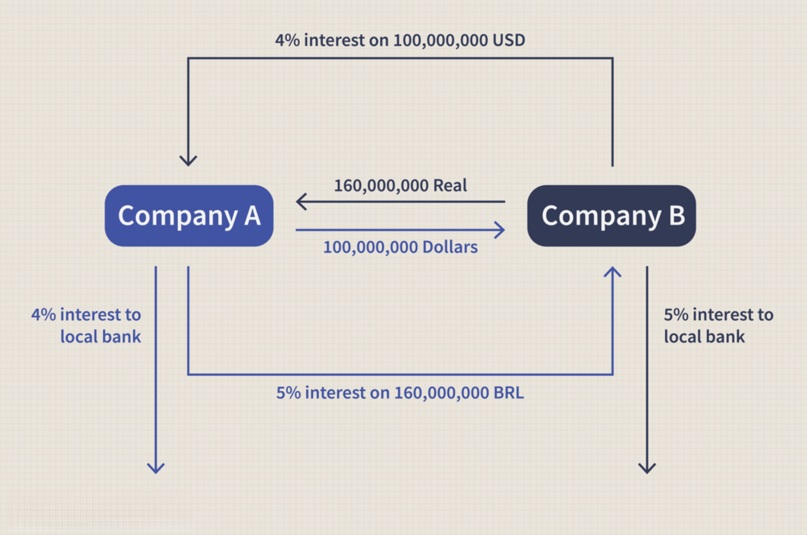

In today's globalized economy, businesses and investors contend with substantial financial risks arising from currency fluctuations. Changes in foreign exchange rates can have significant impacts on the profitability and financial stability of organizations engaged in international transactions. To mitigate these risks, currency swaps and financial hedging strategies have become crucial. Currency swaps involve the exchange of principal and interest payments in differing currencies, providing a means to hedge against adverse foreign exchange movements. By fixing exchange rates and securing favorable borrowing terms, these swaps bestow stability and financial predictability to entities operating on a global scale.

In this article, we will explore how currency swaps serve as a cornerstone in risk management and examine their advantages in financial hedging. Furthermore, we will discuss the integration of innovative techniques, such as algorithmic trading, which have particularly transformed how these strategies are executed. Algorithmic trading leverages data-driven algorithms to automate and optimize trading decisions, thus enhancing the effectiveness of currency risk management. By employing these strategies, organizations can better shield themselves from currency volatility and improve their financial outcomes. We will explore the interplay between currency swaps, hedging, and advanced trading methods, illustrating how they collectively fortify an organization's financial resilience.



## Table of Contents

## Understanding Currency Swaps

Currency swaps are a vital component in financial risk management, providing a mechanism for exchanging principal and interest payments between different currencies. This financial tool is crucial for entities engaged in international business, as it offers a strategy to hedge against the unpredictable nature of foreign exchange rate movements. The primary function of a currency swap is to ensure greater financial stability and operational certainty for enterprises facing exposure to multiple currencies.

At its core, a currency swap involves two parties agreeing to exchange specific cash flows at predetermined exchange rates. This arrangement helps to mitigate the adverse impacts of currency volatility by locking in exchange rates for future transactions. Such preemptive measures are essential for managing potential financial setbacks arising from sudden shifts in exchange rates.

There are primarily two types of currency swaps: fixed-for-fixed rate swaps and fixed-for-floating rate swaps. In a fixed-for-fixed rate swap, both parties exchange fixed interest payments in different currencies, making the cash flows predictable and easier to manage. In contrast, a fixed-for-floating rate swap involves exchanging a fixed interest payment in one currency for a floating interest payment in another currency. This latter type allows one party to benefit from potential declines in floating rates while offering the other party stability in their fixed payments.

These instruments are particularly beneficial for organizations seeking to optimize their exposure to foreign currencies. By engaging in currency swaps, companies can secure more favorable borrowing rates compared to direct loans in foreign markets, which might [carry](/wiki/carry-trading) higher interest rates. For instance, a company with operations in Europe and the United States might enter a swap to exchange its euro-denominated debt for dollar-denominated debt, thereby capitalizing on lower U.S. interest rates.

In summary, currency swaps offer an effective means of managing financial exposure to currency fluctuations, allowing businesses to stabilize their cash flows and improve their borrowing terms. By exchanging cash flows in a structured and predictable manner, these swaps serve as a strategic tool for organizations looking to navigate the complexities of international finance.

## Benefits of Currency Swaps in Risk Management

Currency swaps offer numerous advantages in managing financial risks, particularly for entities engaged in international trade and investment. One of the primary benefits is achieving favorable lending rates. By entering into a currency swap, organizations can effectively borrow at more competitive interest rates compared to those available in certain foreign markets, where interest rates may be significantly higher. This is accomplished as swaps allow entities in different countries to leverage each other's credit ratings and borrowing markets.

Furthermore, currency swaps ensure the timely receipt of foreign currencies essential for international transactions. In doing so, they provide a safeguard against fluctuations in currency value that might otherwise erode profits from cross-border operations. By locking in exchange rates in advance, swaps mitigate the risk associated with adverse currency movements. This protection shields companies from potential losses incurred from unfavorable exchange rate shifts while also securing a degree of predictability in beneficial movements.

In addition, currency swaps enable the effective hedging of currency risk, which is particularly valuable for multinational corporations and investors. Companies with significant exposure to foreign currencies can use swaps to manage and stabilize cash flows, ensuring that financial outcomes are not unduly influenced by volatile exchange rate environments. This hedging capability is crucial in maintaining financial stability and planning accuracy. Overall, these benefits make currency swaps a vital tool for organizations seeking to minimize the uncertainties associated with international business operations and investments.

## Financial Hedging Strategies Using Currency Swaps

Financial hedging strategies utilizing currency swaps are designed to protect entities against adverse movements in currency prices. Such strategies are crucial for stabilizing cash flows, securing advantageous exchange rates, and enhancing financial planning efforts. The use of currency swaps in financial hedging is a sophisticated technique that minimizes risk associated with exchange rate fluctuations, proving especially beneficial for companies with significant international operations.

Companies employ these strategies to stabilize cash flows by converting variable financial elements into fixed obligations or vice versa. A currency swap can lock in favorable exchange rates, thus providing more predictable cash flows and aiding in effective financial planning. This predictability is essential for budgeting, financial forecasting, and managing currency exposure in multinational transactions. For example, if a U.S.-based company has revenues in euros and expenses in dollars, a currency swap can help mitigate the exchange rate risk associated with fluctuating euro/dollar rates.

Portfolio managers often leverage hedged mutual funds and Exchange-Traded Funds (ETFs) to minimize exposure to foreign exchange [volatility](/wiki/volatility-trading-strategies). These financial products can incorporate currency swaps as part of their strategy to deliver returns that are less affected by fluctuations in exchange rates. By doing so, portfolio managers enhance the risk-return profile of their investments, making them more appealing to risk-averse investors.

In addition to currency swaps, other financial instruments such as forward contracts and options are employed to hedge currency risk. Forward contracts allow parties to agree on an exchange rate for a future date, effectively setting future costs or revenues. Options provide the right—though not the obligation—to exchange currency at a specified rate before a certain date, offering protection while allowing entities to benefit from favorable currency movements. By integrating currency swaps with these tools, companies can tailor their hedging strategies to their specific needs, drawing on the strengths of each instrument.

Understanding these financial hedging strategies requires not just a grasp of international currency dynamics, but also a keen insight into the financial instruments available for managing such risks. Properly executed, these strategies not only mitigate potential losses but also create opportunities for financial gain, thereby enhancing overall financial performance.

## The Role of Algorithmic Trading in Currency Risk Management

Algorithmic trading has transformed how currency swaps and hedging strategies are implemented in the financial markets by leveraging technology to automate and optimize trading activities. Algorithms, often referred to as 'algos,' are designed to execute trades and manage investment portfolios with minimal human intervention. They rely on real-time data to make prompt buy or sell decisions, ensuring efficient price discovery and trade execution. This capability is crucial in foreign exchange ([forex](/wiki/forex-system)) markets, where currency values can fluctuate rapidly due to geopolitical events, economic announcements, and other factors.

One of the critical benefits of [algorithmic trading](/wiki/algorithmic-trading) in currency risk management is its ability to handle large volumes of transactions swiftly. This high-speed processing reduces the risk of human error and minimizes the emotional biases that often impact manual trading decisions. Algos can process information much faster than humans, leading to better-informed and timely decisions, which is particularly vital in volatile markets.

Moreover, algorithmic strategies enhance the effectiveness of hedging by dynamically adjusting positions in response to market changes. For instance, if a particular currency starts to fluctuate outside of predefined risk thresholds, the algorithm can initiate swaps or alter existing positions to maintain the desired risk exposure. This ability to adapt rapidly to market conditions ensures that hedging strategies remain aligned with an organization's risk management objectives.

Here is a simple example of how an algorithm could be coded in Python to decide when to initiate a currency swap based on real-time market data:

```python
import pandas as pd

# Simulated real-time data stream
def get_market_data():
    # This function would connect to a real-time data API in a production setting
    return pd.DataFrame({
        'timestamp': pd.date_range(start='2023-01-01', periods=100, freq='T'),
        'currency_pair': ['USD/EUR'] * 100,
        'exchange_rate': [1.05 + 0.001*i for i in range(100)]
    })

# Example risk threshold
RISK_THRESHOLD = 0.02

def decide_swap_action(market_data, threshold=RISK_THRESHOLD):
    moving_avg = market_data['exchange_rate'].rolling(window=10).mean()  
    current_rate = market_data['exchange_rate'].iloc[-1]

    if abs(current_rate - moving_avg.iloc[-1]) / moving_avg.iloc[-1] > threshold:
        print("Initiate Currency Swap: Significant deviation detected.")
    else:
        print("Hold: Rate within risk threshold.")

# Example usage
market_data_stream = get_market_data()
decide_swap_action(market_data_stream)
```

In this example, the algorithm calculates a moving average of exchange rates and compares the current rate with this average to decide if a currency swap should be initiated. The decision-making process is based on predefined risk thresholds, demonstrating the automated and responsive nature of algorithmic trading in managing currency risk. As these systems become more sophisticated, they incorporate complex models and [machine learning](/wiki/machine-learning) techniques to predict market movements and optimize trading strategies further.

Overall, algorithmic trading has not only improved the efficiency of currency swaps and hedging strategies but also empowered businesses to maintain better control over currency risk management. Through continuous advances in technology and data analytics, these systems are becoming increasingly pivotal in navigating the complexities of global financial markets.

## Challenges and Considerations

While currency swaps and algorithmic trading offer significant advantages for risk management, they also present particular challenges that must be carefully managed to ensure successful outcomes. One of the foremost challenges is counterparty risk, which is the possibility that the other party involved in the currency swap may default on their contractual obligations. This risk necessitates a comprehensive understanding of the counterparty's creditworthiness, [liquidity](/wiki/liquidity-risk-premium), and legal framework. Inadequate assessment of these elements can lead to financial losses, as the default of a counterparty could disrupt the anticipated cash flows and expose the company to unintended foreign exchange risk.

To mitigate counterparty risk, institutions often engage in due diligence processes that include credit evaluations, assessing financial stability, and reviewing past performance of the counterparty. Legal agreements such as International Swaps and Derivatives Association (ISDA) Master Agreements can also provide structured frameworks to manage legal risks. These agreements typically outline netting arrangements and collateral requirements to secure the obligations of the counterparties involved in trading derivatives.

Another challenge is the requirement for sophisticated technical infrastructures required to support algorithmic trading. Implementing algorithmic trading systems demands high-performance computing capabilities, robust data management systems, and secure network infrastructures. The development and deployment of these technical solutions can be resource-intensive and requires specialized expertise.

Additionally, continuous market monitoring and strategy reassessment are crucial components of effective currency risk management. The volatility of foreign exchange markets necessitates that organizations frequently review their trading strategies and positions to adapt to changing market conditions. Rapid advancements in technology and evolving economic circumstances mean that even well-crafted strategies may become obsolete quickly. Thus, institutions often employ data analytics and machine learning algorithms to automate the monitoring process, allowing for dynamic adjustments to trading strategies in response to real-time market shifts.

In conclusion, while currency swaps and algorithmic trading present substantial opportunities to mitigate currency risk, their successful utilization depends on addressing counterparty risks and maintaining sophisticated technical infrastructures. Regular reassessment of these strategies is imperative to adapt to the dynamic nature of financial markets.

## Conclusion

Currency swaps, in conjunction with financial hedging strategies and advanced algorithmic trading, provide comprehensive solutions for managing currency risk. By employing these tools, organizations can fortify their financial positions against the uncertainties of fluctuating exchange rates, thereby improving their decision-making capabilities. The integration of currency swaps allows firms to fix exchange rates, which is crucial for maintaining stable cash flows and safeguarding profit margins. This stability is particularly vital for businesses operating on a global scale, where exposure to multiple currencies can lead to significant financial unpredictability.

Algorithmic trading enhances these strategies by enabling rapid and precise execution of trades, which supports the adaptive management of financial positions. Algorithms can process vast quantities of market data in real-time, ensuring that organizations can swiftly respond to any shifts in the market. This capacity to adjust positions dynamically based on market conditions helps in reducing potential losses and capitalizing on market upswings.

However, given the inherent complexity of these financial instruments and strategies, it is crucial for businesses to seek expert advice. Customizing strategies to align with an organization's specific financial goals and market environment is key to their effective implementation. Financial professionals can provide insights on counterparty risk assessment, optimal hedging techniques, and leveraging algorithmic tools to maximize benefits.

In summary, the strategic use of currency swaps, hedging, and algorithmic trading not only insulates organizations from adverse currency movements but also positions them to benefit from favorable economic trends. By leveraging these solutions, businesses can enhance their resilience against currency volatility and make informed, tactical financial decisions.

## References & Further Reading

[1]: ["Currency Swaps: A Comprehensive Guide"](https://forexleaderboard.com/currency-swaps/) by Investopedia

[2]: ["Algorithmic Trading and DMA: An Introduction to Direct Access Trading Strategies"](https://www.amazon.com/Algorithmic-Trading-DMA-introduction-strategies/dp/0956399207) by Barry Johnson

[3]: ["Handbook of Exchange Rates"](https://onlinelibrary.wiley.com/doi/book/10.1002/9781118445785) by Jessica James, Ian W. Marsh, and Lucio Sarno

[4]: ["The Basics of Currency Swaps"](https://www.financestrategists.com/wealth-management/investments/currency-swaps/) by MarketBeat

[5]: Hull, J. C. (2017). ["Options, Futures, and Other Derivatives"](https://www.semanticscholar.org/paper/Options%2C-Futures%2C-and-Other-Derivatives-Hull/89bdee500c8623864fc9eb7a471546aa713acc44), 9th Edition, Pearson.