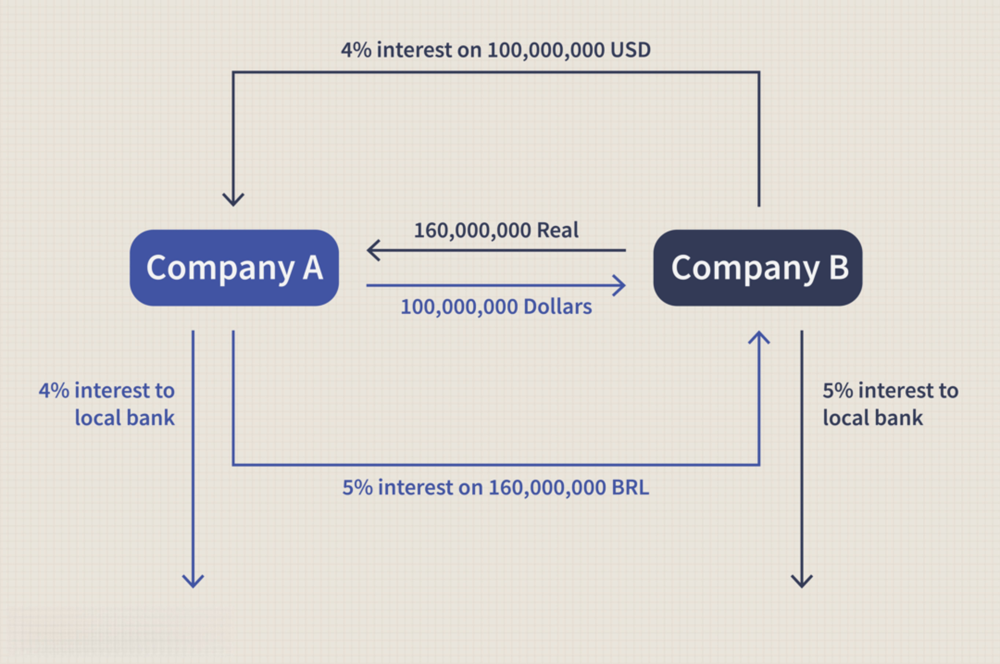

## Table of Contents

## What is a currency swap?

A currency swap is a financial agreement between two parties to exchange cash flows in different currencies. Imagine you have money in US dollars, but you need euros for your business in Europe. You can enter into a currency swap with someone who has euros but needs dollars. You agree to exchange the principal amounts at the start and then swap back the same amounts at the end of the agreement. During the swap period, you also exchange interest payments on the swapped amounts.

Currency swaps help businesses and investors manage their exposure to foreign exchange risk. If the exchange rates change a lot, it can affect the value of their money. By using a currency swap, they can lock in a specific exchange rate for the future, making it easier to plan and budget. This can be very useful for companies that operate in multiple countries and need to deal with different currencies regularly.

## How does a currency swap work?

A currency swap is like a deal where two people trade money in different currencies for a while. Let's say you have US dollars but need euros for your business in Europe. You find someone who has euros but needs dollars. You both agree to swap the money at the start. You give them your dollars, and they give you their euros. You both agree on how long you will keep the swapped money, which could be a few months or even years.

During the time you have the swapped money, you and the other person also swap interest payments. This means if you got euros, you pay interest on those euros, and the other person pays interest on the dollars they got from you. At the end of the agreed time, you both swap the original amounts back. So, you give them back their euros, and they give you back your dollars. This helps both of you manage the risk of the money's value changing because of exchange rates, making it easier to plan and budget for the future.

## What are the main purposes of using currency swaps?

Currency swaps help businesses and investors manage the risk of exchange rates changing. If a company has money in one currency but needs another currency for its operations, a currency swap lets them switch their money at a fixed rate. This means they don't have to worry about the value of their money going up or down suddenly. It's like locking in a price so they can plan and budget better.

Another big reason for using currency swaps is to get access to foreign markets. If a business wants to borrow money in a different country, it might be cheaper to do so in that country's currency. By using a currency swap, the business can borrow the foreign currency and then swap it back to their home currency at a later date. This can save them money on interest rates and help them grow their business in new places.

## Who are the typical participants in currency swap agreements?

The typical participants in currency swap agreements are big businesses, banks, and sometimes governments. These groups often need to handle money in different currencies because they operate in many countries or want to borrow money in a foreign market. For example, a company based in the US might need euros to run its business in Europe. By using a currency swap, they can get the euros they need without worrying about the exchange rate changing suddenly.

Banks are also big players in currency swaps. They use these agreements to help their clients manage foreign exchange risks and to make money from the difference in interest rates between different currencies. Sometimes, governments use currency swaps too. They might do this to stabilize their own currency or to help their country's businesses that need to trade in foreign markets. Overall, currency swaps are a tool that helps these big players manage their money more safely and efficiently across different countries.

## What are the key components of a currency swap?

A currency swap has a few key parts that make it work. First, there's the initial exchange of principal amounts. This is when two parties swap their money in different currencies at the start of the agreement. For example, one might give US dollars and get euros in return. They agree on how much money to swap and at what exchange rate. This initial swap sets the stage for the rest of the agreement.

Next, there are the interest payments that happen during the swap period. While each party holds the other's currency, they pay interest on the swapped amount. These payments can be fixed or based on floating rates, depending on what both parties agree to. The interest payments usually happen regularly, like every month or every year, until the end of the swap. At the end of the swap period, there's the final exchange of principal amounts. Both parties give back the original amounts they swapped at the start, using the same exchange rate they agreed on initially. This final swap closes the agreement.

## How do currency swaps differ from other financial derivatives like options and futures?

Currency swaps are different from options and futures because they involve actually swapping money in different currencies, not just betting on the future price of a currency. When you enter a currency swap, you and the other party agree to exchange principal amounts at the start and then swap them back at the end. During the swap, you also exchange interest payments on the swapped amounts. This helps both of you manage the risk of exchange rates changing by locking in a fixed rate for the future. It's like borrowing money in one currency and lending it in another, all in one agreement.

Options and futures, on the other hand, are more like bets on what the price of a currency will be in the future. An option gives you the right, but not the obligation, to buy or sell a currency at a set price before a certain date. A future is a contract to buy or sell a currency at a set price on a specific future date. Both options and futures are used to hedge against currency risk, but they don't involve swapping actual money like a currency swap does. Instead, they are settled in cash based on the difference between the agreed price and the actual price at the time the contract ends. This makes them more flexible for short-term trading and speculation, while currency swaps are better for long-term financial planning and managing ongoing currency needs.

## What are the risks associated with currency swaps?

Currency swaps can be helpful, but they also come with some risks. One big risk is that the other person in the swap might not be able to pay you back at the end. If they run into money problems, you could lose the money you swapped with them. Another risk is that interest rates might change a lot during the swap. If you agreed to pay a fixed [interest rate](/wiki/interest-rate-trading-strategies) but the market rates go down, you might end up paying more than you would have if you didn't do the swap.

Another risk is that even though a currency swap helps you lock in an exchange rate, the exchange rate might move in a way that would have been better for you if you didn't do the swap. For example, if the value of the currency you swapped goes up a lot, you won't benefit from that increase because you agreed to swap it back at the old rate. Also, currency swaps can be complicated to set up and manage, so there's a risk of making mistakes that could cost you money.

## How is the valuation of a currency swap determined?

The valuation of a currency swap is figured out by looking at what the swap is worth right now compared to when it was first made. You start by calculating the present value of all the future cash flows from the swap. This means you take all the interest payments and the final exchange of principal amounts and see what they would be worth today. You use the current exchange rates and interest rates to do this. If the swap's value today is different from what it was worth when you started, that difference is the swap's current value.

This process can get a bit tricky because exchange rates and interest rates change over time. If the rates have moved in your favor since you started the swap, the swap might be worth more to you now. But if the rates have moved against you, the swap could be worth less. It's like checking the score in a game to see if you're winning or losing. By keeping an eye on these values, you can understand if the swap is helping you or if you might need to make some changes.

## What are the accounting and tax implications of currency swaps?

When a company does a currency swap, it has to follow certain accounting rules to show it correctly in its financial statements. The company needs to record the initial exchange of money at the start of the swap. Then, it must keep track of the interest payments made and received during the swap. At the end, the company records the final exchange of money back. These entries help show how the swap affects the company's money and financial health. It's important to do this right so that the financial statements give a clear picture of the company's situation.

There are also tax rules that come into play with currency swaps. The interest payments made and received during the swap can be treated differently depending on the country's tax laws. Sometimes, these payments might be seen as income or expense, which could affect the company's taxes. Also, any gains or losses from changes in exchange rates during the swap might be taxed. It's a good idea for companies to work with tax experts to understand how currency swaps will affect their taxes and make sure they follow all the rules.

## How have regulatory changes affected the use of currency swaps?

Regulatory changes have made a big difference in how people use currency swaps. After the financial crisis in 2008, governments and financial watchdogs started making new rules to make the financial system safer. One big change was that they wanted more transparency. This means that banks and other big players now have to report their currency swaps to special places called trade repositories. This helps everyone see what's going on and makes the market more open. Also, new rules made some swaps go through clearinghouses, which are like middlemen that make sure both sides of the swap can pay up.

These changes have made currency swaps a bit more complicated to set up and manage. Banks have to spend more time and money following all the new rules. This can make currency swaps more expensive for everyone. But the good thing is that these rules also make the market safer. They help prevent big problems like the ones that happened during the financial crisis. So, while it might be harder to use currency swaps now, they are a safer tool for managing money across different countries.

## Can you provide an example of a real-world currency swap transaction?

Imagine there's a big company called ABC Corp, based in the United States, that wants to expand its business in Europe. ABC Corp needs euros to pay for things like rent and salaries in Europe, but all its money is in US dollars. They find another company, XYZ Ltd, based in Europe, that needs US dollars to do business in America. So, ABC Corp and XYZ Ltd agree to a currency swap. At the start, ABC Corp gives XYZ Ltd $10 million, and in return, XYZ Ltd gives ABC Corp €8 million, using the exchange rate at that time.

During the swap, which lasts for three years, ABC Corp pays interest on the €8 million to XYZ Ltd, and XYZ Ltd pays interest on the $10 million to ABC Corp. These interest payments happen every year. At the end of the three years, they swap the money back. ABC Corp gives XYZ Ltd the €8 million back, and XYZ Ltd gives ABC Corp the $10 million back. This way, both companies get the money they need in the right currency and don't have to worry about the exchange rate changing suddenly.

## What advanced strategies can be employed using currency swaps in complex financial operations?

Currency swaps can be used in some pretty clever ways to manage money across different countries. One advanced strategy is to use currency swaps to lower the cost of borrowing money. Imagine a US company wants to borrow money in Japan where the interest rates are lower. They can borrow in yen and then use a currency swap to swap those yen into dollars. This way, they get to borrow at a cheaper rate and still use the money in their home currency. It's like getting a discount on a loan by using the swap to change the money around.

Another smart move is to use currency swaps to manage risk in big projects that involve different currencies. Let's say a company is building a factory in Europe but gets most of its money from sales in the US. They can use a currency swap to turn their US dollars into euros for the project costs. This helps them avoid the risk of the euro getting more expensive while they're building. By locking in the exchange rate with a swap, they can plan their budget better and not worry about sudden changes in currency values messing up their plans.

## What are the risks and challenges in financial derivatives?

Trading financial derivatives, especially currency swaps, involves a set of inherent risks that market participants need to navigate meticulously. Currency swaps, which are contracts in which two parties exchange principal and interest payments in different currencies, present specific challenges influenced by market [volatility](/wiki/volatility-trading-strategies), leverage, regulatory concerns, and the complexities of [algorithmic trading](/wiki/algorithmic-trading).

Market volatility is a significant [factor](/wiki/factor-investing) affecting the value of derivative positions. In currency swaps, fluctuations in exchange rates can lead to substantial gains or losses, depending on whether the movement favors the position held. High volatility periods can amplify these movements, potentially exposing traders and institutions to increased risk. Leverage, commonly used in derivative trading to enhance returns, can further magnify these effects. The formula for leveraged returns can be expressed as:

$$
\text{Leveraged Return} = (\text{Return on Investment} \times \text{Leverage Ratio}) - \text{Fees}
$$

In this context, while leverage can boost returns in favorable conditions, it also increases the potential for significant losses if market movements are adverse. As such, managing leveraged positions requires careful analysis and risk mitigation strategies.

Regulatory oversight is another critical aspect of derivative trading. Financial regulators impose rules and standards to ensure market integrity and protect participants from systemic risk. Compliance with these regulations is essential, yet it poses challenges, especially as derivatives grow in complexity. For instance, regulations such as the European Market Infrastructure Regulation (EMIR) in Europe and the Dodd-Frank Act in the United States enforce strict reporting and clearing requirements. Non-compliance can result in hefty fines and reputational damage.

Algorithmic trading, characterized by the use of advanced algorithms to execute trades at high speed and efficiency, introduces a new set of challenges. While algo trading can optimize strategies and handle large transaction volumes effectively, it also carries risks such as those from flash crashes and exacerbated market volatility. Flash crashes can occur when algorithms react to market data in unpredictable ways, causing rapid, significant price drops. Moreover, the reliance on technology makes systems vulnerable to technical failures or cyberattacks, prompting concerns about market stability.

Traders and institutions implementing algorithmic trading strategies must navigate these challenges by developing robust risk management protocols and continually monitoring their systems. Stress testing, which involves simulating extreme market conditions to evaluate the resilience of trading strategies, is one approach to mitigating these risks.

In summary, the world of financial derivatives, notably currency swaps, is fraught with risks related to market movements, leverage, regulatory compliance, and the implementation of cutting-edge technologies like algorithmic trading. Market participants must employ comprehensive risk management strategies to address these challenges and safeguard their financial interests effectively.

## References & Further Reading

[1]: ["Currency Swaps and How They Work"](https://www.investopedia.com/terms/c/currencyswap.asp) on Investopedia

[2]: ["Algorithmic Trading: Winning Strategies and Their Rationale"](https://www.amazon.com/Algorithmic-Trading-Winning-Strategies-Rationale-ebook/dp/B00CY5HC0U) by Ernie Chan

[3]: ["Foreign Exchange Risk Management: Which Hedging Techniques are Available to CFOs and Treasurers?"](https://www.usbank.com/financialiq/improve-your-operations/minimize-risk/risk-management-strategies-foreign-exchange-hedging.html) published by CFA Institute

[4]: ["High-Frequency Trading and Flash Crashes"](https://www.tandfonline.com/doi/full/10.1080/03085147.2016.1263034) in "Handbook of High-Frequency Trading and Modeling in Finance" by Elsevier

[5]: ["Financial Derivatives: Pricing and Risk Management"](https://www.amazon.com/Financial-Derivatives-Pricing-Risk-Management/dp/0470499109) by Robert W. Kolb and James A. Overdahl

[6]: ["The Impact of Algorithmic Trading on the Foreign Exchange Market Structure"](https://www.jstor.org/stable/pdf/43612951.pdf) by the Bank of Canada

[7]: ["Risk Transfer Across Economies: The Role of Currency Swaps"](https://www.annualreviews.org/content/journals/10.1146/annurev-economics-092220-103354) published in Economic Review