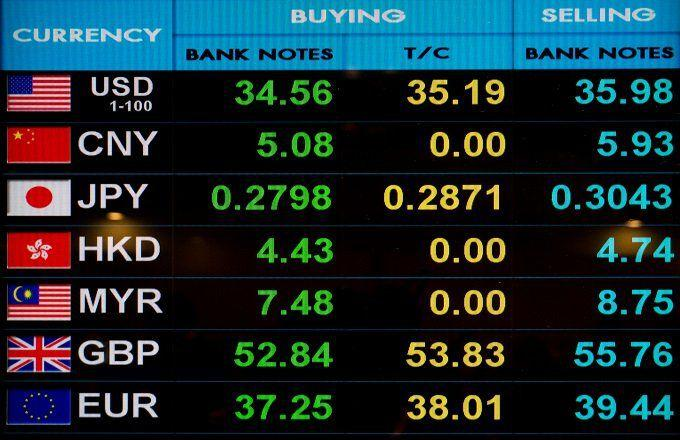

Currencies have been integral to global economics since ancient times, serving as the backbone of trade and commerce. They have evolved from early barter systems to complex digital currencies used today. This evolution highlights the importance of understanding various currency examples, their historical journey, symbolic representations, and modern innovations such as algorithmic trading.

The role and significance of currencies can be traced back to ancient civilizations, where barter systems laid the foundation for trade. These early transactions, although rudimentary, required a mutual agreement of value, eventually leading to the creation of the first currencies. Over centuries, currency forms have diversified, giving rise to commodity money, metal coins, and paper notes, each representing a milestone in economic history.

In contemporary markets, currency symbols, such as the dollar sign ($) and the euro symbol (€), function not only as identifiers but also as essential tools for simplifying and clarifying international trade and finance. With global economic integration, these symbols have become vital in ensuring clarity and reducing confusion across diverse trading platforms.

Recent technological advancements have introduced algorithmic trading in forex markets, revolutionizing how currencies are traded. This automated approach leverages computer programs to execute trades based on predefined conditions, offering rapid decision-making capabilities and transforming the landscape of currency trading. The influence of algorithmic trading is evident in increased market efficiency, heightened liquidity, and sometimes, greater market volatility.

Understanding the historical context of currency, the pivotal role of currency symbols, and the impact of modern trading techniques like algorithmic trading is essential for anyone participating in financial markets. This foundational knowledge equips individuals to navigate the complexities of global finance effectively.

## Table of Contents

## Historical Evolution of Currency

The concept of currency is deeply rooted in human civilization, originating from the necessity to facilitate trade and overcome the limitations of the barter system. The initial phase of currency evolution was characterized by commodity money, where goods with intrinsic value such as grains, cattle, or shells were used as a medium of exchange. However, the impracticality of transporting and storing these commodities led to the development of metal coins, an advancement that significantly enhanced trade efficiency.

The invention of coinage around the 7th century BCE marked a pivotal moment in monetary history. Metal coins made of precious metals like gold and silver offered durability and intrinsic value, becoming a widely accepted form of currency. These coins often bore symbols or images to indicate their authenticity and value, issued by sovereign entities or city-states, which helped standardize trade across regions.

During the medieval period, the economic landscape saw another transformative change with the introduction of paper money. Originating in China during the Tang Dynasty (618–907 CE) and more extensively in the Song Dynasty (960–1279 CE), paper currency provided a more practical and efficient alternative to carrying heavy metal coins. The concept gradually spread to other parts of the world, with European countries like Sweden and the Netherlands adopting it by the 17th century.

In the modern era, the development of digital technology has ushered in the latest phase in currency evolution: digital currencies. These include cryptocurrencies like Bitcoin, which operate on decentralized networks using blockchain technology. Unlike traditional currencies, digital currencies do not have a physical form, representing a significant shift in how value is perceived and exchanged in contemporary financial markets.

These diverse stages in the evolution of currency—from commodity money and metal coins to paper notes and digital currencies—highlight the adaptability of money systems in meeting the changing needs of global trade and economic development.

## Examples of Major World Currencies

The U.S. dollar, denoted by the symbol $, stands as the most widely used and recognized currency on a global scale. Originally established by the Coinage Act of 1792, the dollar has since become a central pillar in international finance and trade. It serves as the world's primary reserve currency, utilized extensively in global transactions, investments, and currency reserves. The dollar's significance is further underscored by its representation in the unofficial term "petrodollar," a reference to its use in global oil transactions.

The Euro (€), introduced in 1999, holds the role of the official currency for 20 European Union member states, encompassing a population of over 340 million people. The Euro was established to promote economic stability and integration across Europe, facilitating easier trade and cross-border transactions. Its widespread adoption demonstrates the region's collective economic strength and unity, making it the second most traded currency after the U.S. dollar.

In addition to the dollar and Euro, other currencies play significant roles in the global financial ecosystem. The British pound (£), one of the oldest currencies still in use, has a storied history dating back to Anglo-Saxon times. Despite the United Kingdom's Brexit decision, the pound remains a strong symbol of economic resilience and traditional financial prowess.

The Japanese yen (¥) is another major currency, notable for its role as a popular safe haven currency in times of economic uncertainty. Introduced in 1871, the yen has become the most traded currency in Asia, with Japan being a critical player in global trade and investment.

Lastly, the Indian rupee (₹), symbolizing one of the world's fastest-growing economies, continues to gain prominence as India expands its influence on the global stage. The rupee's history is deeply intertwined with India's colonial past and its evolution into a significant economic power in the 21st century.

Together, these currencies reflect the diverse and interconnected nature of global economic systems, each carrying unique historical significance and contemporary relevance.

## Currency Symbols and Their Importance

Currency symbols serve as concise graphical representations, offering a streamlined means to identify a given currency during financial transactions. These symbols play a critical role in simplifying economic activities, ensuring clarity in the representation of value across different currencies.

Major world currencies are often identifiable through distinct symbols that have gained widespread recognition and usage. The U.S. dollar, for instance, is universally represented by the symbol '$', while the euro is denoted by '€'. These symbols are not merely aesthetic; they are functional identifiers that facilitate the swift execution of financial tasks ranging from everyday transactions to complex international trade agreements.

In many regions, currency symbols are more than just shorthand; they encapsulate the economic strength and historical significance of a nation's currency. For example, the British pound sterling is symbolized by '£', a representation that carries with it centuries of economic heritage. Similarly, the Japanese yen is indicated by '¥', a symbol that has adapted alongside Japan’s evolving economic landscape.

Some currency symbols are shared across regions or have minor variations to distinguish between similar currencies. For instance, the Indian rupee shares its symbol '₹' with other South Asian currencies adopting similar heritage, albeit with unique regional variations. 

Understanding these symbols is crucial for international trade and finance. In global markets where multiple currencies are exchanged, accurate symbol identification helps in reducing the possibilities of costly mix-ups. For example, distinguishing between the Australian dollar (A$) and the Canadian dollar (C$) is vital in financial documents and trading platforms to avoid transactional errors.

Therefore, currency symbols operate as a fundamental component of the financial domain, providing a universal language that bridges geographical and economic divides. As world economies become increasingly interconnected, the precision offered by these symbols is indispensable for the seamless functioning of global commerce.

## Algorithmic Trading: The Rise of Automation in Currency Markets

Algorithmic trading refers to the use of computer algorithms to automate the process of buying and selling currencies in the [forex](/wiki/forex-system) markets. This form of trading is designed to execute trades based on pre-defined criteria, which can include factors such as price, timing, and [volume](/wiki/volume-trading-strategy). By utilizing these algorithms, traders can operate with increased efficiency, as the systems are capable of making rapid decisions and executing trades with precision—tasks that would be challenging and time-consuming if done manually.

The core advantage of [algorithmic trading](/wiki/algorithmic-trading) is its ability to process data at scales that are unimaginable for human traders. It allows for the evaluation of vast datasets almost instantaneously, thus capitalizing on market inefficiencies faster than manual strategies. This is particularly beneficial in the fast-paced forex market, where the ability to react quickly can lead to significant financial advantages.

A critical component of algorithmic trading is the increase in market [liquidity](/wiki/liquidity-risk-premium). Liquidity refers to the ease with which assets can be bought or sold in the market without affecting the asset's price. Through algorithmic trading, orders are placed with efficiency, often at volumes that reduce the market impact. This results in tighter spreads—the difference between the bid and ask price—making it more cost-effective for traders to transact.

However, the introduction of algorithmic trading has not been without its challenges. One potential downside is the possibility of increased market [volatility](/wiki/volatility-trading-strategies). The swift execution of massive trades can lead to rapid price movements, sometimes resulting in short-term volatility spikes. Additionally, reliance on algorithms can lead to systemic risks if multiple systems react to the same market signals simultaneously, exacerbating price swings and leading to events such as flash crashes.

Despite these challenges, the benefits of algorithmic trading in currency markets continue to drive its adoption. The precision and speed offered by computers allow for an optimized trading experience, providing traders with the tools required to navigate and capitalize on the ever-changing forex market landscape. As technology advances, the role of algorithmic trading is expected to grow, further shaping the dynamics of currency markets globally.

## Conclusion

Understanding the history of currency, its symbols, and modern trading innovations is essential for effectively navigating the multifaceted environment of global finance. The historical evolution of currency, from barter systems to digital currencies, provides critical context for the current financial systems and highlights the adaptive nature of economies. Currency symbols, as integral visual elements, facilitate the seamless identification and differentiation of legal tender, playing a crucial role in international trade and finance.

As the currency landscape continues to evolve, advancements like algorithmic trading underscore the need for staying informed about ongoing changes. Algorithmic trading, utilizing sophisticated computer programs for rapid execution of trades, brings enhanced efficiency and liquidity to foreign exchange markets. However, it also introduces complexities such as potential market volatility requiring careful management and deep understanding.

Participating in global economic activities necessitates an awareness of these dynamics. For individuals and institutions alike, keeping abreast of the latest trends and shifts in currency markets is critical for achieving financial success. Whether it's adapting to the rise of digital currencies or understanding the implications of algorithmic trading, staying informed equips participants to navigate the intricacies of modern finance successfully. As the global economy becomes increasingly interconnected, this knowledge remains an indispensable tool for both personal and professional financial endeavors.

## References & Further Reading

[1]: Davies, G. (2002). ["A History of Money: From Ancient Times to the Present Day."](https://archive.org/details/historyofmoneyfr0000davi) University of Wales Press.

[2]: Prasad, E. S. (2014). ["The Dollar Trap: How the U.S. Dollar Tightened Its Grip on Global Finance."](https://www.jstor.org/stable/j.ctvc77646) Princeton University Press.

[3]: Popper, N. (2015). ["Digital Gold: Bitcoin and the Inside Story of the Misfits and Millionaires Trying to Reinvent Money."](https://www.amazon.com/Digital-Gold-Bitcoin-Millionaires-Reinvent/dp/006236250X) Harper.

[4]: ["Algorithmic Trading: Winning Strategies and Their Rationale"](https://www.wiley.com/en-us/Algorithmic+Trading%3A+Winning+Strategies+and+Their+Rationale-p-9781118460146) by Ernest P. Chan

[5]: Kroszner, R. S., & Obstfeld, M. (2014). ["Lessons from the Financial Crisis and Their Implications for Global Economic Policy"](https://www.frbsf.org/wp-content/uploads/sites/4/Obstfeld_Rogoff.pdf) Federal Reserve Bank of Kansas City Symposium.