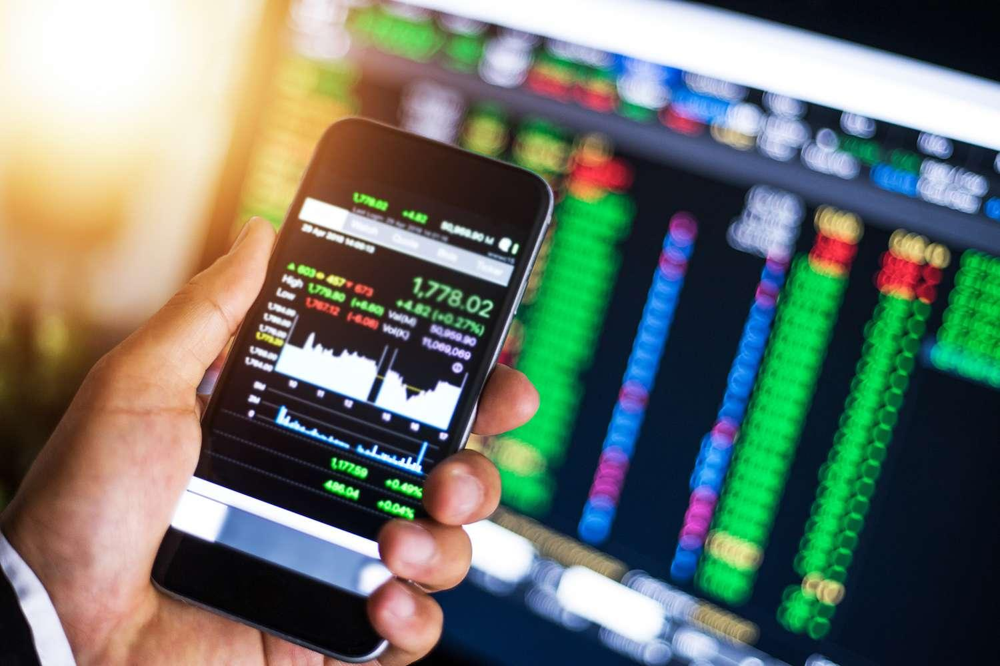

In today's interconnected global economy, the currency market holds a pivotal position as the largest financial market worldwide. Known as forex or FX trading, currency trading facilitates international commerce and investment by enabling the exchange of different currencies. Daily trading volumes in the forex market exceed $6 trillion, reflecting its critical role in global finance and trade.

Forex trading presents vast opportunities for traders around the world to speculate on the price movements of currency pairs such as EUR/USD, GBP/USD, and USD/JPY. The decentralized and over-the-counter nature of the forex market allows trading to occur 24 hours a day, five days a week, involving a diverse range of participants, from major financial institutions to individual traders.



The advent of technology, particularly in the field of finance, has seen the rise of algorithmic trading, or algo trading, within the forex market. Algo trading involves the use of automated systems and algorithms to execute trades based on predefined criteria. This method enhances trading speed and efficiency, as algorithms can analyze vast amounts of data and market conditions faster than human traders, reducing the likelihood of human error and emotional decision-making.

This article seeks to provide a comprehensive understanding of currency trading and the integration of algorithmic strategies to optimize trading outcomes. By exploring the key elements of forex trading, we will examine the benefits of adopting algo trading techniques and consider potential future advancements. The exploration covers the technical and analytical foundations necessary for successful forex trading, the benefits and risks associated with algorithmic approaches, and the evolving landscape of the forex market as it increasingly embraces technological innovation.

## Table of Contents

## Understanding the Currency Market

The currency market, commonly known as the forex market, is recognized as the largest financial market globally. It operates 24 hours a day for five days a week, accommodating traders across different time zones worldwide. With over $6 trillion traded daily, its sheer volume surpasses all other financial exchanges. This colossal market is indispensable in facilitating international trade and finance by enabling currency exchange.

Currency trading involves the simultaneous buying and selling of currency pairs. The price fluctuations in these pairs offer profit opportunities for traders, whether they are large financial institutions or individual participants. The forex market operates over-the-counter (OTC) through a decentralized network of computers, allowing for a continuous flow of transactions beyond the constraints of traditional exchange hours.

Participants in the [forex](/wiki/forex-system) market range broadly, from central and commercial banks, hedge funds, multinational corporations, to individual retail traders. Central banks, for instance, are pivotal players, as they can significantly influence currency prices through monetary policies and interventions. Meanwhile, individual traders typically engage in speculative activities, aiming to leverage small price changes in currency pairs.

Important currency pairs, often called 'majors,' include EUR/USD (Euro/US Dollar), GBP/USD (British Pound/US Dollar), and USD/JPY (US Dollar/Japanese Yen). These pairs are favored due to their high [liquidity](/wiki/liquidity-risk-premium) and lower transaction costs compared to less traded 'exotic' pairs. The market dynamics for these pairs are influenced by various economic indicators, geopolitical events, and investor sentiment.

In summary, the forex market's structure and operations are fundamental to global financial systems, impacting exchange rates that underpin international economics. Understanding its scale, participants, and currency pair dynamics is crucial for anyone looking to engage with or comprehend the mechanisms of currency trading.

## Basics of Currency Trading

Currency trading, also known as forex trading, involves the simultaneous buying and selling of currencies. This occurs in an over-the-counter (OTC) market, meaning transactions are conducted directly between two parties without a centralized exchange. Instead, a global network of computers facilitates the continuous trading of currencies across different time zones. 

Traders aim to profit by speculating on the price movements between two currencies, expressed as currency pairs such as EUR/USD or USD/JPY. The value of these pairs reflects the amount of the quoted currency needed to buy one unit of the base currency. For instance, if EUR/USD is at 1.20, one needs 1.20 USD to buy 1 EUR.

Understanding leverage is crucial in forex trading. Leverage allows traders to control a larger position with a smaller amount of capital, expressed as a ratio (e.g., 50:1). While leverage can amplify profits, it equally increases the potential for losses, thus requiring prudent risk management.

Key terminologies in forex include spreads and pips. The spread is the difference between the bid (buying) and ask (selling) prices and represents the broker's profit. A pip, short for "percentage in point," is the smallest price move a given exchange rate can make, typically the fourth decimal place, or 0.0001, for most currency pairs.

Two main types of analysis guide forex trading decisions: technical and [fundamental analysis](/wiki/fundamental-analysis). Technical analysis involves evaluating statistical trends from trading activity, such as price movement and [volume](/wiki/volume-trading-strategy), to predict future price movements. Traders use charts and various technical indicators like moving averages, RSI (Relative Strength Index), or Bollinger Bands to identify patterns and potential trading signals.

Fundamental analysis, on the other hand, assesses economic indicators, geopolitical events, and interest rates to determine the true value of a currency. This involves analyzing economic reports, such as GDP growth, employment data, and inflation rates, which can influence a currency's value.

Combining both analyses enables traders to make informed decisions, balancing short-term technicals with the broader economic outlook. Successful currency trading requires not only a deep understanding of these concepts but also discipline and a well-planned strategy.

## The Rise of Algo Trading in Forex

Algorithmic trading, often referred to as algo trading, has become an integral component of the forex market. By utilizing automated systems, traders can execute orders with precision and speed, far surpassing the capabilities of manual intervention. This is primarily due to the algorithms' ability to rapidly process extensive datasets, enabling quick responses to fluctuating market conditions. The efficiency inherent in algo trading reduces the likelihood of human errors, such as miscalculations or reactionary trading based on emotions.

The strategic landscape of algo trading in forex is diverse, incorporating a variety of approaches. Arbitrage strategies, for example, exploit price differentials between markets or instruments to generate profit. Trend following, another popular strategy, involves identifying and capitalizing on market trends, predicting future movements based on historical data. Market making, on the other hand, involves providing liquidity by placing buy and sell orders simultaneously, benefiting from the bid-ask spread.

Advanced algorithms are increasingly leveraging [artificial intelligence](/wiki/ai-artificial-intelligence) (AI) and [machine learning](/wiki/machine-learning) to enhance and adapt trading strategies. These technologies enable the development of predictive models that continuously learn from new data inputs, improving their accuracy over time. For instance, machine learning algorithms can identify complex patterns and correlations that are not immediately apparent to human traders. 

A simple example of an [algorithmic trading](/wiki/algorithmic-trading) strategy using Python is the moving average crossover strategy—a basic form of [trend following](/wiki/trend-following). This strategy involves calculating the short-term and long-term moving averages of a currency pair and executing trades based on their interactions:

```python
import pandas as pd
import numpy as np

# Sample: Simulated price data
prices = pd.Series(np.random.randn(1000) + 100).cumsum()

short_window = 40
long_window = 100

short_mavg = prices.rolling(window=short_window, min_periods=1).mean()
long_mavg = prices.rolling(window=long_window, min_periods=1).mean()

signal = pd.DataFrame(index=prices.index)
signal['signal'] = 0.0
signal['short_mavg'] = short_mavg
signal['long_mavg'] = long_mavg

signal['signal'][short_window:] = np.where(signal['short_mavg'][short_window:] > signal['long_mavg'][short_window:], 1.0, 0.0)
signal['positions'] = signal['signal'].diff()

print(signal.head())
```

This code snippet highlights how traders can implement and test simple strategies on historical data, thereby refining and optimizing their approach before deploying it in live trading.

In summary, the rise of algo trading in the forex market signifies a technological transformation, offering traders enhanced efficiency, reduced operational risks, and sophisticated analytical tools. As technology continues to advance, the effectiveness and prevalence of algorithmic strategies in forex trading are expected to grow, paving the way for more dynamic and innovative trading methodologies.

## Benefits of Forex Algo Trading

Algorithmic trading, or algo trading, offers numerous advantages for participants in the foreign exchange (forex) market. This trading method enables high-frequency trading ([HFT](/wiki/high-frequency-trading-strategies)), which can significantly reduce risk exposure. With the inherent speed and precision of algorithms, traders can exploit short-lived market opportunities more effectively than manual methods allow. Additionally, the consistency provided by algorithmic strategies enhances risk management, maintaining disciplined execution through volatile market conditions and minimizing emotional influence on trading decisions.

Automated systems, a cornerstone of algo trading, are adept at swiftly adapting to market fluctuations. These systems are programmed to execute trades at optimal times based on predefined criteria, ensuring that traders capitalize on favorable market movements. This ability aids in maintaining a strategic edge in the fast-paced forex environment.

One of the key features of algo trading is the capacity for [backtesting](/wiki/backtesting) strategies using historical data. Backtesting allows traders to evaluate the potential effectiveness of their algorithms before deploying them in live markets. By simulating trades with historical data, traders can identify potential pitfalls and refine their strategies to enhance performance and mitigate risks. This process increases confidence in the trading systems and helps in optimizing trading outcomes.

Moreover, algorithmic systems offer a high degree of customization, accommodating specific trading goals and risk tolerances. Traders can tailor their algorithms to align with their individual strategies and market outlooks, whether focusing on short-term gains or long-term investment objectives. This flexibility makes algo trading an appealing choice for both novice and seasoned traders looking to enhance their trading capabilities in the forex market.

In summary, forex algo trading provides numerous benefits including executing high-frequency trades with reduced risks, ensuring consistency for better risk management, adapting quickly to market changes, and offering customizable strategies tailored to specific trading objectives. These advantages highlight the growing importance of algorithmic strategies in modern forex trading.

## Challenges and Risks

Algorithmic trading, while offering advantages such as efficiency and speed, is not devoid of challenges and risks. Key among these are system failures and algorithm errors. Such technical issues can lead to significant financial losses, especially when they occur in fast-moving markets where prices can change drastically in seconds. For example, a glitch in the algorithm could execute erroneous trades or fail to [exit](/wiki/exit-strategy) a position at the intended time, amplifying potential losses. 

High-Frequency Trading (HFT), a subset of algo trading, also raises concerns regarding market stability. The rapid pace of HFT can exacerbate market [volatility](/wiki/volatility-trading-strategies) and lead to events like flash crashes, where markets experience extremely rapid and deep price declines followed by a swift recovery. The 2010 Flash Crash is a notable example, where the Dow Jones Industrial Average plunged about 1,000 points within minutes before rebounding, greatly impacting market confidence.

As algorithmic trading becomes more prevalent, regulatory bodies have heightened their scrutiny to ensure fair and transparent trading practices. Regulators impose strict requirements on firms engaged in algo trading to detect and mitigate potential risks. They mandate measures such as circuit breakers to prevent extreme market movements, and algorithm audits to ensure compliance with trading laws and regulations. 

Moreover, developers and traders must ensure that their algorithms are robust and adaptable to changing market conditions. An algorithm that performs well under certain conditions may fail under others. This necessitates a development process that emphasizes rigorous testing, continuous monitoring, and regular updating of algorithmic models to handle unforeseen market events effectively.

These challenges underscore the necessity for careful planning and management in algorithmic trading, with a focus on building resilient systems. Traders are advised to employ strategies that balance profit potential with risk management to mitigate the inherent risks associated with algo trading.

## The Future of Forex Trading: Embracing Technology

Technological advancements are shaping the future landscape of forex trading, introducing both exciting opportunities and complex challenges. The integration of blockchain and cryptocurrencies into forex trading systems is at the forefront of this transformation. Blockchain technology, known for its decentralized and immutable ledger system, promises enhanced transparency and security in forex transactions. This could lead to more efficient settlement processes and reduced transaction costs, thereby increasing trust among traders and institutions. Furthermore, cryptocurrencies are adding a new dimension to the currency market, offering alternative trading opportunities and hedging strategies. 

AI-driven predictive models are also revolutionizing forex trading by providing more sophisticated and accurate forecasts of market trends. These models analyze massive datasets in real-time to identify patterns and correlations that might be invisible to human traders. Machine learning algorithms can be employed to continually refine and optimize trading strategies, reducing the time and effort required from traders and increasing the chances of profitable trades. An example of such a model could be a [neural network](/wiki/neural-network) designed to predict currency price movements based on historical data:

```python
import numpy as np
from keras.models import Sequential
from keras.layers import Dense, LSTM

# Sample data preprocessing
def prepare_data(data, time_steps=1):
    X, y = [], []
    for i in range(len(data) - time_steps):
        a = data[i:(i + time_steps), 0]
        X.append(a)
        y.append(data[i + time_steps, 0])
    return np.array(X), np.array(y)

# Define the LSTM model
model = Sequential()
model.add(LSTM(50, return_sequences=True, input_shape=(10, 1)))
model.add(LSTM(50))
model.add(Dense(1))
model.compile(optimizer='adam', loss='mean_squared_error')

# Assume data_train is preprocessed historical forex data
X_train, y_train = prepare_data(data_train, 10)
model.fit(X_train, y_train, epochs=100, batch_size=64)
```

The increasing accessibility of online trading platforms is democratizing forex trading, allowing more individuals to participate in the market. With lower barriers to entry, retail traders can now access sophisticated tools and data analytics once reserved for institutional traders. This democratization is fostering a more competitive market environment where innovation thrives.

To remain competitive, traders and institutions must adapt to these technological innovations. Continuous learning and skill development in areas like data analysis, programming, and financial modeling are becoming essential. Institutions, on the other hand, might focus on integrating the latest technologies and analytics in their trading operations to maintain an edge.

As technology continues to progress at an unprecedented rate, staying ahead requires flexibility and a proactive approach to adopting new tools and methods. This evolving landscape promises to redefine the forex market, offering numerous opportunities for those willing and able to embrace technological advancements.

## Conclusion

Currency trading remains a dynamic and integral component of the global financial system, offering a vast arena for investment and economic interaction. The advent of algorithmic trading or algo trading has introduced a revolution in how trading strategies are developed and executed, providing traders with a means to optimize processes and maintain a competitive edge. With the high-speed execution and precision that algorithms bring, traders can swiftly adjust to market conditions and capitalize on both short-term and long-term opportunities.

Despite the inherent risks associated with this technology, such as system failures and algorithm errors, the advantages greatly outweigh the negatives. The ability to automate trading tasks not only minimizes human error and emotional decision-making but also opens new avenues for risk management and strategic analysis. Technological innovations are transforming the landscape of forex trading, making it critical for participants to remain well-informed and flexible to adapt to these changes.

The future of forex trading will likely see more integration with cutting-edge technologies. Developments such as blockchain and artificial intelligence promise to further enhance trading efficiency and accuracy, contributing to a more democratized and accessible market. Embracing these innovations will be key to unlocking future growth and ensuring continued opportunities in the forex market. By staying ahead of technological trends and continuously refining their approaches, traders and institutions can ensure their longevity and success in this ever-evolving field.

## References & Further Reading

[1]: Bergstra, J., Bardenet, R., Bengio, Y., & Kégl, B. (2011). ["Algorithms for Hyper-Parameter Optimization."](https://dl.acm.org/doi/10.5555/2986459.2986743) Advances in Neural Information Processing Systems 24.

[2]: ["Advances in Financial Machine Learning"](https://www.amazon.com/Advances-Financial-Machine-Learning-Marcos/dp/1119482089) by Marcos Lopez de Prado

[3]: ["Evidence-Based Technical Analysis: Applying the Scientific Method and Statistical Inference to Trading Signals"](https://www.amazon.com/Evidence-Based-Technical-Analysis-Scientific-Statistical/dp/0470008741) by David Aronson

[4]: ["Machine Learning for Algorithmic Trading"](https://github.com/PacktPublishing/Machine-Learning-for-Algorithmic-Trading-Second-Edition) by Stefan Jansen

[5]: ["Quantitative Trading: How to Build Your Own Algorithmic Trading Business"](https://www.amazon.com/Quantitative-Trading-Build-Algorithmic-Business/dp/0470284889) by Ernest P. Chan