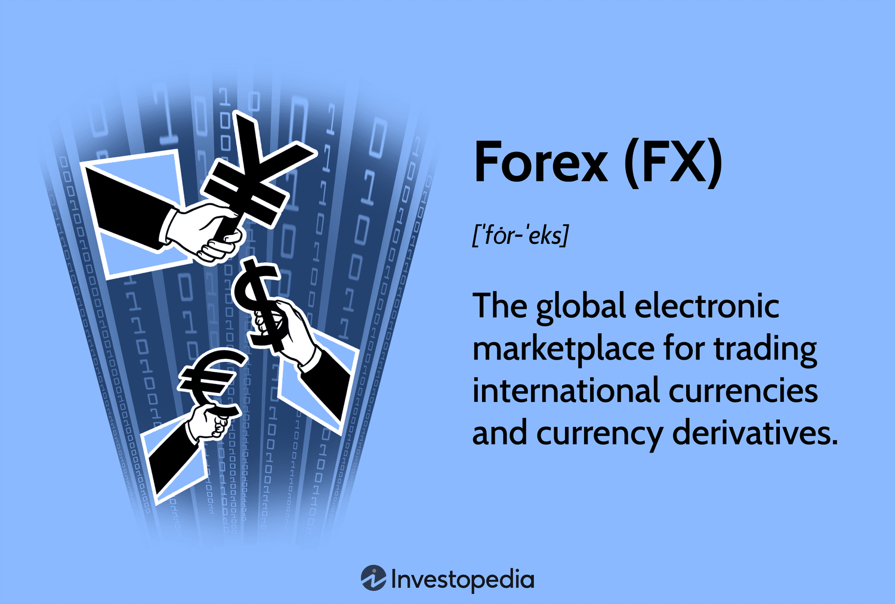

## Table of Contents

## What is the Forex market?

The Forex market, also known as the foreign exchange market, is where people and businesses trade different currencies from around the world. It's like a big marketplace where you can exchange one country's money for another country's money. For example, if you're traveling from the United States to Japan, you might exchange your US dollars for Japanese yen so you can buy things in Japan.

The Forex market is huge and operates 24 hours a day, except for weekends. It's not in one specific place but is spread out all over the world, with trading happening in major financial centers like London, New York, and Tokyo. People trade currencies for many reasons, like buying goods from other countries, investing, or trying to make money from changes in currency values. Because the market is so big and always open, it's very active and can be influenced by many things, like economic news or political events.

## Who are currency traders?

Currency traders are people who buy and sell different kinds of money from around the world. They work in the Forex market, trying to make money by guessing how the value of one currency will change compared to another. Some traders work for big banks or financial companies, while others might trade on their own from home using computers and the internet.

These traders use special tools and information to help them decide when to buy or sell currencies. They look at things like news about the economy, interest rates, and even big events happening in different countries. Trading currencies can be risky because the prices can go up and down a lot, but it can also be very rewarding if the traders make good guesses.

## What are the basic principles of currency trading?

Currency trading, or Forex trading, is all about buying one currency while selling another at the same time. The main idea is to make money from the difference in the exchange rate between the two currencies. Traders look at how much one currency is worth compared to another and try to predict if that value will go up or down. If a trader thinks that the US dollar will get stronger against the Japanese yen, they might buy dollars and sell yen. If their prediction is right and the dollar does get stronger, they can sell the dollars back for more yen than they started with, making a profit.

To be good at currency trading, you need to understand some basic principles. First, you have to know about supply and demand. If more people want to buy a certain currency, its value usually goes up. If fewer people want it, its value goes down. Second, you need to keep an eye on economic news and events, like interest rate changes or big political happenings, because these can affect currency values a lot. Finally, managing risk is very important. This means not putting all your money into one trade and using tools like stop-loss orders to limit how much you could lose if a trade goes wrong.

## How do beginners start trading in the Forex market?

To start trading in the Forex market, beginners need to first choose a reliable Forex broker. A broker is like a middleman who helps you buy and sell currencies. You can find a broker by looking online, but make sure to pick one that is regulated and has good reviews. Once you've chosen a broker, you'll need to open a trading account with them. This usually involves filling out some forms and maybe sending in some documents to prove who you are. After your account is set up, you'll need to put some money into it, which is called making a deposit.

Once you have your account set up and funded, it's time to start learning how to trade. Most brokers offer demo accounts, which let you practice trading with fake money. This is a great way to get the hang of things without risking any real money. You'll also want to learn about different trading strategies and tools, like charts and indicators, which can help you make better decisions. As you learn, start with small trades and slowly increase your trading size as you get more comfortable. Remember, trading can be risky, so it's important to only trade with money you can afford to lose and to always keep learning and improving your skills.

## What are the most common trading strategies used by currency traders?

Currency traders use different strategies to try and make money in the Forex market. One common strategy is called trend following. This means traders look at charts and try to find patterns that show if a currency's value is going up or down over time. If they see that a currency is getting stronger, they might buy it, hoping to sell it later for more money. If they see it getting weaker, they might sell it, hoping to buy it back later for less. This strategy works because it uses the idea that trends often continue for a while before they change.

Another popular strategy is called scalping. Scalpers make lots of small trades in a short amount of time, trying to make a little bit of money from each one. They look for tiny changes in currency prices and try to buy low and sell high very quickly. This can be exciting and fast-paced, but it also requires a lot of attention and quick thinking. Scalpers often use special tools and charts to help them spot these small price movements.

A third strategy is called carry trading. This is when traders borrow money in a currency with a low interest rate and use it to buy a currency with a higher interest rate. They make money from the difference in interest rates, which is called the carry. This strategy can be good when things are stable, but it can be risky if the exchange rates change a lot. Traders need to be careful and watch the market closely to make sure their carry trade keeps making money.

## What are the risks involved in Forex trading?

Forex trading can be risky because the value of currencies can change a lot and very quickly. If you guess wrong about which way a currency's value will go, you could lose money. Sometimes, big news or events in the world can make currency prices jump suddenly, and this can be hard to predict. Also, trading with borrowed money, which is called leverage, can make the risks even bigger. If the trade goes against you, you could lose more money than you put in.

Another risk is that the Forex market is open all the time, except on weekends. This means you need to keep an eye on your trades all the time, which can be stressful. If you don't watch closely, you might miss important changes in the market. Also, there are many people and companies trading in the Forex market, and some might try to trick you or not be honest. So, it's important to choose a good and trustworthy broker to help you trade safely.

## How does leverage work in Forex trading and what are its implications?

In Forex trading, leverage lets you control a big amount of money by only putting down a small amount of your own money. It's like borrowing money from your broker to make bigger trades. For example, if you have a leverage of 100:1, you can trade $100,000 worth of currency by only putting down $1,000. This can help you make more money if your trades go well, but it also means you can lose more money if they don't.

Leverage can be very risky because even small changes in currency prices can lead to big losses. If the market moves against you, you could lose more money than you put in. That's why it's important to use leverage carefully and only trade with money you can afford to lose. Also, brokers might close your trades if your losses get too big, which is called a margin call. This can happen quickly in the Forex market, so you need to watch your trades closely and understand the risks before you start using leverage.

## What are the key economic indicators that currency traders should monitor?

Currency traders need to keep an eye on several important economic indicators to make good trading decisions. One of the most important indicators is the interest rate set by a country's central bank. If a country raises its interest rates, its currency usually becomes stronger because it attracts more investors looking for higher returns. On the other hand, if interest rates go down, the currency might weaken. Another key indicator is the Gross Domestic Product (GDP), which shows how well a country's economy is doing. A strong GDP growth can make a currency stronger, while a weak GDP can make it weaker.

Inflation rates are also very important for currency traders to watch. If a country has high inflation, its currency might lose value because the money becomes worth less. Traders also pay attention to employment data, like the unemployment rate. When more people have jobs, it's usually a sign of a strong economy, which can make the currency stronger. Lastly, trade balances matter too. If a country exports more than it imports, it has a trade surplus, which can make its currency stronger. If it imports more than it exports, it has a trade deficit, which can weaken its currency.

Keeping track of these economic indicators can help traders predict how currency values might change. By understanding these factors, traders can make better decisions about when to buy or sell currencies. It's like having a weather report for the Forex market, helping traders prepare for what might happen next.

## How do geopolitical events impact currency trading?

Geopolitical events, like wars, elections, or big agreements between countries, can shake up the Forex market a lot. When something big happens, like a country going to war, it can make people worried about that country's money. They might start selling the currency because they think it will lose value. This can make the currency weaker very quickly. For example, if there's a big election and people think the new leader will be bad for the economy, the country's currency might go down in value because people lose trust in it.

On the other hand, good news from geopolitical events can make a currency stronger. If countries agree on a big trade deal, it can make people more confident in those countries' economies. They might start buying more of the currency, thinking it will get stronger. Traders need to watch the news closely because these events can change quickly and affect currency values a lot. By understanding what's happening in the world, traders can make better guesses about which way currency values will go.

## What advanced technical analysis tools are used by expert traders?

Expert traders use many advanced technical analysis tools to help them make better guesses about where currency prices might go. One common tool is the Fibonacci retracement, which uses special numbers to find levels where the price might stop and change direction. Another tool is the Relative Strength Index (RSI), which helps traders see if a currency is overbought or oversold. This can tell them if a price might soon go down or up. Traders also use moving averages, like the Simple Moving Average (SMA) and the Exponential Moving Average (EMA), to smooth out price data and spot trends over time. These tools help traders see patterns and make smarter trading choices.

Another important tool is the Bollinger Bands, which show how much a currency's price is moving around. They help traders see if the market is quiet or if it's getting ready for a big move. Expert traders also use chart patterns, like head and shoulders or triangles, to predict future price movements. These patterns can show when a trend might change or continue. By using all these tools together, expert traders can get a better picture of what the market might do next and make more informed trading decisions.

## How can algorithmic trading improve a trader's performance in the Forex market?

Algorithmic trading can help traders do better in the Forex market by taking away some of the guesswork and emotion that can mess up trading decisions. Instead of trying to decide when to buy or sell based on feelings or what they think might happen, traders can use computer programs to follow a set of rules they've made. These rules can be based on things like math formulas, past price movements, or economic news. This means the computer can look at a lot of information really fast and make trades without getting tired or making mistakes that people might make.

Using algorithmic trading can also help traders take advantage of small price changes that happen very quickly. The Forex market moves all the time, and it can be hard for a person to keep up with everything. But a computer can watch the market 24/7 and make trades in just a few seconds. This can lead to making more money from small price movements, which might add up over time. Plus, algorithmic trading can help traders stick to their plan and not make sudden changes just because they feel nervous or excited about the market.

## What are the latest trends and future predictions for the Forex market?

The Forex market is always changing, and one big trend right now is the use of technology. More and more traders are using computers and special software to help them make trades. This is called algorithmic trading, and it lets traders use math and rules to decide when to buy or sell currencies. Another trend is that more people are trading on their phones and tablets. This makes it easier for anyone to trade, no matter where they are. Also, there's a lot of interest in cryptocurrencies like Bitcoin, and some traders are starting to trade these along with regular currencies.

Looking into the future, experts think the Forex market will keep getting bigger and more people will join in. They also think technology will keep playing a big role, with even more advanced tools and software coming out. This could make trading easier and faster, but it might also make the market more complicated. Another prediction is that more countries might start using their own digital currencies, which could change how the Forex market works. Overall, the Forex market will likely keep growing and changing, with technology and new types of money playing big parts in its future.

## References & Further Reading

[1]: Bergstra, J., Bardenet, R., Bengio, Y., & Kégl, B. (2011). ["Algorithms for Hyper-Parameter Optimization."](https://dl.acm.org/doi/10.5555/2986459.2986743) Advances in Neural Information Processing Systems 24.

[2]: ["Advances in Financial Machine Learning"](https://www.amazon.com/Advances-Financial-Machine-Learning-Marcos/dp/1119482089) by Marcos Lopez de Prado

[3]: ["Evidence-Based Technical Analysis: Applying the Scientific Method and Statistical Inference to Trading Signals"](https://www.amazon.com/Evidence-Based-Technical-Analysis-Scientific-Statistical/dp/0470008741) by David Aronson

[4]: ["Machine Learning for Algorithmic Trading"](https://github.com/PacktPublishing/Machine-Learning-for-Algorithmic-Trading-Second-Edition) by Stefan Jansen

[5]: ["Quantitative Trading: How to Build Your Own Algorithmic Trading Business"](https://www.amazon.com/Quantitative-Trading-Build-Algorithmic-Business/dp/0470284889) by Ernest P. Chan