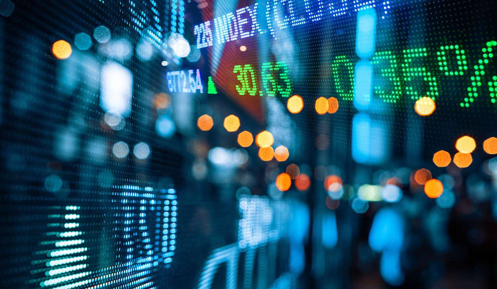

Forex trading, also known as foreign exchange trading, involves the buying and selling of currencies on the global market. This market plays a critical role in facilitating international trade and investment by enabling currency conversion. The forex market's decentralized nature means it operates over the counter (OTC), without a centralized exchange, allowing it to function 24 hours a day during the workweek. Understanding market hours is crucial for traders, as the timing determines when they can engage actively to capitalize on fluctuating currency values driven by geopolitical developments, economic data releases, or other market-moving events.

The forex market is divided into four major trading sessions: Sydney, Tokyo, London, and New York. Each session contributes to the continuity of the market across different time zones, providing traders with various opportunities for trading activity. The variance in trading volumes and volatility across these sessions can significantly impact currency pairs, affecting strategies and potential returns. 

Algorithmic trading, or algo trading, has further revolutionized the forex market by automating trading activities based on pre-set criteria. Incorporating sophisticated algorithms allows traders to execute trades at unparalleled speeds, manage vast data streams, and leverage predictive analytics. By removing human emotion, algorithmic systems offer precision and can manage complex trading strategies, adjusting to real-time market conditions efficiently. 

This article provides an overview of the forex trading market hours and explores how algorithmic trading impacts this volatile market. By understanding how market hours and technology influence trading, participants can better align their strategies to optimize performance and mitigate risk.

## Table of Contents

## Understanding Forex Market Hours

The forex market operates continuously from Monday to Friday, reflecting the international nature of currency trading, where financial centers around the world participate in currency exchanges. Its 24-hour operation is segmented into four principal trading sessions corresponding to key financial centers: Sydney, Tokyo, London, and New York. These sessions enable traders across the globe to engage in forex trading at various times, aligning with their respective time zones.

The Sydney session, which opens at 10 PM GMT, is influenced largely by liquidity from the Australian and New Zealand markets. Currency pairs involving the Australian and New Zealand dollars, such as AUD/USD and NZD/USD, are typically more active during this session. As the first session of the day, it often sets the initial market tone, though with relatively lower volatility compared to other sessions.

The Tokyo session starts at 12 AM GMT, where the trading [volume](/wiki/volume-trading-strategy) increases as markets in Japan and other parts of Asia, including China and Singapore, enter the fray. The most active currency pairs in this session include USD/JPY, EUR/JPY, and others involving the Japanese yen. Traders often look for opportunities as various economic indicators from Japan are released, which can lead to moderate [volatility](/wiki/volatility-trading-strategies).

The London session is one of the most critical, commencing at 8 AM GMT. London’s position as a global financial hub ensures high [liquidity](/wiki/liquidity-risk-premium), with a range of currency pairs such as EUR/USD, GBP/USD, and USD/CHF experiencing significant activity. This session's distinctive characteristic is its intersection with both the closing Asian and opening New York sessions, creating periods of heightened volatility and increased trading volume.

Finally, the New York session opens at 1 PM GMT, bringing substantial activity, as it overlaps with the London session until the latter closes. This session is marked by the release of key economic data from the United States, affecting major currency pairs like EUR/USD and USD/JPY. The New York session remains active until 10 PM GMT, wrapping up the global trading day and often dictating the daily market trend.

Timing and session overlaps are crucial for traders aiming to capitalize on [forex](/wiki/forex-system) market movements. Overlapping trading sessions typically see the highest liquidity and volatility, providing ample opportunities for profitable trades. Understanding and leveraging these dynamics allows traders to better strategize and optimize their trading activities to align with market conditions.

## The Best Times for Forex Trading

The forex market offers multiple trading sessions across different time zones. Each session presents unique opportunities for traders, but the overlap between certain sessions is particularly notable for its increased liquidity and volatility. Among these, the London-New York overlap stands out as one of the most lucrative periods for forex trading.

During this overlap, typically between 8:00 AM and 12:00 PM EST, both the London and New York markets are active. This convergence results in heightened trading activity due to the participation of major financial centers in Europe and North America. The increased trade volume leads to tighter spreads and better pricing, offering traders more opportunities to capitalize on market movements.

Moreover, understanding the timing of major economic news releases is vital for forex traders. Many significant economic indicators, such as employment reports, [interest rate](/wiki/interest-rate-trading-strategies) decisions, and GDP figures, are published during the London and New York sessions. These announcements can cause substantial price fluctuations and increased volatility, presenting both opportunities and risks. For instance, the U.S. Non-Farm Payrolls release at 8:30 AM EST each month can lead to rapid price changes and significant trading opportunities.

In summary, the overlap between the London and New York sessions is a prime time for forex trading, characterized by high liquidity and volatility. By keeping track of key economic news release times, traders can better manage their strategies and exploit market dynamics effectively.

## Overview of Algorithmic Trading

Algorithmic trading involves the use of computer programs to execute trades automatically based on predefined criteria. This advanced trading technique leverages computational power to process vast amounts of financial data and execute transactions at a speed and precision unattainable by human traders. By automating the trading process, [algorithmic trading](/wiki/algorithmic-trading) provides significant competitive advantages.

One of the primary benefits of algorithmic trading is its ability to handle large data sets and compute complex calculations quickly. These algorithms can analyze various market variables and execute trades in milliseconds, capitalizing on even the smallest price discrepancies. This speed is crucial in high-frequency trading environments where millisecond-level latency can significantly impact profitability.

These algorithms employ diverse strategies to achieve trading objectives. Among them, trend-following strategies are popular. These strategies involve algorithms detecting patterns or trends in price movements, allowing traders to ride the wave of price [momentum](/wiki/momentum). Another common strategy is [arbitrage](/wiki/arbitrage), which involves the exploitation of price differentials of the same asset across different markets or forms. Arbitrage opportunities often exist for very short periods, and algorithmic trading helps traders quickly act on them before they disappear.

Market-making is another key strategy in algorithmic trading. In this approach, algorithms provide liquidity by continuously quoting both buy and sell prices for a particular asset, profiting from the bid-ask spread. This strategy not only aids the trader in capturing market inefficiencies but also contributes to the overall liquidity and stability of the financial markets.

Python is a popular programming language employed in developing trading algorithms due to its rich ecosystem of libraries and ease of use. For example, libraries such as NumPy and pandas are widely used for numerical computations and data manipulation, while more specialized libraries like PyAlgoTrade and Zipline facilitate the creation and back-testing of trading strategies.

In conclusion, algorithmic trading transforms the forex market by enabling automated, data-driven trading decisions that enhance speed, efficiency, and profitability. It allows traders to implement sophisticated strategies that leverage the computational power of modern computers, ensuring optimal market participation.

## The Role of Algo Trading in Forex Market

Algorithmic trading, often abbreviated as algo trading, plays a significant role in the forex market by enhancing the consistency and precision of trade execution. One of the primary advantages of algo trading is its ability to remove emotional and psychological biases from trading decisions, which can often lead to inconsistent results in manual trading. By using predefined criteria and complex algorithms, trades are executed with a high degree of accuracy, ensuring that orders are placed at optimal levels.

The efficiency of the forex market is notably increased through algo trading as it facilitates faster order execution. This speed is primarily due to the ability of algorithms to process large volumes of data rapidly and make split-second decisions. Additionally, algo trading contributes to improved market liquidity. As algorithms can act decisively in response to market conditions, the bid-ask spread is narrowed, and the overall depth of the market is enhanced. This increased liquidity benefits all market participants by minimizing transaction costs and reducing price volatility.

Traders employing algo trading can implement a variety of complex strategies. These strategies can include, but are not limited to, [statistical arbitrage](/wiki/statistical-arbitrage), trend-following, and market-making. The sophistication of these algorithms enables traders to respond dynamically to diverse market scenarios, optimizing their returns while managing risk efficiently.

Moreover, a distinct advantage of algo trading in the forex market is the ability to monitor market conditions continuously. Forex markets operate 24 hours a day, spanning various global time zones. Algo trading systems can be programmed to operate throughout these hours, ensuring that trading opportunities are not missed due to time zone differences or the need for human rest. This uninterrupted monitoring allows for opportunities to be captured at any time, regardless of regular trading hours, providing a competitive edge.

By combining speed, precision, and the ability to handle vast amounts of data, algo trading significantly contributes to the functionality and efficiency of the forex market. As a result, traders who leverage algorithmic systems can enhance their trading performance and maintain a competitive advantage in this fast-paced market environment.

## The Pros and Cons of Algo Trading

Algorithmic trading, often referred to as algo trading, has transformed the landscape of currency trading by leveraging computational power and advanced algorithms. The advantages are numerous, with increased speed being one of the primary benefits. Algorithms can execute trades in milliseconds, significantly faster than a human trader, allowing for the capitalization on fleeting market opportunities.

Accuracy is another notable benefit. Algo trading minimizes human errors, which can be prevalent in manual trading due to tiredness or emotional biases. Furthermore, these algorithms can handle complex calculations and manage multiple data streams simultaneously, leading to precise and consistent trading outcomes.

An additional advantage is the ability to backtest strategies efficiently. Traders can use historical data to evaluate the potential performance of their strategies before deploying them in real-time markets. This capability provides insights into the potential risks and rewards associated with different trading strategies and allows for fine-tuning to optimize results.

However, algo trading is not without its drawbacks. Technical failures can occur, and these issues may lead to significant financial losses. The faith in technology means systems must be robust, as a simple glitch could lead to the execution of erroneous trades. 

Furthermore, constant monitoring is essential. Despite the autonomous nature of algo trading, oversight is required to ensure algorithms are operating as intended and adapting to any changes in market conditions. Without proper monitoring, algorithms can engage in unintended trades, lacking the discernment a human trader might exercise.

The dependence on algorithms is another potential drawback. Relying solely on automated strategies can be risky, especially in highly volatile or unprecedented market situations where human intuition might offer a strategic advantage.

A balanced approach might be the optimal strategy for many traders. By integrating both manual and algo trading methods, traders can leverage the speed and precision of algorithms while also applying human judgment and intuition where needed. This hybrid approach can mitigate the risks associated with pure algorithm reliance and enhance overall trading effectiveness.

## Conclusion

Currency trading in the forex market is a dynamic and complex activity influenced by a multitude of factors, among which trading hours and algorithmic trading play significant roles. The forex market operates continuously through various global trading sessions, which creates opportunities but also necessitates a keen awareness of when these sessions overlap for optimal trading conditions. The strategic importance of market hours is undeniable, as currency pairs exhibit varying levels of volatility and liquidity across different times of the day.

Moreover, the rise of algorithmic trading has introduced a transformative shift in how trading is conducted. This technological advancement enables traders to execute orders with unprecedented speed and accuracy, mitigating the human emotional biases often associated with manual trading. Algorithms can also integrate vast datasets to inform trading strategies, manage risks more effectively, and provide 24/7 market monitoring, thus optimizing trading performance even during off-hours.

Successful trading in this ever-evolving market landscape demands more than just understanding the basic fundamentals; it requires a comprehensive and analytical approach toward market hours and the adept use of trading technology. As both technology and global economic conditions continuously advance, traders are compelled to evolve their strategies to maintain a competitive edge. Adapting to these changes by leveraging algorithmic solutions while being aware of the intricacies of market timing can enhance traders' ability to capitalize on market movements.

In conclusion, staying competitive in the forex market necessitates an ongoing commitment to learning, adaptation, and the strategic implementation of technology. Traders must balance historical insights with modern techniques to navigate the complexities of currency trading effectively.

## References & Further Reading

[1]: Bergstra, J., Bardenet, R., Bengio, Y., & Kégl, B. (2011). ["Algorithms for Hyper-Parameter Optimization."](https://dl.acm.org/doi/10.5555/2986459.2986743) Advances in Neural Information Processing Systems 24.

[2]: ["Advances in Financial Machine Learning"](https://www.amazon.com/Advances-Financial-Machine-Learning-Marcos/dp/1119482089) by Marcos Lopez de Prado

[3]: ["Evidence-Based Technical Analysis: Applying the Scientific Method and Statistical Inference to Trading Signals"](https://www.amazon.com/Evidence-Based-Technical-Analysis-Scientific-Statistical/dp/0470008741) by David Aronson

[4]: ["Machine Learning for Algorithmic Trading"](https://github.com/stefan-jansen/machine-learning-for-trading) by Stefan Jansen

[5]: ["Quantitative Trading: How to Build Your Own Algorithmic Trading Business"](https://www.amazon.com/Quantitative-Trading-Build-Algorithmic-Business/dp/1119800064) by Ernest P. Chan