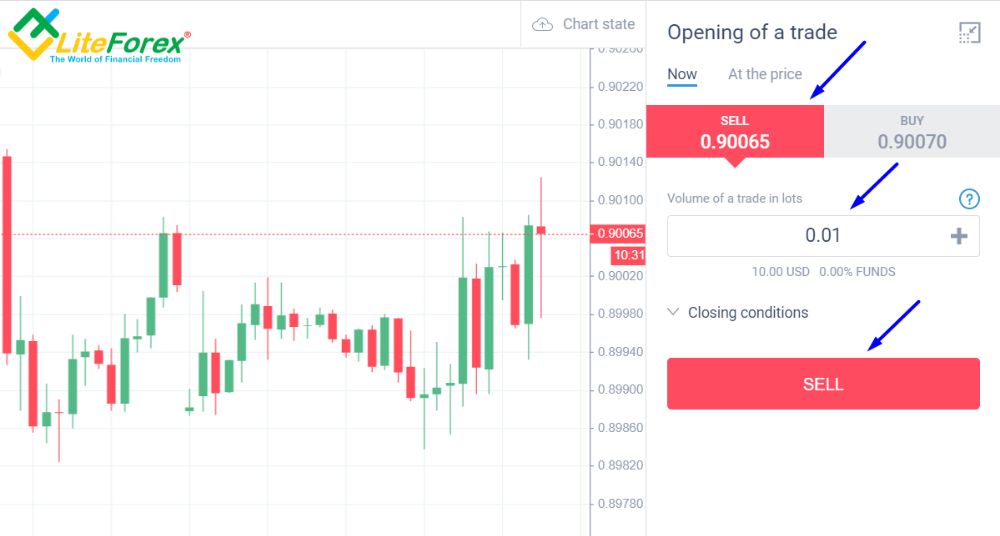

## Table of Contents

## What is currency trading and why might it occur during market closures?

Currency trading, also known as forex trading, is when people buy and sell different countries' money. They do this to make money from the changes in the value of one currency compared to another. For example, if you think the US dollar will get stronger compared to the British pound, you might buy dollars with pounds. If the dollar does get stronger, you can sell it back for more pounds than you started with, making a profit.

Currency trading can happen even when the main stock markets are closed because the forex market works 24 hours a day, from Monday to Friday. This is because different countries have different time zones, and their markets open and close at different times. So, when the New York market is closed, the Tokyo market might still be open, and traders can keep trading currencies. This constant activity means that people can trade currencies anytime they want during the week, not just when their local market is open.

## How do market closures affect currency trading?

Market closures in major financial centers like New York, London, and Tokyo can affect currency trading, but the forex market still keeps going 24 hours a day from Monday to Friday. When one market closes, another one in a different time zone might still be open. This means that even if the New York market is closed, trading can continue in Tokyo or Sydney. So, currency trading doesn't stop completely; it just shifts to where the markets are still open.

However, the volume of trading can change when major markets are closed. When big markets like New York or London are not trading, there might be fewer people buying and selling currencies. This can lead to less activity and sometimes bigger price swings because there are fewer trades happening. But overall, the forex market stays active around the clock, so traders can still make trades even during these closures.

## What are the common reasons for market closures?

Market closures happen for a few main reasons. One big reason is holidays. Each country has its own special days when they celebrate, and during these times, their stock markets and banks might close. For example, the US stock market closes on Thanksgiving and Christmas. Another reason is weekends. Most markets around the world close on Saturdays and Sundays so people can have time off.

Sometimes, markets might close because of really bad weather or big emergencies. If there's a huge storm or something dangerous happening, they might shut down to keep everyone safe. Also, sometimes governments or the people in charge of the markets might decide to close them for a short time if there's a big problem with the economy or if they need to make important changes. These closures don't happen very often, but they can affect trading when they do.

## Can you trade currencies 24/7, and if so, how does this work during market closures?

You can trade currencies 24 hours a day from Monday to Friday, but not on weekends. The forex market never sleeps during the week because different countries are in different time zones. When the market in New York closes, the market in Tokyo might still be open. This means you can keep trading even if your local market is closed. The trading just moves to wherever the markets are still open around the world.

When big markets like New York or London are closed, there might be less trading happening. This can make the prices of currencies move more because there are fewer people buying and selling. But even with these closures, the forex market stays active all week long. So, you can still trade currencies anytime during the week, no matter where you are or which big markets are closed.

## What strategies can be used for currency trading when markets are closed?

When big markets are closed, you can still trade currencies because the forex market works all the time during the week. One good strategy is to watch what's happening in the markets that are still open. For example, if the New York market is closed but the Tokyo market is open, you can look at what's happening there and make your trading decisions based on that. Another strategy is to use automated trading systems. These are computer programs that can trade for you even when you're not watching. They follow rules you set up to buy and sell currencies at the right times.

Another strategy is to pay attention to big news and events that can affect currency prices. Even if your local market is closed, big news from around the world can still move the forex market. For example, if there's important news from Europe, it can affect the euro even if the European markets are closed. By keeping an eye on these events, you can make smart trades. Also, you might want to trade during times when there's less activity because this can lead to bigger price moves. Just be careful because these bigger moves can also mean more risk.

## How does liquidity change during market closures and what impact does this have on trading?

When big markets like New York or London are closed, there's usually less trading happening in the forex market. This means there's less liquidity, which is like having fewer people wanting to buy or sell currencies at any given time. When there's less liquidity, it can be harder to buy or sell the amount of currency you want without affecting the price too much. So, if you want to trade a big amount of currency, you might find that the price moves more than you expected because there aren't as many people trading.

This change in liquidity can make trading riskier during market closures. When there are fewer trades, the prices of currencies can swing more wildly. This is because even small trades can have a bigger effect on the price when there's less activity. Traders need to be careful and maybe use smaller trades to avoid big surprises in the price. But even with less liquidity, the forex market keeps going, and you can still trade if you're ready for the extra ups and downs.

## What are the risks associated with trading during market closures?

Trading during market closures can be riskier because there are fewer people trading. When big markets like New York or London are closed, there's less activity in the forex market. This means there's less liquidity, which makes it harder to buy or sell the amount of currency you want without moving the price a lot. If you try to trade a big amount, the price might change more than you expect because there aren't as many people to trade with.

Because of the lower liquidity, the prices of currencies can swing more wildly during market closures. Even small trades can have a big effect on the price when there's less activity. This can lead to bigger losses if the market moves against you. Traders need to be careful and might want to use smaller trades to avoid big surprises in the price. Even though the forex market keeps going, the extra ups and downs during market closures can make trading more challenging.

## How can traders prepare for trading during market closures?

Traders can prepare for trading during market closures by keeping an eye on the markets that are still open. Even if big markets like New York or London are closed, other markets like Tokyo or Sydney might still be trading. By watching what's happening in these open markets, traders can make better decisions about when to buy or sell currencies. Another way to prepare is by using automated trading systems. These are computer programs that can trade for you even when you're not watching. You can set up rules for the program to follow, so it knows when to make trades, even during times when there's less activity.

It's also important to pay attention to big news and events that can affect currency prices. Even if your local market is closed, news from around the world can still move the forex market. For example, important news from Europe can change the value of the euro, even if the European markets are closed. By staying informed about these events, traders can make smart trades. Additionally, traders should be ready for bigger price swings during market closures because there's less trading happening. Using smaller trades can help manage the risk of these bigger moves.

## What tools and resources are available for traders to monitor markets during closures?

Traders can use several tools to keep an eye on the forex market even when big markets are closed. One useful tool is a real-time market data feed, which shows the latest prices and trading activity from markets that are still open. This can help traders see what's happening in places like Tokyo or Sydney when New York or London is closed. Another helpful resource is economic calendars, which list important news and events that might affect currency prices. By checking these calendars, traders can stay informed about things like interest rate changes or big economic reports, even if their local market is not trading.

Another important tool for traders is trading platforms that offer 24/5 trading. These platforms let traders make trades anytime during the week, no matter where they are or which big markets are closed. Many of these platforms also have built-in charting tools and technical indicators that can help traders analyze market trends and make better decisions. Additionally, traders can use news apps and websites to get updates on global events that might move the forex market. By using these tools and staying informed, traders can be ready to trade even during market closures.

## How do economic announcements and news events during market closures affect currency trading?

Economic announcements and news events can have a big effect on currency trading, even when big markets are closed. When important news comes out, like changes in interest rates or big economic reports, it can move the prices of currencies. Even if your local market is closed, these news events can still cause the forex market to change. Traders need to keep an eye on these announcements because they can create big moves in currency prices, which can be good for making trades or risky if the market moves against you.

Because the forex market works all the time during the week, traders can still trade even when big markets are closed. If there's big news from Europe when the European markets are not open, it can still affect the euro. Traders who are ready and watching these news events can make trades based on how the market reacts. But they need to be careful because the lower trading activity during market closures can make the price swings even bigger, which means more risk.

## What advanced techniques can expert traders use to capitalize on market closure periods?

Expert traders can use a technique called "carry trade" to make money during market closures. In a carry trade, they borrow money in a currency with a low interest rate and use it to buy a currency with a higher interest rate. They earn the difference in interest rates, which can be bigger when there's less trading happening. They need to be careful, though, because big news or events can cause the currencies to move a lot, which can make the carry trade risky.

Another advanced technique is using algorithmic trading systems. These are computer programs that can trade automatically based on rules the trader sets up. During market closures, when there's less activity, these systems can look for small price changes and trade quickly to take advantage of them. This can help expert traders make money even when the big markets are not open. But they need to keep an eye on the news and events that can affect the market because the lower liquidity can make the price swings bigger and more unpredictable.

## How does the forex market's global nature influence trading strategies during different market closures?

The forex market works all over the world, so it's open 24 hours a day from Monday to Friday. This means that when one big market like New York closes, another market like Tokyo might still be open. Because of this, traders can keep trading even if their local market is closed. They can look at what's happening in the markets that are still open and make trades based on that. This global nature of the forex market lets traders use different strategies to make money, no matter where they are or which big markets are closed.

When big markets are closed, there's usually less trading happening, which can make the prices of currencies move more. Expert traders can use this to their advantage by using strategies like carry trades or algorithmic trading systems. In a carry trade, they borrow money in a currency with a low interest rate and use it to buy a currency with a higher interest rate, earning the difference. Algorithmic trading systems can trade quickly and automatically, taking advantage of small price changes during times of low activity. But traders need to be careful because the lower trading volume can make the market more unpredictable, and big news or events can cause big price swings.

## References & Further Reading

[1]: Bergstra, J., Bardenet, R., Bengio, Y., & Kégl, B. (2011). ["Algorithms for Hyper-Parameter Optimization."](https://dl.acm.org/doi/10.5555/2986459.2986743) Advances in Neural Information Processing Systems 24.

[2]: ["Advances in Financial Machine Learning"](https://www.amazon.com/Advances-Financial-Machine-Learning-Marcos/dp/1119482089) by Marcos Lopez de Prado

[3]: ["Evidence-Based Technical Analysis: Applying the Scientific Method and Statistical Inference to Trading Signals"](https://www.amazon.com/Evidence-Based-Technical-Analysis-Scientific-Statistical/dp/0470008741) by David Aronson

[4]: ["Machine Learning for Algorithmic Trading"](https://github.com/stefan-jansen/machine-learning-for-trading) by Stefan Jansen

[5]: ["Quantitative Trading: How to Build Your Own Algorithmic Trading Business"](https://www.amazon.com/Quantitative-Trading-Build-Algorithmic-Business/dp/1119800064) by Ernest P. Chan