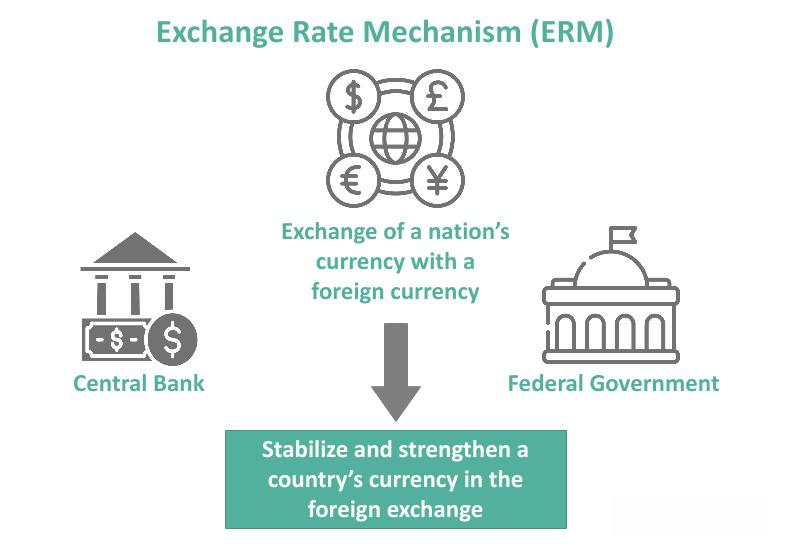

Forex trading represents one of the most dynamic and expansive areas of the financial world, where traders buy and sell currencies in a market that operates 24 hours a day across different time zones. This continuous trading environment poses both opportunities and challenges. Economic indicators, geopolitical events, and market psychology all influence currency values, making it crucial for traders to stay informed and responsive.

In recent years, the integration of algorithmic trading has significantly transformed forex trading. This innovation leverages sophisticated computer algorithms to automate and optimize trading processes, shifting the landscape from human intuition-based trading to data-driven decision-making. Algorithmic trading in forex involves using pre-defined rules and complex mathematical models to execute trades with speed and precision that surpasses traditional methods.



The purpose of this article is to examine forex trading and algorithmic trading extensively. It will highlight their interactions and the impact on modern currency trading, providing insights into how technological advances continue to shape the future of financial markets. As the forex market and trading technology evolve, staying informed on these developments becomes essential for traders aiming to maintain a competitive edge.

## Table of Contents

## Understanding the Forex Market

The foreign exchange market, often abbreviated as forex or [FX](/wiki/fx-anomaly), is recognized as the world's largest and most liquid financial marketplace, with a daily trading volume exceeding $6 trillion as of 2021, according to the Bank for International Settlements. This immense market primarily involves the exchange of currencies between global financial institutions, corporations, governments, and individual traders, operating around the clock across different time zones.

Currency pairs form the cornerstone of forex trading, where the value of one currency is quoted against another. Popular pairs include the EUR/USD (Euro/US Dollar) and USD/JPY (US Dollar/Japanese Yen), which reflect the relative strength of one currency to another. The prices of these pairs are influenced by a myriad of factors, ranging from economic indicators like interest rates and inflation to political events such as elections or legislative changes, and social factors including market sentiment and geopolitical tensions.

Unlike centralized stock exchanges such as the New York Stock Exchange, the forex market is decentralized and operates over-the-counter (OTC). This means that trading does not occur on a centralized exchange but instead through a network of banks, brokers, and individual traders across the globe. The primary trading centers are located in London, New York, Tokyo, and Sydney, creating a 24-hour market that shifts as financial centers open and close.

This decentralized nature provides several advantages, such as increased [liquidity](/wiki/liquidity-risk-premium), greater flexibility in trading hours, and often lower transaction costs. However, it also introduces challenges like varying regulations and the potential for price discrepancies across different trading platforms.

Forex trading involves various participants, from retail traders speculating on short-term currency movements to multinational corporations hedging foreign exchange risk. Central banks also play a significant role, intervening in [forex](/wiki/forex-system) markets to stabilize or increase the value of their national currencies.

The forex market's vast, decentralized, and fluid nature makes it a complex yet attractive trading environment, deeply intertwined with global economic and political dynamics. As technology continues to advance, the ability to analyze and react to these factors in real-time becomes increasingly pivotal for traders and financial institutions alike.

## Basics of Algorithmic Trading

Algorithmic trading refers to the utilization of computer algorithms to automate trading activities based on predefined conditions. This approach employs complex mathematical models and statistical analysis to determine the optimal timing and execution of trades, outperforming human traders in both speed and frequency. 

The core components of [algorithmic trading](/wiki/algorithmic-trading) can be categorized into four main areas: strategy development, data analysis, execution, and risk management.

1. **Strategy Development**: This involves formulating specific trading strategies that the algorithm will execute. The strategies can be based on various indicators, such as moving averages, price trends, or statistical arbitrage. A common model might involve calculating the moving average of a security's price over a specific period and setting buy or sell signals when the actual price deviates from the moving average.

2. **Data Analysis**: Algorithmic trading heavily relies on analyzing massive datasets to identify patterns and trends. This analysis often requires historical market data and real-time updates, processed using machine learning and other computational methods. For example, a Python script utilizing libraries like NumPy or pandas can efficiently handle large datasets for backtesting strategies.

   ```python
   import pandas as pd

   # Example of loading historical data
   data = pd.read_csv('historical_prices.csv')

   # Calculate moving averages
   data['short_mavg'] = data['Close'].rolling(window=40, min_periods=1).mean()
   data['long_mavg'] = data['Close'].rolling(window=100, min_periods=1).mean()
   ```

3. **Execution**: Once a strategy is developed and data analysis is complete, execution refers to the precise carrying out of trades. Algorithms ensure trades are executed at the best possible prices and within milliseconds, reducing the impact of market fluctuations.

4. **Risk Management**: Integral to algorithmic trading is the ability to manage risks effectively. This involves setting stop-loss limits, diversifying portfolios, and continuously monitoring market conditions to adjust strategies as needed. Effective risk management helps protect against significant losses and ensures the algorithm adapts to volatile market situations.

Through these components, algorithmic trading not only optimizes the trading process but also minimizes the potential for human error and emotional decision-making, ensuring a more disciplined and consistent approach to market activities.

## The Intersection of Forex and Algo Trading

The integration of algorithmic trading into the forex markets profoundly enhances trading capabilities by increasing speed, precision, and efficiency. In the forex market, where the [volume](/wiki/volume-trading-strategy) of transactions and the speed of decision-making are paramount, algorithms provide a significant edge by automating processes and performing tasks that are unfeasible for human traders due to time and complexity constraints.

The ability of algorithms to process immense volumes of data quickly allows traders to identify trends and opportunities that may not be visible to the naked eye. By analyzing market conditions, economic indicators, and geopolitical news, algorithms generate insights and opportunities in real-time, which is crucial in the rapidly changing forex environment. For instance, an algorithm can monitor fluctuations in exchange rates and execute trades within milliseconds of detecting a profitable opportunity, far exceeding the response time of a human trader.

One of the key technological features of algorithmic trading is [backtesting](/wiki/backtesting). This involves running the algorithm against historical market data to evaluate its performance under various conditions. Backtesting helps traders refine their strategies, minimizing the likelihood of significant errors during live trading. Utilizing historical data to simulate trades allows for the assessment of the potential risks and rewards involved in a trading strategy. Python, a popular programming language in finance, offers various libraries such as PyAlgoTrade and Backtrader, which facilitate the development and testing of trading algorithms. An example of a simple backtesting script might look like this:

```python
import backtrader as bt

class TestStrategy(bt.Strategy):
    def __init__(self):
        self.dataclose = self.datas[0].close

    def next(self):
        if self.dataclose[0] > self.dataclose[-1]:
            if self.dataclose[-1] > self.dataclose[-2]:
                self.buy()

cerebro = bt.Cerebro()
cerebro.addstrategy(TestStrategy)
data = bt.feeds.YahooFinanceData(dataname='EURUSD=X', fromdate=datetime(2020, 1, 1), todate=datetime(2021, 1, 1))
cerebro.adddata(data)
cerebro.broker.setcash(1000.0)
cerebro.run()
```

This script examines historical data of the EUR/USD currency pair, executing a basic strategy where a buy order is placed if the closing price today is greater than the previous two days. Through backtesting, traders obtain feedback on the strategy’s effectiveness before deploying it in the live market.

In summary, the intersection of algorithmic trading with forex markets provides substantial advancements in terms of speed, accuracy, and data processing capabilities. By leveraging computational power, traders can respond to market conditions more effectively and devise strategies anchored in empirical data, enhancing the overall quality of trading operations.

## Advantages of Forex Algorithmic Trading

Algorithmic trading offers several distinct advantages in the forex market, fundamentally enhancing the trading experience by streamlining processes and removing human biases. One of the primary benefits is the elimination of emotions from trading decisions. Human traders are often influenced by psychological factors such as fear and greed, which can lead to impulsive decision-making and inconsistency. By automating trades, algorithmic trading ensures that each decision is made based on predefined conditions and rationale, leading to a more disciplined and systematic approach. 

The precision with which algorithmic trading executes trades is another critical advantage. Algorithms are capable of assessing multiple market parameters in real-time, allowing them to identify optimal entry and [exit](/wiki/exit-strategy) points with remarkable accuracy. This precision reduces transaction costs by minimizing slippage, which is the difference between the expected price of a trade and the actual price at which the trade is executed. Slippage can significantly impact trading profitability, especially in a fast-moving environment like forex; thus, minimizing it is a substantial benefit.

Moreover, algorithmic trading enables continuous operation, offering traders the ability to capitalize on market opportunities as they arise. In the forex market, which operates 24 hours a day due to its global nature, being able to monitor and respond to market changes around the clock is vital. Automated systems can execute trades at any time, without breaks or the need for human intervention, ensuring that traders do not miss out on potentially lucrative movements.

The combination of discipline, precision, and continuous operation provided by algorithmic trading makes it a powerful tool in the forex market, enabling traders to optimize their strategies and improve their overall trading performance.

## Common Pitfalls and Risks

Over-optimization, frequently referred to as curve-fitting, is a significant risk in algorithmic trading strategies. This occurs when a trading algorithm is excessively tailored to historical data, creating a strategy that seems unbeatable in past scenarios but performs poorly in live trading environments. The danger lies in designing a strategy that perfectly captures past noise or anomalies, which are not indicative of future market conditions. To evaluate the robustness of an algorithm and prevent over-optimization, traders can employ cross-validation techniques or use out-of-sample testing, ensuring the strategy is tested on data not used in the optimization process.

Technological failures pose another serious risk. Algorithmic trading depends heavily on technological infrastructure for execution. Any failure, such as hardware malfunctions or software bugs, can result in significant financial losses if the system executes trades incorrectly or incompletely. Connectivity issues compound these risks, particularly in the high-speed world of forex trading, where even milliseconds of delay can affect the outcome of a trade. Trading firms often implement redundancies, such as backup servers and multiple internet connections, to mitigate these risks.

Market [volatility](/wiki/volatility-trading-strategies) is an inherent characteristic of the forex market, which can challenge the viability of algorithmic strategies. Algorithms typically rely on specific patterns and assumptions about market behavior that may not hold in highly volatile conditions. Volatile markets can lead to rapid and unpredictable price movements, rendering static models ineffective and causing algorithms to generate misguided trading signals. Therefore, it's crucial for algorithmic traders to incorporate volatility adjustments and conduct stress tests under extreme market conditions to understand potential vulnerabilities.

In summary, while algorithmic trading offers numerous benefits, it is essential to manage the associated risks comprehensively. Through rigorous testing and preparation, traders can aim to minimize the impact of these common pitfalls, striving for a balanced approach that leverages technology while acknowledging its limitations.

## Future of Forex Algo Trading

Continued advancements in [artificial intelligence](/wiki/ai-artificial-intelligence) (AI) and [machine learning](/wiki/machine-learning) (ML) are poised to significantly enhance the capabilities of forex algorithmic trading systems. AI and ML technologies provide predictive analytics and sophisticated data processing capabilities, which enable algorithms to adapt and improve over time. By leveraging these technologies, trading systems can analyze complex market data to recognize emerging patterns and trends, thus enhancing decision-making processes.

The proliferation of high-frequency trading ([HFT](/wiki/high-frequency-trading-strategies)) is another area contributing to the evolution of forex algorithmic trading. HFT utilizes powerful computing power to execute a large number of orders at extremely high speeds, often in fractions of a second. This allows traders to capitalize on minimal price movements with precision and speed unattainable by human traders. High-frequency trading strategies rely heavily on big data analytics to gather insights from vast amounts of market data, leading to quicker and more informed trade executions.

Big data analytics plays a crucial role in providing deeper market insights, allowing algorithms to process millions of data points ranging from historical price data to current market news and economic indicators. This information is vital for making predictions and adjusting trading strategies in real time. The use of advanced data analytics tools enables traders to gain a competitive edge by responding swiftly to changing market conditions.

Moreover, the rise of cryptocurrencies has introduced new dimensions to algorithmic trading in the forex markets. Cryptocurrencies, known for their volatility and unique market behaviors, present fresh opportunities and challenges for algorithmic strategies. Algorithms designed for traditional forex may need modifications to accommodate the fast-paced and round-the-clock trading environment of digital currencies. As such, traders can develop specialized strategies to manage the risks and capitalize on the opportunities presented by [cryptocurrency](/wiki/cryptocurrency) markets.

In summary, ongoing developments in AI, ML, high-frequency trading, big data analytics, and the expanding cryptocurrency market signify a future rich with opportunities for forex algorithmic trading. Traders who can harness these technologies will be better equipped to navigate the evolving landscape of modern currency trading.

## Conclusion

Forex algorithmic trading stands as a robust mechanism that enhances the efficiency of currency trading through automation and precision. By leveraging computational algorithms, it bridges the gap between traditional trading practices and modern technological innovations, enabling traders to execute strategies with improved speed and accuracy.

Implementing algorithmic trading in forex offers substantial advantages. Notably, it minimizes emotional interference, fostering a more disciplined and consistent trading approach. The automation of trade executions helps reduce slippage—inefficiencies that occur between the expected price of a trade and the actual price—thus optimizing entry and exit points in the market.

Nonetheless, successful use of algorithmic trading necessitates a comprehensive understanding of both the technical components and the forex market dynamics. Developing robust strategies requires careful risk management to mitigate potential pitfalls like over-optimization and connectivity issues. Traders must continuously test and refine their algorithms to ensure reliability and performance under varying market conditions.

As the landscape of financial markets continues to evolve, staying informed about technological advancements is critical. Emerging technologies such as artificial intelligence and machine learning are likely to further transform algorithmic trading systems, offering enhanced data insights and faster processing capabilities. Additionally, the increasing prevalence of cryptocurrencies introduces new complexities and opportunities for algorithmic strategies, demanding continual adaptability from traders.

In conclusion, while the potential of forex algorithmic trading is vast, achieving its benefits requires a strategic approach underpinned by knowledge, prudent risk management, and technological adaptability. Keeping pace with advancements and understanding market changes will be essential for traders aiming to capitalize on the full potential of algorithmic systems in forex trading.

## References & Further Reading

[1]: ["Forex Trading Guide: Forex Course Get Insights Into Successful Trading"](https://www.investopedia.com/articles/forex/11/why-trade-forex.asp) by Richard Lee

[2]: Carrion, A. (2013). ["Very Fast Money: High Frequency Trading on the NASDAQ."](https://www.sciencedirect.com/science/article/pii/S138641811300027X) The Journal of Finance, 68(4), 1735–1746.

[3]: Narang, R. K. (2013). ["Inside the Black Box: A Simple Guide to Quantitative and High Frequency Trading."](https://onlinelibrary.wiley.com/doi/book/10.1002/9781118662717) John Wiley & Sons.

[4]: ["Algorithmic Trading & DMA: An Introduction to Direct Access Trading Strategies"](https://www.amazon.com/Algorithmic-Trading-DMA-introduction-strategies/dp/0956399207) by Barry Johnson

[5]: Pojarliev, M., and Levich, R. (2010). ["A New Look at Currency Investing."](https://rpc.cfainstitute.org/-/media/documents/book/rf-publication/2012/rf-v2012-n4-1-pdf.pdf) CFA Institute Research Foundation.

[6]: Aldridge, I. (2013). ["High-Frequency Trading: A Practical Guide to Algorithmic Strategies and Trading Systems."](https://books.google.com/books/about/High_Frequency_Trading.html?id=8QpIsVUMhmEC) John Wiley & Sons.

[7]: Chaboud, A. P., Chiquoine, B., Hjalmarsson, E., & Vega, C. (2014). ["Rise of the Machines: Algorithmic Trading in the Foreign Exchange Market."](https://papers.ssrn.com/sol3/papers.cfm?abstract_id=1501135) The Review of Economic Studies, 81(1), 270–299.