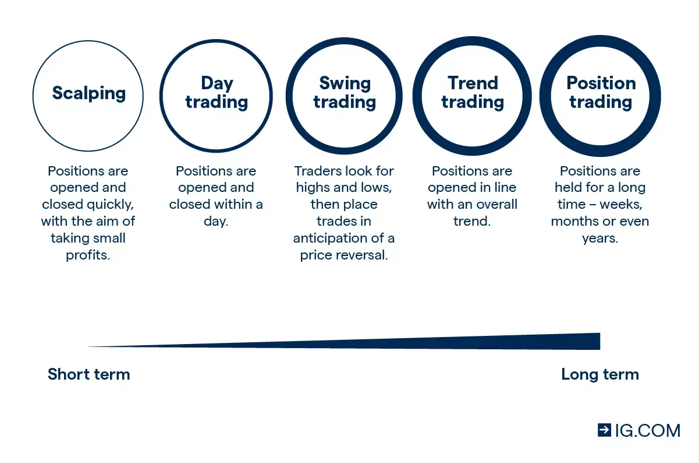

## Table of Contents

## What is currency trading?

Currency trading, also known as forex trading, is the act of buying and selling different currencies to make a profit. People trade currencies because the value of one currency compared to another can change over time. For example, if you think the US dollar will become stronger compared to the Euro, you might buy dollars with Euros. If the dollar does become stronger, you can then sell those dollars back for more Euros than you started with, making a profit.

This type of trading happens all over the world and can be done 24 hours a day during the weekdays. It's done by banks, big companies, governments, and even regular people. The most common way to trade currencies is through a forex broker, which is a company that helps you buy and sell currencies. It's important to understand that currency trading can be risky because the values of currencies can be very unpredictable.

## How does the foreign exchange market work?

The foreign exchange market, often called the forex market, is where people and organizations trade different currencies. It's the biggest financial market in the world, with lots of money changing hands every day. The main goal is to buy a currency when it's cheap and sell it when it's more expensive to make a profit. People use the forex market for many reasons, like when companies need to pay for things in another country or when investors want to make money from changes in currency values.

The [forex](/wiki/forex-system) market works all the time during the week, from Monday to Friday. It doesn't have one big place where everyone meets to trade; instead, it's all done through computers and phones around the world. The price of one currency compared to another can change because of things like interest rates, how well a country's economy is doing, or even big news events. Traders watch these things closely to decide when to buy or sell. It's important to know that trading currencies can be risky because the prices can go up and down a lot, and you might lose money.

## What are the main types of currency trading?

There are two main types of currency trading: spot trading and forward trading. Spot trading is when you buy or sell a currency right away at the current price. It's called "spot" because the trade happens on the spot, or very quickly. Most people who trade currencies do spot trading because it's simple and fast. You can do it online through a forex broker.

Forward trading is different because you agree to buy or sell a currency at a certain price in the future. This can be useful if you want to protect yourself from big changes in currency prices. For example, if you know you'll need to buy Euros in six months, you can use forward trading to lock in the price now. This way, even if the price of Euros goes up, you won't have to pay more. Forward trading is often used by businesses and investors who need to plan ahead.

## What are the basic terms used in currency trading?

In currency trading, there are some basic terms you need to know. The first one is a 'currency pair,' which means you're trading one currency for another. For example, if you're trading US dollars for Euros, you're dealing with the EUR/USD pair. The first currency in the pair is called the 'base currency,' and the second one is the 'quote currency.' The price you see is how much of the quote currency you need to buy one unit of the base currency. Another important term is 'pip,' which stands for 'percentage in point.' A pip is a small change in the value of a currency pair, and it's how traders measure profits or losses.

Another term you'll hear a lot is 'leverage.' This means you can trade with more money than you actually have, but it can be risky because you could lose more money too. 'Margin' is related to leverage; it's the money you need to put up to open a trade. 'Bid' and 'ask' prices are also key. The 'bid' price is what someone is willing to pay to buy the currency pair, while the 'ask' price is what someone is willing to sell it for. The difference between these two prices is called the 'spread,' and it's how brokers make money. Understanding these terms can help you get started with currency trading.

## How can someone start trading currencies?

To start trading currencies, the first thing you need to do is choose a forex broker. A broker is a company that helps you buy and sell currencies. You can find brokers online, and it's a good idea to pick one that is trusted and has low fees. Once you've chosen a broker, you'll need to open an account with them. This usually involves filling out some forms and maybe sending some documents to prove who you are. After your account is set up, you'll need to put some money into it. This money is called your trading capital, and you'll use it to make trades.

Once you have your account ready and funded, you can start trading. Most brokers have a platform where you can see the prices of different currency pairs and make trades. You'll need to decide which currency pair you want to trade, like the EUR/USD, and then decide if you want to buy or sell it. If you think the price of the base currency will go up, you'll buy it. If you think it will go down, you'll sell it. Remember, trading currencies can be risky, so it's a good idea to learn as much as you can and maybe start with a small amount of money until you get the hang of it.

## What are the risks involved in currency trading?

Currency trading can be risky because the value of currencies can change a lot and quickly. This means you could lose money if the currency you bought goes down in value. Also, many traders use something called leverage, which lets you trade with more money than you have. This can make your profits bigger, but it can also make your losses bigger. If the market moves against you, you could lose more money than you put in.

Another risk is that the forex market can be affected by things you can't predict, like news events or changes in a country's economy. These things can cause big changes in currency prices, and it's hard to know when they will happen. Also, not all forex brokers are trustworthy. Some might charge high fees or not give you the best prices, which can eat into your profits. It's important to do your research and pick a good broker to help lower these risks.

## What strategies can be used to manage risk in currency trading?

To manage risk in currency trading, one good strategy is to use something called stop-loss orders. A stop-loss order is like a safety net. It tells your broker to sell a currency if it drops to a certain price. This way, you can limit how much money you might lose if the market moves against you. Another strategy is to not use too much leverage. Leverage can make your profits bigger, but it can also make your losses bigger. If you use less leverage, you might make less money, but you won't lose as much if things go wrong.

Another way to manage risk is to spread your money around. Instead of putting all your money into one currency pair, you can trade different pairs. This is called diversification, and it can help protect you because if one currency goes down, the others might not. It's also a good idea to keep learning and staying updated on what's happening in the world. News and events can change currency prices, so knowing what's going on can help you make better trading decisions. By using these strategies, you can try to keep your risks lower while still trying to make money from currency trading.

## How do economic indicators affect currency values?

Economic indicators are like clues that tell us how a country's economy is doing. Things like the unemployment rate, inflation, and how much stuff a country is making can affect how strong or weak its currency is. For example, if a country has a low unemployment rate and is making a lot of stuff, people might think its economy is doing well. This can make its currency stronger because more people want to buy it. On the other hand, if a country's economy is not doing so well, its currency might become weaker because people don't want to buy it as much.

Interest rates set by a country's central bank are another big [factor](/wiki/factor-investing). If a country raises its interest rates, it can make its currency more attractive to investors because they can earn more money by putting their money there. This can make the currency stronger. But if a country lowers its interest rates, it might make its currency less attractive, and the currency could become weaker. So, economic indicators are really important because they can tell traders and investors a lot about what might happen to currency values in the future.

## What is the role of central banks in currency markets?

Central banks play a big role in currency markets. They are like the bosses of a country's money. One of the main things they do is set interest rates. When a central bank raises interest rates, it can make the country's currency more attractive to people who want to invest their money. They can earn more from their investments, so they buy more of that currency. This can make the currency stronger. On the other hand, if the central bank lowers interest rates, the currency might become less attractive, and it could get weaker.

Central banks also sometimes buy or sell their own currency in the market to control its value. If they think their currency is too weak, they might sell other currencies and buy their own to make it stronger. If they think it's too strong, they might do the opposite. This is called intervening in the market. Besides that, central banks release economic reports and make announcements that traders and investors watch closely. These reports and announcements can give clues about what the central bank might do next, and this can affect how people trade currencies. So, central banks have a lot of power over what happens in the currency markets.

## How does leverage work in currency trading?

Leverage in currency trading is like borrowing money to make bigger trades. Imagine you have $1,000 to trade with. Normally, you could only buy $1,000 worth of a currency. But with leverage, you can borrow more money from your broker to make a bigger trade. If the broker gives you 100:1 leverage, you can trade with $100,000 even though you only have $1,000. This can make your profits bigger if the trade goes your way, but it can also make your losses bigger if it doesn't.

Using leverage is risky because you can lose more money than you put in. If the market moves against you, you might have to pay back the money you borrowed even if you lost all your own money. That's why it's important to use leverage carefully. Some traders choose to use less leverage to keep their risks lower, even if it means their potential profits are smaller. Understanding how leverage works and using it wisely can help you manage the risks in currency trading.

## What advanced trading techniques can improve profitability?

One advanced trading technique that can help improve profitability is using technical analysis. This means looking at charts and using special tools to try to predict where currency prices might go next. Traders often use things like moving averages, which show the average price of a currency over time, or the Relative Strength Index (RSI), which tells you if a currency is overbought or oversold. By studying these patterns and indicators, traders can make better guesses about when to buy or sell a currency. This can help them make more money if they get it right, but it takes a lot of practice and learning to use these tools well.

Another technique is called [scalping](/wiki/gamma-scalping). Scalping is when traders make a lot of small trades in a short amount of time, trying to make small profits from tiny changes in currency prices. They might hold onto a trade for just a few minutes or even seconds. Scalpers need to be very quick and good at watching the market because they're trying to catch small price movements. This technique can be profitable if you're good at it, but it's also risky because you need to make a lot of good trades to make up for any losses. Both technical analysis and scalping need a lot of focus and skill, but they can help traders do better in the currency markets.

## How can algorithmic trading be applied to currency trading?

Algorithmic trading in currency trading means using computer programs to buy and sell currencies automatically. These programs, or algorithms, follow a set of rules that traders write. The rules can be based on things like price movements, economic data, or even news events. When the rules are met, the algorithm makes trades without the trader having to do anything. This can be really helpful because computers can look at a lot of information very quickly and make trades faster than a person could.

One big advantage of using [algorithmic trading](/wiki/algorithmic-trading) is that it can help remove emotions from trading. Sometimes, people make bad trading decisions because they get too excited or too scared. But a computer doesn't feel emotions, so it just follows the rules you set. This can lead to more consistent trading and possibly better results. However, setting up these algorithms can be tricky and needs a good understanding of both trading and computer programming. If done right, algorithmic trading can help traders make more money and manage their risks better in the fast-moving world of currency trading.

## References & Further Reading

[1]: ["Forex Trading Guide: Forex Course Get Insights Into Successful Trading"](https://www.investopedia.com/articles/forex/11/why-trade-forex.asp) by Richard Lee

[2]: Carrion, A. (2013). ["Very Fast Money: High Frequency Trading on the NASDAQ."](https://www.sciencedirect.com/science/article/pii/S138641811300027X) The Journal of Finance, 68(4), 1735–1746.

[3]: Narang, R. K. (2013). ["Inside the Black Box: A Simple Guide to Quantitative and High Frequency Trading."](https://onlinelibrary.wiley.com/doi/book/10.1002/9781118662717) John Wiley & Sons.

[4]: ["Algorithmic Trading & DMA: An Introduction to Direct Access Trading Strategies"](https://www.amazon.com/Algorithmic-Trading-DMA-introduction-strategies/dp/0956399207) by Barry Johnson

[5]: Pojarliev, M., and Levich, R. (2010). ["A New Look at Currency Investing."](https://rpc.cfainstitute.org/-/media/documents/book/rf-publication/2012/rf-v2012-n4-1-pdf.pdf) CFA Institute Research Foundation.

[6]: Aldridge, I. (2013). ["High-Frequency Trading: A Practical Guide to Algorithmic Strategies and Trading Systems."](https://books.google.com/books/about/High_Frequency_Trading.html?id=8QpIsVUMhmEC) John Wiley & Sons.

[7]: Chaboud, A. P., Chiquoine, B., Hjalmarsson, E., & Vega, C. (2014). ["Rise of the Machines: Algorithmic Trading in the Foreign Exchange Market."](https://papers.ssrn.com/sol3/papers.cfm?abstract_id=1501135) The Review of Economic Studies, 81(1), 270–299.