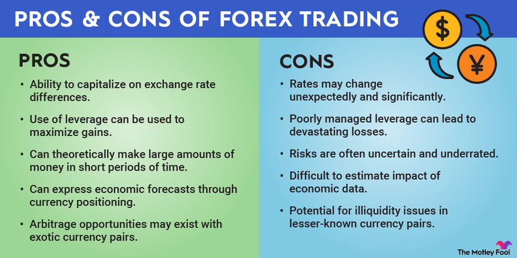

## Table of Contents

## What is a currency trading platform?

A currency trading platform is a type of software that helps people buy and sell different kinds of money from around the world. It's like a big online marketplace where you can trade one country's money for another's. These platforms are used by people who want to make money by guessing how the value of different currencies will change over time.

These platforms usually have tools that show you the current prices of different currencies and charts that help you understand how these prices have changed in the past. They also let you set up orders to buy or sell money automatically when it reaches a certain price. This can be helpful if you want to trade without watching the market all the time.

## How do currency trading platforms work?

Currency trading platforms are like online shops where you can trade different countries' money. When you use a platform, you can see how much one currency is worth compared to another. For example, you might see that one US dollar is worth about 0.85 euros. If you think the euro will become more valuable compared to the dollar, you can buy euros with your dollars. If the euro's value goes up, you can sell your euros back for more dollars than you started with, making a profit.

These platforms also have tools to help you make smart trades. They show you charts and graphs that tell you how the prices of different currencies have changed over time. This can help you guess what might happen next. You can also set up automatic orders, which means the platform will buy or sell for you when the price reaches a level you choose. This is useful if you can't watch the market all the time. By using these tools, you can try to make money by trading currencies.

## What are the basic features to look for in a currency trading platform?

When looking for a currency trading platform, it's important to find one that has a user-friendly interface. This means the platform should be easy to use and understand, even if you're new to trading. It should show you the current prices of different currencies clearly and let you make trades without too much hassle. A good platform will also have tools like charts and graphs that help you see how currency prices have changed over time. These tools can help you make better guesses about what might happen next.

Another key feature to look for is the ability to set up automatic orders. This means you can tell the platform to buy or sell a currency for you when it reaches a certain price, even if you're not watching the market. This can be really helpful if you have other things to do and can't always keep an eye on your trades. Also, make sure the platform is safe and secure. It should protect your money and personal information from being stolen. A reliable platform will have strong security measures in place to keep your trades and data safe.

## Can you list some popular currency trading platforms for beginners?

For beginners, some popular currency trading platforms are easy to use and have lots of helpful tools. One of these is MetaTrader 4 (MT4). MT4 is well-known because it's simple to understand and has a lot of features that can help you learn about trading. It shows you charts and graphs that make it easier to see how currency prices change over time. Another good platform for beginners is eToro. eToro is great because it lets you copy what other successful traders are doing, which can be a big help when you're just starting out.

Another platform that beginners might like is Plus500. Plus500 has a clean and easy-to-use interface that makes trading less confusing. It also has a lot of educational resources to help you learn more about trading. If you're looking for a platform with a strong focus on customer support, you might want to try out IG. IG is known for its helpful customer service team, which can answer your questions and guide you through the trading process.

These platforms are all good choices for beginners because they offer user-friendly experiences and helpful tools. Whether you choose MT4, eToro, Plus500, or IG, you'll find features that can make your first steps in currency trading easier and more enjoyable.

## What are the advantages of using a currency trading platform?

Using a currency trading platform has many benefits. One big advantage is that these platforms make it easy for you to buy and sell different kinds of money from around the world. They show you the current prices of currencies clearly and let you trade with just a few clicks. This can save you a lot of time and effort compared to doing everything on your own. Plus, these platforms often have tools like charts and graphs that help you understand how currency prices change over time. This can make it easier for you to make smart trading decisions.

Another advantage is that currency trading platforms often let you set up automatic orders. This means you can tell the platform to buy or sell a currency for you when it reaches a certain price, even if you're not watching the market. This is really helpful if you have other things to do and can't always keep an eye on your trades. Also, many platforms have educational resources and customer support to help you learn more about trading. This can be especially useful if you're new to trading and want to improve your skills.

## What are the potential disadvantages or risks associated with currency trading platforms?

Using a currency trading platform can be risky because the value of money from different countries can change a lot. If you guess wrong about how the value of a currency will change, you could lose money instead of making it. This is called market risk. Also, some platforms might not be very safe. If the platform doesn't have good security, someone might steal your money or personal information. This is called security risk. It's important to choose a platform that is safe and secure to protect yourself.

Another risk is that trading can be hard to understand, especially for beginners. Even with all the tools and charts that platforms provide, it can still be tricky to make good guesses about how currency prices will move. This can lead to mistakes and losses. Plus, some platforms might charge you fees for trading or keeping your money with them. These fees can add up and eat into your profits. So, it's a good idea to read about the fees before you start trading.

## How do advanced trading tools on currency trading platforms benefit experienced traders?

Advanced trading tools on currency trading platforms help experienced traders by giving them more ways to analyze the market and make smart trades. These tools include things like technical indicators, which are special calculations that help traders see patterns and trends in currency prices. Experienced traders can use these indicators to predict what might happen next and make better trading decisions. They can also use tools like backtesting, where they test their trading strategies on past data to see how well they would have worked. This helps them fine-tune their strategies before using them in real trading.

Another way these tools help experienced traders is by letting them automate their trading. Many platforms have features like algorithmic trading, where traders can set up computer programs to buy and sell currencies based on certain rules. This can save a lot of time and help traders take advantage of market opportunities even when they're not watching the market. Also, advanced charting tools give experienced traders a deeper look at how currency prices are moving, helping them spot opportunities that others might miss. Overall, these tools give experienced traders more control and flexibility, making their trading more effective and potentially more profitable.

## What should be considered when choosing a currency trading platform for professional trading?

When choosing a currency trading platform for professional trading, it's important to think about the platform's reliability and speed. Professionals need a platform that works well all the time and can handle a lot of trades quickly. If the platform is slow or crashes often, it could cost you money. Also, the platform should have strong security to keep your money and information safe. You don't want to lose your money because of a security breach. So, make sure to choose a platform that is known for being reliable, fast, and secure.

Another thing to consider is the platform's features and tools. Professional traders need advanced tools like technical indicators, backtesting, and algorithmic trading to help them make smart decisions and automate their trades. These tools can give you an edge in the market and help you manage your trades better. Also, check if the platform has good customer support. If you run into problems, you'll want help from people who know what they're doing. A platform with a lot of helpful features and good support can make your professional trading easier and more successful.

## How do regulatory requirements impact the choice of currency trading platforms?

Regulatory requirements are really important when choosing a currency trading platform. Different countries have rules about who can trade and how they can trade. A good platform will follow these rules to keep you safe and make sure your trades are fair. If you choose a platform that doesn't follow the rules, you might get in trouble or lose your money. So, it's a good idea to pick a platform that is approved by a trusted regulator in your country or region.

Regulations can also affect what features a platform has. Some platforms might not offer certain tools or trading options because of the rules they have to follow. This can be important if you need specific tools for your trading strategy. Also, regulated platforms often have to keep your money in separate accounts to protect it if the platform has financial problems. This can give you peace of mind knowing your money is safe. So, when choosing a platform, make sure it meets the regulatory standards that apply to you.

## What are the differences between various types of currency trading platforms (e.g., ECN, STP, Market Maker)?

There are different types of currency trading platforms, like ECN, STP, and Market Maker. An ECN (Electronic Communication Network) platform connects traders directly to other traders and to the interbank market. This means you can see real-time prices from different sources and trade with other traders or big banks. ECN platforms usually have lower fees but might need a bigger account to start trading. An STP (Straight Through Processing) platform is similar to ECN but might also send your trades to a liquidity provider. This can make trading faster and more efficient, but the fees might be a bit higher than ECN.

A Market Maker platform is different because it doesn't connect you directly to other traders or the interbank market. Instead, the platform itself acts as the buyer or seller for your trades. This can make it easier to trade because there's always someone to trade with, but the platform might make money by setting the prices a bit differently. Market Maker platforms often have lower account minimums and can be good for beginners, but you might pay more in fees or get worse prices compared to ECN or STP platforms. Each type of platform has its own benefits and drawbacks, so it's important to choose one that fits your trading needs and style.

## How can one optimize the use of currency trading platforms for algorithmic trading?

To optimize the use of currency trading platforms for algorithmic trading, it's important to choose a platform that supports advanced trading tools like algorithmic trading. Look for platforms that let you use programming languages like MQL4 or MQL5, which are common in the trading world. These languages help you write code that tells the platform when to buy or sell currencies based on certain rules you set. Also, make sure the platform has a good backtesting feature. Backtesting lets you test your trading strategies on past data to see how well they would have worked. This can help you fine-tune your strategies before using them in real trading, saving you time and money.

Another way to optimize algorithmic trading is by using the platform's charting and technical analysis tools. These tools can give you a deeper look at how currency prices move, helping you spot patterns and trends that you can use in your trading algorithms. Also, consider the platform's speed and reliability. Algorithmic trading often depends on quick and accurate data, so you want a platform that can handle a lot of trades without slowing down or crashing. By choosing the right platform and using its tools effectively, you can make your algorithmic trading more successful and efficient.

## What future trends are expected to influence the development of currency trading platforms?

In the future, currency trading platforms are likely to get even better with new technology. One big trend is the use of artificial intelligence (AI) and machine learning. These technologies can help platforms analyze a lot of data really fast and make smart guesses about how currency prices will change. This can make trading easier and more accurate for people using the platforms. Also, more platforms might start using blockchain technology. Blockchain can make trading safer and more transparent because it keeps a record of all trades that can't be changed. This could help prevent fraud and make people feel more confident about trading.

Another trend is the growing use of mobile trading. More and more people are using their phones to trade, so platforms will need to make their apps better and easier to use. This means we might see platforms with simpler designs and faster ways to make trades on the go. Also, regulations around the world might change, and platforms will need to keep up with these changes to stay safe and legal. Overall, these trends will make currency trading platforms more advanced, safer, and easier to use for everyone.

## References & Further Reading

[1]: Bergstra, J., Bardenet, R., Bengio, Y., & Kégl, B. (2011). ["Algorithms for Hyper-Parameter Optimization."](https://papers.nips.cc/paper/4443-algorithms-for-hyper-parameter-optimization) Advances in Neural Information Processing Systems 24.

[2]: ["Advances in Financial Machine Learning"](https://www.amazon.com/Advances-Financial-Machine-Learning-Marcos/dp/1119482089) by Marcos Lopez de Prado

[3]: ["Evidence-Based Technical Analysis: Applying the Scientific Method and Statistical Inference to Trading Signals"](https://www.amazon.com/Evidence-Based-Technical-Analysis-Scientific-Statistical/dp/0470008741) by David Aronson

[4]: ["Machine Learning for Algorithmic Trading"](https://github.com/stefan-jansen/machine-learning-for-trading) by Stefan Jansen

[5]: ["Quantitative Trading: How to Build Your Own Algorithmic Trading Business"](https://www.amazon.com/Quantitative-Trading-Build-Algorithmic-Business/dp/1119800064) by Ernest P. Chan