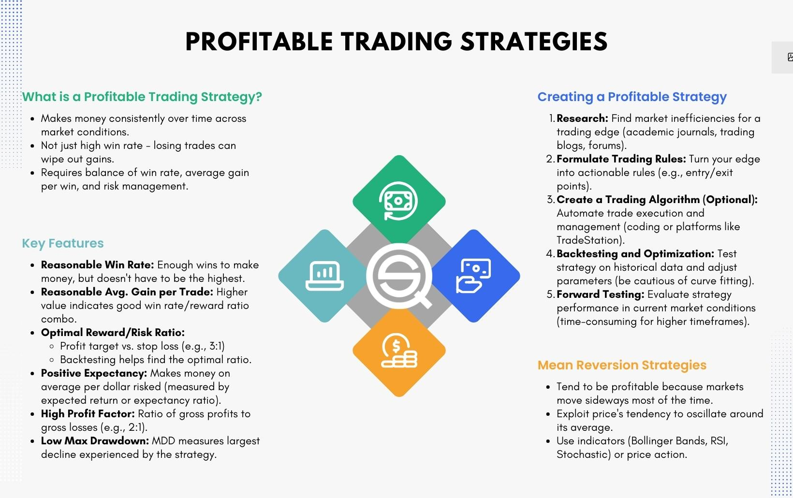

## Table of Contents

## What is currency trading and how does it work?

Currency trading, also known as forex trading, is the act of buying and selling different currencies to make a profit. People trade currencies because their values change over time. For example, if you think the value of the US dollar will go up compared to the Euro, you might buy dollars with Euros. If the dollar does go up in value, you can then sell your dollars back for more Euros than you started with, making a profit.

The forex market is the largest financial market in the world, with trading happening 24 hours a day, five days a week. It's different from stock markets because it doesn't have a central location. Instead, trading happens electronically over-the-counter (OTC), which means that transactions are made directly between two parties without a central exchange. Most trading is done through brokers, who provide platforms where traders can buy and sell currencies. These platforms show the current exchange rates and allow traders to make their trades quickly and easily.

## What are the basic principles of forex trading profitability?

The first basic principle of forex trading profitability is understanding the concept of exchange rates. Exchange rates tell you how much one currency is worth in terms of another. If you think a currency will go up in value, you buy it. If you think it will go down, you sell it. The goal is to buy low and sell high. The difference between the buying and selling price is your profit. It's important to keep an eye on economic news and events because they can change how people think about a currency's value.

The second principle is managing risk. Forex trading can be risky because the market can be very unpredictable. To manage this risk, traders use tools like stop-loss orders, which automatically sell a currency if its value drops to a certain level. This can help limit how much money you lose. Another tool is leverage, which lets you trade with more money than you actually have. While leverage can increase your profits, it can also increase your losses, so it's important to use it carefully. Successful traders always think about how to protect their money as much as how to make more of it.

## How can a beginner start trading currencies profitably?

Starting to trade currencies can feel a bit scary at first, but it's easier if you take it step by step. First, you need to learn the basics. Understand what currencies are, how they change in value, and what makes them go up or down. You can find lots of free information online, like articles and videos, that explain these things in simple terms. Once you feel ready, open a demo account with a [forex](/wiki/forex-system) broker. A demo account lets you practice trading with fake money, so you can get used to how the trading platform works and try out different strategies without risking real money. This is a safe way to learn and make mistakes without losing anything.

After you've practiced and feel more confident, you can start trading with real money. Begin with a small amount that you can afford to lose. Remember, forex trading can be risky, so it's important to be careful. Set clear goals for what you want to achieve and stick to a trading plan. This plan should include when to buy and sell currencies, how much money you're willing to risk on each trade, and how you'll manage your money. It's also a good idea to keep learning and stay updated on what's happening in the world, because economic news can affect currency values. Over time, as you gain more experience and learn from your trades, you can start to make more profitable decisions.

## What are the most common currency pairs to trade for beginners?

For beginners, the most common currency pairs to trade are called the "majors." These are pairs that include the US dollar because it's the world's most traded currency. The most popular major pairs are the EUR/USD (Euro/US Dollar), USD/JPY (US Dollar/Japanese Yen), and GBP/USD (British Pound/US Dollar). These pairs are good for beginners because they are very liquid, which means there are lots of people trading them, so it's easy to buy and sell. They also have smaller spreads, which is the difference between the buying and selling price, so it's cheaper to trade them.

Another group of currency pairs that beginners might want to try are the "minors" or "crosses." These are pairs that don't include the US dollar. Examples include EUR/GBP (Euro/British Pound) and AUD/NZD (Australian Dollar/New Zealand Dollar). These pairs can be a bit less liquid than the majors, but they are still popular and can be good for beginners who want to try something different. It's a good idea to start with the majors and then move to the minors as you get more comfortable with trading.

## What technical analysis tools are essential for profitable trading?

Technical analysis tools are really helpful for figuring out when to buy and sell currencies. One of the most important tools is the moving average. It's a line on a chart that shows the average price of a currency over a certain time. Traders use it to see if the price is going up or down. If the price is above the moving average, it might be a good time to buy. If it's below, it might be a good time to sell. Another useful tool is the Relative Strength Index (RSI). It shows if a currency is overbought or oversold. If the RSI is over 70, the currency might be overbought, and it could be time to sell. If it's under 30, it might be oversold, and it could be time to buy.

Another essential tool is the support and resistance levels. These are like invisible lines on the chart where the price often stops and turns around. If the price keeps bouncing off a certain level, that's called support. If it keeps getting stopped at a higher level, that's called resistance. Traders use these levels to decide when to enter or [exit](/wiki/exit-strategy) a trade. For example, if the price is getting close to a resistance level, a trader might sell, expecting the price to go back down. Chart patterns are also important. Patterns like the head and shoulders or triangles can show if the price might go up or down. By learning to spot these patterns, traders can make better guesses about what the market will do next.

## How does fundamental analysis impact currency trading profitability?

Fundamental analysis looks at the big picture of why a currency's value might change. It involves studying things like a country's economy, its interest rates, and even big news events. For example, if a country's economy is doing well, its currency might go up in value because more people want to invest there. On the other hand, if a country is having problems, like high unemployment or inflation, its currency might go down. Traders use this information to guess where a currency's value might be headed. By understanding these big factors, traders can make smarter decisions about when to buy or sell a currency.

Using [fundamental analysis](/wiki/fundamental-analysis) can really help traders make more profitable trades. For instance, if a trader knows that a country's central bank is about to raise interest rates, they might buy that country's currency because higher interest rates often make a currency more valuable. Also, big news events like elections or natural disasters can shake up a country's economy and affect its currency. By keeping an eye on these events, traders can get ahead of the market and make trades that take advantage of these changes. So, while it takes some time to learn about all these factors, using fundamental analysis can lead to better trading decisions and more profits in the long run.

## What are the risk management strategies every trader should know?

Risk management is super important in trading because it helps you protect your money. One key strategy is using stop-loss orders. A stop-loss order is like a safety net that automatically sells your currency if its value drops to a certain level. This stops you from losing too much money on one trade. Another strategy is to only risk a small part of your money on each trade, like 1% or 2%. This way, even if you lose on a trade, you won't lose all your money at once. It's also smart to set a take-profit level, which is like a goal for how much profit you want to make. Once you reach that goal, the trade closes, and you keep your profits.

Another important thing is to not use too much leverage. Leverage lets you trade with more money than you actually have, but it can also make your losses bigger. So, use it carefully and only with money you can afford to lose. Also, having a trading plan is a big part of managing risk. Your plan should say when to buy and sell, how much to risk, and what to do if things go wrong. Sticking to your plan helps you stay disciplined and avoid making quick, emotional decisions. Remember, the goal is to keep your money safe while you try to make more.

## How can leverage be used effectively to increase profitability in forex trading?

Leverage can help you make more money in forex trading, but it's important to use it carefully. It's like borrowing money to trade with more than you actually have. For example, if you use 100:1 leverage, you can control $100 for every $1 you put in. This means you can make bigger profits if the market moves in your favor. But, it's a double-edged sword because if the market moves against you, your losses can also be bigger. So, you should only use leverage with money you can afford to lose and always keep an eye on your trades.

To use leverage effectively, start with a small amount and slowly increase it as you get more comfortable. It's smart to set stop-loss orders to limit how much you can lose on a trade. Also, don't use too much leverage at once because that can be very risky. Stick to a trading plan that says how much leverage you'll use and when you'll enter and exit trades. By being careful and using leverage wisely, you can increase your chances of making profits without taking on too much risk.

## What advanced trading strategies can significantly boost profits?

One advanced trading strategy that can boost profits is called [scalping](/wiki/gamma-scalping). Scalping means making lots of small trades to catch small price movements. Traders who use this strategy might only hold onto a currency for a few seconds or minutes. They look for quick profits by buying low and selling high very quickly. To do this well, you need to pay close attention to the market and use tools like technical analysis to spot these small movements. Scalping can be risky because it's fast-paced, but if you're good at it, you can make a lot of small profits that add up over time.

Another strategy is called [carry](/wiki/carry-trading) trading. This involves borrowing money in a currency with a low [interest rate](/wiki/interest-rate-trading-strategies) and using it to buy a currency with a higher interest rate. The difference in interest rates is your profit. For example, if you borrow Japanese Yen, which often has a low interest rate, and use it to buy Australian Dollars, which often have a higher interest rate, you can earn money from the interest rate difference. Carry trading can be profitable if the exchange rate stays stable or moves in your favor, but it can also be risky if the exchange rate changes a lot. So, it's important to keep an eye on economic news and events that could affect the currencies you're trading.

## How do macroeconomic events influence currency trading outcomes?

Macroeconomic events can really shake things up in the world of currency trading. These are big events that affect a whole country's economy, like changes in interest rates, inflation rates, or big news like elections or natural disasters. When a country's central bank decides to raise or lower interest rates, it can make their currency more or less valuable. For example, if interest rates go up, more people might want to invest in that country because they can earn more from their investments. This demand can push the currency's value higher. On the other hand, if a country is going through tough times with high unemployment or inflation, their currency might lose value because people might not want to invest there.

Traders need to keep an eye on these macroeconomic events because they can change how people think about a currency's future value. For instance, if there's a big election coming up, traders might start buying or selling the country's currency based on who they think will win and what that might mean for the economy. Natural disasters can also have a big impact. If a country gets hit by a hurricane or earthquake, it can hurt their economy and make their currency weaker. By staying informed about these events, traders can make better guesses about where a currency's value might be headed and adjust their trading strategies to take advantage of these changes.

## What are the psychological aspects of trading that affect profitability?

One big part of trading that affects how much money you make is your mindset. Trading can be really stressful because the market can change quickly, and you might lose money. This stress can make you feel scared or greedy, which can lead to bad decisions. For example, if you're scared, you might sell your currency too soon and miss out on more profits. Or, if you're feeling greedy, you might hold onto a trade too long, hoping for even more money, and end up losing when the market turns against you. So, it's important to stay calm and stick to your trading plan, even when things get tough.

Another important psychological aspect is discipline. Successful traders follow a set of rules they've made for themselves, like when to buy and sell, and how much money to risk on each trade. It can be hard to stick to these rules, especially when you see a chance to make quick money. But if you don't follow your plan, you might end up making trades based on emotions instead of logic. Over time, this can hurt your profits. So, being disciplined and patient, even when the market is moving fast, is key to making more money in the long run.

## How can algorithmic trading enhance currency trading profitability for experts?

Algorithmic trading can help expert traders make more money by using computers to find and act on trading opportunities faster than humans can. These computers use math formulas to look at lots of data, like price movements and economic news, to decide when to buy and sell currencies. This means they can spot patterns and trends that might be hard for people to see. Because the computer can make trades in a split second, it can take advantage of small price changes that might not last long enough for a human to act on. This can lead to more profits over time, especially if the algorithm is well-designed and tested.

Another way [algorithmic trading](/wiki/algorithmic-trading) can boost profits is by removing emotions from the trading process. Human traders can sometimes make bad decisions because they feel scared or greedy, but a computer follows its rules without feeling anything. This can help traders stick to their trading plan and avoid mistakes that come from emotional reactions. Also, algorithmic trading can handle lots of trades at the same time, which can be hard for a person to do. By managing many trades at once, the computer can spread out the risk and increase the chances of making money. So, for experts who know how to create and use these algorithms, it can be a powerful tool for making more profits in currency trading.

## What are the pros and cons of Forex and Algo trading?

Forex trading is renowned for its high [liquidity](/wiki/liquidity-risk-premium) and the flexibility of 24/5 trading opportunities, which are particularly appealing for active traders who seek to take advantage of currency movements at nearly any time of the day. The forex market's vast liquidity enables traders to execute large trades with minimal impact on market prices, thereby often ensuring tighter spreads and lower transaction costs. Traders can capitalize on short-term opportunities more effectively, given the constant price fluctuations and the range of currency pairs available for trading.

However, it's important to note that currency pairs can exhibit significant [volatility](/wiki/volatility-trading-strategies) due to factors such as geopolitical events, economic announcements, or natural disasters. This volatility can lead to both high returns and substantial losses. One of the more appealing, yet risky, aspects of forex trading is the use of leverage. Leverage allows traders to control a larger position with a smaller amount of capital. In mathematical terms, the leverage ratio can be expressed as:

$$
\text{Leverage Ratio} = \frac{\text{Value of Position}}{\text{Amount of Margin}}
$$

While leveraging can amplify the potential for profit, it can equally magnify losses, representing a double-edged sword for traders who do not employ sound risk management practices.

Algorithmic trading, or algo trading, enhances trading efficiency by utilizing computer programs that automatically execute trades based on predefined criteria. This form of trading eliminates the emotional biases that often hinder manual trading decisions and ensures consistent, rapid execution of trades. For traders, this can mean seizing opportunities faster than if trading manually.

Despite these advantages, algorithmic trading is not without its drawbacks. Implementing effective algorithms requires an in-depth understanding of both market dynamics and technological tools. The complexity of developing, [backtesting](/wiki/backtesting), and adjusting algorithms necessitates a significant commitment of time and resources. Furthermore, the market conditions that these algorithms are based on may change, requiring constant refining of strategies to maintain effectiveness.

In conclusion, while forex and algorithmic trading both present unique advantages, they also come with inherent challenges that traders need to navigate. Mastery in both areas involves understanding the risks, leveraging technology responsibly, and maintaining a disciplined approach to trading.

## References & Further Reading

[1]: Bergstra, J., Bardenet, R., Bengio, Y., & Kégl, B. (2011). ["Algorithms for Hyper-Parameter Optimization."](https://papers.nips.cc/paper/4443-algorithms-for-hyper-parameter-optimization) Advances in Neural Information Processing Systems 24.

[2]: ["Advances in Financial Machine Learning"](https://www.amazon.com/Advances-Financial-Machine-Learning-Marcos/dp/1119482089) by Marcos Lopez de Prado

[3]: ["Evidence-Based Technical Analysis: Applying the Scientific Method and Statistical Inference to Trading Signals"](https://www.semanticscholar.org/paper/Evidence-Based-Technical-Analysis%3A-Applying-the-and-Aronson/3b33df8737f1772e9e14d66a08c9696f140a2ee1) by David Aronson

[4]: ["Machine Learning for Algorithmic Trading"](https://github.com/PacktPublishing/Machine-Learning-for-Algorithmic-Trading-Second-Edition) by Stefan Jansen

[5]: ["Quantitative Trading: How to Build Your Own Algorithmic Trading Business"](https://books.google.com/books/about/Quantitative_Trading.html?id=j70yEAAAQBAJ) by Ernest P. Chan