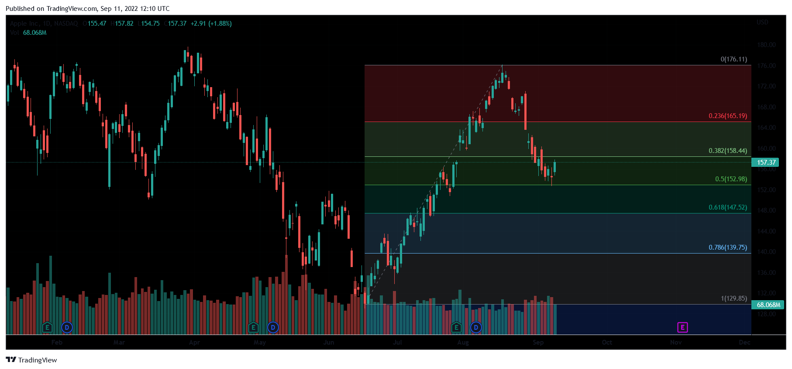

Forex trading, also known as foreign exchange trading, is the process of buying and selling currencies in a global marketplace. This dynamic market is the largest financial market in the world, characterized by high liquidity and the capability for substantial returns. Active traders are particularly drawn to its 24-hour trading opportunities and the potential for profit across various currency pairs. However, the potential for significant profits comes hand-in-hand with considerable risks, primarily due to the market's volatility and the complexity of currency exchange mechanisms.

In this article, we examine forex trading, emphasizing strategies for generating financial gains through currency exchange and the influence of algorithmic trading systems. Algorithmic trading, or algo trading, is increasingly prevalent in the forex market due to its ability to enhance trading efficiency and reduce errors. By integrating computer algorithms designed to execute trades based on set parameters, traders can exploit market opportunities rapidly and systematically.



This discussion will cover the foundational aspects of the forex market, demonstrating why it is an advantageous platform for active traders. We will also analyze how algorithmic trading is increasingly being utilized to boost trading strategies, thus enhancing profitability and minimizing risks.

For novice traders and seasoned investors alike, comprehending these concepts is crucial. A thorough understanding of forex trading, coupled with the adoption of sophisticated trading techniques like algorithms, can significantly improve one’s trading strategy and potentially lead to greater returns. As we navigate through the complexities of the forex market, the aim is to equip traders with the knowledge needed to harness these opportunities efficiently.

## Table of Contents

## Understanding Forex Trading

The foreign exchange market, commonly referred to as Forex or FX, stands as the largest and most liquid financial market globally, with a daily trading volume surpassing $7.5 trillion. This immense level of activity underscores its significance and the opportunities it offers for traders worldwide. Forex trading primarily involves the exchange of major currency pairs, such as USD/EUR, USD/JPY, and EUR/JPY, where the objective is to profit from fluctuations in exchange rates.

At its core, Forex trading hinges on the anticipation of a currency's value rising or falling relative to another. For instance, if a trader believes that the euro (EUR) will strengthen against the US dollar (USD), they might purchase EUR/USD, expecting the exchange rate to increase in the future. This fundamental principle of buying low and selling high, or vice versa, is the cornerstone of currency trading. 

However, successful Forex trading requires more than just the ability to predict currency movements. It demands a comprehensive understanding of market trends, geopolitical developments, and a variety of economic indicators. Key factors influencing Forex markets include interest rates, inflation, political stability, and economic performance indicators such as GDP growth and employment figures.

For traders looking to navigate this complex environment, several analytical tools are available:

1. **Technical Analysis**: This involves evaluating historical price data and applying chart patterns and technical indicators, such as moving averages and relative strength index (RSI), to identify potential market entry and exit points.

2. **Fundamental Analysis**: This approach considers economic reports, news events, and geopolitical developments to forecast currency movements. Understanding a country's economic health, interest rate policies, and political climate are crucial in making informed trading decisions.

3. **Sentiment Analysis**: This method gauges the overall mood or sentiment of the market participants and helps predict possible market movements. Indicators such as the Commitment of Traders report can provide insights into market sentiment.

Success in Forex trading lies in a trader’s ability to synthesize these analyses and make informed decisions. It requires continual learning and adapting to market changes while maintaining a disciplined trading strategy.

## Getting Started With Forex

To start trading [forex](/wiki/forex-system), it is essential for traders to grasp several crucial concepts, namely leverage, margin, and pips. Leverage is a powerful tool in forex trading that allows traders to control a larger position in the market with a relatively small amount of capital. It is often expressed as a ratio, such as 50:1, indicating how much more a trader can manage relative to their actual deposit. For example, with a 50:1 leverage, a deposit of $1,000 can control a $50,000 position. While this amplifies potential gains, it also increases potential losses, necessitating careful risk management.

Margin, closely related to leverage, refers to the initial deposit required to open and maintain a leveraged position. It acts as a collateral for the borrowed funds. Margin is typically expressed as a percentage of the total trade size. Understanding margin requirements is crucial, as failure to maintain the required margin levels can result in margin calls or forced closure of positions by the broker.

A pip, short for "percentage in point," is a unit of measurement for price changes in currency pairs. In most currency pairs, a pip represents a 0.0001 change in value, although in pairs involving the Japanese yen, it is typically 0.01. Calculating pip values helps traders assess potential profits or losses on trades.

Selecting a reliable forex broker is paramount for a successful trading experience. Factors to consider include trading fees, such as spreads and commissions, as well as the quality of customer service and the robustness of trading platforms offered. A broker's regulatory status also ensures compliance with financial standards, providing an additional layer of security.

For new traders, using a demo account is highly recommended. Demo accounts simulate real market conditions without any financial risk, allowing beginners to develop and practice their trading strategies. This hands-on experience is invaluable for gaining confidence and learning how to navigate the trading platform effectively.

Furthermore, developing a solid trading plan is advisable for all traders. A well-structured plan outlines clear goals, risk tolerance levels, and the strategies to be employed. It serves as a roadmap to guide decision-making processes and helps maintain discipline, especially during the emotional highs and lows of trading. Comprehensive research and continuous education form the foundation of a robust trading plan, ensuring that traders are well-prepared to face the complexities of the forex market.

## The Role of Algorithmic Trading

Algorithmic trading, commonly known as algo trading, leverages computer algorithms to execute trades based on established parameters. These algorithms analyze a multitude of market factors, such as price, timing, and [volume](/wiki/volume-trading-strategy), to swiftly perform buy or sell trades whenever specified market conditions arise. This automated approach to trading capitalizes on sophisticated quantitative analyses to identify trading opportunities that might be missed through manual trading.

By enabling rapid and precise trade execution, [algorithmic trading](/wiki/algorithmic-trading) significantly enhances efficiency. The use of predefined algorithms eliminates human errors, which can occur due to emotional biases or simple oversight. These algorithms can process vast datasets quickly, responding to market changes with high-speed execution, crucial in a market as dynamic as forex.

The competitive edge provided by algorithmic trading lies in its ability to execute complex trading strategies. Such strategies may involve techniques like statistical [arbitrage](/wiki/arbitrage), [market making](/wiki/market-making), or [trend following](/wiki/trend-following), each requiring precise timing and execution unachievable by human traders alone. For instance, [statistical arbitrage](/wiki/statistical-arbitrage) utilizes mathematical models to detect pricing inefficiencies between related currency pairs. By quickly buying undervalued assets and selling overvalued ones, algorithms exploit these temporary price discrepancies for profit.

Algorithmic trading is particularly beneficial in managing high-frequency trading ([HFT](/wiki/high-frequency-trading-strategies)) strategies, where the goal is to take advantage of small price movements at high speeds and volumes. HFT requires execution speeds measured in microseconds, a feat only possible through automation.

In Python, a basic algorithm template to execute trades based on moving averages might look like this:

```python
import pandas as pd

def calculate_moving_average(prices, window):
    return prices.rolling(window=window).mean()

def trading_signal(prices):
    short_window = 40
    long_window = 100

    signals = pd.DataFrame(index=prices.index)
    signals['short_mavg'] = calculate_moving_average(prices['Close'], short_window)
    signals['long_mavg'] = calculate_moving_average(prices['Close'], long_window)

    signals['signal'] = 0.0
    signals['signal'][short_window:] = np.where(
        signals['short_mavg'][short_window:] > signals['long_mavg'][short_window:], 1.0, 0.0)

    signals['positions'] = signals['signal'].diff()
    return signals

# Example usage:
# prices = pd.DataFrame(...)  # Load your historical price data
# signals = trading_signal(prices)
```

This script calculates short and long-term moving averages, generating buy signals when the short-term average crosses above the long-term average, indicating potential price increases.

Algorithmic trading, while providing significant advantages, requires thorough [backtesting](/wiki/backtesting) and risk management to adapt to forex market conditions effectively. Advanced knowledge in quantitative finance, programming, and data analysis is essential to design robust trading algorithms. Despite these challenges, algo trading continues to be a vital tool for traders seeking to maximize profit in the fast-paced forex market.

## Pros and Cons of Forex and Algo Trading

Forex trading is renowned for its high [liquidity](/wiki/liquidity-risk-premium) and the flexibility of 24/5 trading opportunities, which are particularly appealing for active traders who seek to take advantage of currency movements at nearly any time of the day. The forex market's vast liquidity enables traders to execute large trades with minimal impact on market prices, thereby often ensuring tighter spreads and lower transaction costs. Traders can capitalize on short-term opportunities more effectively, given the constant price fluctuations and the range of currency pairs available for trading.

However, it's important to note that currency pairs can exhibit significant [volatility](/wiki/volatility-trading-strategies) due to factors such as geopolitical events, economic announcements, or natural disasters. This volatility can lead to both high returns and substantial losses. One of the more appealing, yet risky, aspects of forex trading is the use of leverage. Leverage allows traders to control a larger position with a smaller amount of capital. In mathematical terms, the leverage ratio can be expressed as:

$$
\text{Leverage Ratio} = \frac{\text{Value of Position}}{\text{Amount of Margin}}
$$

While leveraging can amplify the potential for profit, it can equally magnify losses, representing a double-edged sword for traders who do not employ sound risk management practices.

Algorithmic trading, or algo trading, enhances trading efficiency by utilizing computer programs that automatically execute trades based on predefined criteria. This form of trading eliminates the emotional biases that often hinder manual trading decisions and ensures consistent, rapid execution of trades. For traders, this can mean seizing opportunities faster than if trading manually.

Despite these advantages, algorithmic trading is not without its drawbacks. Implementing effective algorithms requires an in-depth understanding of both market dynamics and technological tools. The complexity of developing, backtesting, and adjusting algorithms necessitates a significant commitment of time and resources. Furthermore, the market conditions that these algorithms are based on may change, requiring constant refining of strategies to maintain effectiveness.

In conclusion, while forex and algorithmic trading both present unique advantages, they also come with inherent challenges that traders need to navigate. Mastery in both areas involves understanding the risks, leveraging technology responsibly, and maintaining a disciplined approach to trading.

## Developing a Winning Trading Strategy

A successful trading strategy in forex trading hinges on establishing clear objectives, meticulous risk management, and employing the appropriate indicators and signals. Goals should be specific, measurable, and realistic, allowing traders to gauge progress and make necessary adjustments. Risk management is crucial, often involving the calculation of risk-reward ratios and the use of stop-loss orders to prevent excessive losses. For example, a trader might maintain a risk-reward ratio of 1:3, which means they aim to potentially earn three units of profit for every unit of risk.

Indicators and signals act as the foundation of any robust trading strategy. Popular indicators include moving averages, relative strength index (RSI), and Bollinger Bands, which assist in identifying market trends and potential reversal points. These tools, combined with an understanding of technical analysis, aid traders in making informed decisions.

Backtesting is an essential step in developing a trading strategy, where a proposed strategy is evaluated using historical data to assess its viability. Backtesting helps determine if the strategy would've been profitable in the past and provides insights into potential improvements. In Python, backtesting can be implemented using libraries such as Backtrader or PyAlgoTrade. For instance, using Backtrader, a simple moving average crossover strategy can be coded as follows:

```python
import backtrader as bt

class SmaCross(bt.SignalStrategy):
    def __init__(self):
        sma1 = bt.indicators.SimpleMovingAverage(self.data.close, period=10)
        sma2 = bt.indicators.SimpleMovingAverage(self.data.close, period=30)
        self.signal_add(bt.SIGNAL_LONG, bt.ind.CrossOver(sma1, sma2))

cerebro = bt.Cerebro()
cerebro.addstrategy(SmaCross)
# Add data and run the backtest
```

Continuous monitoring and adjustments are vital for maintaining a profitable strategy over time. Markets are dynamic, and conditions can change rapidly due to geopolitical events, economic announcements, or shifts in trader sentiment. Regularly reviewing performance and refining strategies based on current market conditions ensures they remain effective. For instance, updating the parameters of indicators or integrating new data sources may be necessary to align with evolving market trends.

In conclusion, a well-developed trading strategy combines clear goals, effective risk management, and strategic use of indicators and signals, bolstered by thorough backtesting and ongoing strategy refinement. This approach not only helps in navigating the volatile forex market but also in potentially enhancing profitability.

## Avoiding Common Trading Pitfalls

Over-leveraging is a prevalent issue among forex traders, often leading to significant financial losses. Leverage allows traders to control large positions with a relatively small amount of capital, amplifying both potential gains and losses. For instance, a leverage ratio of 100:1 means that for every $1 in equity, the trader can open a position worth $100. While this can increase the potential profit, it equally magnifies the risk of substantial losses if the market moves unfavorably. Therefore, prudent leverage management is critical, and traders should use leverage judiciously to protect their capital.

Another common pitfall is the overfitting of trading strategies to historical data. Overfitting occurs when a strategy is excessively tailored to past market conditions, capturing noise rather than underlying patterns. This often results in a model that performs well on historical data but fails when applied to live markets. To mitigate this, traders should employ robust statistical validation methods and diversify their strategies to withstand varying market conditions. Cross-validation and out-of-sample testing are recommended practices to ensure the reliability of trading models.

Trading costs, such as spreads and commissions, can gradually erode profits. While individual costs may seem minor, they accumulate over time, significantly impacting overall profitability. Traders should [factor](/wiki/factor-investing) these costs into their strategy and be conscious of them when executing trades. A common approach is to account for spreads and commissions when calculating potential profit targets and risk management levels.

Adopting a diversified trading approach is another strategy to mitigate these pitfalls. Diversification minimizes risk by distributing investments across different currency pairs and trading strategies, reducing exposure to any single source of risk. Such an approach not only balances potential losses but also creates opportunities for gains across varying market conditions.

Awareness of these common pitfalls and implementing strategies to address them can significantly enhance a trader's performance and sustainability in the forex market.

## The Future of Forex and Algorithmic Trading

Advancements in technology have progressively transformed forex trading, making it a dynamic field constantly evolving alongside innovations such as [artificial intelligence](/wiki/ai-artificial-intelligence) (AI) and [machine learning](/wiki/machine-learning) (ML). These technologies are poised to substantially influence how trading is conducted, specifically enhancing algorithmic trading.

Artificial intelligence, with its ability to process vast amounts of data and learn from it, offers numerous possibilities for improving forex trading strategies. For instance, AI algorithms can be designed to recognize complex patterns within historical and real-time data, leading to insights that are not readily apparent through traditional analysis. The implementation of machine learning models enables traders to not only predict market trends more accurately but also adapt strategies based on new data, thereby enhancing decision-making processes.

Moreover, algorithmic trading systems are expected to become increasingly sophisticated. The integration of AI and ML can lead to more precise execution of trades, minimizing slippage and optimizing entry and [exit](/wiki/exit-strategy) points. As algorithms learn from market behaviors and refine their rules, the potential for improved risk management emerges. Such systems can incorporate stochastic models to forecast potential price movements or use neural networks to simulate trading scenarios, thus providing traders with a robust support mechanism for handling market volatility.

Despite these technological advancements, ethical concerns around market manipulation and fairness persist. The deployment of high-frequency trading (HFT) systems, which execute a large number of orders in fractions of a second, has raised questions about the equitable nature of trading environments. Critics argue that these systems may offer an undue advantage to technologically advanced traders over others and could lead to market distortions.

The trading community continues to debate the ethical implications of employing AI in forex and algorithmic trading. Balance must be maintained to ensure that technological progress does not compromise market integrity. Regulatory frameworks may need to evolve concurrently to address these issues effectively, ensuring that advancements serve the broader trading ecosystem equitably.

In conclusion, while AI and ML hold immense potential for transforming forex trading, continuous dialogue on ethical considerations and regulatory oversight will be crucial. This discussion is vital to fostering an environment where technological advancements contribute positively to market efficiency and fairness.

## Conclusion

Forex trading presents a vast landscape of opportunities for making money, but it demands a careful, informed approach. Traders must not only understand market dynamics and economic indicators but also continuously adapt to fluctuating conditions. Successful forex trading relies on a solid foundation that includes both manual and algorithmic trading techniques.

For those who can master this combination, the forex market offers a potential for significant rewards. Manual trading allows traders to leverage personal insights and experience, while algorithmic trading can improve efficiency and execution speed. By automating processes through predefined criteria and algorithms, traders can minimize the risks associated with human error and emotional bias, thereby enhancing profitability.

Ultimately, success in forex trading requires a disciplined strategy, continuous learning, and adaptability to market changes. Traders should regularly review and adjust their strategies based on performance metrics and evolving market conditions. Continuous learning from both historical data and current market trends is crucial for refining trading approaches. Moreover, staying informed about technological advancements, such as the integration of artificial intelligence and machine learning, can offer additional tools to stay ahead in the market. In this ever-evolving trading landscape, proactiveness and adaptability are invaluable assets for maximizing returns in forex trading.

## References & Further Reading

[1]: Bergstra, J., Bardenet, R., Bengio, Y., & Kégl, B. (2011). ["Algorithms for Hyper-Parameter Optimization."](https://papers.nips.cc/paper/4443-algorithms-for-hyper-parameter-optimization) Advances in Neural Information Processing Systems 24.

[2]: ["Advances in Financial Machine Learning"](https://www.amazon.com/Advances-Financial-Machine-Learning-Marcos/dp/1119482089) by Marcos Lopez de Prado

[3]: ["Evidence-Based Technical Analysis: Applying the Scientific Method and Statistical Inference to Trading Signals"](https://www.semanticscholar.org/paper/Evidence-Based-Technical-Analysis%3A-Applying-the-and-Aronson/3b33df8737f1772e9e14d66a08c9696f140a2ee1) by David Aronson

[4]: ["Machine Learning for Algorithmic Trading"](https://github.com/PacktPublishing/Machine-Learning-for-Algorithmic-Trading-Second-Edition) by Stefan Jansen

[5]: ["Quantitative Trading: How to Build Your Own Algorithmic Trading Business"](https://books.google.com/books/about/Quantitative_Trading.html?id=j70yEAAAQBAJ) by Ernest P. Chan