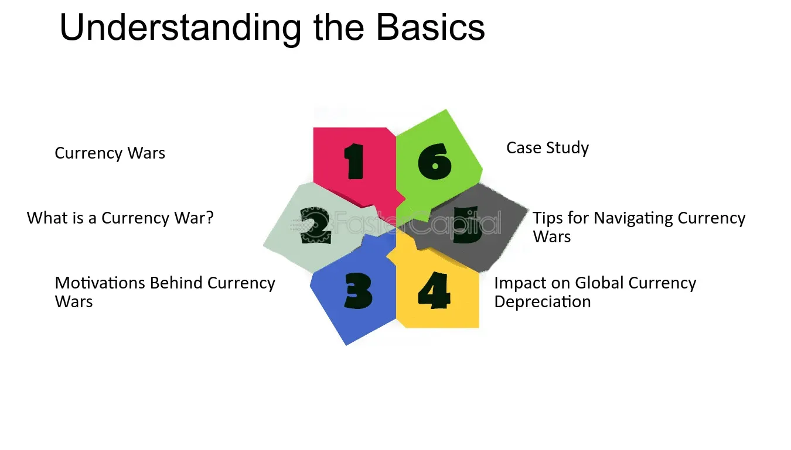

## Table of Contents

## What is a currency war?

A currency war is when countries try to make their own money worth less compared to other countries' money. They do this to make their exports cheaper and more attractive to other countries. This can help their own businesses sell more products abroad and create more jobs at home. But, when one country does this, other countries might do the same thing to keep up. This can lead to a situation where everyone is trying to lower the value of their money, which can cause problems in the global economy.

When countries engage in a currency war, it can lead to higher prices for imports, which can make life more expensive for people in those countries. It can also create tension between countries, as each tries to gain an advantage over the others. If not managed carefully, currency wars can lead to trade conflicts and even harm the global financial system. It's important for countries to work together and use international cooperation to prevent these kinds of conflicts from getting out of hand.

## What are the main causes of currency wars?

Currency wars often start because countries want to boost their own economies. When a country's economy is not doing well, its leaders might decide to make their currency weaker. This makes their products cheaper for other countries to buy, which can help increase exports and create jobs at home. But when one country does this, others might feel they need to do the same to stay competitive. This competition to weaken currencies can turn into a currency war.

Another cause of currency wars is when countries have different economic goals. For example, one country might want to keep its currency strong to control inflation, while another might want a weaker currency to help its exporters. These different goals can lead to disagreements and actions that start a currency war. Also, global economic problems, like a financial crisis, can push countries to take drastic measures with their currencies, which can escalate into a currency war if not handled carefully.

## How do countries engage in currency wars?

Countries engage in currency wars mainly by making their own money worth less. They do this by buying foreign money with their own currency, which increases the supply of their money in the market and makes it less valuable. This is called currency devaluation. When a country's money is worth less, its products become cheaper for other countries to buy. This can help the country sell more things abroad and create jobs at home. But when one country does this, other countries might feel they need to do the same thing to keep their products competitive. This can start a cycle where everyone is trying to lower the value of their money.

Another way countries engage in currency wars is by lowering interest rates. When a country lowers its interest rates, it makes its money less attractive to foreign investors because they can earn less by keeping their money in that country. This can also lead to a weaker currency. Sometimes, countries use other methods like putting limits on how much money can leave the country or directly controlling the exchange rate. These actions can create tension between countries, as each tries to gain an advantage over the others. If not managed carefully, these actions can lead to a situation where countries are in a constant battle to weaken their currencies, which can harm the global economy.

## What are the common mechanisms used in currency wars?

Countries use different ways to make their money worth less in currency wars. One common way is called currency devaluation. This happens when a country buys a lot of foreign money with its own money. This makes more of their money available, which makes it worth less. When their money is worth less, their products become cheaper for other countries to buy. This can help them sell more things and create jobs at home. But when one country does this, other countries might feel they have to do the same thing to keep their products competitive. This can start a cycle where everyone is trying to make their money worth less.

Another way countries engage in currency wars is by lowering interest rates. When a country lowers its interest rates, it makes its money less attractive to foreign investors. This is because investors can earn less by keeping their money in that country. This can also lead to a weaker currency. Sometimes, countries use other methods like putting limits on how much money can leave the country or directly controlling the exchange rate. These actions can create tension between countries, as each tries to gain an advantage over the others. If not managed carefully, these actions can lead to a situation where countries are constantly trying to weaken their currencies, which can harm the global economy.

## What are the short-term impacts of currency wars on the global economy?

In the short term, currency wars can make things cheaper for some countries. When a country makes its money worth less, its products become cheaper for other countries to buy. This can help the country sell more things abroad and create jobs at home. But, it can also make things more expensive for people in that country because imports become pricier. This can lead to higher prices for things like food and fuel, which can make life harder for people.

Currency wars can also cause tension between countries. When one country tries to make its money worth less, other countries might feel they need to do the same thing to keep their products competitive. This can lead to a situation where everyone is trying to make their money worth less, which can create a lot of uncertainty in the global economy. This uncertainty can make it harder for businesses to plan and invest, which can slow down economic growth.

## What are the long-term effects of currency wars on participating countries?

Over time, currency wars can hurt the countries involved. When countries keep trying to make their money worth less, it can lead to inflation. This means that prices for things like food and fuel go up, which can make life harder for people. It can also make it harder for businesses to plan and invest because they don't know what will happen next. This uncertainty can slow down the economy and make it harder for countries to grow.

Currency wars can also cause tension between countries. When one country tries to make its money worth less, other countries might feel they need to do the same thing. This can lead to a situation where everyone is trying to make their money worth less, which can harm global trade. If countries are always fighting over their money, it can lead to bigger problems, like trade wars or even conflicts. This can make it harder for countries to work together and solve other big problems, like climate change or poverty.

## Can you explain the role of central banks in currency wars?

Central banks play a big role in currency wars. They are the ones who can decide to make their country's money worth less by buying a lot of foreign money. This makes more of their own money available, which makes it worth less. When their money is worth less, their country's products become cheaper for other countries to buy. This can help their country sell more things and create jobs at home. But when one central bank does this, other central banks might feel they have to do the same thing to keep their country's products competitive. This can start a cycle where everyone is trying to make their money worth less.

Central banks can also start currency wars by changing interest rates. When a central bank lowers interest rates, it makes its money less attractive to foreign investors. This is because investors can earn less by keeping their money in that country. This can also lead to a weaker currency. Sometimes, central banks use other methods like putting limits on how much money can leave the country or directly controlling the exchange rate. These actions can create tension between countries, as each tries to gain an advantage over the others. If not managed carefully, these actions can lead to a situation where countries are constantly trying to weaken their currencies, which can harm the global economy.

## How do currency wars affect international trade and investment?

Currency wars can make international trade more difficult. When countries try to make their money worth less, it can cause a lot of uncertainty. Businesses don't know what will happen next, so they might be scared to buy and sell things with other countries. This can slow down trade and make it harder for countries to sell their products abroad. Also, when one country's money is worth less, it can make their products cheaper for other countries to buy. This might sound good, but it can lead to other countries doing the same thing, which can start a cycle where everyone is trying to make their money worth less. This can hurt global trade because it makes it hard for countries to agree on prices and trade fairly.

Currency wars can also affect investment. When countries are fighting over their money, it can make investors nervous. They might be scared to put their money into businesses in other countries because they don't know what will happen next. This can lead to less investment, which can slow down the economy. Also, when a country's money is worth less, it can make it more expensive for them to borrow money from other countries. This can make it harder for them to invest in things like new factories or roads, which can hurt their economy in the long run.

## What are some historical examples of currency wars?

One famous example of a currency war happened during the 1930s, known as the "Beggar-Thy-Neighbor" policies. During the Great Depression, many countries were struggling with their economies. They started to make their money worth less to sell more things to other countries. This made things worse because everyone was trying to do the same thing. It led to less trade and more problems for everyone. Countries like the United States and the United Kingdom were involved in this, and it made the global economy even weaker during a time when it was already struggling.

Another example happened in the early 2000s, when Japan was dealing with a slow economy. Japan's central bank started to buy a lot of foreign money to make the yen worth less. This was called "quantitative easing." Other countries, like the United States and countries in Europe, felt they had to do the same thing to keep their products competitive. This led to a lot of tension and uncertainty in the global economy. It showed how one country's actions can start a chain reaction that affects everyone.

## How can countries protect themselves from the negative impacts of currency wars?

Countries can protect themselves from currency wars by working together and talking to each other. If countries can agree on rules about their money, it can help stop the fighting over who can make their money worth less. They can use groups like the International Monetary Fund (IMF) to make sure everyone follows the rules. This way, countries can avoid the problems that come from trying to make their money worth less all the time.

Another way countries can protect themselves is by focusing on their own economies. They can try to make their businesses stronger and find new ways to sell things to other countries. By doing this, they can be less affected by what other countries do with their money. It's also important for countries to save money and not borrow too much, so they can handle any problems that come from currency wars. By being smart and working together, countries can make sure that currency wars don't hurt them too much.

## What are the geopolitical implications of currency wars?

Currency wars can cause big problems between countries. When one country tries to make its money worth less, other countries might feel they have to do the same thing. This can lead to a lot of tension and fighting over money. Countries might start to see each other as enemies instead of friends. This can make it harder for them to work together on other important things, like stopping climate change or helping poor countries. If countries are always fighting over their money, it can lead to bigger problems, like trade wars or even conflicts.

Currency wars can also change how countries see each other in the world. When a country's money is worth less, it can make that country seem weaker. This can make other countries try to take advantage of them. On the other hand, if a country's money is strong, it can make that country seem more powerful. This can lead to other countries wanting to be friends with them. So, currency wars can change the balance of power in the world and make countries rethink their relationships with each other.

## Can you provide a detailed case study of a recent currency war and analyze its outcomes?

A recent example of a currency war happened between the United States and China in the early 2010s. The U.S. was dealing with a slow economy after the 2008 financial crisis, and it started to print more money and buy bonds to make the dollar worth less. This was called "quantitative easing." The goal was to make U.S. products cheaper for other countries to buy, which would help create jobs at home. But China felt this was unfair because it made their products more expensive compared to U.S. products. So, China tried to keep the value of its currency, the yuan, low to stay competitive. This led to a lot of tension between the two countries, and they started to see each other as rivals.

The outcomes of this currency war were mixed. On one hand, the U.S. was able to boost its economy and create more jobs because its products became cheaper for other countries to buy. But on the other hand, it led to a lot of tension with China, and the two countries started to fight over trade. This made it harder for them to work together on other important things, like climate change. For China, keeping the yuan low helped its businesses stay competitive, but it also made other countries see China as a threat. This changed how countries saw each other in the world and led to a lot of uncertainty in the global economy. Overall, the currency war between the U.S. and China showed how one country's actions can start a chain reaction that affects everyone.

## References & Further Reading

[1]: Eichengreen, B. (2013). ["Currency War or International Policy Coordination?"](https://eml.berkeley.edu/~eichengr/curr_war_JPM_2013.pdf) National Bureau of Economic Research, Working Paper No. 19572.

[2]: Krugman, P. R. (1991). ["The International Role of the Dollar: Theory and Prospects."](https://www.nber.org/system/files/chapters/c6838/c6838.pdf) In Exchange Rate Policies. University of Chicago Press.

[3]: ["Currency Wars: The Making of the Next Global Crisis"](https://archive.org/details/currencywarsmaki0000rick) by James Rickards

[4]: Brunnermeier, M. K., Nagel, S., & Pedersen, L. H. (2009). ["Carry Trades and Currency Crashes."](https://www.nber.org/system/files/working_papers/w14473/w14473.pdf) Review of Economic Studies, 76(3), 879-906.

[5]: G20 Group. (2020). ["G20 Action Plan - Supporting the Global Economy Through the COVID-19 Pandemic."](https://www.g20.utoronto.ca/2020/2020-g20-finance-0415.html)

[6]: FXCM. (2020). ["An Introduction to Algorithmic Trading."](https://onlinelibrary.wiley.com/doi/book/10.1002/9781119206033)

[7]: International Monetary Fund. (2011). ["Assessing Reserve Adequacy."](https://www.imf.org/external/np/pp/eng/2011/021411b.pdf) 

[8]: Taleb, N. N. (2010). ["The Black Swan: The Impact of the Highly Improbable."](https://www.jstor.org/stable/23045073) Random House Trade Paperbacks. 

