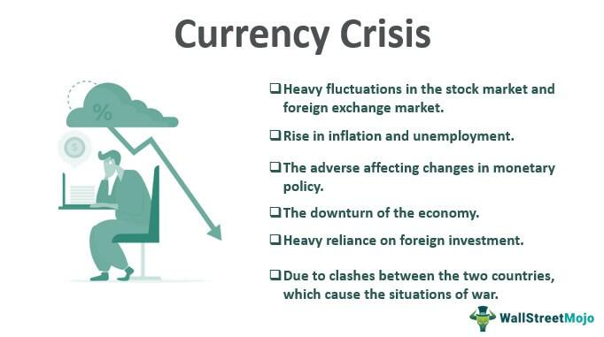

In the intricate world of international finance, 'currency war' is a term used to describe competitive devaluations between countries aiming to boost their economic standing. Countries engage in currency devaluations as part of their economic strategies to gain a competitive edge over others. By lowering the value of their currency, nations make their exports cheaper and more attractive on international markets, potentially driving economic growth. However, these strategies often have a profound impact on global economic stability, trade, and financial strategies.

Currency wars have historically caused significant disruptions in international trade, as countries compete to maintain favorable exchange rates. The lack of coordination and retaliatory devaluations can increase volatility and uncertainty in financial markets. This scenario can lead to economic tensions and impact the global economy's overall health, affecting everything from inflation rates to international investments.

The rise of algorithmic trading has added complexity and speed to the dynamics of currency wars. These algorithm-driven systems can execute trades and analyze market data at high speeds, amplifying market movements. Algorithmic trading presents opportunities to exploit the rapid changes resulting from currency devaluations. However, it also introduces new risks of market manipulation and necessitates regulatory oversight to ensure fair and stable markets.

This article explores the economic impacts of currency wars and the strategic responses employed by nations. In doing so, it delves into the role of algorithmic trading in managing the challenges and exploiting opportunities presented by these turbulent financial waters. By examining these aspects, we aim to uncover how nations navigate this continually evolving landscape, striving for economic stability while leveraging technological advancements.

## Table of Contents

## Understanding Currency Wars

Currency wars occur when countries deliberately devalue their currencies to gain a competitive edge in international trade. This strategy makes a nation's exports more competitively priced on the global market, as they become cheaper for foreign buyers, thereby boosting the exporting country's economy. Conversely, imports become more expensive, discouraging foreign purchases and promoting domestic consumption and production.

Central banks are pivotal in orchestrating currency devaluations, employing monetary tools to achieve desired currency values. Two primary methods used are reducing interest rates and engaging in quantitative easing. Lowering interest rates reduces the return on investments denominated in the local currency, leading to currency depreciation as investors seek higher returns elsewhere. Quantitative easing involves the central bank purchasing financial assets to inject liquidity into the economy, which can also lead to a currency's depreciation by increasing the money supply.

However, devaluing a currency can set off a chain reaction of similar actions by other nations, resulting in a cycle of competitive devaluations. When one country devalues its currency to boost exports, partner countries may retaliate by devaluing their own currencies to maintain their competitive position. This tit-for-tat strategy can escalate into broader economic conflicts, destabilizing trade and financial relationships globally. Such cycles can lead to reduced global economic growth and increased [volatility](/wiki/volatility-trading-strategies) in international markets, making coordinated economic policies and strong diplomatic ties crucial to mitigating these effects.

## Economic Impacts of Currency Wars

Currency wars, characterized by competitive devaluations, can stimulate short-term economic growth by enhancing export competitiveness. When a country's currency is devalued, its goods and services become cheaper for foreign buyers, potentially increasing demand for exports. This, in turn, can boost domestic economic activity and employment in the export sectors.

However, the long-term economic consequences of currency wars can be detrimental. One significant effect is inflation. As devaluation makes imports more expensive, domestic consumers and businesses may face higher prices for imported goods and raw materials. For example, essential inputs like foreign machinery or components become costlier, leading to increased production costs and potentially reduced productivity. This inflationary pressure can erode the purchasing power of consumers and contribute to the overall economic instability of the participating country.

Moreover, currency wars can deter foreign investment. The uncertainty and volatility in exchange rates create an unpredictable economic environment, discouraging investors seeking stable returns. This decline in foreign investment can stifle economic growth and lead to a diminished capital flow, hampering the development of infrastructure and industries dependent on such investments.

The international ramifications of currency wars can strain diplomatic relations and jeopardize global economic cooperation. Countries involved in competitive devaluations may retaliate with similar measures, creating a cycle that escalates tensions. This retaliation undermines efforts to maintain economic stability through coordinated policies and can lead to a fragmented global economic environment. As nations prioritize national economic interests, achieving consensus on international monetary policies becomes challenging, further exacerbating global economic instability.

In summary, while currency wars can offer a temporary boost in competitiveness and economic activity, their enduring impacts—such as inflation, reduced productivity, diminished foreign investment, and strained international relations—pose significant risks to both national and global economic stability.

## Financial Strategies in Currency Wars

To counter the negative impacts of currency wars, countries employ a variety of financial strategies designed to stabilize their economies and prevent prolonged disruption. One approach involves balancing devaluation with structural economic reforms aimed at enhancing overall productivity and efficiency. By restructuring fundamental economic sectors such as agriculture, manufacturing, and services, countries can improve infrastructure, streamline regulations, and invest in education and technological advancements, ultimately boosting long-term economic resilience and reducing reliance on currency devaluation as a primary competitive tool.

Trade strategies also play a critical role. Countries may engage in negotiations for trade agreements that create conducive environments for exports while protecting sensitive domestic industries. These agreements can help mitigate the effects of aggressive foreign competition resulting from currency devaluations. Alternatively, nations might implement trade barriers, such as tariffs or import quotas, to shield local industries from the negative impacts of cheap foreign goods. While these protectionist measures can lead to short-term relief for affected industries, they must be carefully managed to avoid triggering retaliatory actions and further escalation of trade conflicts.

Central banks, integral to managing currency stability, may seek international cooperation to prevent excessive currency fluctuations that could destabilize the global economy. By participating in multilateral forums and platforms, such as the International Monetary Fund (IMF) or the Group of Twenty (G20), central banks can coordinate monetary policies to enhance exchange rate stability. This cooperation might involve currency swap lines or agreeing on shared policy measures that mitigate competitive devaluations. Such collaborative efforts are essential, as uncoordinated monetary policies have the potential to exacerbate global financial instability and hinder economic growth.

By leveraging these financial strategies, countries aim to maintain economic stability and protect their interests amidst the complexities of currency wars, ensuring that their economies can thrive in an interconnected global marketplace.

## Role of Algorithmic Trading

Algorithmic trading has emerged as a key component in managing the complexities and volatilities associated with currency wars. These automated trading systems utilize advanced quantitative models to swiftly analyze vast amounts of market data, facilitating the execution of trades at extraordinary speeds. This rapid response capability is crucial in capitalizing on the quick and sometimes unpredictable market movements prompted by competitive devaluations of currencies. 

The core advantage of [algorithmic trading](/wiki/algorithmic-trading) lies in its ability to provide [liquidity](/wiki/liquidity-risk-premium) and enhance market stability during periods of intense fluctuation. By executing large volumes of trades efficiently, these systems can absorb shocks and smooth out price volatility, thereby contributing to an orderly market operation. This is particularly beneficial during currency wars, where sudden shifts in exchange rates can create a ripple effect across global financial markets.

However, the increasing reliance on algorithmic trading also poses significant challenges, primarily concerning market manipulation and systemic risks. The speed and automation inherent in these systems can be exploited for manipulative purposes, such as "spoofing," where bogus orders are placed with the intent to deceive other traders about supply and demand dynamics. Moreover, the interconnectedness and complexity of these trading algorithms raise concerns about systemic risks, where a failure in one segment can quickly proliferate, leading to market-wide disruptions.

Given these concerns, there is a pressing need for robust regulatory oversight to ensure that algorithmic trading practices do not undermine market integrity. This includes establishing clear guidelines and monitoring mechanisms to detect and prevent manipulative behaviors, as well as conducting regular assessments of algorithmic trading systems to ensure their resilience against unexpected market events. Ultimately, while algorithmic trading offers powerful tools for navigating the financial instability associated with currency wars, it must be underpinned by a strong regulatory framework to safeguard against potential risks.

## Case Studies

Currency wars throughout the 2010s highlight how countries have attempted to achieve competitive advantages, consequently affecting global trade and economic stability. During this period, major economies like the United States, the European Union, Japan, and China took various monetary actions aimed at controlling their currency valuation to boost exports.

The United States, for instance, employed quantitative easing (QE) strategies aggressively, purchasing government securities and other financial assets to increase money supply and lower interest rates. This move was intended to stimulate the economy post-2008 financial crisis but led to a weaker dollar, spurring competitive responses from other nations. 

Japan also undertook significant monetary easing under its "Abenomics" policy, which included a concerted effort by the Bank of Japan to weaken the yen to make Japanese exports more competitive. This policy, however, drew criticism from international observers who viewed it as a direct currency manipulation tactic.

The European Union waged its currency battle by implementing negative interest rates and extensive asset-buying programs. These measures aimed to counteract disinflation and slow growth but had the effect of devaluing the euro, causing ripples across international financial markets.

In contrast, China has been routinely accused of manipulating the yuan to maintain its export competitiveness, especially highlighted during trade tensions with the United States under the Trump administration. The People’s Bank of China frequently intervened in currency markets to stabilize the yuan, intending to keep its devaluation controlled to avert excessive outflows and domestic economic instability.

Emerging markets faced substantial challenges in such an environment. Many struggled to maintain economic stability due to capital outflows spurred by developed nations' aggressive policy measures. For example, countries like Brazil and India experienced volatile exchange rates and inflation pressures as they wrestled to protect their currencies without sacrificing economic growth.

These instances illustrate the interconnectedness of global economies, where policy decisions in one country can induce responses across the globe, complicating efforts to achieve a balanced international monetary system. The challenges arising from currency wars emphasize the necessity for enhanced international cooperation and monetary policy coordination to ensure economic stability.

## Global Cooperation and Future Outlook

International cooperation is fundamental in mitigating the adverse effects of currency wars, and institutions like the International Monetary Fund (IMF) and the World Trade Organization (WTO) play pivotal roles in promoting collaborative financial policies. These institutions encourage countries to adopt measures that prevent the escalation of competitive devaluations, focusing on stable exchange rate systems and economic policies that consider global impacts. The IMF, for instance, provides platforms for dialogue and policy advice, helping countries navigate monetary challenges while stabilizing the international financial system.

Future outlooks for currency dynamics are influenced by several key factors, including the geopolitical landscape and global economic conditions. Geopolitical tensions can heighten the risk of currency wars as countries may resort to devaluation to gain leverage in international negotiations. Additionally, fluctuations in global economic growth, trade patterns, and investment flows can also impact currency values. An environment of economic uncertainty tends to exacerbate volatility in exchange rates, complicating the efforts of nations to maintain financial stability.

Technological advancements are likely to redefine traditional notions of currency value and exchange mechanisms. The rise of digital currencies, such as Bitcoin and central bank digital currencies (CBDCs), introduces new considerations in currency dynamics. Digital currencies have the potential to alter how countries approach devaluation and monetary policy. For example, the widespread adoption of CBDCs could reduce the reliance on traditional monetary policy tools, as digital currencies may offer more controlled and transparent avenues for influencing economic activity.

Additionally, countries must carefully balance national interests with the imperative of global economic stability. While pursuing policies that favor domestic growth and trade competitiveness, it is essential to recognize the broader implications of such actions. Cooperative efforts are necessary to avoid a zero-sum game where competitive devaluations ultimately lead to global economic instability.

Promoting sustainable economic growth and market integrity requires a multi-faceted approach that incorporates innovation, regulation, and international collaboration. Policymakers must embrace technological innovations, like digital currencies, while ensuring robust regulatory frameworks to safeguard market integrity. By fostering an environment of mutual benefit and shared responsibility, the international community can work towards a balanced and resilient monetary system that supports global prosperity.

## Conclusion

Currency wars continue to exert profound influence on international economic relations, significantly impacting trade and monetary policy strategies. Nations engage in competitive devaluations aiming to make exports more attractive while protecting domestic industries from foreign competition. However, such tactics can lead to significant global economic disruptions, including inflationary pressures and strained international relations, underscoring the challenges of managing national and international monetary policies.

Algorithmic trading has emerged as a vital component in navigating the complexities of currency wars, offering both opportunities and challenges. These sophisticated tools allow traders and financial institutions to analyze market trends and execute trades at unprecedented speeds, potentially stabilizing markets during periods of high volatility. By leveraging quantitative models and real-time data, algorithmic trading can enhance liquidity and efficiency, contributing positively to market dynamics. Yet, the rapid pace and substantial volumes involved pose risks of market manipulation and systemic instability, which necessitate diligent regulatory oversight to safeguard market integrity.

Looking forward, the formulation of future policies must reflect the insights gained from past experiences with currency wars. Economic strategies should integrate innovative approaches, leveraging technological advancements like digital currencies that may transform traditional devaluation tactics. At the same time, fostering international cooperation remains crucial to balancing national interests with global economic stability. The establishment of frameworks that promote sustainable economic growth while ensuring robust market oversight is fundamental to achieving a stable global economic environment. Through combined efforts in embracing innovation and reinforcing cooperation, nations can effectively navigate the challenges posed by currency wars, aiming for a resilient and harmonious international economic landscape.

## References & Further Reading

[1]: Eichengreen, B. (2013). ["Currency War or International Policy Coordination?"](https://eml.berkeley.edu/~eichengr/curr_war_JPM_2013.pdf) National Bureau of Economic Research, Working Paper No. 19572.

[2]: Krugman, P. R. (1991). ["The International Role of the Dollar: Theory and Prospects."](https://www.nber.org/system/files/chapters/c6838/c6838.pdf) In Exchange Rate Policies. University of Chicago Press.

[3]: ["Currency Wars: The Making of the Next Global Crisis"](https://archive.org/details/currencywarsmaki0000rick) by James Rickards

[4]: Brunnermeier, M. K., Nagel, S., & Pedersen, L. H. (2009). ["Carry Trades and Currency Crashes."](https://www.nber.org/system/files/working_papers/w14473/w14473.pdf) Review of Economic Studies, 76(3), 879-906.

[5]: G20 Group. (2020). ["G20 Action Plan - Supporting the Global Economy Through the COVID-19 Pandemic."](https://www.g20.utoronto.ca/2020/2020-g20-finance-0415.html)

[6]: FXCM. (2020). ["An Introduction to Algorithmic Trading."](https://onlinelibrary.wiley.com/doi/book/10.1002/9781119206033)

[7]: International Monetary Fund. (2011). ["Assessing Reserve Adequacy."](https://www.imf.org/external/np/pp/eng/2011/021411b.pdf) 

[8]: Taleb, N. N. (2010). ["The Black Swan: The Impact of the Highly Improbable."](https://www.jstor.org/stable/23045073) Random House Trade Paperbacks. 

