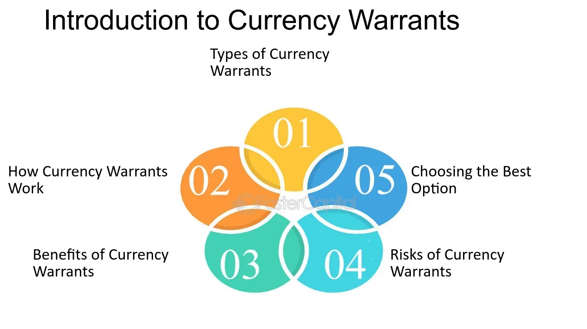

## Table of Contents

## What is a currency warrant?

A currency warrant is a type of financial instrument that gives the holder the right, but not the obligation, to buy or sell a specific amount of a currency at a set price before a certain date. It's like a ticket that lets you exchange one currency for another at a price that was agreed upon earlier. People use currency warrants to bet on how the value of one currency might change compared to another, hoping to make a profit if their predictions are correct.

Currency warrants are often used by investors who want to take advantage of movements in currency exchange rates without directly trading in the forex market. They can be bought and sold on financial markets, just like stocks or bonds. If the currency's value moves in the direction the investor expected, they can use the warrant to make a profit. However, if the currency moves the other way, the investor might lose the money they spent on the warrant.

## How does a currency warrant differ from a currency option?

A currency warrant and a currency option are similar because they both give you the right to buy or sell a currency at a set price before a certain date. The big difference is who issues these instruments. A currency option is usually issued by a bank or a financial institution, while a currency warrant is issued by a company. This means that when you buy a warrant, you're dealing directly with the company that issued it.

Another difference is how these instruments are traded. Currency options are often traded on big financial markets, making them easier to buy and sell. Currency warrants, on the other hand, might not be as easy to trade because they are less common and not always listed on major exchanges. This can make warrants a bit riskier because it might be harder to get out of the investment if you need to.

## What are the types of currency warrants available to investors?

There are two main types of currency warrants that investors can choose from: call warrants and put warrants. A call warrant gives you the right to buy a specific amount of a currency at a set price before the warrant expires. If you think the value of that currency is going to go up, you might buy a call warrant because it could make you money if you're right. On the other hand, a put warrant gives you the right to sell a specific amount of a currency at a set price before it expires. If you think the value of a currency is going to go down, you might buy a put warrant to make a profit from that drop in value.

Both types of warrants can be useful for investors who want to bet on changes in currency values without directly trading in the forex market. Call warrants are good for when you're feeling optimistic about a currency's future value, while put warrants are better when you're feeling pessimistic. Remember, though, that using warrants involves risk. If the currency doesn't move the way you expected, you could lose the money you spent on the warrant.

## How can one buy or sell a currency warrant?

To buy or sell a currency warrant, you need to find a place where they are traded. These places are called financial markets or exchanges. Not all markets offer currency warrants, so you might need to look around to find one that does. Once you find a market that has the currency warrant you're interested in, you can place an order to buy or sell it, just like you would with a stock or a bond. You'll need to work with a broker, which is a person or a company that helps you make these trades. They can guide you through the process and make sure everything goes smoothly.

After you've placed your order, you'll have to wait for it to be filled. This means someone else on the market has to agree to buy or sell the warrant at the price you've set. Once that happens, the trade is complete, and you'll either own the currency warrant or have sold it to someone else. Remember, trading currency warrants can be tricky because they're not as common as other types of investments. It's a good idea to do your homework and maybe talk to a financial advisor before you start trading them.

## What are the key factors to consider before investing in currency warrants?

Before you decide to invest in currency warrants, it's really important to think about how much risk you're willing to take. Currency warrants can be pretty risky because their value can go up and down a lot, depending on what happens with the currencies they're based on. If the currency doesn't move the way you expect, you could lose all the money you spent on the warrant. So, make sure you're okay with the possibility of losing your investment and only put in money you can afford to lose.

Another thing to consider is how well you understand the currency markets. Currency values can change because of lots of different things, like what's happening in the economy of a country, what the government is doing, or even big events around the world. If you don't know much about these things, it might be hard to predict what will happen to the value of a currency warrant. It's a good idea to learn as much as you can about the currencies you're interested in and maybe even talk to a financial advisor who can help you make a smart decision.

Lastly, think about how easy it is to buy and sell currency warrants. They're not as common as other investments, so it might be harder to find a place to trade them. This means you might not be able to sell your warrant quickly if you need to, which adds another layer of risk. Make sure you know where you can trade the warrants you're looking at and how easy it will be to get out of the investment if you need to.

## Can you explain the payoff structure of a currency warrant?

The payoff structure of a currency warrant is like a reward system that depends on how the currency's value changes. If you have a call warrant, you make money if the currency's value goes up past the set price, called the strike price. The more the currency's value rises above the strike price, the more money you can make. But if the currency's value doesn't go above the strike price by the time the warrant expires, your warrant becomes worthless, and you lose the money you spent on it. It's like buying a ticket to a game where you only win if your team scores more points than expected.

If you have a put warrant, the payoff works the other way around. You make money if the currency's value falls below the strike price. The more the currency's value drops below the strike price, the more you can earn. But if the currency's value doesn't drop below the strike price before the warrant expires, then your put warrant is worth nothing, and you lose what you paid for it. It's like betting that a team will score fewer points than expected, and you only win if they do worse than the set score.

## How do currency warrants affect the foreign exchange market?

Currency warrants can affect the foreign exchange market because they let investors bet on how currencies will change in value. When a lot of people buy or sell currency warrants, it can push the demand for certain currencies up or down. For example, if many investors buy call warrants on the Euro, hoping its value will go up, this might increase the demand for Euros in the market. This can make the Euro's value rise a bit because more people want to buy it.

On the other hand, if many investors buy put warrants on the Euro, thinking its value will go down, this can increase the supply of Euros as people might sell them to buy the warrants. This could make the Euro's value drop because there are more Euros available in the market. So, currency warrants can add to the ups and downs of currency values, making the foreign exchange market a bit more unpredictable.

## What are the risks associated with trading currency warrants?

Trading currency warrants can be risky because their value can change a lot. If the currency you're betting on doesn't move the way you thought it would, you could lose all the money you spent on the warrant. This is because currency warrants have an expiration date, and if the currency's value isn't where you need it to be by that date, the warrant becomes worthless. It's like buying a ticket to a game where you only win if your team scores more or fewer points than expected, but if they don't, you lose your money.

Another risk is that currency warrants can be hard to buy and sell. They're not as common as other investments, so you might not find many places to trade them. This means if you need to get out of your investment quickly, it might be tough. It's like trying to sell a rare toy that not many people want to buy – it can take a long time to find someone willing to take it off your hands. So, you need to be ready to hold onto your warrant until you can sell it, which adds to the risk.

## How do currency warrants fit into a broader investment strategy?

Currency warrants can be a part of a broader investment strategy if you want to add some excitement and risk to your portfolio. They let you bet on how the value of one currency might change compared to another, which can be a good way to try and make some extra money. But because they're risky, it's smart to only use a small part of your investment money for currency warrants. This way, if things don't go as planned and you lose money, it won't hurt your whole investment plan too much.

Including currency warrants in your strategy can also help you spread out your risks. Instead of putting all your money into one type of investment, like stocks or bonds, you can mix things up by adding currency warrants. This means if one part of your investments isn't doing well, another part might be doing better, which can help balance things out. Just make sure you know what you're doing with currency warrants because they can be tricky, and it's a good idea to talk to a financial advisor to make sure they fit well with your overall investment goals.

## What are some historical examples of currency warrant usage and their outcomes?

One famous example of currency warrants happened in the late 1990s when investors used them to bet on the value of the Euro, which was a new currency at the time. Many people thought the Euro would go up in value, so they bought call warrants on it. When the Euro did start to rise, those investors made a lot of money. But not everyone was right. Some investors thought the Euro would fall, so they bought put warrants. When the Euro went up instead, those investors lost the money they spent on their warrants. This shows how currency warrants can be a way to make big profits or big losses, depending on how well you predict what will happen.

Another example comes from the early 2000s when the Japanese Yen was going through a lot of ups and downs. Investors used currency warrants to bet on whether the Yen would get stronger or weaker. Some investors bought call warrants on the Yen, hoping it would go up. When the Yen did strengthen, they made money. But others bought put warrants, thinking the Yen would fall. When it didn't, they lost out. These examples show that currency warrants can be exciting and risky, and they depend a lot on guessing what will happen with currency values.

## How are currency warrants priced, and what models are typically used for this purpose?

Currency warrants are priced based on a few important things, like how long they last, the difference between the current currency value and the strike price, and how much the currency's value might change. The longer a warrant lasts, the more time there is for the currency to move in the right direction, which can make the warrant more valuable. The bigger the difference between the current currency value and the strike price, the less likely it is that the warrant will pay off, which can make it cheaper. And if the currency's value is expected to change a lot, the warrant can be more valuable because there's a bigger chance it will end up in the money.

To figure out the price of a currency warrant, people often use a model called the Black-Scholes model. This model helps calculate what a warrant might be worth by looking at the current price of the currency, the strike price, the time until the warrant expires, the expected ups and downs of the currency's value, and the interest rates for the currencies involved. It's like a math formula that tries to guess the future value of the warrant based on all these factors. While the Black-Scholes model is popular, it's not perfect, and other models like the binomial model can also be used to price currency warrants, especially when things get more complicated.

## What regulatory considerations should be taken into account when trading currency warrants internationally?

When trading currency warrants internationally, it's important to know the rules in different countries. Each country has its own laws about financial trading, and these can affect how you buy, sell, and even hold onto currency warrants. Some countries might have strict rules about who can trade warrants, how much money you need to start trading, and what kind of information you have to report. It's like playing a game where each country has its own set of rules, so you need to make sure you're following the right ones wherever you're trading.

Another thing to think about is taxes. Different countries have different tax laws for trading profits and losses, and this can change how much money you keep at the end of the day. You might have to pay taxes in the country where you're trading, or in your home country, or maybe even both. It's a good idea to talk to a tax advisor who knows about international trading to make sure you're doing everything right. Keeping track of all these rules can be tricky, but it's important to stay on the right side of the law when you're trading currency warrants around the world.

## References & Further Reading

[1]: Bergstra, J., Bardenet, R., Bengio, Y., & Kégl, B. (2011). ["Algorithms for Hyper-Parameter Optimization."](https://dl.acm.org/doi/10.5555/2986459.2986743) Advances in Neural Information Processing Systems 24.

[2]: ["Advances in Financial Machine Learning"](https://www.amazon.com/Advances-Financial-Machine-Learning-Marcos/dp/1119482089) by Marcos Lopez de Prado

[3]: ["Evidence-Based Technical Analysis: Applying the Scientific Method and Statistical Inference to Trading Signals"](https://www.amazon.com/Evidence-Based-Technical-Analysis-Scientific-Statistical/dp/0470008741) by David Aronson

[4]: ["Machine Learning for Algorithmic Trading"](https://github.com/stefan-jansen/machine-learning-for-trading) by Stefan Jansen

[5]: ["Quantitative Trading: How to Build Your Own Algorithmic Trading Business"](https://www.amazon.com/Quantitative-Trading-Build-Algorithmic-Business/dp/1119800064) by Ernest P. Chan