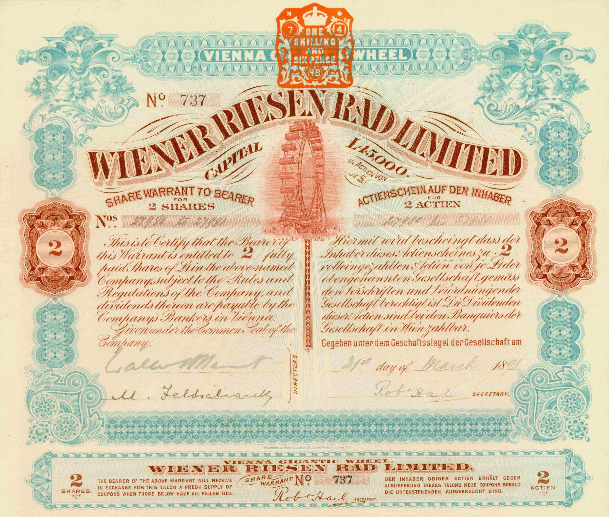

Financial derivatives are essential instruments in the modern financial landscape, serving as indispensable tools for investors looking to speculate, hedge, and effectively manage risks across diverse markets. Among these derivatives, currency warrants offer unique advantages by enabling investors to leverage positions in foreign exchange markets, thus providing the potential for significant financial gains. Unlike options, which typically have shorter life spans, currency warrants grant longer-term exposure to changes in currency exchange rates, making them well-suited for both hedging strategies and speculative endeavors. 

The incorporation of algorithmic trading is revolutionizing the ways in which currency warrants are utilized. Algorithms enhance the efficiency and precision of trading strategies, facilitating faster and more informed decision-making processes. By systematically analyzing large data sets and rapidly executing trades, algorithmic trading minimizes human error and optimizes market timing, leading to more cost-effective trading operations.



This article examines the intersection of currency warrants and algorithmic trading, offering insights into the opportunities and challenges this convergence presents. It highlights how understanding these financial instruments and trading technologies empower investors to navigate the intricate and volatile landscapes of the global financial markets. By equipping themselves with detailed knowledge and strategic approaches, investors can better manage their exposure to currency movements and harness the potential offered by advances in trading technology.

## Table of Contents

## Understanding Financial Derivatives

Financial derivatives are financial contracts whose value is contingent upon an underlying asset, which can include assets such as stocks, bonds, commodities, or currencies. These derivatives are vital for investors for several reasons, including their roles in risk management, speculation, and achieving market exposure without necessitating actual ownership of the underlying asset. Derivatives offer a variety of benefits, making them instrumental in the complex environment of financial markets.

One of the primary uses of financial derivatives is in hedging, which involves mitigating potential losses from adverse price movements in the underlying asset. For instance, a company expecting to receive future payments in a foreign currency can use currency derivatives to hedge against potential depreciation of that currency, thus securing a more predictable financial outcome. On the other hand, these instruments are also used for speculative purposes, where investors aim to profit from the anticipated price movements of the underlying assets. The leverage inherent in derivatives can amplify both potential gains and losses, offering high-risk, high-reward opportunities.

Among the different types of financial derivatives, warrants and options are popular choices for investors. Both instruments provide the right, but not the obligation, to buy or sell an asset at a predetermined price within a specified time frame. This characteristic allows investors to lock in a purchase or sale price, thus managing their risk effectively. The main difference between these two lies in their issuance and expiration; warrants are often issued by companies and have longer time frames compared to options, which are typically standardized contracts traded on exchanges.

In the context of currency warrants, these derivatives allow traders to engage with the dynamics of currency exchange rate fluctuations. They serve as tools for hedging against adverse currency movements or speculating on favorable currency trends. For example, an investor anticipating a rise in the euro against the dollar could purchase a currency warrant that profits from such appreciation. The payoff from such positions is contingent on the movements of currency exchange rates, providing a strategic investment approach for currency exposure.

Overall, financial derivatives, including warrants and currency warrants, offer sophisticated mechanisms for portfolio management, risk mitigation, and speculative strategies. Understanding how these instruments function is crucial for investors looking to capitalize on the varied opportunities within the financial markets.

## What Are Currency Warrants?

Currency warrants are financial instruments that fall under the category of derivatives, providing investors with the right, but not the obligation, to buy or sell a specified amount of currency at a predetermined exchange rate. These instruments are inherently flexible, as they can be employed for both speculative purposes and hedging strategies against currency risk. Unlike standard options, which typically have shorter expiry horizons, currency warrants offer extended maturity periods. This longer timeframe is particularly advantageous for investors looking to engage in protracted strategic positions or those aiming to hedge against anticipated currency fluctuations over an extended duration.

The leverage aspect of currency warrants is significant. By utilizing these instruments, investors have the ability to exert control over larger currency positions with relatively minimal capital involvement. This characteristic of leverage means that both potential profits and potential losses are magnified. For instance, if an investor anticipates a favorable move in the currency exchange rate and the prediction is accurate, the returns can be substantial. Conversely, should the market move against the investor's position, the financial impact can be equally pronounced.

Currency warrants are generally issued by financial institutions, providing a layer of institutional credibility and enabling easier access for retail and institutional investors alike. These warrants can be traded on various exchanges, similarly to stocks and other derivative instruments, thus offering [liquidity](/wiki/liquidity-risk-premium) and facilitating transparent price discovery. As with trading in any derivatives market, understanding the intrinsic and extrinsic factors that influence currency movements is crucial for trading currency warrants effectively.

In summary, currency warrants offer a powerful mechanism for engaging with the foreign exchange markets, providing both the opportunity for amplified returns through leverage and an instrument for long-term strategic engagement or risk management in fluctuating currency environments.

## Algorithmic Trading in Currency Warrants

Algorithmic trading has revolutionized the landscape of financial markets, including the trading of currency warrants. By employing sophisticated algorithms, traders can execute orders with remarkable speed and precision based on predefined criteria. This method stands in stark contrast to traditional trading, where human discretion often leads to slower and potentially less accurate decision-making.

In the trading of currency warrants, algorithms have transformed the process by analyzing large datasets to rapidly identify trading opportunities. These opportunities are typically found by recognizing patterns, [arbitrage](/wiki/arbitrage) prospects, or market trends within milliseconds. Such automation not only enhances trading efficiency but also reduces the likelihood of human errors that might arise from emotional or cognitive biases.

One of the primary advantages of [algorithmic trading](/wiki/algorithmic-trading) in currency warrants is the precision of market timing it offers. By systematically placing buy and sell orders, algorithms can capture micro-movements in the market, thus ensuring optimal entry and [exit](/wiki/exit-strategy) points. This capability is particularly valuable in the context of currency warrants, where small price movements can lead to significant profit or loss due to the leverage typically involved.

Liquidity, a crucial component in the trading ecosystem, is also significantly enhanced through algorithmic trading. By facilitating a [high frequency](/wiki/high-frequency-trading) of transactions, algorithms contribute to a more liquid and efficient market environment. This increased liquidity benefits all market participants by narrowing the bid-ask spreads and reducing the costs associated with trading.

Several common strategies in algorithmic trading can be effectively applied to currency warrants. Market making involves providing liquidity by simultaneously offering to buy and sell currency warrants, capturing the spread as profit. Statistical arbitrage exploits pricing inefficiencies between related markets or securities, including currency pairs, to generate profit. Momentum trading takes advantage of trending markets by executing trades aligned with the current market direction, thereby maximizing profits in currency warrants during sustained price movements.

By integrating algorithmic strategies, traders enhance their ability to leverage market dynamics effectively. Such strategies not only optimize the execution process but also provide a robust framework for managing the inherent risks of trading currency derivatives. As technology continues to evolve, algorithmic trading is poised to further hone the precision and capabilities of currency warrant trading, offering traders a competitive edge in a fast-paced financial environment.

## Risks and Benefits of Investing in Currency Warrants

Currency warrants possess unique characteristics that make them attractive to investors by offering both potential benefits and inherent risks.

### Benefits:

1. **High Leverage**: Currency warrants allow investors to control a larger position with a relatively smaller investment. This leverage amplifies potential returns, providing the opportunity for significant profits. For example, if an investor anticipates a favorable currency move, a small fluctuation can result in disproportionately large gains due to the leveraged exposure.

2. **Hedging Capabilities**: These financial instruments grant the capability to hedge currency exposures over extended periods. By incorporating currency warrants into a portfolio, investors can hedge against unfavorable currency moves, thus protecting international investments from adverse exchange rate fluctuations.

3. **Flexibility in Strategy**: Currency warrants enable diverse strategic applications, including speculative and hedging strategies, adapting to various market conditions and investor goals. This flexibility enhances the potential for portfolio optimization.

### Risks:

1. **Market Volatility**: Currency markets are subject to high volatility, influenced by geopolitical events, economic indicators, and market sentiment. This volatility can lead to rapid and unpredictable price movements, posing risks of substantial losses, especially when leverage is involved.

2. **Potential for Significant Losses**: While leverage can amplify gains, it also magnifies losses. An adverse change in currency rates can result in losses exceeding the initial investment, underscoring the need for cautious leverage utilization and rigorous risk management.

3. **Liquidity Risks**: In less active markets, currency warrants may suffer from liquidity constraints, leading to difficulties in executing trades at desired prices. Illiquidity can widen bid-ask spreads, increasing trading costs and potentially affecting the efficiency of entering or exiting positions.

### Risk Management and Algorithmic Strategies:

To address these challenges, a comprehensive understanding of the underlying currency markets and the deployment of robust risk management strategies are crucial. This includes monitoring economic and political indicators, setting stop-loss limits, and maintaining portfolio diversification. 

Moreover, algorithmic trading strategies can play a significant role in mitigating risks. By utilizing algorithms, traders can execute pre-defined strategies that are data-driven and systematic, reducing the potential for human error and emotional decision-making. Algorithms can swiftly analyze massive datasets to identify market trends and execute trades with optimal timing. This precision can help manage risks associated with market [volatility](/wiki/volatility-trading-strategies) and liquidity by ensuring efficient and controlled trade execution. 

Algorithmic trading thus represents a valuable tool in enhancing the risk-return profile of investing in currency warrants, providing investors with the means to navigate the complexities of these financial instruments effectively.

## Strategies for Trading Currency Warrants

Trading currency warrants effectively involves a blend of analytical skills, risk management, and the strategic application of technological tools. Here, we explore the key strategies that can bolster an investor's ability to navigate the complex world of currency warrants.

### 1. Analytical Approaches

A robust analytical framework is essential for making informed trading decisions. This includes analyzing economic indicators, political events, and their potential impact on currency markets. Investors should regularly monitor geopolitical developments, central bank announcements, and macroeconomic data releases. For instance, variations in interest rates can significantly affect currency values, making it crucial to track monetary policy changes.

Technical analysis is also vital for forecasting currency price movements. Traders often employ technical indicators such as Moving Averages (MA), Relative Strength Index (RSI), and Fibonacci retracement levels to identify potential entry and exit points. While these tools cannot predict the future with certainty, they provide historical context that can guide trading decisions.

### 2. Hedging and Speculative Strategies

Hedging strategies are designed to mitigate the impact of adverse currency fluctuations on an investment portfolio. This involves taking positions in currency warrants that counterbalance existing exposures. For example, if an investor's portfolio is heavily weighted towards a currency likely to depreciate, purchasing a warrant that gains value with the currency's decline can offset potential losses.

On the other hand, speculative strategies seek to capitalize on expected market movements. This can be particularly effective in volatile markets where sharp currency swings offer opportunities for significant returns. However, speculation carries substantial risk, necessitating a disciplined approach to manage potential losses.

### 3. The Role of Algorithmic Trading

Algorithmic trading tools enhance the efficiency and precision of executing currency warrant trades. By deploying algorithms to systematically analyze market data, traders can uncover and act on trading opportunities that might be missed manually. These systems can process vast amounts of data at high speeds, identifying patterns and trends that inform trading strategies.

For instance, algorithmic strategies such as Statistical Arbitrage and Momentum Trading capitalize on pricing inefficiencies and trends, respectively. Statistical Arbitrage involves identifying securities that are mispriced relative to one another, while Momentum Trading focuses on securities exhibiting upward or downward trends in price.

Here's a simple Python example that might be used to backtest a [momentum](/wiki/momentum) trading strategy:

```python
import pandas as pd
import numpy as np

def moving_average(data, window):
    return data.rolling(window=window).mean()

def momentum_strategy(prices, short_window, long_window):
    signals = pd.DataFrame(index=prices.index)
    signals['Price'] = prices
    signals['ShortMA'] = moving_average(signals['Price'], short_window)
    signals['LongMA'] = moving_average(signals['Price'], long_window)
    signals['Signal'] = 0.0
    signals['Signal'][short_window:] = np.where(signals['ShortMA'][short_window:] > signals['LongMA'][short_window:], 1.0, 0.0)
    signals['Position'] = signals['Signal'].diff()
    return signals

# Example usage with random price data
dates = pd.date_range('20230101', periods=100)
price_data = pd.Series(np.random.randn(100), index=dates)
signals = momentum_strategy(price_data, short_window=5, long_window=20)
```

This algorithm calculates short-term and long-term moving averages and generates buy or sell signals based on their crossover points. Such automated systems can reduce human error and improve the timing of trades.

By integrating these strategies—sound analysis, hedging and speculation, and algorithmic trading tools—investors can effectively exploit opportunities in the currency warrant market while managing associated risks.

## Conclusion

Currency warrants present investors with distinct opportunities to capitalize on currency market fluctuations. However, successful engagement in these instruments demands a thorough understanding of the accompanying risks and the development of strategic approaches for their management. The high leverage offered by currency warrants can amplify gains, yet it similarly increases the potential for significant losses. Therefore, a comprehensive risk assessment is paramount.

Algorithmic trading is transforming the utilization of currency warrants, providing a substantial enhancement in the execution of trades. Algorithms improve trading by ensuring transactions are executed with precision and speed, minimizing human errors that can arise from emotional decisions or oversight. These algorithms can process large datasets to identify optimal trading opportunities, making them indispensable tools for traders looking to maximize returns while maintaining rigorous risk control.

As financial markets continuously evolve, it is imperative that investors remain current with emerging technologies and market developments. Staying informed about advancements in trading technology, such as [machine learning](/wiki/machine-learning) and [artificial intelligence](/wiki/ai-artificial-intelligence) in algorithms, can offer a competitive edge. This may enable investors to refine their trading strategies, aligning them more closely with the latest data and market predictions.

For sustained success in investing in financial derivatives like currency warrants, ongoing education on both market fundamentals and the latest technological advancements is crucial. Investors who proactively expand their knowledge base are better equipped to navigate the intricacies of the currency markets and leverage technology to their advantage. Engaging with educational resources, industry analyses, and expert insights can facilitate more informed investment decisions, ultimately enhancing the likelihood of achieving favorable outcomes.

## References & Further Reading

[1]: Bergstra, J., Bardenet, R., Bengio, Y., & Kégl, B. (2011). ["Algorithms for Hyper-Parameter Optimization."](https://dl.acm.org/doi/10.5555/2986459.2986743) Advances in Neural Information Processing Systems 24.

[2]: ["Advances in Financial Machine Learning"](https://www.amazon.com/Advances-Financial-Machine-Learning-Marcos/dp/1119482089) by Marcos Lopez de Prado

[3]: ["Evidence-Based Technical Analysis: Applying the Scientific Method and Statistical Inference to Trading Signals"](https://www.amazon.com/Evidence-Based-Technical-Analysis-Scientific-Statistical/dp/0470008741) by David Aronson

[4]: ["Machine Learning for Algorithmic Trading"](https://github.com/stefan-jansen/machine-learning-for-trading) by Stefan Jansen

[5]: ["Quantitative Trading: How to Build Your Own Algorithmic Trading Business"](https://www.amazon.com/Quantitative-Trading-Build-Algorithmic-Business/dp/1119800064) by Ernest P. Chan