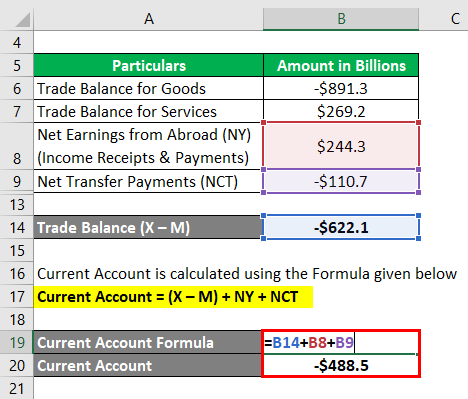

Understanding the intricacies of economic components is crucial for comprehending the broader financial landscape. Among these components, the current account balance serves as a fundamental indicator of a country's economic standing on the global stage. This balance encapsulates a nation's transactions with the world, providing insights into its economic health and performance. It reflects how a country interacts economically with others through trade, income, and transfers.

The current account balance is composed of several critical elements, including the trade balance, net primary income, and net secondary income. By examining these components, policymakers and economists can gain valuable insights into a nation's economic dynamics and make informed decisions regarding its trade and investment policies. A surplus in the current account suggests a nation's exports exceed its imports, whereas a deficit indicates higher imports than exports, affecting the nation's need for external financing.



In this article, we will explore the significance of the current account balance by dissecting its main economic components. We will also examine the mathematical formulation that defines the current account balance, providing a comprehensive understanding of its calculation. Furthermore, the article will address how algorithmic trading—a method that utilizes computer programs to execute orders based on predefined criteria—influences and responds to these economic metrics. Algorithmic trading heavily relies on economic data, and the current account balance serves as a significant indicator that informs trading decisions, particularly in the forex market.

By the end of this article, readers will have a thorough understanding of how these elements interact in the world of finance and trading. This knowledge will enhance both individual and broader economic perspectives, enabling stakeholders to navigate the complexities of global financial markets more effectively.

## Table of Contents

## Understanding Current Account Balance

The current account balance is a crucial indicator of a nation's financial engagements with the global economy, encompassing transactions that influence its economic standing. This balance comprises three primary components: the trade balance, net primary income, and net secondary income. 

The trade balance, a core element of the current account, is the difference between a country's exports and imports of goods and services. A positive trade balance, or surplus, indicates that a nation exports more than it imports, often reflecting a strong competitive position in international markets. Conversely, a negative trade balance, or deficit, suggests that a country imports more goods and services than it exports, potentially signaling a reliance on foreign products and economic structures.

Net primary income pertains to the earnings derived from financial investments and employment abroad. This includes dividends, interest, and wages received by residents from foreign sources, as well as similar payments made to foreign entities operating within the nation. This component is vital for understanding the flow of earnings on international investments and labor.

Net secondary income involves unilateral transfers between countries, which do not involve direct exchange of goods or services. These are typically remittances sent by individuals working abroad back to their home countries, and foreign aid provided to or received from other nations. Although these transfers do not directly impact the production capacity of a nation, they can significantly influence economic well-being through the redistribution of resources.

A surplus in the current account balance, marked by higher export receipts, primary income, or positive secondary income transfers, can enhance a nation’s economic stability by reducing the need for external borrowing and fostering reserves accumulation. On the other hand, a deficit, driven by an excess of imports or payments in primary and secondary incomes, may necessitate borrowing, impacting a country's foreign exchange reserves and financial stability.

In conclusion, the current account balance serves as an essential tool for economists and policymakers. By analyzing its components, these stakeholders can assess the economic health of a nation comprehensively, guiding policies related to international trade and investments.

## Breaking Down Economic Components

The current account balance is an essential measure of a country's economic transactions with the global market and is primarily divided into three components: goods and services, primary income, and secondary income.

The goods and services component includes the trade of tangible products like manufactured goods, raw materials, and agricultural products, as well as intangible services such as tourism, transportation, and financial services. Analyzing this segment reveals the trade balance, which is the difference between a nation's exports and imports. A trade surplus, where exports exceed imports, contributes positively to the current account, whereas a trade deficit, with higher imports than exports, results in a negative impact.

Primary income encompasses inflows and outflows related to foreign investment earnings and wages. This includes profits, dividends, and interest income earned by residents from their investments in foreign assets, minus similar payments made to foreign investors in domestic markets. It also accounts for compensation received by residents working abroad versus payments to foreign workers domestically. This segment provides insight into the country's net earnings on investments and labor, influencing the current account's overall performance.

Secondary income, often referred to as current transfers, includes transactions where a resident entity in one country provides a good, service, or money to a non-resident without expecting anything in return. This category primarily involves remittances, which are funds sent by migrants to their home countries, and foreign aid. While these transfers do not directly reflect the trade of goods or services, they significantly influence the current account balance by either adding to a surplus or increasing a deficit.

Understanding these components aids economists and policymakers in identifying the specific areas contributing to a surplus or deficit in a country’s current account. It provides crucial insights into economic relationships and dependencies, thereby informing decisions related to trade policies, investment strategies, and economic collaborations.

## The Formula for Current Account Balance

The current account balance is a critical economic indicator that aggregates several financial components to reflect a nation’s financial transactions with the global market. The formula for calculating the current account balance is:

$$
\text{Current Account Balance} = (\text{Exports of Goods and Services} - \text{Imports of Goods and Services}) + \text{Net Primary Income} + \text{Net Secondary Income}
$$

1. **Exports and Imports of Goods and Services**: This component represents the difference between what a country sells to and buys from the international market. A positive value indicates that exports exceed imports, contributing positively to the current account balance, while a negative value suggests the opposite.

2. **Net Primary Income**: This involves earnings from abroad, such as dividends, interest, and wages. Net primary income accounts for the income residents earn from abroad minus the payments made to foreign nationals.

3. **Net Secondary Income**: This part involves unilateral transfers, such as remittances, foreign aid, and donations. It measures the net inflow of income that does not require a reciprocal transaction, like exports or services, contributing to the current account balance.

The measurement of each component critically influences the overall calculation, affecting the insights derived from the current account. A surplus in the current account can signal a robust economic state, potentially attracting foreign investment, while a deficit might indicate over-reliance on foreign capital, with implications for foreign exchange and financial markets.

For example, in a Python script, calculating the current account balance given these components could look like this:

```python
def calculate_current_account_balance(exports, imports, net_primary_income, net_secondary_income):
    trade_balance = exports - imports
    current_account_balance = trade_balance + net_primary_income + net_secondary_income
    return current_account_balance

# Example usage
exports = 500  # hypothetical export values
imports = 450
net_primary_income = 30
net_secondary_income = 20

current_account_balance = calculate_current_account_balance(exports, imports, net_primary_income, net_secondary_income)
print(f"Current Account Balance: {current_account_balance}")
```

Accurate measurement and interpretation of these components shape economic policy, currency valuation, and strategic decisions in international finance.

## Algorithmic Trading and Economic Indicators

Algorithmic trading refers to the use of computer algorithms to execute trading orders based on a set of predefined criteria. This approach leverages the speed and precision of computers to make trading decisions, often resulting in enhanced efficiency and reduced transaction costs. Economic indicators play a critical role in formulating these algorithms, providing essential data that influences financial markets.

The current account balance is one such vital economic indicator. It reflects a nation's trade and financial transactions with the rest of the world, impacting currency valuations and investor sentiment. A surplus in the current account often leads to currency appreciation, as it suggests a net inflow of foreign capital. Conversely, a deficit can signal depreciation pressures, resulting in capital outflows as the country becomes more reliant on external financing.

Algorithmic traders incorporate these economic indicators into their models to improve the accuracy of their predictions and the efficiency of their trading strategies. By using real-time data on variables such as export-import dynamics, primary income from investments, and secondary transfers like remittances, traders can craft bots that react instantaneously to market developments. 

Python, with its rich ecosystem of libraries, is often used for developing such algorithms. For instance, traders might utilize the `pandas` library to process and analyze financial data, while `NumPy` and `SciPy` enable complex mathematical computations. Machine learning frameworks, such as `scikit-learn` and `TensorFlow`, can further optimize algorithmic models by identifying patterns and forecasting future market trends based on historical data.

An example of [algorithmic trading](/wiki/algorithmic-trading) in Python might involve the following:

```python
import pandas as pd
import numpy as np
from sklearn.ensemble import RandomForestRegressor

# Load economic data
data = pd.read_csv('economic_indicators.csv')

# Features: export/import ratios, income streams
features = data[['export_import_ratio', 'net_primary_income', 'net_secondary_income']]

# Target variable: currency value
target = data['currency_value']

# Initialize and train a random forest model
model = RandomForestRegressor()
model.fit(features, target)

# Predict future trends
predictions = model.predict(features)
```

Integrating current account balance data allows traders to design strategies that adapt to economic shifts, thereby optimizing their market positions. This integration enhances the potential for profit while mitigating risks associated with volatile market conditions. By continuously updating algorithms with the latest data, traders remain responsive to economic fluctuations, aligning their strategies with evolving market realities.

## The Interplay Between Current Account and Forex Markets

The relationship between a country's current account balance and its currency value in the foreign exchange ([forex](/wiki/forex-system)) markets is intricate and significant. A current account deficit typically suggests that a nation is importing more than it exports, resulting in a higher demand for foreign currency. To finance this deficit, the country might need to attract foreign capital. Consequently, this dependency can lead to currency depreciation as the market anticipates increased supply of the local currency and demand for foreign currencies.

On the other hand, a current account surplus indicates that a country is exporting more than it imports, reflecting a net inflow of foreign currency. This situation can bolster the local currency's value, as the demand for local goods and services in the international market translates into demand for the country's currency. A surplus can enhance investor confidence and stabilize exchange rates, reducing [volatility](/wiki/volatility-trading-strategies) in the forex markets.

Algorithmic trading, favored for its speed and precision, intensely observes these current account shifts. Algorithms are programmed to analyze various economic indicators, including the current account balance, to execute trades based on anticipated market moves. For example, if a country reports a narrowing current account deficit, algorithmic traders might predict a potential currency appreciation, adjusting their trading strategies accordingly to capitalize on expected trends.

Python, with its extensive libraries, is often used to develop and implement such trading algorithms. Below is a simplified example of a Python snippet using hypothetical data to decide on a forex trade based on current account data:

```python
def evaluate_currency_position(current_account_deficit, threshold_deficit):
    if current_account_deficit > threshold_deficit:
        return "sell"
    else:
        return "buy"

# Hypothetical data
current_account_deficit = 50  # in billions of dollars
threshold_deficit = 30  # threshold for selling the currency

# Determine trade action
trade_action = evaluate_currency_position(current_account_deficit, threshold_deficit)
print(f"Recommended action: {trade_action}")
```

This example illustrates a simple decision rule for selling a currency if the current account deficit surpasses a certain threshold, indicating potential depreciation. By integrating real-time data and more complex algorithms, traders can enhance their strategies to mitigate risks and maximize returns amidst currency fluctuations triggered by current account dynamics.

## Conclusion

The current account balance and its economic components serve as critical indicators of a nation's economic health, providing insight into the trade and capital flows with other countries. Understanding its definition and formula equips traders and economists with the ability to navigate complex financial landscapes effectively. The formula:

$$
\text{Current Account Balance} = (\text{Exports of Goods and Services} - \text{Imports of Goods and Services}) + \text{Net Primary Income} + \text{Net Secondary Income}
$$

highlights the interplay between different segments of a nation's economy. By analyzing these components, stakeholders can ascertain the overall economic position—whether it is strengthening through a surplus or facing challenges with a deficit.

Incorporating algorithmic trading strategies based on these insights enhances decision-making and ensures that trading algorithms are responsive to shifts in economic indicators such as the current account balance. These strategies enable traders to leverage data-driven insights to optimize their forex market strategies, thus mitigating risks and maximizing potential returns.

Remaining informed about the components and implications of the current account balance not only enriches individual understanding but also contributes to a broader awareness of economic trends and strategies. Through this knowledge, financial participants can foster more informed and strategic approaches to investment and policy-making, ultimately leading to potentially profitable outcomes and a deeper comprehension of global economic dynamics.

## References & Further Reading

[1]: Lane, P. R., & Milesi-Ferretti, G. M. (2007). ["The External Wealth of Nations Mark II: Revised and Extended Estimates of Foreign Assets and Liabilities, 1970–2004."](https://www.imf.org/en/Publications/WP/Issues/2016/12/31/The-External-Wealth-of-Nations-Mark-II-Revised-and-Extended-Estimates-of-Foreign-Assets-and-18942) Journal of International Economics.

[2]: Obstfeld, M., & Rogoff, K. (1995). ["The Intertemporal Approach to the Current Account."](https://www.nber.org/papers/w4893) Handbook of International Economics.

[3]: ["Macroeconomics"](https://www.investopedia.com/terms/m/macroeconomics.asp) by Paul Krugman and Robin Wells

[4]: Grossman, G. M., & Razin, A. (1985). ["External Debt and Macroeconomic Performance in Latin America."](https://collaborate.princeton.edu/en/publications/direct-foreign-investment-and-the-choice-of-technique-under-uncer) National Bureau of Economic Research.

[5]: ["Algorithmic Trading: Winning Strategies and Their Rationale"](https://www.wiley.com/en-us/Algorithmic+Trading%3A+Winning+Strategies+and+Their+Rationale-p-9781118460146) by Ernie Chan

[6]: ["The Essentials of Trading: From the Basics to Building a Winning Strategy"](https://books.google.com/books/about/The_Essentials_of_Trading.html?id=UBfo0TojOn0C) by John Forman