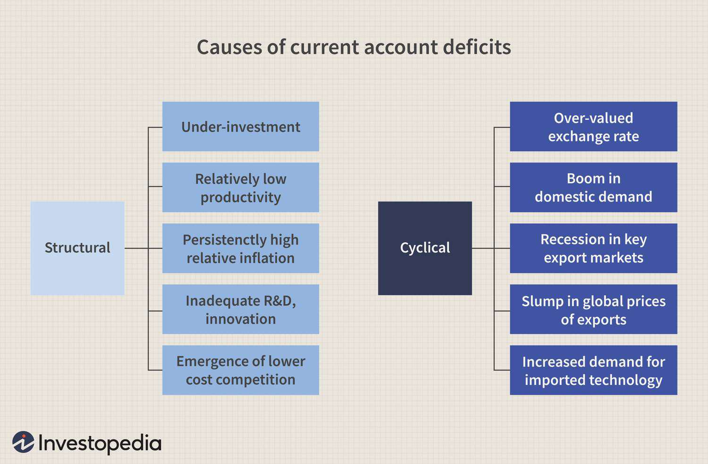

## Table of Contents

## What is a current account deficit?

A current account deficit happens when a country spends more money on foreign goods and services than it earns from selling its own goods and services abroad. This is part of a country's balance of payments, which tracks all the money coming in and going out. When a country has a current account deficit, it means it is importing more than it is exporting. This can be due to buying more foreign products, paying more for foreign investments, or sending more money abroad as gifts or aid.

Having a current account deficit isn't always bad. It can mean that investors from other countries believe in the country's economy and are willing to invest there. This can help the country grow. However, if the deficit is too large and lasts too long, it might cause problems. The country might need to borrow more money from other countries, which could lead to debt. Also, if the currency of the country weakens, it might become more expensive to pay back these loans.

## How is a current account deficit measured?

A current account deficit is measured by looking at the difference between the money a country receives from its exports and the money it spends on imports, plus other financial transactions like income from investments and money transfers. If a country spends more on imports and other payments than it earns from exports and other receipts, it has a current account deficit. This is calculated over a specific period, usually a year, and is part of the country's balance of payments.

To find out the exact number, economists add up all the money coming into the country from selling goods and services abroad, income from investments like interest and dividends, and money transfers like remittances. Then they subtract all the money going out of the country for buying foreign goods and services, sending money abroad for investments, and other transfers. If the total money going out is more than the total money coming in, the result is a current account deficit.

## What are the main components of the current account?

The current account is made up of four main parts. The first part is the trade balance, which is the difference between the value of goods a country exports and the value of goods it imports. If a country exports more goods than it imports, it has a trade surplus. If it imports more than it exports, it has a trade deficit. The second part is the services balance, which is similar but for services like tourism, banking, and shipping. A country can have a surplus or deficit in services too.

The third part of the current account is income from investments. This includes money earned from investments abroad, like interest on loans or dividends from stocks, minus the money paid out to foreign investors for their investments in the country. The last part is called current transfers, which includes money sent home by workers living abroad (remittances), foreign aid, and other one-way transfers of money. All these parts together make up the current account, and if the total of these parts is negative, the country has a current account deficit.

## What are structural causes of a current account deficit?

Structural causes of a current account deficit are long-term factors that affect how much a country imports and exports. One main reason is if a country doesn't have a strong industry for making things people want to buy from other countries. For example, if a country can't make high-tech gadgets or fancy cars, it might have to buy these from other countries. This can lead to a current account deficit because the country is spending more on imports than it's [earning](/wiki/earning-announcement) from exports. Another reason is if a country's workers are less productive than workers in other countries. This can make the country's goods more expensive or lower quality, so people in other countries might not want to buy them.

Another structural cause can be a country's saving and investment patterns. If people in a country don't save much money, there might not be enough money for businesses to invest in growing and making more goods to export. This can lead to a current account deficit because the country is not earning enough from selling things abroad. Also, if a country's government spends a lot more than it earns, it might need to borrow money from other countries, which can add to the current account deficit. These structural issues are hard to fix quickly and need long-term changes in how the country works.

## What are cyclical causes of a current account deficit?

Cyclical causes of a current account deficit are things that change over time, often because the economy is going through different stages. One big reason is when a country's economy is doing really well. When people have more money, they buy more things, including things from other countries. This can lead to a current account deficit because the country is importing more than it's exporting. Another reason is if the economies of other countries are not doing so well. If other countries are in a recession, they might not buy as much from the country, which can also cause a current account deficit.

Another cyclical cause is changes in interest rates. If a country's interest rates go down, people might borrow more money to buy things, including things from other countries. This can increase imports and lead to a current account deficit. On the other hand, if interest rates go up in other countries, people might want to invest their money there instead. This can mean less money coming into the country, which can also lead to a current account deficit. These cyclical causes can change over time as the economy goes through different stages.

## How do structural factors like competitiveness affect the current account deficit?

Structural factors like competitiveness can have a big impact on a country's current account deficit. Competitiveness means how well a country can make things that people in other countries want to buy. If a country is not very competitive, it might not be able to make high-quality or low-cost products. This can lead to a current account deficit because the country has to import more things from other countries. For example, if a country can't make good cars or fancy electronics, it will have to buy these from other countries, which means spending more money on imports than it earns from exports.

Improving competitiveness can help reduce a current account deficit. This can happen if a country invests in better technology or education, which can help its workers make better products. Also, if a country can make things more cheaply than other countries, it might be able to sell more of its products abroad. This would increase its exports and help balance out the money spent on imports. Over time, these changes can help a country have a smaller current account deficit or even turn it into a surplus.

## How do cyclical factors like economic growth impact the current account deficit?

Cyclical factors like economic growth can really change a country's current account deficit. When a country's economy is growing, people usually have more money to spend. They might buy more things, including stuff from other countries. This means the country's imports go up. If the country isn't selling more things to other countries at the same time, it can lead to a bigger current account deficit. So, when the economy is doing well, the current account deficit might get worse because people are buying more from abroad.

On the other hand, if the economy is not doing so well, the current account deficit might get better. When people don't have as much money, they might buy fewer things, including things from other countries. This means imports go down. If the country is still selling the same amount of things to other countries, the current account deficit might get smaller. So, the ups and downs of the economy can make the current account deficit bigger or smaller over time.

## Can you provide examples of countries with structural current account deficits?

The United States often has a structural current account deficit. This is because the country buys a lot more things from other countries than it sells to them. For example, the U.S. imports a lot of cars, electronics, and clothes from places like China and Japan. Even though the U.S. has a big economy, it doesn't make as many of these things itself. This means the U.S. spends more money on imports than it earns from exports, leading to a current account deficit.

Another example is the United Kingdom. The UK also has a structural current account deficit because it imports more than it exports. The UK buys a lot of goods from other countries, like food, cars, and machinery. At the same time, it doesn't sell as many things to other countries. This imbalance means the UK has to spend more money on imports than it gets from exports, which results in a current account deficit. Both the U.S. and the UK have been dealing with these deficits for a long time, showing that they are structural issues.

## Can you provide examples of countries with cyclical current account deficits?

Australia sometimes has a cyclical current account deficit. This happens when the country's economy is doing really well. People in Australia have more money to spend, so they buy more things from other countries. This means Australia's imports go up. If Australia isn't selling more things to other countries at the same time, it can lead to a bigger current account deficit. So, when Australia's economy is growing, its current account deficit might get worse because people are buying more from abroad.

Spain is another example of a country that can have a cyclical current account deficit. When Spain's economy is growing fast, people there spend more money on things from other countries. This makes Spain's imports go up. If Spain's exports don't go up at the same time, the country ends up with a bigger current account deficit. But when Spain's economy slows down, people buy fewer things from other countries, which can make the current account deficit smaller. So, Spain's current account deficit can change a lot depending on how its economy is doing.

## What are the long-term implications of a structural current account deficit?

A structural current account deficit can lead to big problems for a country over a long time. If a country keeps spending more on things from other countries than it earns from selling its own things, it might need to borrow a lot of money from other countries. This can make the country's debt grow bigger and bigger. If the country can't pay back this debt, it might have to ask for help from other countries or big groups like the International Monetary Fund. Also, if a lot of money is leaving the country to pay for imports and debt, it can make the country's money (currency) worth less. This can make things from other countries even more expensive, which makes the current account deficit even worse.

In the long run, a big structural current account deficit can make it hard for a country to grow and get better. The country might not have enough money to invest in things like schools, hospitals, and roads because it's spending so much on imports and debt. This can make it hard for the country to make things that people in other countries want to buy, which keeps the current account deficit going. Over time, this can slow down the country's economy and make life harder for people living there. It's important for countries with these kinds of deficits to find ways to make more things at home and sell more things to other countries to fix the problem.

## How can policy measures address structural versus cyclical current account deficits?

To fix a structural current account deficit, a country needs to make big changes that take a long time. This means working on things like making better products that other countries want to buy. A country can do this by spending money on schools and training so workers can make high-quality things. It can also help businesses by giving them money to buy new machines and technology. Another way is to make it easier for businesses to sell their products in other countries, like by making trade deals. These changes can help a country sell more things abroad and buy fewer things from other countries, which can fix the current account deficit over time.

For a cyclical current account deficit, a country can use shorter-term fixes that change with the economy. When the economy is doing well and people are buying a lot from other countries, the government can try to slow things down a bit. It can do this by raising taxes or making borrowing money more expensive. This can make people spend less on things from other countries. When the economy is not doing so well, the government might want to help it grow by lowering taxes or making borrowing cheaper. This can help people spend more on things from home and less on things from other countries. These short-term changes can help balance out the current account deficit as the economy goes through different stages.

## What are the global economic implications of persistent current account deficits in major economies?

When big countries have current account deficits that last a long time, it can affect the whole world's economy. If a big country like the United States keeps buying more things from other countries than it sells, it might need to borrow a lot of money. This can make the world's money markets change because other countries might lend money to the big country. If too many countries are lending money to one big country, it can make their own economies weaker. Also, if the big country's money (currency) gets weaker because it's borrowing so much, it can make things from other countries more expensive for everyone.

Over time, these big current account deficits can make the world's economy less stable. If a big country can't pay back its debts, it might cause problems for other countries that lent money. This can lead to a big economic crisis that affects everyone. Also, if big countries are not buying as much from other countries because they're trying to fix their deficits, it can slow down the world's economy. So, it's important for big countries to keep their current account deficits under control to help keep the world's economy strong and stable.

## What are the cyclical causes of a current account deficit?

Economic cycles, characterized by periods of expansion and contraction, significantly influence a country's current account balance, often contributing to temporary deficits. During economic expansions, a country's consumers and businesses typically exhibit increased spending power. This heightened demand frequently targets imported goods and services, as incomes rise and consumption patterns expand. Consequently, imports may substantially outstrip exports, leading to a current account deficit.

For instance, during a boom, businesses may invest in imported machinery and technology to capitalize on favorable economic conditions, while consumers might increase their spending on foreign products and services. Although robust consumer and business activity can drive short-term economic growth, it can also suppress the growth of exports, resulting in an imbalance in trade that negatively impacts the current account balance.

Exchange rates play a critical role in these cyclical dynamics. When a country's currency appreciates during an economic upswing, its exports become more expensive for foreign buyers, potentially reducing export volumes. Simultaneously, an appreciated currency makes imports cheaper, further tilting the trade balance toward a deficit. Exchange rate fluctuations are thus pivotal in shaping trade dynamics during different phases of the economic cycle.

Foreign interest rates also influence cyclical deficits. For example, changes in interest rates abroad can affect capital flows and currency valuations, indirectly impacting a country's trade balance. An increase in foreign interest rates might attract capital away from domestic markets, leading to currency depreciation, making exports cheaper and imports more expensive. However, such movements can vary depending on the broader economic environment and market perceptions.

To understand the cyclical causes mathematically, consider the equation for the current account (CA):

$$
\text{CA} = (\text{Exports} - \text{Imports}) + \text{Net Income from Abroad} + \text{Net Transfers}
$$

During an economic boom, the term $(\text{Exports} - \text{Imports})$ often becomes negative as imports rise disproportionately compared to exports, resulting in a deficit.

In summary, economic expansions, currency fluctuations, and foreign interest rates interplay to create temporary current account deficits during different phases of the economic cycle. Recognizing these factors helps in understanding how cyclical economic forces can temporarily disrupt a nation's balance of payments.

## References & Further Reading

[1]: Obstfeld, M., & Rogoff, K. (2000). ["The Six Major Puzzles in International Macroeconomics: Is There a Common Cause?"](https://www.nber.org/papers/w7777) NBER Macroeconomics Annual, 15, 339-390.

[2]: Krugman, P. R. (1991). "Has the Adjustment Process Worked?" In: Feldstein, M., ed., International Economic Policy: Theory and Evidence. University of Chicago Press.

[3]: Mishkin, F. S. (2006). "The Next Great Globalization: How Disadvantaged Nations Can Harness Their Financial Systems to Get Rich." Princeton University Press.

[4]: ["Globalization, Macroeconomic Performance, and Monetary Policy"](https://www.nber.org/papers/w13948) by Obstfeld, M., & Rogoff, K. (2004). European Central Bank Working Paper Series No. 382.

[5]: Chan, E. P. (2013). ["Algorithmic Trading: Winning Strategies and Their Rationale"](https://github.com/ftvision/quant_trading_echan_book). Wiley Trading Series.