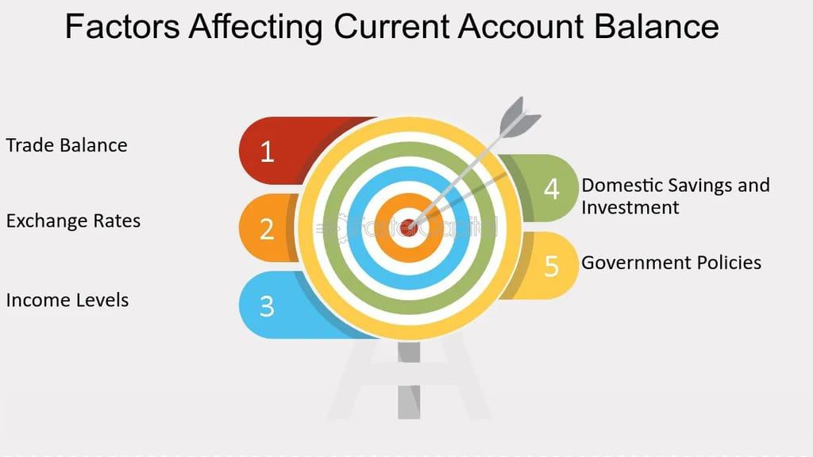

## Table of Contents

## What is a current account?

A current account is a type of bank account that lets you easily deposit and withdraw money. It is mainly used by people who need to do a lot of transactions, like businesses or people who get paid often. You can use a current account to pay bills, get money from an ATM, or transfer money to someone else.

Current accounts usually come with a cheque book and a debit card. Some banks might charge a fee for using a current account, but many offer free services if you keep a certain amount of money in the account. It's a good idea to compare different banks to find the best current account for your needs.

## How does a current account differ from a savings account?

A current account and a savings account are both types of bank accounts, but they are used for different purposes. A current account is meant for everyday transactions. It lets you deposit and withdraw money easily, and you can use it to pay bills, use a debit card, or write cheques. Current accounts are often used by businesses or people who need to handle a lot of money coming in and going out. Some banks might charge a fee for using a current account, but many offer free services if you keep a certain amount of money in the account.

On the other hand, a savings account is designed to help you save money over time. It usually offers a higher interest rate than a current account, which means your money can grow a bit more. Savings accounts are good for people who want to put money away for the future and don't need to use it every day. You can still take money out of a savings account, but there might be limits on how often you can do this, and sometimes you might have to pay a fee if you take out money too often.

In summary, if you need an account for daily transactions and easy access to your money, a current account is the better choice. If you want to save money and earn some interest, a savings account would be more suitable.

## What are the main features of a current account?

A current account is a type of bank account that helps you manage your money every day. It lets you put money in and take money out easily. You can use a current account to pay for things, like bills or shopping, using a debit card or by writing cheques. It's good for people who need to handle a lot of money coming in and going out, like businesses or people who get paid often. Some banks might charge a fee for using a current account, but many offer free services if you keep a certain amount of money in the account.

Current accounts often come with special features to make managing money easier. You might get a cheque book and a debit card, which you can use to pay for things or get cash from an ATM. You can also use online banking or a mobile app to check your balance, transfer money, and pay bills. Some current accounts even let you set up direct debits and standing orders, which means you can pay for things automatically without having to remember to do it each time.

## What are the common fees associated with current accounts?

Current accounts can come with different fees, depending on the bank and the type of account you choose. One common fee is the monthly maintenance fee, which some banks charge just for having the account. This fee can be waived if you keep a certain amount of money in the account or if you use the account a lot. Another fee you might see is for using an ATM that doesn't belong to your bank. If you take out money from another bank's ATM, you might have to pay a small fee for each transaction.

There are also fees for things like overdrafts, where you spend more money than you have in the account. Banks might charge you a fee for going over your limit, and they might also charge interest on the amount you owe. Some current accounts have fees for paper statements, too. If you want to get a paper copy of your account activity, you might have to pay for it. It's a good idea to check with your bank to see what fees they charge and how you can avoid them.

## How do interest rates affect current accounts?

Interest rates can affect current accounts in a few ways. Usually, current accounts don't offer much interest on the money you keep in them. This is because they are meant for everyday use, not for saving money. But if interest rates go up, some banks might start offering a little more interest on current accounts to attract more customers. Even so, the interest you get from a current account is usually very low compared to what you might get from a savings account.

On the other hand, if interest rates go down, the interest you earn on your current account might get even smaller. Also, if you use an overdraft on your current account, the interest rate on that can change too. When interest rates go up, the cost of borrowing money through an overdraft might go up as well. So, it's a good idea to keep an eye on interest rates if you use an overdraft a lot.

## What role does inflation play in the management of a current account?

Inflation is when the prices of things go up over time. This can affect how you manage your current account. If inflation is high, the money in your current account might not be worth as much in the future. This means that the same amount of money won't buy as much as it used to. So, if you keep a lot of money in your current account, it might lose value because of inflation.

To deal with inflation, you might want to move some of your money from your current account into a savings account or another type of investment that can grow faster than inflation. A current account is good for everyday spending, but it's not the best place to keep money if you want it to keep its value over time. By understanding inflation, you can make better choices about how to manage your money in your current account.

## How do economic policies influence current account balances?

Economic policies can have a big effect on current account balances. A current account balance shows how much money a country gets from selling things to other countries and how much it spends on buying things from them. If a country's government makes rules that help its businesses sell more stuff to other countries, like giving them money to help them grow, the current account balance might get better. On the other hand, if the government makes it harder for businesses to sell things abroad, maybe by putting up taxes on exports, the current account balance might get worse.

Interest rates set by the government can also change the current account balance. If a country raises its interest rates, it might attract more money from people in other countries who want to save their money there. This can make the country's money worth more, which can make its exports more expensive and imports cheaper. As a result, the current account balance might go down because the country is selling less to other countries and buying more from them. So, economic policies can really change how much money a country makes and spends with the rest of the world.

## What are the impacts of global trade on a country's current account?

Global trade can have a big effect on a country's current account. The current account shows if a country is making more money from selling things to other countries than it is spending on buying things from them. If a country sells a lot of things to other countries, its current account balance can get better. For example, if a country is good at making cars and sells a lot of them to other countries, it will have more money coming in than going out. On the other hand, if a country buys a lot of things from other countries, like electronics or food, it might spend more money than it makes, which can make its current account balance worse.

Changes in global trade can also affect a country's current account. If other countries start buying less from a country because they find cheaper options somewhere else, the country's current account balance might go down. For example, if a country that used to buy a lot of oil from another country starts buying it from a new country that sells it cheaper, the first country will have less money coming in. Also, if a country's own people start buying more things from other countries, like clothes or toys, this can make the current account balance worse because more money is going out than coming in. So, global trade is really important for a country's current account.

## How do exchange rates affect the current account?

Exchange rates can have a big effect on a country's current account. The current account shows if a country is making more money from selling things to other countries than it is spending on buying things from them. If a country's money gets stronger compared to other countries' money, its exports can become more expensive for people in other countries to buy. This can make people buy less from that country, which can make the current account balance worse. On the other hand, if the country's money gets weaker, its exports can become cheaper, and people in other countries might buy more, which can make the current account balance better.

At the same time, if a country's money gets stronger, it can make imports cheaper for people in that country to buy. This means they might buy more things from other countries, which can make the current account balance worse because more money is going out than coming in. If the country's money gets weaker, imports can become more expensive, and people might buy less from other countries, which can help the current account balance. So, changes in exchange rates can really change how much a country makes and spends with the rest of the world.

## What are the implications of a current account surplus or deficit?

A current account surplus means that a country is making more money from selling things to other countries than it is spending on buying things from them. This can be good because it shows that the country is doing well in global trade. It might mean that the country's businesses are strong and that other countries want to buy what they are selling. However, a big surplus can also cause problems. It might make the country's money stronger, which can make its exports more expensive and hurt businesses that sell to other countries. Also, if the country keeps saving more money than it spends, it might not invest enough in its own economy, which can slow down growth.

A current account deficit means that a country is spending more money on buying things from other countries than it is making from selling things to them. This can be okay if the country is borrowing money to invest in things that will help it grow, like new factories or schools. But if the deficit is too big and keeps growing, it can be a problem. The country might have to borrow a lot of money from other countries, and if it can't pay it back, it could face economic trouble. Also, a big deficit might mean that the country is not good at selling things to other countries, which can hurt its businesses and economy in the long run.

## How can fiscal policy be used to manage current account imbalances?

Fiscal policy can be used to manage current account imbalances by changing how much the government spends and how much it taxes. If a country has a big current account deficit, it means it is buying more from other countries than it is selling to them. To fix this, the government can spend less money or raise taxes. This can help because when the government spends less, people and businesses might spend less on things from other countries. Also, if taxes go up, people might have less money to spend on imports, which can help lower the deficit. By doing this, the government can try to make the current account more balanced.

On the other hand, if a country has a big current account surplus, it means it is selling more to other countries than it is buying from them. To fix this, the government can spend more money or lower taxes. When the government spends more, it can help the economy grow and people might buy more things from other countries. If taxes are lower, people might have more money to spend on imports, which can help lower the surplus. By using fiscal policy this way, the government can try to make the current account more balanced and keep the economy healthy.

## What advanced strategies can businesses use to optimize their current account management in international trade?

Businesses can use several advanced strategies to optimize their current account management in international trade. One key strategy is to use hedging to protect against currency fluctuations. By using financial instruments like forward contracts or options, businesses can lock in exchange rates for future transactions, reducing the risk of losing money if the value of the currency changes. Another strategy is to diversify their markets and suppliers. By selling to and buying from different countries, businesses can spread their risk and not depend too much on one market. This can help them keep a healthy current account balance even if one market is not doing well.

Another important strategy is to use advanced cash management techniques. Businesses can use tools like cash pooling to manage their money more efficiently across different countries. Cash pooling allows them to move money between different accounts to make sure they always have enough money where they need it. This can help them avoid overdrafts and reduce the cost of borrowing money. Finally, businesses can use technology to their advantage. By using software that helps them track and analyze their transactions in real-time, they can make better decisions about when to buy or sell, which can help them keep their current account in good shape.

## What is the Current Account and how can we understand it?

The current account is a crucial component of a nation's balance of payments, representing the net flow of goods, services, income, and transfer payments to and from the rest of the world. It comprises three primary components: the trade balance, net earnings on cross-border investments (including both primary and secondary incomes), and unilateral transfers.

1. **Trade Balance**: This is the difference between a country's exports and imports of goods and services. A positive trade balance indicates that a country exports more than it imports, contributing to a current account surplus, whereas a negative trade balance suggests a current account deficit.

2. **Net Earnings on Cross-Border Investments**: This part of the account includes income received from investments abroad minus income paid to foreign investors. Net earnings are divided into:
   - **Primary Income**: Comprising income from employment and investment returns such as dividends, interests, and profits.
   - **Secondary Income**: Including current transfers such as remittances, foreign aid, pensions, and tax payments.

3. **Transfer Payments**: These are unilateral transactions where a country's residents receive or provide income without providing any goods or services in return. Examples include foreign aid and personal transfers.

Mathematically, the current account can be expressed as:

$$
\text{Current Account} = (\text{Exports} - \text{Imports}) + \text{Net Income from Abroad} + \text{Net Current Transfers}
$$

Where:
- $\text{Exports} - \text{Imports}$ is the trade balance.
- $\text{Net Income from Abroad}$ encapsulates primary and secondary incomes.
- $\text{Net Current Transfers}$ represent the overall balance of unilateral transfers.

A surplus in the current account signifies that a country is a net exporter, often reflecting economic strength and competitiveness. Conversely, a deficit indicates a nation is a net importer, which might suggest economic vulnerabilities if persistent over the long term.

The current account status is a significant indicator of economic health and stability. Policymakers and economists monitor it to assess a country's international economic position, its capacity to pay foreign debts, and its need for foreign capital. The balance is instrumental in guiding foreign exchange policies and determining the economic relationships of a country with the global market.

## What are the key economic factors affecting the current account?

Trade policies are fundamental in shaping a country's trade balance, which, in turn, affects its current account. These policies include tariffs, subsidies, import quotas, and export incentives. By imposing tariffs, a country can make imported goods more expensive, encouraging consumers to purchase domestically produced goods, which can lead to an improved trade balance as imports decrease. On the other hand, subsidies for domestic industries can make goods more competitive internationally, potentially increasing exports. These policy tools must be used judiciously as they can invite retaliatory measures from trade partners, sometimes leading to trade wars that adversely affect the current account.

Exchange rates play a crucial role in a country’s international trade competitiveness. A weaker domestic currency makes a country's exports cheaper and imports more expensive, potentially improving the trade balance. Conversely, a strong currency can lead to a trade deficit by making exports relatively expensive and imports cheaper. The relationship can be analyzed using the formula: 

$$
\text{Trade Balance} = X - M,
$$

where $X$ represents exports and $M$ denotes imports. Changes in exchange rates effectively alter this balance by impacting $X$ and $M$.

Global demand significantly influences the current account by dictating the quantity of goods and services a nation can sell abroad. When global demand for a country's products increases, its exports grow, positively impacting the current account. This demand is also affected by global economic conditions, consumer preferences, and technological advancements. For instance, a spike in global demand for electronic products can benefit a country that specializes in electronics manufacturing, leading to a surplus in the trade balance.

Economic growth, both domestic and international, is crucial in determining trade dynamics. Rapid economic growth often leads to increased imports as the demand for foreign goods rises to satisfy consumer and industrial needs. However, if this growth is driven by increased production and competitiveness, it can also result in higher exports. Internationally, strong economic growth in partner countries typically increases their import demand, benefiting other countries’ export sectors. This interplay between domestic and global economic conditions creates a complex relationship, where simultaneous growth in multiple regions can either exacerbate or mitigate trade imbalances.

Effective management of these economic factors can lead to a healthier current account, influencing a nation's economic stability and growth prospects.

## References & Further Reading

[1]: Krugman, P. R., & Obstfeld, M. (2009). ["International Economics: Theory & Policy."](https://archive.org/details/internationaleco0008krug) Pearson Education.

[2]: Gopinath, G., Helpman, E., & Rogoff, K. (Eds.). (2014). ["Handbook of International Economics."](https://scholar.harvard.edu/gopinath/publications/handbook-international-economic-vol-4) North-Holland.

[3]: Murphy, K. P. (2012). ["Machine Learning: A Probabilistic Perspective."](https://vdoc.pub/documents/machine-learning-a-probabilistic-perspective-5nh9osgl8qq0) MIT Press.

[4]: Lopez de Prado, M. (2018). ["Advances in Financial Machine Learning."](https://www.amazon.com/Advances-Financial-Machine-Learning-Marcos/dp/1119482089) Wiley.

[5]: Shreve, S. E. (2004). ["Stochastic Calculus for Finance I: The Binomial Asset Pricing Model."](https://link.springer.com/book/10.1007/978-0-387-22527-2) Springer.

[6]: Zhang, H., & Chan, N. H. (2009). ["Exchange Rate Dynamics and the Current Account: A Panel VAR Analysis."](https://link.springer.com/article/10.4209/aaqr.2014.12.0322) Open Economies Review, 20(1), 73–95.

[7]: Basu, K. (2013). ["Analytical Peace Economics: The Illusion of War for Peace and Prosperity."](https://www.taylorfrancis.com/books/edit/10.4324/9781315677439/analytical-peace-economics-partha-gangopadhyay-nasser-elkanj) Peace Economics, Peace Science, and Public Policy.