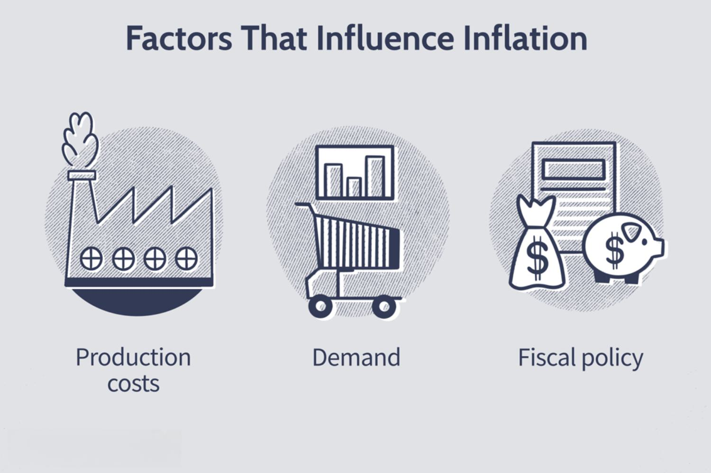

International trade plays a crucial role in shaping the current account balance of nations by determining their net financial interactions with other countries. This balance, incorporating elements such as the trade balance, net income on cross-border investments, and transfer payments, serves as a pivotal indicator of a country's economic standing and stability. In an interconnected global economy, fluctuations in one country's current account can ripple across international borders, influencing markets and economic policies worldwide.

For investors, economists, and policymakers, grasping the nuances of how international trade impacts the current account is essential. Trade policies, exchange rates, and global demand are among the many economic factors that affect this balance. A trade surplus, which highlights a surplus of exports over imports, generally strengthens a country's current account position, whereas a persistent trade deficit might suggest economic vulnerabilities.



Moreover, advancements in technology have introduced algorithmic trading to international markets, altering how trade data and economic indicators are interpreted and acted upon. These automated, algorithm-driven trades enable market participants to react swiftly to changes in economic indicators, including those affecting the current account. As a result, the landscape of international trade and finance is increasingly influenced by both traditional economic factors and modern technological innovations.

This article investigates these complex relationships, highlighting how international trade affects current account balances, identifying the economic variables at play, and examining the impact of algorithmic trading on today's global markets. Understanding these dynamics is crucial for making informed decisions in an ever-evolving economic environment.

## Table of Contents

## Understanding the Current Account

The current account is a crucial component of a nation's balance of payments, representing the net flow of goods, services, income, and transfer payments to and from the rest of the world. It comprises three primary components: the trade balance, net earnings on cross-border investments (including both primary and secondary incomes), and unilateral transfers.

1. **Trade Balance**: This is the difference between a country's exports and imports of goods and services. A positive trade balance indicates that a country exports more than it imports, contributing to a current account surplus, whereas a negative trade balance suggests a current account deficit.

2. **Net Earnings on Cross-Border Investments**: This part of the account includes income received from investments abroad minus income paid to foreign investors. Net earnings are divided into:
   - **Primary Income**: Comprising income from employment and investment returns such as dividends, interests, and profits.
   - **Secondary Income**: Including current transfers such as remittances, foreign aid, pensions, and tax payments.

3. **Transfer Payments**: These are unilateral transactions where a country's residents receive or provide income without providing any goods or services in return. Examples include foreign aid and personal transfers.

Mathematically, the current account can be expressed as:

$$
\text{Current Account} = (\text{Exports} - \text{Imports}) + \text{Net Income from Abroad} + \text{Net Current Transfers}
$$

Where:
- $\text{Exports} - \text{Imports}$ is the trade balance.
- $\text{Net Income from Abroad}$ encapsulates primary and secondary incomes.
- $\text{Net Current Transfers}$ represent the overall balance of unilateral transfers.

A surplus in the current account signifies that a country is a net exporter, often reflecting economic strength and competitiveness. Conversely, a deficit indicates a nation is a net importer, which might suggest economic vulnerabilities if persistent over the long term.

The current account status is a significant indicator of economic health and stability. Policymakers and economists monitor it to assess a country's international economic position, its capacity to pay foreign debts, and its need for foreign capital. The balance is instrumental in guiding foreign exchange policies and determining the economic relationships of a country with the global market.

## Key Economic Factors Affecting the Current Account

Trade policies are fundamental in shaping a country's trade balance, which, in turn, affects its current account. These policies include tariffs, subsidies, import quotas, and export incentives. By imposing tariffs, a country can make imported goods more expensive, encouraging consumers to purchase domestically produced goods, which can lead to an improved trade balance as imports decrease. On the other hand, subsidies for domestic industries can make goods more competitive internationally, potentially increasing exports. These policy tools must be used judiciously as they can invite retaliatory measures from trade partners, sometimes leading to trade wars that adversely affect the current account.

Exchange rates play a crucial role in a country’s international trade competitiveness. A weaker domestic currency makes a country's exports cheaper and imports more expensive, potentially improving the trade balance. Conversely, a strong currency can lead to a trade deficit by making exports relatively expensive and imports cheaper. The relationship can be analyzed using the formula: 

$$
\text{Trade Balance} = X - M,
$$

where $X$ represents exports and $M$ denotes imports. Changes in exchange rates effectively alter this balance by impacting $X$ and $M$.

Global demand significantly influences the current account by dictating the quantity of goods and services a nation can sell abroad. When global demand for a country's products increases, its exports grow, positively impacting the current account. This demand is also affected by global economic conditions, consumer preferences, and technological advancements. For instance, a spike in global demand for electronic products can benefit a country that specializes in electronics manufacturing, leading to a surplus in the trade balance.

Economic growth, both domestic and international, is crucial in determining trade dynamics. Rapid economic growth often leads to increased imports as the demand for foreign goods rises to satisfy consumer and industrial needs. However, if this growth is driven by increased production and competitiveness, it can also result in higher exports. Internationally, strong economic growth in partner countries typically increases their import demand, benefiting other countries’ export sectors. This interplay between domestic and global economic conditions creates a complex relationship, where simultaneous growth in multiple regions can either exacerbate or mitigate trade imbalances.

Effective management of these economic factors can lead to a healthier current account, influencing a nation's economic stability and growth prospects.

## The Relationship Between International Trade and the Current Account

Trade balances play a pivotal role in determining a country's current account status, distinguishing between a trade surplus and a trade deficit. A trade surplus occurs when a nation's exports exceed its imports, contributing positively to the current account. Conversely, a trade deficit arises when imports surpass exports, negatively impacting the current account balance. The trade balance is a fundamental component of the current account, directly influencing a nation's economic health and stability.

### Impact of Factor Endowments
Countries often shape their trade strategies based on [factor](/wiki/factor-investing) endowments, which refer to the resources available within their borders. These resources include natural resources, labor, capital, and technology, each influencing what products a country is most efficient at producing and therefore exporting. For example, a country rich in natural resources like oil or minerals will likely export these commodities, reinforcing its trade surplus if global demand for these resources is high. In contrast, countries with limited natural resources might focus more on human capital-intensive industries or technology-driven sectors. According to the Heckscher-Ohlin theory, a country will export goods that intensively use its abundant resources while importing goods that use its scarce resources. This specialization not only optimizes production efficiency but also aligns with global demand, affecting trade balances and current account outcomes.

### Influence of Technological Advancements
Technological advancements significantly impact a country's trade position by enhancing competitiveness. Innovations can lead to increased productivity, reducing costs and improving the quality of goods and services. For instance, automation and [artificial intelligence](/wiki/ai-artificial-intelligence) can streamline manufacturing processes, enabling countries to produce more efficiently and at a lower cost. This increase in competitiveness can lead to higher exports, contributing to a trade surplus and improving the current account balance.

Moreover, technology can open new markets through digital trade platforms, facilitating cross-border commerce and reaching a global customer base. The development of e-commerce platforms and digital payment systems has allowed countries to expand their export markets beyond traditional trade channels, further influencing their trade balances.

In summary, the relationship between international trade and the current account is heavily influenced by trade balances, factor endowments, and technological advancements. Understanding these elements is essential for comprehending a country's economic interactions on the global stage and predicting future current account trends.

## Algorithmic Trading in International Markets

Algorithmic trading, commonly known as algo trading, leverages sophisticated algorithms to execute trades on financial markets with precision and rapidity. These algorithms pre-program strategies to take advantage of market conditions, ensuring trades occur at optimal speeds and prices. One of the primary benefits of [algorithmic trading](/wiki/algorithmic-trading) is its ability to enhance market efficiency by processing vast amounts of data and executing large volumes of trades, which can reduce transaction costs and provide [liquidity](/wiki/liquidity-risk-premium). This increase in market efficiency has a profound impact on international trade dynamics, offering a smoother and more predictable trading environment.

Algo trading systems can swiftly analyze macroeconomic indicators, including current account data, and adjust trading strategies accordingly. For instance, if a country reports a significant surplus in its current account, indicating a strong trade balance and potential currency appreciation, algorithmic systems may react by rebalancing portfolios or adjusting foreign exchange positions. This automated response allows market participants to capitalize on economic shifts rapidly, maintaining competitive advantage in global markets.

Algorithmic trading strategies often incorporate complex quantitative models and [machine learning](/wiki/machine-learning) techniques to predict market movements. Algorithms can be designed to analyze historical data patterns, detect anomalies, and identify trading opportunities based on economic releases, news events, and statistical [arbitrage](/wiki/arbitrage). These capabilities are crucial in a globalized economy, where economic data from one region can impact financial markets worldwide.

Additionally, algo trading enhances transparency and reduces the human error component in trading activities. Algorithmic systems follow specific rules without the influence of emotional or psychological biases, allowing for more consistent implementation of trading strategies. The adoption of such technology has become increasingly prevalent in international markets, driving an evolution in how trading is conducted and influencing the strategies of institutional and individual investors alike.

In summary, algorithmic trading plays a pivotal role in modern international markets by enhancing efficiency, liquidity, and responsiveness to economic indicators. Its capacity to rapidly process and act upon current account data and other macroeconomic variables underscores the evolving landscape of global financial markets.

## Case Study: Current Account Trends and Algo Trading

Analyses of various countries' current account balances reveal essential insights into their economic strategies and the broader implications for global markets. A current account surplus, for instance, often reflects a country's robust export sector or significant income from foreign investments, while a deficit might indicate heavy reliance on imported goods and services. How countries manage these balances is integral to their economic policy and can significantly influence international capital flows. Moreover, algorithmic trading has started playing a pivotal role in how markets respond to and adapt these economic indicators.

Algorithmic trading, with its ability to process vast amounts of data and execute trades at high speeds, has become a crucial component of modern financial markets. It allows traders and financial institutions to incorporate economic data, such as current account figures, into their trading strategies effectively. By leveraging sophisticated algorithms, traders can quickly analyze trends and patterns in economic indicators, enabling them to make more informed decisions and capitalize on market inefficiencies.

For example, consider a scenario where a country releases positive current account data, indicating a surplus due to increased exports. Algorithmic trading systems can rapidly respond to this information by optimizing trading strategies to exploit anticipated market reactions. Such systems analyze historical data and predict potential price movements based on the current account trends, facilitating immediate trade execution to maximize profits. Here's a simplified Python example to illustrate how algorithmic trading might leverage current account data:

```python
import pandas as pd
import numpy as np

# Sample current account data
current_account_data = {
    'Country': ['A', 'B', 'C'],
    'Current Account Balance': [5.2, -3.1, 2.4],  # In billions of USD
    'Exports Growth Rate': [0.05, -0.02, 0.03]  # Growth rates
}

# Convert to DataFrame
df = pd.DataFrame(current_account_data)

# Define a simple trading strategy based on current account trends
def trading_strategy(balance, growth_rate):
    if balance > 0 and growth_rate > 0:
        return "Buy"
    elif balance < 0 and growth_rate < 0:
        return "Sell"
    else:
        return "Hold"

# Apply the trading strategy
df['Trading Decision'] = df.apply(lambda row: trading_strategy(row['Current Account Balance'], row['Exports Growth Rate']), axis=1)

print(df)
```

Real-world examples of algorithmic trading's impact are seen in diverse markets, from equities to foreign exchange, where these systems adjust positions and strategies in response to macroeconomic shifts. In particular, during periods of significant economic announcements or changes in current account status, algorithmic systems can exploit the [volatility](/wiki/volatility-trading-strategies) and arbitrage opportunities presented by rapid information flow.

For instance, Japan's history of current account surpluses, driven by its strong export base, has often led to an appreciation of the yen. Algorithmic trading systems are programmed to recognize such patterns, swiftly executing trades in currency markets to benefit from potential yen strength.

As technology continues to evolve, so does the sophistication of algorithmic trading. Machine learning and artificial intelligence are increasingly incorporated into trading models, enhancing their ability to adjust dynamically to economic trends, including those related to current account changes. The future promises even greater integration of these technologies, reinforcing the significance of understanding current account trends for traders and policymakers alike.

## Future Outlook: The Evolution of Trade and Algorithmic Trading

Emerging technologies and trends in algorithmic trading are significantly impacting the global trade landscape. As algorithmic trading continues to evolve, it introduces efficiencies, complexities, and challenges that influence current account balances and broader economic interactions. Algorithmic trading utilizes computer algorithms to make trading decisions, executing orders at speeds and scales impossible for human traders. This not only enhances market efficiency but also introduces new dynamics to international trade.

One of the key advancements in algorithmic trading is the increasing role of artificial intelligence (AI) and machine learning (ML). These technologies enable sophisticated pattern recognition and predictive analytics, allowing algorithms to adapt to ever-changing market conditions. For example, algorithms can analyze vast amounts of data, including macroeconomic indicators, trade balances, and geopolitical events, to forecast trends and adjust trading strategies accordingly. This capability can directly affect a nation’s trade dynamics and its current account by swiftly responding to economic data and global economic shifts.

Moreover, high-frequency trading ([HFT](/wiki/high-frequency-trading-strategies)), a subset of algorithmic trading, is gaining prominence. HFT involves executing a large number of orders in fractions of a second, capitalizing on small price discrepancies. Although controversial due to its potential to increase market volatility, HFT can also improve liquidity and reduce spreads. These changes influence the cost of trading internationally and can alter competitive positions in global markets.

Looking forward, the integration of blockchain technology presents promising opportunities for algorithmic trading. Blockchain can offer enhanced security, transparency, and efficiency in settlement processes. This technology can streamline cross-border transactions, reduce fraud, and enable real-time trade settlements, consequently affecting trade balances and economic indicators.

The implications for stakeholders in the global economy are profound. Policymakers, investors, and businesses must adapt to these technological advancements. For policymakers, understanding the impact of algorithmic trading on trade policies and current account balances is critical. Regulatory bodies may need to consider frameworks that ensure fair market practices without stifling innovation.

For investors and businesses, staying informed about the developments in algorithmic trading is essential. Investment strategies may need to incorporate AI-driven insights and algorithmic interventions, while businesses can leverage these technologies to optimize their supply chain and international trade operations.

In conclusion, the evolution of algorithmic trading reshapes international trade, with current account balances reflecting these dynamic changes. The continuous development of technologies like AI and blockchain will likely influence global economic interactions further. Stakeholders must remain vigilant and adaptive to harness these advancements for economic growth and stability.

## Conclusion

The current account is a significant economic indicator that encapsulates a country's financial transactions with the rest of the world. It is heavily affected by international trade dynamics and a multitude of economic factors. When engaging in global trade, nations encounter fluctuations in trade balances that directly impact the current account. For instance, a robust trade surplus enhances the current account, reflecting a net export position that signifies economic strength and competitiveness.

Algorithmic trading injects a sophisticated layer into financial markets by allowing for the rapid processing and analysis of economic data, including trade and current account figures. This technologically driven trading approach enables markets to react swiftly to real-time economic indicators, incorporating them within pre-defined trading strategies. By integrating big data analytics and machine learning, algorithmic trading can identify subtle patterns and trends, adjusting to the economic landscape effectively, thereby influencing trade dynamics and market liquidity.

Understanding the interplay between the current account, international trade, and algorithmic trading is essential for various stakeholders, including investors, economists, and policymakers. The insights gleaned from these relationships guide economic forecasting and help devise strategic investment decisions. As international trade continues to evolve and algorithmic trading becomes more prevalent, the ability to interpret these dynamics enhances the accuracy of economic predictions and optimizes resource allocation in global markets.

## References & Further Reading

[1]: Krugman, P. R., & Obstfeld, M. (2009). ["International Economics: Theory & Policy."](https://archive.org/details/internationaleco0008krug) Pearson Education.

[2]: Gopinath, G., Helpman, E., & Rogoff, K. (Eds.). (2014). ["Handbook of International Economics."](https://scholar.harvard.edu/gopinath/publications/handbook-international-economic-vol-4) North-Holland.

[3]: Murphy, K. P. (2012). ["Machine Learning: A Probabilistic Perspective."](https://vdoc.pub/documents/machine-learning-a-probabilistic-perspective-5nh9osgl8qq0) MIT Press.

[4]: Lopez de Prado, M. (2018). ["Advances in Financial Machine Learning."](https://www.amazon.com/Advances-Financial-Machine-Learning-Marcos/dp/1119482089) Wiley.

[5]: Shreve, S. E. (2004). ["Stochastic Calculus for Finance I: The Binomial Asset Pricing Model."](https://link.springer.com/book/10.1007/978-0-387-22527-2) Springer.

[6]: Zhang, H., & Chan, N. H. (2009). ["Exchange Rate Dynamics and the Current Account: A Panel VAR Analysis."](https://link.springer.com/article/10.4209/aaqr.2014.12.0322) Open Economies Review, 20(1), 73–95.

[7]: Basu, K. (2013). ["Analytical Peace Economics: The Illusion of War for Peace and Prosperity."](https://www.taylorfrancis.com/books/edit/10.4324/9781315677439/analytical-peace-economics-partha-gangopadhyay-nasser-elkanj) Peace Economics, Peace Science, and Public Policy.