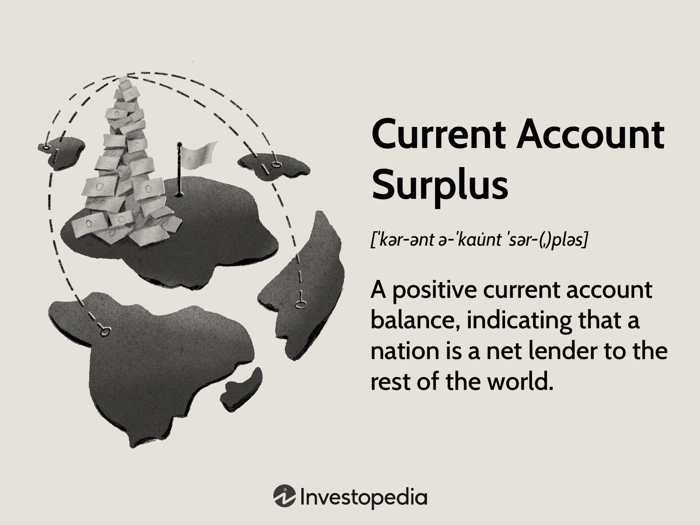

Economic surplus and current account surplus are critical concepts in understanding a country's economic health and global economic dynamics. Economic surplus refers to the benefits that producers and consumers receive in a market at a given price level. It consists of consumer surplus, which is the difference between what consumers are willing to pay and what they actually pay, and producer surplus, which is the difference between the price at which producers are willing to sell and the actual sale price. These surpluses are indicative of market efficiency and economic vitality, serving as vital measures of economic health and competitiveness.

A current account surplus occurs when a country's total exports of goods, services, and transfers exceed its total imports. This is a key component of a nation’s balance of payments, reflecting the difference between national savings and investment. A surplus can signal strong export performance, competitive industries, and prudent consumption behaviors domestically. While a surplus can contribute to economic growth and stability, it also presents challenges, such as currency appreciation and its impact on global trade balances.



Algorithmic trading has grown significantly, transforming financial markets by using computer algorithms to execute trades at speeds and frequencies beyond human capability. This method relies on mathematical models and complex algorithms to make rapid trading decisions and is a staple in today’s financial markets due to its efficiency and ability to manage large volumes of transactions. As technological advancements continue to unfold, algorithmic trading is becoming a pivotal tool in managing economic strategies, including surplus management.

The purpose of this article is to explore the intersection of these critical economic phenomena: economic surplus, current account surplus, and algorithmic trading. Understanding the management of economic and current account surpluses is essential for maintaining economic stability and competitiveness in an increasingly interconnected global environment. Algorithmic trading plays a crucial role in these processes, offering both opportunities and challenges for nations aiming to leverage their economic position effectively.

This article will proceed as follows. First, it will define economic surplus, including its key components and global measurement practices. Next, it will explain the concept of a current account surplus and its implications for national economies, followed by a discussion on countries with notable surpluses and the strategies they employ to maintain them. The focus will then shift to algorithmic trading, highlighting its role as a modern financial tool. Finally, the article will examine the interplay between economic surpluses and algorithmic trading, discussing both the benefits and potential risks associated with these phenomena, and presenting strategies to mitigate these risks while maximizing economic benefits.

## Table of Contents

## Understanding Economic Surplus

Economic surplus, a fundamental concept in economics, refers to the benefits accrued by consumers and producers in a market transaction. This surplus is split into two primary components: consumer surplus and producer surplus.

**Consumer Surplus** is the difference between the total amount that consumers are willing and able to pay for a good or service and the actual amount they pay. It reflects the extra satisfaction or utility consumers receive. If the demand curve for a product is linear, consumer surplus can be visualized as the area beneath the demand curve and above the price level, up to the quantity purchased.

**Producer Surplus** represents the difference between what producers are willing to accept for a good or service and what they actually receive. It is essentially the profit or additional benefit producers gain from selling at market prices higher than the minimum acceptable price. Graphically, producer surplus is the area above the supply curve and below the market price, up to the quantity sold.

Economic surplus is a measure of economic welfare and efficiency, indicating how well resources are allocated within an economy. A high economic surplus signifies effective resource allocation, where goods and services are produced at the lowest cost and align closely with consumer preferences. This efficiency translates into a more vibrant and competitive economy, as firms innovate and optimize production to maximize surplus.

Globally, economic surplus is monitored and assessed through various indicators and analytical tools. Institutions such as the World Bank and International Monetary Fund use comprehensive data on consumer behavior, production costs, and market prices to evaluate economic health. Indicators like Gross Domestic Product (GDP), consumer price index (CPI), and producer price index (PPI) provide insights into the aggregate economic surplus at a national level. These measures help policymakers understand the balance between consumption and production, guiding decisions that promote economic growth and stability.

The quantification of economic surplus can be influenced by changes in market dynamics, including shifts in supply and demand, technological advancements, and policy interventions. Governments across the world strive to optimize economic surplus by implementing policies that enhance productivity, boost consumer confidence, and ensure competitive markets.

In summary, economic surplus not only serves as an indicator of economic vitality but also as a driver of competitiveness and growth. Efficiently managing and maximizing this surplus is crucial for nations aiming to achieve economic prosperity and resilience in the global marketplace.

## Current Account Surplus Explained

A current account surplus occurs when a nation's total exports of goods, services, and transfers exceed its total imports. Mathematically, it can be expressed as:

$$
\text{Current Account Surplus} = \text{Exports} - \text{Imports} + \text{Net Income} + \text{Net Transfers}
$$

This calculation encompasses not only tangible goods but also services, as well as income flows such as interest and dividends, and unilateral transfers like foreign aid. The surplus is a component of a country's balance of payments, fundamentally indicating that a country is a net lender to the rest of the world. 

The implications of a current account surplus are significant. Economically, it suggests that a nation saves more than it invests domestically, which can result in increased foreign investment or reserve accumulation. Countries with a substantial surplus often have strong currencies due to higher demand for their currency to pay for exports, impacting global trade dynamics. However, persistent surpluses can lead to international tensions, as they may indicate imbalances that affect global economic stability. For example, other countries may run deficits as they purchase more from surplus nations, potentially leading to issues of debt sustainability.

Several key factors contribute to a current account surplus. Firstly, export competitiveness is crucial. Countries that produce high-quality goods and services efficiently tend to dominate in international markets, resulting in higher export revenues. Exchange rate policies also play a role; a relatively undervalued currency can make a country's exports cheaper and more attractive on the global market. Secondly, domestic consumption patterns are influential. In economies where saving is prioritized over spending, consumption of imported goods tends to be lower, contributing to a surplus. Structural economic policies that focus on export-led growth or strategic industries also influence a surplus, dictating trade patterns and economic focus.

Understanding the dynamics of a current account surplus aids in grasping how a nation positions itself within the global economy, especially in terms of trade policies and macroeconomic management. Quantifying and addressing these factors can provide insights into the strategic economic direction of a country and its interactions in international financial systems.

## Countries with Notable Current Account Surpluses

Germany, China, and Japan are among the leading global economies distinguished by their substantial current account surpluses. These surpluses signify the excess of national income over national expenditure, influenced by strong export sectors, high savings rates, and effective economic policies. Understanding the strategies and structures maintaining these surpluses offers insight into the mechanisms driving modern economic success.

### Germany

Germany consistently enjoys a significant current account surplus, attributed largely to its robust manufacturing and export-oriented economy. The automotive industry, led by companies such as Volkswagen and BMW, plays a pivotal role. High-quality engineering and innovation have enabled Germany to maintain its competitive edge internationally.

Government policies are integral to sustaining Germany’s surplus. The focus on vocational training enhances workforce skills, contributing to high productivity levels. Additionally, Germany's economic model prioritizes fiscal discipline and cost competitiveness, factors crucial in maintaining export advantages. The Eurozone arrangement also benefits Germany by ensuring a stable currency and expanding market access without currency appreciation pressures that might emerge from a strong national currency.

### China

China's current account surplus stems from its export-driven growth model, emphasizing low-cost manufacturing and massive economies of scale. The "Made in China 2025" initiative aims to transition the economy from low-cost manufacturing to higher-value production, focusing on technology and innovation.

The Chinese government plays a strategic role through policies that manage exchange rates and foster favorable trade conditions. The governance structure supports infrastructure development and export subsidies, further bolstering the trade surplus. Additionally, high savings rates in China provide substantial capital for investment, enhancing production capacity and economic resilience.

### Japan

Japan's current account surplus is underpinned by its sophisticated manufacturing sector, especially in electronics and automobiles. Companies like Toyota and Sony exemplify Japan’s command in high-value industries. The focus on technology and quality enables Japan to remain competitive in tight global markets.

Government interventions include policies promoting research and development, aiming to keep Japanese products at the forefront of innovation. The Bank of Japan's monetary policies, such as low-interest rates, support exports by maintaining a favorable exchange rate. Moreover, Japan's demographic trends contribute to high savings, which, while challenging domestic demand, ensure a steady flow of investments abroad, further contributing to the current account surplus.

In summary, Germany, China, and Japan deploy distinct but equally effective economic strategies to maintain their significant current account surpluses. The interplay between government policies, economic structure, and the strategic focus on competitive industries defines their success. These surpluses are crucial, providing these nations with greater financial stability and the means to influence global economic dynamics.

## Algo Trading: The Modern Financial Tool

Algorithmic trading, often referred to as algo trading, represents the use of computer algorithms to automate trading decisions in financial markets. Utilizing complex mathematical models and high-speed data processing, algo trading allows for the execution of orders at speeds and frequencies unachievable by human traders. It is gaining prominence in global markets due to its efficiency, precision, and ability to implement sophisticated trading strategies with minimal human intervention.

Algo trading's growing importance can be attributed to its capability to manage large volumes of data, optimize order execution, and reduce the impact of human emotions on trading decisions. By employing predictive analytics and [machine learning](/wiki/machine-learning), algo trading systems can identify profitable opportunities in market patterns and trends, contributing to larger economic and current account surpluses.

When managing economic surpluses, algo trading plays a crucial role by enhancing [liquidity](/wiki/liquidity-risk-premium) and reducing transaction costs. It enables countries with significant surplus positions to effectively allocate their financial resources in global markets, thereby maximizing returns on investments. For instance, by leveraging machine learning algorithms, traders can predict market movements and optimize foreign exchange reserves, a vital component in maintaining current account surpluses.

Technological advancements have significantly impacted trading and economic stability. The development of high-frequency trading ([HFT](/wiki/high-frequency-trading-strategies)), a subset of algo trading, relies on complex algorithms to execute a large number of orders within fractions of a second. This rapid execution can increase market efficiency and liquidity, though it also raises concerns about market [volatility](/wiki/volatility-trading-strategies) and systemic risk.

Mathematical models underpinning algo trading often include regression analysis for predicting price movements or mean-reversion strategies used to capitalize on asset prices deviating from their average value. For example, a simple Python implementation of a mean-reversion strategy might look as follows:

```python
import numpy as np

# Mean-reversion strategy for a stock
def mean_reversion(stock_prices, window):
    mean = np.mean(stock_prices[-window:])
    std_dev = np.std(stock_prices[-window:])
    z_score = (stock_prices[-1] - mean) / std_dev
    return z_score

# Example stock prices
stock_prices = [100, 102, 101, 98, 97, 100, 103, 105]
print(mean_reversion(stock_prices, window=5))  # Calculate z-score
```

This example calculates the z-score of the latest stock price relative to its recent average, indicating potential buy or sell signals based on historical price patterns.

In summary, [algorithmic trading](/wiki/algorithmic-trading) serves as a pivotal financial tool in contemporary economic management. By facilitating the strategic deployment of surpluses and enhancing market operations, algo trading not only supports economic objectives but also adjusts to the evolving landscape of technology-driven financial ecosystems.

## Interplay Between Surplus and Algo Trading

Countries with significant economic surpluses often turn to algorithmic trading, or algo trading, to optimize their financial strategies and enhance economic performance. This involves using computer algorithms to automate trading decisions in the financial markets, which can be particularly beneficial in managing and capitalizing on surpluses.

Algorithmic trading offers several advantages for countries managing surpluses. It allows for faster and more accurate financial transactions, reducing the cost of trading and improving efficiency. Moreover, algo trading can enhance market liquidity and provide improved risk management through strategies like statistical [arbitrage](/wiki/arbitrage) and market-making algorithms. By leveraging complex algorithms, countries can engage in high-frequency trading, capitalizing on minute price discrepancies that may exist only for milliseconds.

However, integrating algo trading into economic policy is not without challenges. The reliance on technology and algorithms introduces risks related to system failures and cyber threats. The infamous flash crash of 2010, where the Dow Jones Industrial Average plummeted nearly 1,000 points within minutes, highlights the potential volatility linked to algorithmic trading. Additionally, there is the risk of over-reliance on historical data used in algorithms, which may not always account for unforeseen market conditions or shocks.

Countries such as the United States, Japan, and Germany have successfully utilized algo trading to manage their surpluses. The United States, for instance, employs algorithmic strategies to engage in foreign exchange markets, optimizing its reserve management and trading efficiencies. Similarly, Japan uses algo trading extensively in its financial markets, which aids in stabilizing its economy by providing liquidity and minimizing transaction costs.

Python code can be used to implement algo trading strategies. An example of a simple moving average crossover strategy is shown below:

```python
import pandas as pd
import numpy as np

# Sample data: closing prices of a stock
data = {'Close': [150, 152, 155, 149, 148, 150, 153, 155, 157, 156]}
df = pd.DataFrame(data)

# Calculate moving averages
df['SMA20'] = df['Close'].rolling(window=20).mean()
df['SMA50'] = df['Close'].rolling(window=50).mean()

# Define conditions for buy and sell signals
df['Buy_Signal'] = np.where(df['SMA20'] > df['SMA50'], 1, 0)
df['Sell_Signal'] = np.where(df['SMA20'] < df['SMA50'], -1, 0)

# Display results
print(df[['Close', 'SMA20', 'SMA50', 'Buy_Signal', 'Sell_Signal']])
```

In conclusion, while algorithmic trading can significantly enhance the management of economic surpluses by improving efficiency and liquidity, it presents challenges that require careful regulatory oversight and strategic implementation. Countries benefiting from these technologies must continuously adapt their strategies to mitigate risks and capitalize on the dynamic financial environment.

## Potential Risks and Considerations

A large current account surplus can present several risks to an economy. One significant risk is currency appreciation. When a country consistently exports more than it imports, demand for its currency may rise, leading to appreciation. A stronger currency can make exports more expensive and imports cheaper, potentially diminishing export competitiveness over time. This dynamic can suppress growth in an export-driven economy, leading to a reliance on international markets and increased vulnerability to global demand fluctuations.

Additionally, a persistent current account surplus may indicate reduced domestic demand. When consumption and investment within a country are subdued, it could signal that domestic markets are not absorbing production efficiently, potentially stifling economic growth. Such scenarios can lead policymakers to adopt measures aimed at stimulating domestic consumption and investment to balance the economic structure.

Algorithmic trading (algo trading) introduces a separate set of challenges. It can exacerbate market volatility due to its high speed and efficiency, which sometimes results in abrupt market movements. Furthermore, algorithms can magnify systemic risks if not adequately monitored, as they might react en masse to specific economic triggers, leading to market cascades or flash crashes. The complexity of algo trading systems also heightens the challenge of financial risk management, where understanding and predicting the behavior of algorithms in various market conditions is crucial.

To mitigate these risks while maximizing economic advantages, several strategies can be implemented:

1. **Diversification of Economic Activities**: For countries experiencing large current account surpluses, focusing on diversifying their economic base can help reduce dependency on exports. Encouraging domestic consumption and investment can foster a more resilient economic structure.

2. **Monetary and Fiscal Policy Adjustments**: Policymakers can use monetary policy to manage currency appreciation, such as by engaging in foreign exchange market interventions or adjusting interest rates. Simultaneously, fiscal measures can aim to boost domestic demand through infrastructure projects or tax incentives.

3. **Regulation and Oversight of Algo Trading**: Enhancing the regulatory framework governing algorithmic trading can mitigate risks. Mechanisms like circuit breakers and market-wide pauses can prevent extreme volatility. Additionally, requiring regular stress testing of trading algorithms and implementing robust risk management practices will help in maintaining market stability.

4. **Continuous Technological Advancements**: Employing AI and machine learning can improve the efficiency and accuracy of algo trading systems, allowing for better risk predictions and decision-making processes.

By understanding and addressing these risks, countries can effectively manage their current account surpluses and leverage algorithmic trading to sustain economic growth and stability.

## Conclusion

In summarizing the intricate dynamics of economic surpluses, current account surpluses, and algorithmic trading, it is essential to recognize the pivotal role each component plays in shaping modern economies. Economic surpluses, which encompass consumer and producer surpluses, serve as critical indicators of a nation's economic health, reflecting the efficiency and competitiveness of markets. Meanwhile, current account surpluses signify a nation's net earnings from foreign transactions, indicating robust export activities and prudent domestic consumption.

Algorithmic trading emerges as a formidable force in contemporary financial systems, offering both opportunities and challenges. It aids countries in managing their economic positions, including current account surpluses, by optimizing transactions and adjusting to market conditions in real-time. The integration of such advanced technology calls for strategic economic management to leverage its benefits while mitigating associated risks such as market volatility and systemic disruptions.

Looking to the future, strategic economic policy will increasingly hinge on the marriage between surplus management and technology. Nations with substantial surpluses may continue to harness algorithmic trading to elevate their economic strategies, promoting sustainable growth. However, this requires vigilant regulation and innovation, ensuring that the technology enhances stability rather than creating perilous financial conditions.

In conclusion, as economies navigate the complexities introduced by globalization and technological advancements, an adaptable and forward-thinking approach will be crucial. The enduring importance of surplus management coupled with technological integration will serve as cornerstones in crafting resilient economic landscapes capable of withstanding future challenges.

## References & Further Reading

[1]: ["The Balance of Payments Manual" by International Monetary Fund](https://www.imf.org/external/np/sta/bop/BOPman.pdf)

[2]: Bernanke, B. S. (2005). ["The Global Saving Glut and the U.S. Current Account Deficit"](https://www.semanticscholar.org/paper/The-global-saving-glut-and-the-U.S.-current-account-Bernanke/934885f6888d6ccda840dc180034b66155d72903)

[3]: Acemoglu, D. & Robinson, J. A. (2012). ["Why Nations Fail: The Origins of Power, Prosperity, and Poverty"](https://www.wcfia.harvard.edu/publications/why-nations-fail-origins-power-prosperity-and-poverty)

[4]: Pástor, Ľ., & Stambaugh, R. F. (2012). ["On the size of the active management industry."](https://www.jstor.org/stable/10.1086/667987) Journal of Political Economy, 120(4), 740-781.

[5]: Gomber, P., Arndt, B., Lutat, M., & Uhle, T. (2011). ["High-frequency trading."](https://papers.ssrn.com/sol3/papers.cfm?abstract_id=1858626) SSRN 1858624. 

[6]: Krugman, P. R. (1991). ["Has the Adjustment Process Worked?"](https://archive.org/details/hasadjustmentpro00krug) In International Adjustment and Financing: The Lessons of 1985-1991 (pp. 279-320).