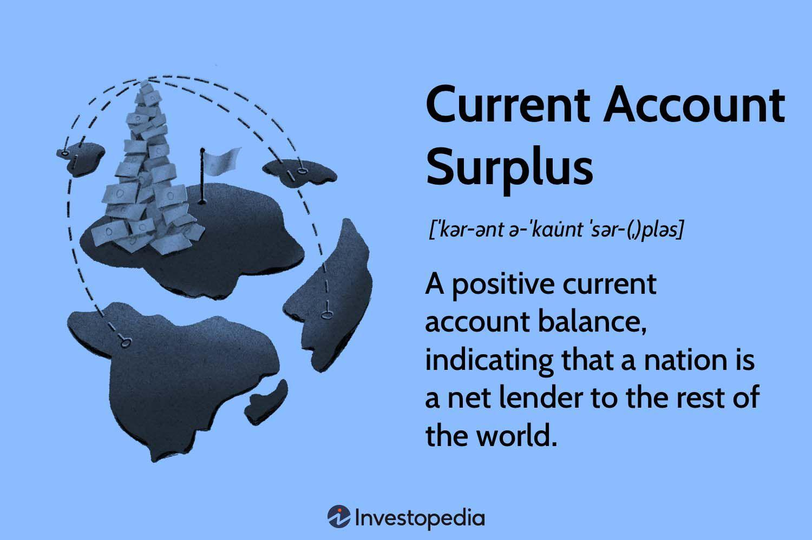

## Table of Contents

## What is a current account surplus?

A current account surplus happens when a country earns more money from its exports and other international activities than it spends on imports and other foreign payments. Imagine if you sell more toys to other countries than the toys you buy from them. The extra money you get from selling more toys is like a current account surplus for your country.

This surplus shows that a country is a net lender to the rest of the world. It means the country is sending more money abroad than it is receiving. This can be good because it can make the country's economy stronger, but it can also make other countries worry about their own economies if they are not doing as well.

## How is a current account surplus calculated?

A current account surplus is calculated by looking at the difference between what a country earns from the rest of the world and what it pays out. This includes money from selling goods like cars and food, which is called exports, and money spent on buying things from other countries, which is called imports. It also includes money from services, like tourism or banking, and other payments like interest on loans and gifts sent abroad.

If a country earns more from its exports and services than it spends on imports and other payments, it has a current account surplus. For example, if a country exports $100 billion worth of goods and services and imports $80 billion, it has a surplus of $20 billion. This simple calculation shows how much extra money the country has from its international activities.

## Why is a current account surplus important for a country's economy?

A current account surplus is important because it means a country is [earning](/wiki/earning-announcement) more from other countries than it is spending. This extra money can help make the country's economy stronger. It can be used to invest in things like new roads, schools, or businesses, which can create jobs and make life better for people. Also, a surplus can make other countries see the country as a good place to do business, which might bring in even more money.

However, having a big surplus can also cause some problems. If a country keeps selling a lot more than it buys, other countries might feel left out. They might start putting up barriers to stop the country from selling so much to them. This can lead to less trade and might hurt the country's economy in the long run. So, while a surplus can be good, it's important for a country to keep a balance and not depend too much on it.

## What are the common causes of a current account surplus?

A current account surplus often happens when a country is really good at making things that other countries want to buy. This could be because the country has a lot of natural resources, like oil or minerals, that other countries need. Or it could be because the country makes high-quality products, like cars or electronics, that are popular around the world. When a country can sell a lot of these things to other countries, it earns more money than it spends on buying things from them, leading to a surplus.

Another reason for a current account surplus is when a country saves a lot of money. If people in the country are good at saving and not spending too much, the country might not need to buy as many things from other countries. This means the country can keep more of the money it earns from selling things abroad. Also, if the country's money, or currency, is strong compared to other countries' money, it can make the country's exports cheaper and more attractive, helping to create a surplus.

## Can a current account surplus be harmful to an economy?

Yes, a current account surplus can be harmful to an economy. If a country keeps selling a lot more than it buys, other countries might feel left out. They might start putting up barriers to stop the country from selling so much to them. This can lead to less trade and might hurt the country's economy in the long run. Also, if a country depends too much on its surplus, it might not focus on growing other parts of its economy, like services or local businesses.

Another way a surplus can be harmful is if it makes the country's money, or currency, too strong. When a country has a big surplus, its currency can become more valuable compared to other countries' money. This can make the country's exports more expensive and less attractive to other countries. As a result, the country might sell fewer things abroad, which can hurt its economy. So, while a surplus can be good, it's important for a country to keep a balance and not depend too much on it.

## Which countries currently have the largest current account surpluses?

Some countries are really good at selling things to other countries and not buying a lot from them, which gives them big current account surpluses. As of recent data, China has one of the largest surpluses. They make a lot of things like electronics and clothes that people all over the world want to buy. Germany is another country with a big surplus. They are known for making high-quality cars and machines that other countries love to buy.

Other countries with big surpluses include Japan, which makes a lot of cars and electronics, and the Netherlands, which has a strong economy and sells a lot of goods and services to other countries. These countries earn more money from what they sell than what they spend on buying things from other places. Having a big surplus can make a country's economy stronger, but it can also cause some problems if other countries start to feel left out.

## How do current account surpluses affect global trade?

When a country has a big current account surplus, it means they are selling a lot more to other countries than they are buying from them. This can change how countries trade with each other. If one country keeps selling a lot more than it buys, other countries might feel left out. They might start putting up barriers, like taxes on imports, to stop the country with the surplus from selling so much to them. This can lead to less trade overall, which can make it harder for countries to work together and grow their economies.

On the other hand, a current account surplus can also make global trade stronger in some ways. When a country earns a lot from selling things abroad, it can use that extra money to invest in other countries. This can help other countries grow their economies too. For example, a country with a surplus might invest in building factories or roads in another country, which can create jobs and help both countries trade more. So, while a big surplus can cause some problems, it can also help make global trade better if countries work together.

## What are the policy measures a country can take to maintain or increase a current account surplus?

A country can take several steps to keep or grow its current account surplus. One way is to make things that other countries really want to buy. This could mean focusing on industries where the country is already good, like making cars or electronics. The government can help by giving money or support to these industries so they can make even better products. Another way is to make sure the country's money, or currency, stays strong. A strong currency can make the country's exports cheaper and more attractive to other countries, which can help sell more things abroad.

Another important step is to encourage people in the country to save more money instead of spending it on things from other countries. The government can do this by offering good savings plans or by making it easier for people to save. Also, the country can try to bring in more money from services, like tourism or banking. By making these services better and more attractive, the country can earn more money from other countries. All these steps together can help the country keep or even grow its current account surplus.

## How do current account surpluses relate to exchange rates?

A current account surplus can affect a country's exchange rate. When a country has a big surplus, it means they are selling a lot more to other countries than they are buying from them. This extra money coming in can make the country's money, or currency, more valuable compared to other countries' money. When a country's currency gets stronger, it can make their exports more expensive. Other countries might not want to buy as much if the things they want to buy cost more, which can make the surplus smaller over time.

On the other hand, a strong currency from a current account surplus can also be good. It can make it cheaper for the country to buy things from other places, which can help keep the cost of living down for people in the country. But it's a balance. If the currency gets too strong, it might hurt the country's ability to sell things abroad. So, countries with big surpluses often try to keep their currency from getting too strong or too weak, to make sure they can keep selling things to other countries and keep their economy strong.

## What is the historical trend of current account surpluses in major economies?

Over the years, the way countries earn and spend money with each other has changed a lot. In the past, countries like the United States had big current account surpluses. This was because they were really good at making things that other countries wanted to buy, like cars and machinery. But over time, the U.S. started buying more from other countries than it sold to them, which turned their surplus into a deficit. On the other hand, countries like Germany and Japan started having bigger surpluses. They focused on making high-quality products that people all over the world wanted, like cars and electronics.

In more recent years, China has become a big player in having a current account surplus. They make a lot of things like clothes and electronics that people everywhere want to buy. This has helped China grow its economy a lot. At the same time, countries in Europe, like Germany and the Netherlands, have kept their surpluses strong by making good products and saving a lot of money. The trend shows that countries that can make things other countries want, and save money instead of spending too much, tend to have bigger surpluses. But it's always changing, and countries need to keep finding new ways to stay strong in the global market.

## How do current account surpluses impact domestic and international investment?

When a country has a current account surplus, it means they are earning more money from selling things to other countries than they are spending on buying things from them. This extra money can be used to invest in the country itself, like building new roads, schools, or businesses. This can create jobs and help the economy grow stronger. At home, this can mean more opportunities for people to work and make money. It can also make the country a more attractive place for other countries to invest in, because they see the country as doing well and likely to keep growing.

On the international side, a country with a current account surplus can use its extra money to invest in other countries. This can help those countries grow their economies too. For example, the country with the surplus might build factories or roads in another country, which can create jobs and help both countries trade more. But if the surplus is too big, it might make other countries feel left out. They might start putting up barriers to stop the country with the surplus from selling so much to them. This can lead to less trade and might hurt the country's economy in the long run. So, while a surplus can be good for investment, it's important for a country to keep a balance and not depend too much on it.

## What are the geopolitical implications of large current account surpluses?

When a country has a big current account surplus, it can change how it gets along with other countries. If one country keeps selling a lot more than it buys, other countries might feel left out. They might start putting up barriers, like taxes on imports, to stop the country with the surplus from selling so much to them. This can lead to less trade and might make other countries feel like they need to protect their own economies. It can also cause tension because countries might start arguing about who is playing fair in the global market.

On the other hand, a big surplus can also make a country more powerful on the world stage. When a country earns a lot from selling things abroad, it can use that extra money to help other countries. For example, it might invest in building roads or factories in other countries, which can create jobs and help those countries grow. This can make the country with the surplus more important and influential in global politics. But it's a balance, because if the surplus is too big, it might make other countries feel threatened and could lead to more problems than solutions.

## What is a Current Account Surplus and How is it Explained?

A current account surplus occurs when a nation's total exports of goods, services, and transfers exceed its total imports. Mathematically, it can be expressed as:

$$
\text{Current Account Surplus} = \text{Exports} - \text{Imports} + \text{Net Income} + \text{Net Transfers}
$$

This calculation encompasses not only tangible goods but also services, as well as income flows such as interest and dividends, and unilateral transfers like foreign aid. The surplus is a component of a country's balance of payments, fundamentally indicating that a country is a net lender to the rest of the world. 

The implications of a current account surplus are significant. Economically, it suggests that a nation saves more than it invests domestically, which can result in increased foreign investment or reserve accumulation. Countries with a substantial surplus often have strong currencies due to higher demand for their currency to pay for exports, impacting global trade dynamics. However, persistent surpluses can lead to international tensions, as they may indicate imbalances that affect global economic stability. For example, other countries may run deficits as they purchase more from surplus nations, potentially leading to issues of debt sustainability.

Several key factors contribute to a current account surplus. Firstly, export competitiveness is crucial. Countries that produce high-quality goods and services efficiently tend to dominate in international markets, resulting in higher export revenues. Exchange rate policies also play a role; a relatively undervalued currency can make a country's exports cheaper and more attractive on the global market. Secondly, domestic consumption patterns are influential. In economies where saving is prioritized over spending, consumption of imported goods tends to be lower, contributing to a surplus. Structural economic policies that focus on export-led growth or strategic industries also influence a surplus, dictating trade patterns and economic focus.

Understanding the dynamics of a current account surplus aids in grasping how a nation positions itself within the global economy, especially in terms of trade policies and macroeconomic management. Quantifying and addressing these factors can provide insights into the strategic economic direction of a country and its interactions in international financial systems.

## References & Further Reading

[1]: ["The Balance of Payments Manual" by International Monetary Fund](https://www.imf.org/external/np/sta/bop/BOPman.pdf)

[2]: Bernanke, B. S. (2005). ["The Global Saving Glut and the U.S. Current Account Deficit"](https://www.semanticscholar.org/paper/The-global-saving-glut-and-the-U.S.-current-account-Bernanke/934885f6888d6ccda840dc180034b66155d72903)

[3]: Acemoglu, D. & Robinson, J. A. (2012). ["Why Nations Fail: The Origins of Power, Prosperity, and Poverty"](https://www.wcfia.harvard.edu/publications/why-nations-fail-origins-power-prosperity-and-poverty)

[4]: Pástor, Ľ., & Stambaugh, R. F. (2012). ["On the size of the active management industry."](https://www.jstor.org/stable/10.1086/667987) Journal of Political Economy, 120(4), 740-781.

[5]: Gomber, P., Arndt, B., Lutat, M., & Uhle, T. (2011). ["High-frequency trading."](https://papers.ssrn.com/sol3/papers.cfm?abstract_id=1858626) SSRN 1858624. 

[6]: Krugman, P. R. (1991). ["Has the Adjustment Process Worked?"](https://archive.org/details/hasadjustmentpro00krug) In International Adjustment and Financing: The Lessons of 1985-1991 (pp. 279-320).