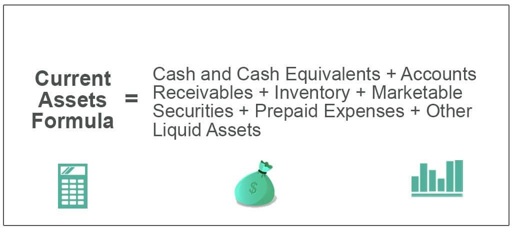

## Table of Contents

## What are current assets?

Current assets are things a company owns that can be turned into cash within a year. They are important because they show how well a company can pay its short-term bills. Examples of current assets include cash, money in the bank, things the company will sell soon, and money others owe the company that will be paid back soon.

These assets are listed on a company's balance sheet, which is like a big list of what the company owns and owes. The balance sheet helps people see if the company is healthy financially. If a company has a lot of current assets, it usually means it can easily pay its short-term debts, which is good for the company's future.

## Why are current assets important for a business?

Current assets are really important for a business because they help the company pay its bills that are due soon. Imagine a company as a person; current assets are like the money in their wallet or bank account that they can use right away. If a business has a lot of current assets, it means they can easily pay for things like rent, salaries, and other short-term expenses without any trouble. This makes the business more stable and less likely to run into money problems.

Also, current assets show how healthy a business is. When people want to invest in a company or lend it money, they look at the current assets to see if the company can pay them back. If a business has more current assets than short-term debts, it's a good sign that the company is doing well and managing its money wisely. This can help the business get more investment or loans, which can help it grow and do even better in the future.

## Can you list some common examples of current assets?

Current assets are things a company can turn into cash quickly, usually within a year. Some common examples are cash, which is money the company has right now, and money in the bank, like in a checking or savings account. Another example is inventory, which are the products the company has made or bought to sell soon. 

Also, accounts receivable are money that other people or companies owe the business, and they are expected to pay it back soon. Prepaid expenses are another type of current asset; these are payments the company has made in advance for things like rent or insurance that will be used up within the year. These are all important because they help the company pay its bills and keep running smoothly.

## How do current assets differ from non-current assets?

Current assets are things a company owns that can be turned into cash within a year. They are important for paying short-term bills like salaries, rent, and other immediate expenses. Examples include cash, money in the bank, inventory, accounts receivable, and prepaid expenses. These assets are crucial because they show how well a company can handle its day-to-day financial needs and maintain its operations smoothly.

Non-current assets, on the other hand, are things a company owns that are not expected to be turned into cash within a year. They are more long-term and help the company grow and operate over time. Examples include property, buildings, machinery, and long-term investments. These assets are important for the future of the company because they help it produce goods or services and can increase in value over time, contributing to the company's overall worth.

The main difference between current and non-current assets is the time it takes to turn them into cash. Current assets are more liquid, meaning they can be quickly used to pay off short-term debts. Non-current assets are less liquid and are focused on long-term growth and stability. Both types of assets are essential for a company's financial health, but they serve different purposes in managing the company's operations and planning for the future.

## What is the formula to calculate total current assets?

To calculate total current assets, you add up all the things a company owns that can be turned into cash within a year. This includes cash, money in the bank, inventory, accounts receivable, and prepaid expenses. You just add all these amounts together to get the total current assets.

For example, if a company has $10,000 in cash, $5,000 in the bank, $20,000 worth of inventory, $15,000 in accounts receivable, and $3,000 in prepaid expenses, you would add these numbers together. So, the total current assets would be $10,000 + $5,000 + $20,000 + $15,000 + $3,000 = $53,000. This total shows how much money the company can quickly use to pay its short-term bills.

## How do you determine if an asset is a current asset?

To determine if an asset is a current asset, you need to see if it can be turned into cash within one year. This means looking at things like cash, money in the bank, and things the company plans to sell soon. If a company can use these assets to pay bills that are due within the next year, they count as current assets.

For example, if a company has money that people owe them and they expect to get it back within the year, that's a current asset called accounts receivable. Also, if the company has paid for something ahead of time, like insurance for the next year, that's called a prepaid expense and it's a current asset too. So, anything that can help the company pay its short-term bills is a current asset.

## What is the significance of current assets in financial ratios like the current ratio?

Current assets are really important when we look at financial ratios like the current ratio. The current ratio tells us if a company can pay its short-term bills by comparing its current assets to its current liabilities. It's like checking if a person has enough money in their wallet to pay for their monthly expenses. If a company has a lot of current assets compared to its bills, it means they can easily pay what they owe and are in good financial health.

This ratio is helpful for people who want to invest in or lend money to a company. They look at the current ratio to see if the company can handle its short-term debts. A high current ratio, usually over 1, is a good sign because it shows the company has more than enough current assets to cover what it owes. This makes the company look stable and less risky, which can attract more investors and lenders.

## How can a company improve its current assets position?

A company can improve its current assets position by focusing on increasing its cash and other assets that can be turned into cash quickly. One way to do this is by speeding up how fast they collect money from customers. If a company can get paid faster for what they sell, they will have more cash on hand. Another way is to manage their inventory better. By selling products more quickly and not keeping too much stock, a company can turn its inventory into cash faster. Also, if a company can negotiate better terms with suppliers, they might be able to delay paying for things they need, which keeps more cash in their current assets.

Another important way to improve current assets is by making smart investments. If a company can invest in short-term opportunities that give them a good return, they can increase their cash. They can also look at their prepaid expenses and see if there are ways to reduce them, freeing up more cash. Sometimes, a company might need to borrow money to improve its current assets, but they need to be careful that the loan terms don't create more short-term debts that outweigh the benefits of the extra cash. By focusing on these strategies, a company can strengthen its current assets and improve its ability to pay short-term bills.

## What are the challenges in managing current assets effectively?

Managing current assets effectively can be tough because it's hard to keep the right balance. If a company has too much cash sitting around, it might not be using that money to grow or make more money. But if they don't have enough cash, they might struggle to pay their bills on time. It's like trying to keep the perfect amount of money in your wallet - not too much, not too little. Another challenge is managing inventory. If a company has too much stuff to sell, it ties up money that could be used elsewhere. But if they don't have enough, they might miss out on sales.

Another challenge is collecting money from customers quickly. If customers take too long to pay, the company's cash flow can suffer, making it harder to pay their own bills. This is like lending money to a friend and waiting too long to get it back. Also, managing accounts receivable and keeping them low can be tricky. Companies need to make sure they're not giving too much credit to customers who might not pay on time. Lastly, keeping an eye on prepaid expenses is important. If a company pays too much upfront for things like rent or insurance, it might not have enough cash for other needs. Balancing all these aspects requires careful planning and constant attention.

## How do current assets impact a company's liquidity?

Current assets have a big impact on a company's liquidity, which is how easily a company can turn its assets into cash to pay its short-term bills. Liquidity is important because it shows if a company can handle its day-to-day expenses without running into money problems. If a company has a lot of current assets like cash, money in the bank, and things it can sell quickly, it means the company is more liquid. This makes it easier for the company to pay its bills on time and keep running smoothly.

On the other hand, if a company doesn't have enough current assets, it might struggle to pay its short-term debts. This can lead to problems like not being able to buy more inventory, pay employees, or even keep the lights on. So, managing current assets well is key to maintaining good liquidity. It helps the company stay stable and gives investors and lenders confidence that the company can handle its financial responsibilities.

## Can you explain how to analyze current assets in a balance sheet?

To analyze current assets on a balance sheet, you first need to look at the list of things the company can turn into cash within a year. This includes cash, money in the bank, inventory, money people owe the company (accounts receivable), and payments made in advance (prepaid expenses). You add up all these numbers to find the total current assets. This total shows how much money the company has to pay its short-term bills. If the total is high compared to the company's short-term debts, it's a good sign that the company can easily handle its immediate financial needs.

Next, you can compare the current assets to the current liabilities, which are the bills the company needs to pay within a year. This comparison gives you the current ratio, which is calculated by dividing total current assets by total current liabilities. A current ratio above 1 means the company has more current assets than liabilities, which is good because it shows the company can cover its short-term debts. If the ratio is below 1, it might mean the company could struggle to pay its bills on time. By looking at these numbers, you get a clear picture of the company's short-term financial health and its ability to stay liquid and stable.

## What are some advanced strategies for optimizing current assets in large corporations?

Large corporations can optimize their current assets by using advanced cash management techniques. One way is to use a cash pooling system where they gather all the cash from different parts of the business into one big account. This helps them see all their money in one place and use it more efficiently. They can also use something called cash forecasting to predict how much money they will have and need in the future. This helps them plan better and make sure they always have enough cash to pay their bills. Another strategy is to invest any extra cash in short-term, safe investments that can give them a little extra money without risking their liquidity.

Another advanced strategy is to use technology to manage inventory better. Large corporations can use software that helps them see exactly how much inventory they have and how fast it's selling. This helps them keep just the right amount of stock, so they don't tie up too much money in things that aren't selling. They can also use just-in-time inventory systems, where they only get new inventory when they need it, which keeps their cash free for other uses. Additionally, they can work on improving their accounts receivable process by using automated systems to remind customers to pay on time and offering discounts for early payments, which speeds up the cash coming in.

Finally, large corporations can optimize their current assets by negotiating better terms with suppliers. By asking for longer payment terms, they can keep more cash on hand for longer periods. They can also look at their prepaid expenses and see if there are ways to reduce them or spread them out over time. This careful management of all these current assets helps large corporations maintain strong liquidity and financial health, ensuring they can meet their short-term obligations and invest in future growth.

## What are current assets and how can we understand them?

Current assets are an integral part of a company's balance sheet. They are the assets expected to be converted into cash within a one-year timeframe, a characteristic that makes them essential for evaluating a company's short-term financial health and liquidity position. Current assets provide insight into a company's ability to meet its short-term obligations without having to liquidate long-term assets, thus preserving long-term stability.

The constituent elements of current assets typically include cash, accounts receivable, inventory, and marketable securities. These categories are chosen because of their liquidity or near-liquid nature:

1. **Cash**: This represents the most liquid form of current assets, readily available to settle debts and make payments.

2. **Accounts Receivable**: These are funds that customers owe the company for goods or services that have been delivered but not yet paid for. They are typically expected to be settled within a short period, contributing to the liquidity calculation.

3. **Inventory**: While not as liquid as cash or accounts receivable, inventory is an important current asset. It consists of raw materials, work-in-progress, and finished goods that the company intends to sell. The speed at which inventory can be converted into cash depends on the company's production process and sales cycle.

4. **Marketable Securities**: These are financial instruments that can be easily sold or converted into cash within a one-year period. They offer a balance between liquidity and return, serving as a buffer against cash shortfalls.

The function of these assets in a balance sheet is to provide a snapshot of the company's [liquidity](/wiki/liquidity-risk-premium) profile, demonstrating its capacity to meet short-term liabilities. The relationship between current assets and short-term liabilities is often assessed using financial ratios such as the current ratio, which is calculated as:

$$
\text{Current Ratio} = \frac{\text{Current Assets}}{\text{Current Liabilities}}
$$

A ratio above 1 suggests that a company is in a strong position to cover its short-term liabilities.

The significance of current assets in financial statements extends beyond their value as liquid resources; they also reflect managerial efficiency in asset utilization. Efficient management of each category of current assets can lead to improved cash flows, better credit terms from suppliers, and enhanced market competitiveness.

In summary, understanding and managing current assets is key for ensuring that a company remains solvent in the short term without jeopardizing its long-term financial health. Their inclusion in financial statements is critical for stakeholders to assess liquidity, operational effectiveness, and overall financial health.

## How do you calculate current assets?

The calculation of current assets involves summing up all assets that are easily convertible into cash within a short period, typically within a year. This aggregation includes various components that each play a crucial role in determining a company's liquidity and operational efficiency. 

The formula for calculating current assets can be expressed as:

$$
\text{Current Assets} = \text{Cash} + \text{Cash Equivalents} + \text{Inventory} + \text{Accounts Receivable} + \text{Marketable Securities} + \text{Prepaid Expenses} + \text{Other Liquid Assets}
$$

Each element in the formula represents a unique category of current assets:

- **Cash and Cash Equivalents:** These are the most liquid assets a company holds, readily available for operations or emergencies. Cash equivalents include short-term investments that are easily convertible into cash, such as treasury bills or money market funds.

- **Inventory:** This includes raw materials, work-in-progress, and finished goods that a company intends to sell. Inventory is crucial for operational flow but is less liquid than cash equivalents because it requires selling time.

- **Accounts Receivable:** These are the outstanding invoices a company expects to receive within a short period. High accounts receivable indicate strong sales but also signify pending cash flow.

- **Marketable Securities:** These are liquid financial instruments that can be quickly sold for cash. Companies usually hold these for short-term funding purposes.

- **Prepaid Expenses:** These are payments made in advance for services or goods to be received. Although not directly convertible into cash, they reduce future cash outflows.

- **Other Liquid Assets:** This category includes any additional assets that can be quickly converted into cash, such as temporary financial instruments.

Understanding how these components are reported can provide insight into a company's financial health and liquidity. For instance, large corporations like Walmart and Microsoft provide detailed reports of their current assets in their financial statements. In their balance sheets, these companies outline the value of each current asset category, which helps analysts, investors, and managers to assess financial performance and liquidity efficiently.

For example, Microsoft's annual report for 2022 showed current assets that included cash and equivalents, receivables, and inventory, which collectively indicated strong liquidity. Similarly, Walmart's balance sheet reflected substantial inventory and receivables, showcasing its extensive operational scale and short-term financial health.

Accurate calculation and reporting of current assets enable stakeholders to make informed decisions regarding asset utilization and management, ensuring efficient operational strategies and sound financial planning. Understanding these financial metrics is crucial for optimizing the balance between cash flow sustainability and investment growth.

## What is the relationship between Risk Management and Financial Metrics?

In asset management and algorithmic trading, risk management is critical, and financial metrics play a key role in evaluating and mitigating potential risks. Understanding liquidity ratios, such as the current ratio, quick ratio, and cash ratio, is essential for assessing a company's short-term financial health and its ability to meet current liabilities. These ratios are crucial indicators of a company's financial standing, enabling investors and managers to make informed decisions.

### Liquidity Ratios:

1. **Current Ratio**: This metric measures a company's ability to cover its short-term obligations with its current assets. It is calculated as:
$$
   \text{Current Ratio} = \frac{\text{Current Assets}}{\text{Current Liabilities}}

$$

   A ratio higher than 1 indicates that the company has more current assets than liabilities, which is generally desirable.

2. **Quick Ratio**: Also known as the acid-test ratio, the quick ratio provides a more stringent measure of liquidity by excluding inventory from current assets. It is given by:
$$
   \text{Quick Ratio} = \frac{\text{Current Assets} - \text{Inventory}}{\text{Current Liabilities}}

$$

   This ratio focuses on the most liquid assets, such as cash and receivables, emphasizing the company's capability to satisfy immediate obligations without relying on inventory sales.

3. **Cash Ratio**: This ratio is the most conservative liquidity measure, considering only cash and cash equivalents. The formula is:
$$
   \text{Cash Ratio} = \frac{\text{Cash + Cash Equivalents}}{\text{Current Liabilities}}

$$

   A higher cash ratio means the company is in an excellent position to pay off short-term liabilities using only its cash reserves.

### Value at Risk (VaR):

Value at Risk is a statistical metric designed to measure and quantify the potential loss in the value of an asset or portfolio over a defined period for a given confidence interval. VaR is widely used in trading activities to assess potential losses. It is expressed as:
$$
   \text{VaR} = \text{Value of Portfolio} \times \sigma_{\text{Portfolio}} \times \Phi^{-1}(1-\alpha)

$$

   Here, $\sigma_{\text{Portfolio}}$ represents the standard deviation of the portfolio's returns, $\Phi^{-1}$ is the inverse of the cumulative distribution function (CDF) of a standard normal distribution, and $\alpha$ is the confidence level.

VaR helps in identifying the maximum expected loss over a given timeframe and is integral in forming strategies that align with a company's risk appetite.

### Comprehensive Risk Management Framework:

Building a strong risk management framework involves integrating these financial metrics into routine evaluations, enhancing decision-making, and ensuring a stable financial structure. Companies need to balance liquidity and profitability while safeguarding assets against market volatilities. Employing advanced risk management tools and continuously monitoring financial conditions facilitates sustainable growth and long-term stability. Additionally, these metrics aid in optimizing performance by highlighting key areas for improvement and ensuring the company is well-positioned to handle financial adversities.

## References & Further Reading

[1]: ["Advances in Financial Machine Learning"](https://www.amazon.com/Advances-Financial-Machine-Learning-Marcos/dp/1119482089) by Marcos Lopez de Prado

[2]: ["Machine Learning for Algorithmic Trading"](https://github.com/stefan-jansen/machine-learning-for-trading) by Stefan Jansen

[3]: ["Quantitative Trading: How to Build Your Own Algorithmic Trading Business"](https://www.amazon.com/Quantitative-Trading-Build-Algorithmic-Business/dp/1119800064) by Ernest P. Chan

[4]: ["Evidence-Based Technical Analysis: Applying the Scientific Method and Statistical Inference to Trading Signals"](https://www.amazon.com/Evidence-Based-Technical-Analysis-Scientific-Statistical/dp/0470008741) by David Aronson

[5]: Damodaran, A. (2012). ["Investment Valuation: Tools and Techniques for Determining the Value of Any Asset."](https://books.google.com/books/about/Investment_Valuation.html?id=5SRHAAAAQBAJ) Wiley Finance.

[6]: ["Algorithmic Trading & DMA: An introduction to direct access trading strategies"](https://archive.org/details/algorithmictradi0000john) by Barry Johnson

[7]: Brealey, R. A., Myers, S. C., & Allen, F. (2019). ["Principles of Corporate Finance."](https://www.mheducation.com/highered/product/Principles-of-Corporate-Finance-Brealey.html) McGraw-Hill Education.