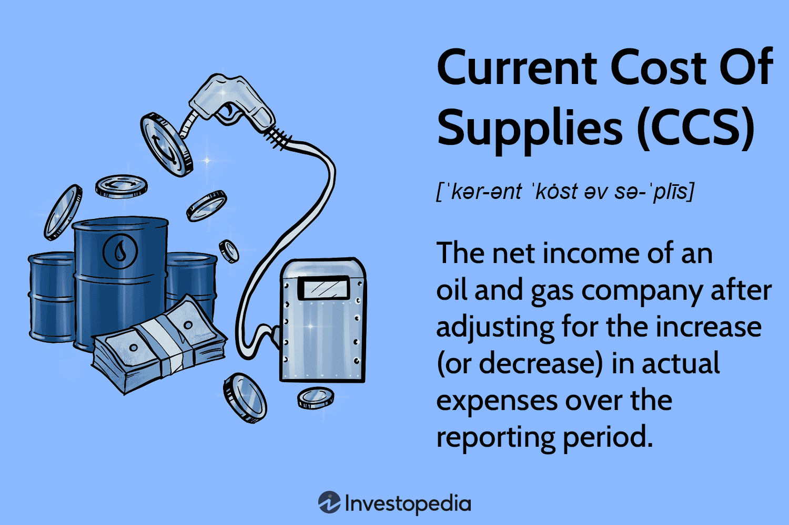

The financial landscape is undergoing significant transformation, adapting to contemporary challenges and technological advancements. Metrics and tools play a vital role in this evolution, providing insights that are crucial for decision-making processes in finance. A prominent example of such a metric is the Current Cost of Supplies (CCS), which serves as an integral part of financial reporting, particularly for businesses influenced by fluctuating commodity prices like oil and gas.

CCS is designed to offer a refined measure of a company’s financial health by adjusting net income to account for real-time changes in supply costs. This adjustment provides stakeholders with a clearer understanding of the company’s economic situation, beyond traditional profit metrics that might not reflect present market conditions.



In parallel, the financial sector has witnessed a surge in algorithmic trading, where the use of automated, pre-programmed instructions for executing trades has become commonplace. This approach leverages various financial metrics to optimize trading strategies, enhancing speed, precision, and efficiency across markets. The integration of CCS into these strategies offers an opportunity to further align trading algorithms with market realities, potentially improving risk-adjusted returns.

Understanding the significance of CCS in financial reporting and its application in algorithmic trading is essential for investors and traders seeking to navigate the complexities of modern finance. By seamlessly incorporating CCS into trading systems, one can better adapt to the swift changes in commodity prices, ultimately leading to more strategic financial planning.

## Table of Contents

## Understanding the Current Cost of Supplies (CCS)

The Current Cost of Supplies (CCS) is a financial metric designed to adjust net income for fluctuations in commodity costs, particularly in industries such as oil and gas. During a reporting period, the prices of commodities can vary significantly, affecting the purchasing power and expenditure of a company. CCS modifies the net income by reflecting real-time changes in the costs of supplies, thereby offering a more accurate representation of a company's financial performance.

In industries where supply costs vastly influence net income, CCS becomes a critical tool. Unlike traditional profit measurements, CCS provides companies with a deeper understanding of their financial health by considering the direct impact of commodity price volatility. This approach helps companies represent their earnings more accurately, considering the current market conditions rather than historic cost assumptions.

The concept of CCS pivots on replacing the cost of inventory, such as [crude oil](/wiki/crude-oil) or natural gas, with its current market price rather than the historical acquisition cost. For example, in accounting terms, if a company holds oil in its inventory that was purchased at a significantly lower price than the current market value, CCS would adjust the financial records to reflect the current price, not the original purchase price. This adjustment is crucial for financial transparency and accuracy.

CSS is particularly important during periods of high price [volatility](/wiki/volatility-trading-strategies), as traditional accounting methods can produce misleading profit figures. Without CCS, a company might report inflated profits due to holding lower-cost inventory, distorting the true financial state. By incorporating CCS, the reported income aligns closely with actual economic indicators, fostering trust among investors and stakeholders who rely on accurate financial data for decision-making.

In summary, the CCS metric serves to refine a company’s net income calculation by emphasizing contemporary supply cost variations. It goes beyond the boundaries of conventional profit indicators by incorporating insights into the dynamics of supply costs, which are notably volatile in certain sectors. This results in a more accurate representation of a company's financial situation, benefiting stakeholders who seek a clearer understanding of economic performance.

## Significance of CCS in Financial Reporting

The Current Cost of Supplies (CCS) plays a significant role in financial reporting by offering a more accurate representation of a company's financial health. This metric adjusts net income to account for real-time cost changes, particularly in industries where supply costs are volatile, like oil and gas. Unlike traditional financial metrics that may use historical cost or ignore fluctuations in commodity prices, CCS provides a nuanced view that reflects the true economic conditions affecting a company.

During periods of economic instability, CCS becomes an invaluable tool for assessing and forecasting financial performance. The frequent fluctuations in commodity prices can distort a company’s financial statements if not appropriately accounted for. By adjusting net income to consider these variations, CCS offers a stabilized view of financial outcomes, aiding in effective planning and resource allocation.

For investors and stakeholders, relying on adjusted net income through CCS enables decision-making grounded in a company's actual economic situation. This measure provides insights that might not be apparent through traditional accounting practices, allowing stakeholders to gauge the impact of cost volatility on earnings and make well-informed strategic choices.

In mathematical terms, the adjusted net income using CCS can be expressed as:

$$
\text{Adjusted Net Income} = \text{Net Income} + (\text{Current Cost} - \text{Historical Cost}) \times \text{Volume of Supplies}
$$

This formula highlights the adjustment process, where the difference between current and historical costs is factored into the net income based on the [volume](/wiki/volume-trading-strategy) of supplies. This approach ensures that financial statements reflect current economic realities, facilitating better assessment and forecasting amid changing market conditions.

## Algorithmic Trading: A Brief Overview

Algorithmic trading employs automated and pre-programmed trading instructions to conduct trades based on a predefined set of rules and conditions derived from various financial metrics. This form of trading leverages advanced computational algorithms to make decisions and execute orders at speeds and frequencies that are impossible for human traders. The precision and speed offered by [algorithmic trading](/wiki/algorithmic-trading) platforms allow traders to seamlessly handle complex trading strategies across multiple financial markets.

Key metrics employed in algorithmic trading include cumulative returns, the Sharpe ratio, and maximum drawdown, among others. These metrics play a crucial role in evaluating the risk, efficiency, and overall performance of trading strategies. 

Cumulative returns measure the total gain or loss generated by a trading strategy over a specified period. It is calculated as the geometric total return accumulated from the start date to the end date. The formula for cumulative return over a period $T$ is given by:

$$
CR = \frac{V(T) - V(0)}{V(0)}
$$

where $V(T)$ is the final portfolio value and $V(0)$ is the initial portfolio value.

The Sharpe ratio is an essential measure for assessing the risk-adjusted return of a trading strategy. It calculates the average return earned in excess of the risk-free rate per unit of volatility or total risk. The formula for the Sharpe ratio is:

$$
SR = \frac{E[R_p - R_f]}{\sigma_p}
$$

where $E[R_p]$ is the expected portfolio return, $R_f$ is the risk-free rate, and $\sigma_p$ is the standard deviation of the portfolio's excess return.

Maximum drawdown represents the largest peak-to-trough decline during a specific record-keeping period, showcasing the risk of a strategic downturn. It is defined as:

$$
MD = \max_{t \in (1, T)} \left( \frac{V_{\text{peak}} - V_{\text{trough}}}{V_{\text{peak}}} \right)
$$

where $V_{\text{peak}}$ is the maximum observed portfolio value and $V_{\text{trough}}$ is the lowest portfolio value after the peak within the period $T$.

These metrics serve not only to gauge the success of a strategy but also to provide a basis for comparing different strategies under similar conditions. By utilizing algorithmic trading, traders can effectively apply quantitative models to identify trading opportunities, optimize execution timing, and minimize market impact, ultimately enabling a more strategic approach to market engagement.

## Integration of CCS in Algorithmic Trading Strategies

The integration of the Current Cost of Supplies (CCS) into algorithmic trading strategies offers a dynamic approach that can leverage real-time financial data for enhanced trading outcomes. As commodity prices fluctuate, the ability to incorporate CCS as a parameter assists traders in adapting their algorithmic strategies, ensuring they remain aligned with the shifting economic landscape.

Algorithmic trading primarily relies on various data inputs to make split-second decisions. By incorporating CCS, traders have the advantage of a more refined understanding of supply costs, which directly influence commodity prices. This integration enables algorithms to adjust their execution based on current market volatility and the underlying cost environment. The dynamic nature of CCS ensures that trading algorithms reflect the most current economic conditions, providing a robust framework for price assumptions and trading decisions.

One of the key benefits of using CCS within algorithmic trading is the potential for improved risk-adjusted returns. Risk-adjusted return metrics, such as the Sharpe Ratio, measure the potential return of an investment relative to its risk. By considering CCS, traders can optimize strategies to capitalize on real-time price changes, potentially leading to higher Sharpe Ratios. This means that the algorithms are not only chasing returns but are doing so by effectively managing risk, ensuring a more stable trading portfolio.

The agility provided by CCS also enhances the risk-to-reward ratios. In algorithmic trading, a well-calibrated risk-to-reward ratio is crucial for long-term success. Algorithms that adapt to CCS can adjust their risk parameters instantly, which optimizes the decision-making process under volatile conditions. For instance, when commodity prices surge due to increased production costs, a CCS-aware algorithm might reduce exposure or adjust stop-loss levels to protect against downside risk.

Implementing CCS into trading algorithms involves sophisticated programming and an understanding of financial engineering. Below is a simplified Python example that demonstrates how CCS might be included in a trading strategy:

```python
class TradingStrategy:
    def __init__(self, initial_capital, CCS_data):
        self.capital = initial_capital
        self.CCS_data = CCS_data
        self.portfolio = []

    def calculate_risk_adjusted_return(self, expected_return, CCS_factor):
        return expected_return / CCS_factor

    def execute_trade(self, market_data):
        # Example algorithm leveraging CCS data
        for data in market_data:
            adjusted_return = self.calculate_risk_adjusted_return(data['expected_return'], self.CCS_data[data['commodity']])
            if adjusted_return > threshold:
                self.portfolio.append(data)
                self.capital -= data['investment_amount']

# Usage
ccs_data = {'oil': 1.05, 'gas': 1.02}  # CCS factors for commodities
strategy = TradingStrategy(1000000, ccs_data) 
market_data = [{'commodity': 'oil', 'expected_return': 1500, 'investment_amount': 10000}, ...]
strategy.execute_trade(market_data)
```

In conclusion, the seamless integration of CCS into algorithmic trading represents an advanced strategy that not only enhances responsiveness to market conditions but also improves performance metrics. As traders continue to seek data-driven insights, leveraging CCS ensures algorithms are strategically poised to maximize returns while effectively managing associated risks.

## Key Performance Metrics in Algorithmic Trading

In algorithmic trading, the utilization of key performance metrics is essential for assessing strategy efficiency and profitability. These metrics provide traders with a structured approach to measure and optimize their trading strategies.

Cumulative returns are a fundamental metric, representing the total gain or loss on an investment over a specified period. It is calculated as the percentage increase in the value of an asset. This metric offers straightforward insights into the overall performance of a trading strategy. Mathematically, cumulative return ($CR$) can be expressed as:

$$
CR = \left(\frac{{\text{Ending Value}}}{{\text{Starting Value}}} - 1\right) \times 100\%
$$

The Sharpe ratio is another crucial metric that evaluates the risk-adjusted return of an investment. It measures how much excess return a portfolio generates per unit of risk taken, typically represented by standard deviation. The Sharpe ratio ($SR$) is calculated as:

$$
SR = \frac{{E[R_p] - R_f}}{{\sigma_p}}
$$

where $E[R_p]$ is the expected portfolio return, $R_f$ is the risk-free rate, and $\sigma_p$ is the standard deviation of portfolio returns. A higher Sharpe ratio indicates a more favorable risk-adjusted return.

The Sortino ratio is similar to the Sharpe ratio but differentiates by focusing solely on downside risk, which offers a more nuanced view of risk by considering only negative volatility. It is given by:

$$
\text{Sortino Ratio} = \frac{{E[R_p] - R_f}}{{\sigma_D}}
$$

where $\sigma_D$ is the standard deviation of the downside deviation.

Understanding maximum drawdown is critical for risk management. Maximum drawdown quantifies the largest peak-to-trough decline in the value of a portfolio before it recovers to the peak level. It is useful for assessing the potential risk of loss in a strategy and is expressed as a percentage.

Value-at-risk (VaR) provides insights into the potential losses in a portfolio over a specified period under normal market conditions. It is a probabilistic metric indicating the maximum expected loss not to be exceeded with a given confidence level.

Performance metrics such as these serve as vital feedback mechanisms, informing traders of how well their strategies align with predefined financial goals. By continuously analyzing these metrics, traders can identify strengths and weaknesses in their current strategies, facilitating informed adjustments and further optimization. Leveraging these metrics enables market participants to enhance decision-making processes and achieve more consistent and targeted trading outcomes.

## Challenges and Opportunities

The integration of the Current Cost of Supplies (CCS) into real-time trading systems presents unique challenges and opportunities. One significant challenge is the complexity and data intensity required to implement CCS effectively into algorithmic trading platforms. CCS adjustments require real-time data integration, processing, and analysis of fluctuating commodity prices. This demands advanced data infrastructure capable of handling large volumes of information with minimal latency. Algorithmic trading platforms need to be designed with robust data management systems that can efficiently process CCS data without affecting the performance of trading algorithms.

To effectively incorporate CCS, platforms must adopt flexible and scalable architectures. This could involve using distributed computing systems and optimized data storage solutions such as in-memory databases and cloud-based services to ensure data is rapidly accessible and up-to-date. Data normalization techniques need to be employed to harmonize data inputs from various sources, ensuring consistency and reliability.

Despite these challenges, the fusion of CCS adjustments into algorithmic trading strategies offers substantial opportunities. By integrating CCS, trading algorithms can achieve higher adaptability to market conditions, especially in commodities where supply costs fluctuate significantly. This enables the development of strategies that are more resilient to market volatility, potentially leading to improved performance metrics such as higher risk-adjusted returns.

In Python, a simple implementation to illustrate the concept could involve using libraries such as `pandas` for data manipulation and `numpy` for numerical computations. For example, algorithms can be adapted to adjust trading positions based on real-time CCS data inputs:

```python
import pandas as pd
import numpy as np

# Sample CCS DataFrame
ccs_data = pd.DataFrame({
    'time': pd.date_range(start='2023-01-01', periods=100, freq='H'),
    'ccs_value': np.random.randn(100) * 5 + 100  # Random CCS data
})

# Function to adjust trading positions based on CCS
def adjust_positions(trading_df, ccs_df):
    combined_df = pd.merge_asof(trading_df, ccs_df, on='time', direction='backward')
    combined_df['adjusted_position'] = combined_df['position'] * (1 + combined_df['ccs_value'] / 100)
    return combined_df

# Sample trading DataFrame
trading_data = pd.DataFrame({
    'time': pd.date_range(start='2023-01-01', periods=100, freq='H'),
    'position': np.random.choice([-1, 0, 1], size=100)  # Example trading positions
})

adjusted_trading_data = adjust_positions(trading_data, ccs_data)
```

This code offers a foundation where trading positions are dynamically adjusted based on CCS data, highlighting the adaptability and potential enhancement of trading strategies through CCS integration.

In conclusion, while the incorporation of CCS into algorithmic trading requires overcoming complex data challenges, it paves the way for innovative and effective trading strategies. The ability to adapt to real-time cost changes can significantly enhance decision-making and contribute to more informed and strategic financial planning for investors and traders.

## Conclusion

Current Cost of Supplies (CCS) plays an essential role in offering a comprehensive view of company performance, especially in industries such as oil and gas that are subject to volatile commodity markets. This measure adjusts net income by considering the changing costs of supplies, thus providing a more realistic portrayal of a company's financial health. By doing so, it allows stakeholders to gain a better understanding of the true economic condition of a company, beyond what conventional profit measurements can reveal.

Algorithmic trading systems benefit significantly from incorporating financial metrics like CCS, enriching the data-driven decision-making process. By using CCS, algorithms can dynamically adjust to reflect real-time changes in input costs, thereby fine-tuning trading strategies to account for market volatility. This capability ensures that algorithmic traders can achieve higher risk-adjusted returns and optimize risk-to-reward ratios, ultimately leading to more resilient trading outcomes.

For investors and traders, understanding and leveraging CCS in algorithmic trading signifies a crucial step toward more informed and strategic financial planning. As the financial landscape continues to evolve, the integration of traditional financial metrics like CCS with advanced trading technologies provides a pathway to improved decision-making. By capturing real-time data and incorporating it into trading models, market participants are better equipped to navigate economic uncertainties and capitalize on opportunities in a strategic manner.

## References & Further Reading

[1]: ["Advances in Financial Machine Learning"](https://www.amazon.com/Advances-Financial-Machine-Learning-Marcos/dp/1119482089) by Marcos Lopez de Prado

[2]: ["Quantitative Trading: How to Build Your Own Algorithmic Trading Business"](https://www.amazon.com/Quantitative-Trading-Build-Algorithmic-Business/dp/1119800064) by Ernest P. Chan

[3]: ["Evidence-Based Technical Analysis: Applying the Scientific Method and Statistical Inference to Trading Signals"](https://www.amazon.com/Evidence-Based-Technical-Analysis-Scientific-Statistical/dp/0470008741) by David Aronson

[4]: ["Machine Learning for Algorithmic Trading"](https://github.com/stefan-jansen/machine-learning-for-trading) by Stefan Jansen

[5]: ["Investment Valuation: Tools and Techniques for Determining the Value of Any Asset"](https://archive.org/details/investmentvaluat0000damo_n6k9) by Aswath Damodaran