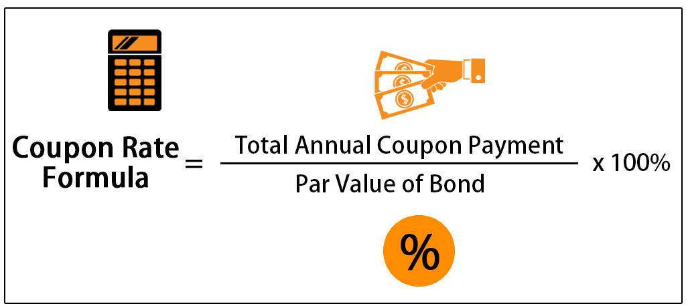

The coupon bond market occupies a critical place in the financial landscape, serving as a key mechanism for raising capital by governments, municipalities, and corporations. Coupon bonds, characterized by periodic interest payments known as coupons, are integral to a diversified investment portfolio. They provide a predictable stream of income to investors and influence overall market interest rates. Coupon bonds are often viewed as a less volatile investment compared to equities, offering a stable risk-return profile, which makes them appealing to a broad array of investors, from individual retirees to large institutional funds.

Algorithmic trading has become a transformative force in the management and execution of bond trades. Its role is pivotal due to the complexity and scale of the modern coupon bond market. Utilizing advanced algorithms and computational models, traders and financial institutions can efficiently handle vast datasets and execute trades with remarkable speed and precision. Algorithmic trading circumvents traditional market inefficiencies, allowing for improved liquidity, reduced transaction costs, and better price discovery. It involves the implementation of a variety of strategies, including statistical arbitrage, trend-following, and market making, tailored specifically to the bond market's nuances.



This article aims to explore the intricacies of coupon bonds and the dynamic strategies enabled by algorithmic trading. Understanding coupon bonds—from their basic characteristics to the variables affecting their pricing—is essential for grasping their role in the wider financial system. Moreover, a detailed examination of algorithmic trading highlights how technological advancements are reshaping bond market strategies. By delving into these subjects, this article provides insights that are crucial for investors, traders, and financial professionals aiming to navigate and leverage the evolving bond market landscape effectively.

## Table of Contents

## Understanding Coupon Bonds

Coupon bonds are a type of debt security where the issuer is obliged to pay the holder periodic interest payments, known as coupons, until the bond reaches maturity, at which point the principal amount is repaid. Each coupon represents an interest payment based on the bond's face value and coupon rate. This regular stream of income makes coupon bonds attractive to investors seeking steady returns and plays a critical role in diversifying investment portfolios, managing risk, and stabilizing returns in the financial market.

The current coupon of a bond refers to the annual interest payment divided by the bond's current market price. It adjusts alongside bond prices and is a key indicator for investors to assess the value and liquidity of a bond, particularly in a fluctuating interest rate environment. When market interest rates change, the bond's price must adjust so that the yield matches prevailing rates, affecting its current coupon rate. For instance, if market interest rates rise above the bond's coupon rate, the bond's price typically falls to align the yield with the new rates, potentially making it more attractive in terms of yield relative to newly issued securities.

The relationship between coupon rates, bond yields, and market interest rates is intrinsic to bond pricing. The bond yield, often represented as the yield to maturity (YTM), expresses the total return anticipated if the bond is held until maturity, inclusive of all coupon payments and the monetary gain or loss realized at maturity relative to the purchase price. Mathematically, this relationship can be encapsulated as follows:

$$

YTM = \frac{C + \frac{F - P}{n}}{\frac{F + P}{2}} 
$$

where $C$ is the annual coupon payment, $F$ is the face value, $P$ is the current price, and $n$ is the number of years to maturity. This equation highlights how YTM depends on the bond's coupon, price, and time to maturity.

Market interest rates have a direct impact on bond yields and coupon rates. When interest rates rise, new bonds are issued with higher coupon rates, making existing bonds with lower rates less attractive unless their prices decrease, thus increasing their yield. Conversely, if rates fall, existing bonds with higher coupons become more valuable, leading to price increases and decreased yields. This inverse relationship between bond prices and interest rates is a foundational concept in understanding bond market dynamics.

## Mechanics of the Coupon Bond Market

Coupon bonds, fundamental components of the financial market, are valued based on several factors, including interest rates, yield spreads, and market [volatility](/wiki/volatility-trading-strategies). These elements intricately affect bond pricing and investor decisions.

Interest rates are pivotal in determining the value of coupon bonds. A bond's value is derived from the present value of its future cash flows, which include periodic coupon payments and the principal amount at maturity. The formula for the present value of a bond is:

$$

PV = \sum_{t=1}^{n} \frac{C}{(1 + r)^t} + \frac{F}{(1 + r)^n} 
$$

where $PV$ is the present value, $C$ is the coupon payment, $r$ is the market interest rate, $t$ is the time period, $n$ is the total number of periods, and $F$ is the face value of the bond. When market interest rates rise, the present value of the bond's future cash flows decreases, leading to a decline in bond prices. Conversely, falling interest rates result in higher bond prices.

Yield spreads, the difference in yields between various bonds, also play a critical role. These spreads can reflect differences in credit risk, [liquidity](/wiki/liquidity-risk-premium), and macroeconomic conditions. A wider yield spread usually indicates higher perceived risk, thus affecting bond pricing and investor preferences. A narrowing spread implies decreasing risk perceptions, potentially elevating the bond's price relative to others.

Market volatility significantly impacts coupon bonds. High volatility often results in increased risk premiums, as investors demand higher yields to compensate for uncertainty. This can lead to fluctuating bond prices. Additionally, volatile markets may cause shifts in interest rates and yield spreads, further influencing bond valuations and investor strategies.

In summary, the mechanics of coupon bond pricing involve a complex interplay of interest rates, yield spreads, and market volatility. Understanding these factors is crucial for investors and traders as they navigate the bond market.

## Algorithmic Trading in the Coupon Bond Market

Algorithmic trading refers to the use of computer algorithms to automate the process of trading financial instruments, including bonds. This approach has become increasingly prevalent in bond markets, including the coupon bond market, due to its ability to enhance trading efficiency and accuracy. 

One of the primary advantages of [algorithmic trading](/wiki/algorithmic-trading) is speed. Algorithms can process vast amounts of market data and execute trades much faster than human traders. This rapid processing capability is particularly beneficial in the bond market, where prices can fluctuate quickly based on changes in interest rates and market sentiment. Efficiency is another significant benefit. Algorithms can operate continuously, conducting trades in a predefined manner without the need for human intervention, which reduces the time and resources needed to monitor and execute trades manually.

Precision is a further advantage of algorithmic trading. By utilizing sophisticated algorithms, traders can specify detailed criteria for executing trades, such as desired price levels and timing, minimizing the risk of human error. This is particularly valuable in the bond market, where small changes in prices can significantly impact the yield and return on investment for coupon bonds.

Algorithms analyze market data through various computational methods. These methods often involve statistical models and techniques from [machine learning](/wiki/machine-learning) to identify trading opportunities. For instance, algorithms can scan historical price data to detect patterns or trends, such as mean reversion or [momentum](/wiki/momentum), that suggest potential future price movements. They also incorporate factors such as [interest rate](/wiki/interest-rate-trading-strategies) changes, economic indicators, and geopolitical developments into their analysis to optimize trade execution.

Once a trading opportunity is identified, algorithms execute trades based on predefined rules. This process can involve assessing the current market liquidity, determining the optimal size and timing of the trade, and managing execution costs. By doing so, algorithmic trading strategies aim to minimize market impact and trading costs, thus optimizing the overall return.

In summary, algorithmic trading has transformed the coupon bond market by providing tools for traders to execute trades with increased speed, efficiency, and precision. By leveraging complex algorithms that analyze market data and automate the trading process, bond traders can capitalize on market opportunities more effectively than ever before.

## Strategies for Algorithmic Trading in Bond Markets

Algorithmic trading strategies have gained prominence in bond markets due to their ability to automate and enhance trading processes. These strategies leverage advanced computational tools to optimize trade execution and improve efficiency. One of the primary strategies includes the use of statistical models like moving average crossovers and momentum analysis to predict bond price movements and implement trades accordingly.

### Moving Average Crossovers

A moving average crossover strategy is a simple yet effective technique used to identify potential buy or sell signals in bond markets. It involves plotting two types of moving averages on a bond's price data—a short-term moving average (e.g., 50-day) and a long-term moving average (e.g., 200-day). When the short-term moving average crosses above the long-term moving average, it generates a buy signal, and conversely, when it crosses below, it produces a sell signal.

Mathematically, moving averages are calculated as:

$$
\text{Moving Average} = \frac{1}{n} \sum_{i=0}^{n-1} P_i
$$

where $P_i$ is the price of the bond at time $i$, and $n$ is the number of periods over which the average is calculated.

### Momentum Analysis

Momentum analysis is another strategy that focuses on the speed or velocity of price changes in bond markets. It gauges the strength of price movements, with the underlying principle that assets that have performed well in the past will continue to perform well in the future. This involves analyzing the rate of change (ROC) indicator which measures the percentage change in bond price between two periods.

The ROC formula is:

$$
\text{Rate of Change} = \left( \frac{P_t - P_{t-n}}{P_{t-n}} \right) \times 100
$$

where $P_t$ is the current price, and $P_{t-n}$ is the price $n$ periods ago.

### Integration of Machine Learning and AI

Machine learning and AI technologies play a transformative role in developing sophisticated trading strategies. These technologies handle large datasets and identify patterns not discernible through traditional methods. Algorithms powered by machine learning can adapt to new data, learning from it to improve trading decisions.

For instance, [reinforcement learning](/wiki/reinforcement-learning), a type of machine learning, allows traders to develop strategies that learn to make optimal trading decisions through trial and error, using historical data to simulate various market conditions.

Here is a simple example of how machine learning can be applied to bond trading using Python:

```python
from sklearn.model_selection import train_test_split
from sklearn.ensemble import RandomForestClassifier
import pandas as pd

# Load bond market data
data = pd.read_csv('bond_data.csv')

# Features include historical prices, moving averages, etc.
features = data[['price', 'moving_average', 'momentum', 'volume']]

# Target variable: buy or sell signal
target = data['signal']

# Split dataset into train and test sets
X_train, X_test, y_train, y_test = train_test_split(features, target, test_size=0.3, random_state=42)

# Initialize and train Random Forest model
model = RandomForestClassifier(n_estimators=100, random_state=42)
model.fit(X_train, y_train)

# Predict signals for test set
predictions = model.predict(X_test)
```

These advancements in algorithmic trading, facilitated by machine learning and AI, enhance the capabilities of traders to react promptly and accurately to market changes, thus optimizing their bond trading strategies. This integration is increasingly vital as bond markets grow in complexity and [volume](/wiki/volume-trading-strategy).

## Impact of Yield Curves on Bond Trading Strategies

Yield curves are graphical representations that show the relationship between interest rates and the maturity of debt securities, typically government bonds. The curve is plotted with the interest rate (or yield) on the vertical axis and time to maturity on the horizontal axis. Yield curves are crucial in economic forecasting as they provide insights into future interest rate movements and economic growth prospects. A normal upward-sloping yield curve suggests that longer-term interest rates are higher than short-term rates, indicating expectations of economic expansion and potential inflation. Conversely, an inverted yield curve, where long-term rates fall below short-term rates, often signals economic slowdown or recession.

### Types of Yield Curves and Their Effects on Bond Trading Decisions

Different types of yield curves—normal, inverted, and flat—can significantly influence bond trading decisions:

1. **Normal Yield Curve:** Typically indicates positive economic growth expectations. Traders might be inclined towards long-term bonds, anticipating rising short-term interest rates. The expectation of economic stability could lead investors to prefer bonds with higher durations to lock in current yields.

2. **Inverted Yield Curve:** Historically a predictor of economic recessions, it signals trader caution around long-term bonds due to anticipated rate decreases. In such scenarios, traders may reallocate portfolios towards shorter-duration bonds to mitigate interest rate risk.

3. **Flat Yield Curve:** Suggests uncertainty in economic outlook, making it challenging for traders to predict future rate movements. In this environment, trading strategies might focus on relative value plays between different maturities rather than outright directional rate bets.

### Implications for Interest Rate Expectations and Trading Strategies

Yield curves influence not only the selection of bonds within a strategy but also broader interest rate expectations and strategy formulation:

- **Interest Rate Expectations:** The anticipatory nature of yield curves can drive investor assumptions about central bank policy actions. An upward-sloping curve can lead traders to expect rate hikes, influencing a shift towards shorter-term bonds due to anticipated price declines in longer-term issues. Conversely, an inverted curve might indicate expectations for rate cuts, generally encouraging traders to consider longer maturities.

- **Trading Strategies:** Yield curve analysis is integral to formulating strategies such as riding the yield curve, where traders position themselves in bonds on the steeper section of the curve, benefiting from capital gains as these bonds roll down the curve to maturity. Other strategies might involve yield curve spread trades, such as betting on the steepening or flattening of the curve, using bond derivatives or other interest rate products.

Understanding and interpreting yield curves empower traders to make informed decisions about timing, bond selection, and potential hedging strategies. Moreover, advanced algorithmic trading systems often incorporate real-time yield curve data to dynamically adjust portfolios, ensuring they align with both current market conditions and anticipated economic shifts. Given the pivotal role of yield curves in signaling future economic trends, they remain a cornerstone aspect of strategic bond trading.

## Risk Management in Bond Algorithmic Trading

Risk management in algorithmic trading is crucial for maintaining stability and ensuring profitability in bond markets. The automated nature of algorithmic trading necessitates robust risk management frameworks to mitigate potential losses arising from rapid market changes. As bonds are susceptible to market volatility, effective risk management strategies are essential in safeguarding investments and achieving optimal trade execution.

Volatility in the bond market can stem from interest rate fluctuations, economic data releases, or geopolitical events. One technique for managing volatility is the implementation of algorithms designed to monitor and respond to significant price movements in real time. These algorithms can incorporate volatility indicators such as the Average True Range (ATR) or the Volatility Index (VIX) to adjust trading positions appropriately.

For instance, a simple Python implementation to calculate ATR may look like this:

```python
import pandas as pd

def calculate_atr(data, period=14):
    data['H-L'] = data['High'] - data['Low']
    data['H-PC'] = abs(data['High'] - data['Close'].shift(1))
    data['L-PC'] = abs(data['Low'] - data['Close'].shift(1))
    tr = data[['H-L', 'H-PC', 'L-PC']].max(axis=1)
    atr = tr.rolling(window=period).mean()
    return atr
```

Risk management also involves mitigating exposure to adverse market movements. One approach is to use stop-loss and take-profit levels, which trigger automatic exits out of unfavorable positions, thereby limiting potential losses. Additionally, diversification of trading strategies can reduce reliance on a single market condition or instrument.

Liquidity management plays a vital role in the execution of algorithmic trades in bond markets. Ensuring sufficient liquidity allows algorithms to execute trades quickly without causing substantial price impacts. This can be achieved by incorporating algorithms that assess [order book](/wiki/order-book-trading-strategies) depth and transaction costs before executing trades, avoiding market conditions that could lead to slippage.

Optimizing trade execution involves the use of algorithms that can adapt to changing market conditions, adjusting the size and timing of trades to minimize market impact and transaction costs. Techniques such as time-weighted average price (TWAP) or volume-weighted average price (VWAP) are employed to distribute trades over a specified period, thus reducing the possibility of market disruption.

In sum, effective risk management in bond algorithmic trading is centered on understanding and managing volatility, maintaining liquidity, and optimizing trade execution. Implementing these strategies helps safeguard against potential financial losses and enhances the reliability of algorithmic trading systems.

## Future Trends in Coupon Bonds and Algorithmic Trading

The integration of technology in bond trading is rapidly transforming the landscape of the coupon bond market. As the pace of technological innovation accelerates, several future developments are expected to reshape how coupon bonds are traded and managed.

One of the key advancements anticipated is the increased use of machine learning (ML) and [artificial intelligence](/wiki/ai-artificial-intelligence) (AI) to enhance the algorithmic trading of coupon bonds. ML algorithms can analyze complex datasets to identify patterns and make predictive analyses that were previously impossible with traditional methods. This capability will enable traders to respond swiftly to market changes and optimize trading strategies efficiently. For instance, natural language processing (NLP) can be utilized to analyze unstructured data such as news articles and social media trends, providing insights that impact bond pricing.

Another potential innovation involves the development of smart contracts and blockchain technology. These technologies promise to automate settlement processes, reduce the likelihood of errors, and enhance transparency and security in bond trading. By leveraging blockchain, traders could execute trades more swiftly and with greater certainty of authentication, leading to increased confidence in the market.

Despite these promising developments, several challenges remain. The primary challenge is the increased complexity and regulatory scrutiny associated with the adoption of AI-driven technologies. Regulators may require more stringent oversight and scrutiny to ensure these systems are used ethically and do not lead to market manipulation or systemic risk. Ensuring data privacy and security in the context of large-scale AI and data-driven platforms will also be a significant concern.

Emerging trends indicate a shift toward more decentralized and democratized trading frameworks. Platforms facilitating peer-to-peer bond trading may arise, giving individual investors greater access to markets traditionally dominated by large institutional players. This democratization will likely stimulate competition, driving innovative practices and providing more liquidity to the market.

Furthermore, the continuous digitization and integration of environmental, social, and governance ([ESG](/wiki/esg-investing)) factors into the trading algorithms cater to a growing emphasis on sustainable investing. Traders are expected to increasingly prioritize bonds that align with ethical and environmental criteria, reflecting broader societal shifts towards sustainability.

In summary, the future of coupon bonds and algorithmic trading is poised to be characterized by technological sophistication, increased automation, and ethical considerations. While these developments promise to enhance efficiency and transparency, addressing the associated risks will be crucial in maintaining a robust and fair trading environment.

## Conclusion

Coupon bonds remain a fundamental component of the global financial markets, providing investors with predictable income through periodic interest payments. Their pricing and yield dynamics are influenced by a myriad of factors, including interest rates, economic indicators, and market sentiment. In recent years, the advent of algorithmic trading has revolutionized how coupon bonds are traded. Algorithms have enhanced the speed and precision of bond trading, allowing for real-time analysis and execution of trades that minimize manual intervention.

The integration of technology into bond trading through algorithmic strategies has significantly shaped the market landscape. Algorithms can process vast amounts of data to identify patterns and exploit [arbitrage](/wiki/arbitrage) opportunities, which traditional trading methods may overlook. Techniques such as machine learning and artificial intelligence enable traders to adapt to changing market conditions swiftly and strategically, optimizing returns while mitigating risks.

For investors and traders, the importance of staying abreast of technological advancements cannot be overstated. To effectively navigate the bond market, they should consider incorporating algorithmic tools into their trading strategies. This could involve leveraging sophisticated models that assess yield curves, predict interest rate movements, and manage portfolio risk efficiently. Furthermore, there is a strategic advantage in acknowledging the role of yield curves in preparing for interest rate changes and their subsequent impact on bond pricing and valuation.

Investors should also prioritize robust risk management strategies to safeguard their investments in an increasingly volatile market environment. This includes maintaining liquidity and using hedging techniques to cushion portfolios against adverse movements. As the bond market continues to evolve, the ability to harness technological solutions while maintaining vigilant risk oversight will be paramount in achieving sustained investment success. 

In conclusion, the fusion of technology and finance in the bond market paves the way for more efficient and informed trading practices. Investors and traders who leverage algorithmic trading will be better positioned to capitalize on market opportunities and navigate the complexities of the bond market with greater confidence.

## References & Further Reading

[1]: ["Advances in Financial Machine Learning"](https://www.amazon.com/Advances-Financial-Machine-Learning-Marcos/dp/1119482089) by Marcos Lopez de Prado

[2]: ["Evidence-Based Technical Analysis: Applying the Scientific Method and Statistical Inference to Trading Signals"](https://www.amazon.com/Evidence-Based-Technical-Analysis-Scientific-Statistical/dp/0470008741) by David Aronson

[3]: ["Machine Learning for Algorithmic Trading"](https://github.com/stefan-jansen/machine-learning-for-trading) by Stefan Jansen

[4]: ["Quantitative Trading: How to Build Your Own Algorithmic Trading Business"](https://www.amazon.com/Quantitative-Trading-Build-Algorithmic-Business/dp/1119800064) by Ernest P. Chan

[5]: Fabozzi, F. J. (2007). ["Fixed Income Analysis."](https://www.amazon.com/Fixed-Income-Analysis-Frank-Fabozzi/dp/047005221X) Wiley Finance.

[6]: Vayanos, D., & Vila, J. L. (2009). ["A Preferred-Habitat Model of the Term Structure of Interest Rates."](https://personal.lse.ac.uk/vayanos/Papers/PHMTSIR_ECMAf.pdf) National Bureau of Economic Research.