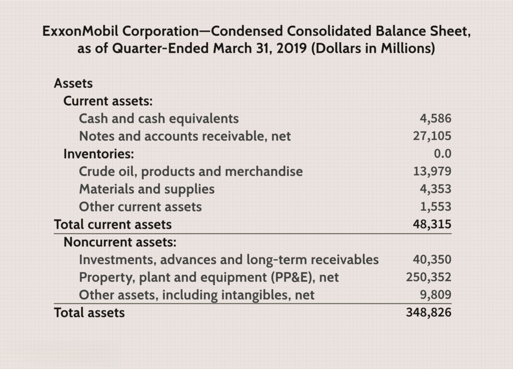

In the modern global economy, businesses rely heavily on efficient delivery systems, shipping methods, and logistics solutions to maintain competitiveness and meet customer expectations. The need for speed, reliability, and cost-effectiveness in logistics operations has never been greater, driven by the rapid growth of e-commerce and consumer demand for fast delivery. Traditional logistics models are becoming insufficient, prompting companies to seek innovative solutions.

One of the most compelling developments in logistics is the adaptation of algorithmic trading concepts, traditionally associated with financial markets, to optimize logistics and delivery systems. Algorithmic trading has transformed financial markets by using algorithms to execute trades at high speeds, reduce costs, and manage risks. Applying similar principles to logistics, algorithms can enhance efficiency in various operational areas, such as route optimization, demand forecasting, and inventory management.



This intersection of algorithmic trading and logistics presents an opportunity to revolutionize how businesses manage their supply chains. Algorithms offer the potential to predict demand more accurately, optimize transportation routes to reduce fuel consumption and delivery times, and manage inventory levels to minimize storage costs. Through real-time data analysis, businesses can make more informed decisions, ultimately driving improvements in both performance and customer satisfaction.

The article aims to explore these innovative trends and demonstrate how algorithmic methodologies are reshaping logistics, providing businesses with the tools to adapt to the changing landscape and maintain a competitive edge. By examining current practices and projecting future possibilities, we can gain valuable insights into how these technological advancements are shaping the future of delivery systems and shipping methods.

## Table of Contents

## Overview of Delivery Systems and Shipping Methods

Delivery systems and shipping methods have undergone profound changes with the infusion of technological advances. Historically, logistics relied heavily on manual processes and rudimentary tracking systems, but the industry has shifted towards automation and digitalization. This transformation is characterized by the adoption of smart technologies that enhance speed, reliability, and cost-effectiveness—core components that define modern shipping trends. 

One of the most significant advancements in delivery systems is the use of GPS and Internet of Things (IoT) technology for real-time tracking and route optimization. These tools enable precise location monitoring and data collection, which facilitates more efficient decision-making and resource allocation. For instance, IoT devices can collect data regarding vehicle performance and environmental conditions, adjusting routes in real-time to avoid traffic congestion or adverse weather. Simple Python libraries like `geopy` and `requests` can be employed to simulate basic route optimization:

```python
from geopy.distance import geodesic

def calculate_distance(coord1, coord2):
    return geodesic(coord1, coord2).kilometers

# Example coordinates (latitude, longitude)
warehouse = (37.7749, -122.4194)  # San Francisco
delivery_point = (34.0522, -118.2437)  # Los Angeles

distance = calculate_distance(warehouse, delivery_point)
print(f"Distance between points: {distance} km")
```

The integration of advanced software solutions into logistics operations allows companies to not only track shipments but also to predict potential delays, streamline loading processes, and optimize fuel consumption—thus reducing costs and improving service levels. Additionally, automation in warehousing and inventory management further complements shipping methods by ensuring that goods are dispatched promptly and efficiently.

Current trends also emphasize green logistics, where initiatives aim to minimize environmental footprints associated with freight transportation. By optimizing routes, reducing idle times, and leveraging alternative fuels, logistics companies are striving to meet sustainability goals while maintaining competitive service standards. 

As technology continues to evolve, we can anticipate even more sophisticated tools to emerge, driving the logistics sector towards greater efficiency and adaptability. Businesses are increasingly using [machine learning](/wiki/machine-learning) algorithms to forecast demand and dynamically adjust shipping schedules, further emphasizing the potent role of technology in shaping the future landscape of delivery systems and shipping methods.

## The Role of Logistics in Today’s Market

Logistics plays a crucial part in supply chain management, directly affecting both the cost structure of businesses and the satisfaction of end customers. In today's competitive environment, efficient logistics capabilities are critical for maintaining market position. By optimizing logistics, companies can anticipate and meet customer demands more effectively, leading to enhanced customer loyalty and retention.

Advancements in logistics technology have provided businesses with innovative tools to streamline their operations. These technologies include automated warehouses, fleet management software, and real-time tracking systems. Automated warehouses utilize robotics and sophisticated inventory systems to improve storage and retrieval processes, reducing labor costs and minimizing errors. Fleet management software aids in managing vehicle logistics, improving route planning, and reducing fuel consumption.

The environmental impact of logistics has also come under scrutiny. There is a growing emphasis on reducing the carbon footprint through the adoption of green logistics solutions. These include the use of electric vehicles, optimization of delivery routes to reduce emissions, and investment in energy-efficient warehouses.

Several case studies underline both the successes and hurdles companies encounter when implementing these technologies. Companies like Amazon have pioneered in using robotics and AI to enhance their logistics processes. Their approach has resulted in faster delivery times and more efficient use of resources. On the flip side, small businesses may face challenges such as high initial costs and the complexity of integrating new technologies with existing systems. However, phased implementation and scalable solutions can mitigate these challenges.

The logistics sector is a dynamic and evolving field, with technology playing a significant role in shaping its future. Businesses that effectively harness these advancements not only improve operational efficiency but also contribute to a sustainable environment. The ongoing development in logistics technology will continue to redefine how supply chains operate, offering both challenges and opportunities for businesses willing to adapt.

## Algorithmic Trading and Its Influence on Logistics

Algorithmic trading, traditionally associated with financial markets, employs complex algorithms to execute trades at optimal prices by analyzing vast datasets in real time. Recently, the logistics industry has begun adapting similar algorithmic techniques to enhance operational efficiencies. This paradigm shift introduces a host of opportunities for innovation and optimization within logistics and supply chains.

Algorithms in logistics are primarily used to predict demand, manage inventory, and optimize transportation routes. By forecasting demand more accurately, businesses can better align their inventory levels with market needs, reducing the risk of overstocking or stockouts. This predictive capability is essential in minimizing costs and enhancing customer satisfaction.

A predictive model often used is the time series analysis, which forecasts future values based on previously observed values. For example, autoregressive integrated moving average (ARIMA) models can be implemented in Python to forecast product demand. A simple Python implementation might look like this:

```python
import pandas as pd
from statsmodels.tsa.arima.model import ARIMA

# Load your dataset
data = pd.read_csv('demand_data.csv')
demand_series = data['demand']

# Fit an ARIMA model
model = ARIMA(demand_series, order=(5, 1, 0))
model_fit = model.fit()

# Make a prediction
forecast = model_fit.forecast(steps=10)
print(forecast)
```

Another crucial application of algorithms is route optimization, which reduces transportation costs and delivery times. By analyzing historical traffic patterns and real-time data, algorithms can compute the most efficient routes for delivery vehicles. This concept parallels [algorithmic trading](/wiki/algorithmic-trading) strategies that identify the most advantageous trading pathways to maximize profit.

The utilization of optimization algorithms, such as Dijkstra's or the A* algorithm, can significantly enhance logistics operations. These algorithms are employed in determining the shortest paths in a graph, applicable to network routes in logistics.

Furthermore, the integration of algorithmic principles has unveiled new efficiencies in logistic systems, analogous to the high-frequency trading models in finance that leverage speed and automation for strategic advantage. For instance, the swift analysis and execution of delivery schedules can mimic the rapid execution of trades in algorithmic trading.

In summary, the intersection of algorithmic trading principles and logistics presents transformative opportunities for industry advancements. By leveraging predictive algorithms and real-time data analysis, logistics operations can achieve heightened efficiency, cost-effectiveness, and innovation. As these sectors continue to converge, the potential for further development and sophistication in logistic solutions remains vast.

## Benefits of Using Algorithmic Solutions in Logistics

Implementing algorithms in logistics significantly enhances demand forecasting and supply chain management. Algorithms like machine learning models analyze historical data, extract patterns, and predict future demand with greater accuracy. This improves inventory management and reduces the risk of overstocking or stockouts, optimizing the flow of goods from manufacturers to consumers.

One of the primary benefits is the reduction in operational costs. Algorithmic solutions identify the most cost-effective routes and modes of transportation, ensuring goods reach their destination quickly and economically. By optimizing shipping routes and schedules, companies can minimize fuel consumption and labor costs, directly impacting the bottom line. Additionally, algorithms can help balance supply and demand across different logistics nodes, preventing bottlenecks and ensuring efficient resource utilization.

Algorithmic solutions also enhance decision-making capabilities by providing real-time data analysis. This allows logistics managers to make informed decisions rapidly, adjusting strategies to meet dynamic market conditions. For instance, if a sudden spike in demand is detected, algorithms can recommend adjustments to procurement or distribution schedules to meet the new requirements without delay. 

Real-time adjustments are crucial in today's fast-paced market environments. With algorithmic models, logistics systems can analyze incoming data continuously, automatically recalibrating routes, schedules, and inventory levels. This ensures that logistics operations remain agile and responsive to changes, such as traffic conditions, weather disruptions, or unexpected shifts in demand.

In summary, the integration of algorithmic solutions in logistics offers substantial benefits in terms of cost efficiency and resource utilization, while significantly enhancing decision-making and operational agility. As logistics continue to evolve, these benefits will likely become even more pronounced, offering a sustainable competitive advantage to businesses that fully embrace these technologies.

## Challenges in Implementing Algorithm-Based Logistics

Implementing algorithm-based logistics, while promising in its potential benefits, presents several significant challenges that organizations must navigate. One of the primary concerns is data privacy. The sensitive nature of logistics data, which can include customer information, proprietary supply chain details, and strategic business insights, necessitates stringent data protection measures. Companies must ensure compliance with regulations such as the General Data Protection Regulation (GDPR) in the European Union, which imposes strict guidelines on data handling and sharing.

Another considerable challenge is the requirement for substantial IT infrastructure. The successful deployment of algorithmic solutions demands high computational power and advanced data processing capabilities. This often involves investment in cloud computing resources, data storage facilities, and networking technologies to handle large datasets and perform real-time analytics. Smaller enterprises, in particular, might struggle with these upfront costs, creating a barrier to entry that can put them at a competitive disadvantage.

Integrating new algorithms with legacy systems presents additional complexities. Many established companies operate on outdated platforms, which may not easily support modern algorithmic approaches. This integration process can be costly and time-consuming, as it often requires custom-development and extensive testing to ensure compatibility and functionality across various system components.

To address these challenges, companies can adopt phased implementation strategies. This gradual approach allows organizations to pilot test algorithmic solutions within certain segments of their operations, refining processes and ironing out incompatibilities before a full-scale rollout. Additionally, continual process improvements are crucial; businesses should adopt a cycle of feedback and iteration. Leveraging machine learning, companies can develop adaptive algorithms that evolve over time to accommodate new data patterns and logistical demands.

Furthermore, building cross-functional teams that include data scientists, IT professionals, and logistics experts can aid in bridging the gap between algorithm development and real-world application. These teams can collaboratively address integration issues, ensuring that the technical needs dovetail with operational realities. By fostering an environment of collaboration and innovation, organizations can more effectively harness the power of algorithmic solutions while mitigating implementation obstacles.

## Future Trends in Logistics and Delivery Systems

The future of logistics is poised to undergo significant transformations through the adoption of [artificial intelligence](/wiki/ai-artificial-intelligence) (AI) and machine learning, leading to unprecedented efficiencies. As these technologies continue to evolve, they present opportunities for streamlining processes by promoting data-driven decision-making, automating routine tasks, and enhancing predictive analytics. AI and machine learning are particularly suited to handling the complexities inherent in logistics, such as inventory management, route optimization, and demand forecasting. For example, machine learning algorithms can analyze historical data to predict peak times and optimize delivery routes accordingly, reducing both time and fuel consumption.

Sustainability concerns are likely to drive innovations in green logistics solutions. As awareness of environmental impact grows, companies are increasingly pressured to minimize their carbon footprint. This can be achieved through methods such as optimizing cargo loads to reduce the number of trips, integrating alternative fuel vehicles, and employing better predictive analytics for energy management. The commitment to sustainability not only helps companies comply with regulations but also meets consumer demand for more environmentally friendly practices, which has become a competitive advantage in the logistics sector.

Emerging trends will focus on achieving a balance between cost efficiency and environmental responsibility. Innovations in logistics are increasingly aligned with sustainable practices, aiming to reduce costs while simultaneously addressing ecological impacts. This requires a careful assessment of lifecycle costs, including the hidden costs of environmental degradation. Companies are now exploring the use of blockchain for transparent, verifiable supply chains, which can further ensure compliance with sustainability targets.

Open-source software and cloud computing are increasingly enabling logistics companies to innovate with less financial risk, providing platforms for small and medium enterprises to implement sophisticated logistics solutions without substantial upfront investments. Python, for instance, is a tool often utilized for developing machine learning models due to its vast libraries such as TensorFlow and scikit-learn, which offer predictive analytics capabilities vital for enhancing logistical operations.

In conclusion, the logistics industries that embrace AI, machine learning, and sustainable practices will likely lead the charge in realizing logistical efficiencies and environmental stewardship over the coming years. As these technologies advance, they promise to redefine how logistics and delivery systems function, offering significant benefits in terms of both cost savings and environmental impact reductions.

## Conclusion

The fusion of algorithmic trading techniques with logistics is revolutionizing how businesses approach delivery and shipping. This synergy is characterized by enhanced efficiency and precision in logistics operations. Algorithms, traditionally utilized in high-frequency trading to analyze massive datasets and make split-second decisions, are now applied to logistical challenges. They optimize routes, predict demand fluctuations, and manage inventory levels. These algorithmic innovations allow logistics companies to achieve unprecedented speed and accuracy.

As technology continues to evolve, the logistics sector will encounter both opportunities and challenges in fully integrating these advancements. The rapid evolution of artificial intelligence and machine learning models presents new possibilities for refining logistics operations. For instance, the deployment of predictive analytics can significantly improve demand forecasting, providing companies a competitive advantage by aligning inventory and resources optimally with market needs.

However, the integration of these technologies is not without its obstacles. Businesses must grapple with data privacy concerns, necessitating robust cybersecurity measures to protect sensitive information. Furthermore, implementing sophisticated algorithms requires significant investment in IT infrastructure and expertise, presenting a barrier for smaller firms. The complexity of merging new technologies with existing systems necessitates careful planning and execution to avoid operational disruptions.

Despite these challenges, companies that adeptly adapt to these changes are likely to secure a competitive edge in the market. By leveraging algorithmic solutions, businesses can enhance their decision-making capabilities, leading to improved customer satisfaction and reduced costs. In conclusion, the transformative impact of algorithmic trading techniques on logistics underscores the potential for continued innovation and growth in the delivery and shipping sectors. As technology advances, the ability of businesses to harness these tools will be crucial in maintaining and enhancing their market position.

## References & Further Reading

[1]: Kouvelis, P., Chambers, C., & Wang, H. (2006). ["Supply Chain Management Research and Production and Operations Management: Review, Trends, and Opportunities."](https://onlinelibrary.wiley.com/doi/abs/10.1111/j.1937-5956.2006.tb00257.x) Production and Operations Management.

[2]: Russell, S., & Norvig, P. (2016). ["Artificial Intelligence: A Modern Approach."](http://aima.cs.berkeley.edu/) Pearson Education.

[3]: Caplice, C., & Sheffi, Y. (1994). ["A Review and Evaluation of Logistics Metrics."](https://sheffi.mit.edu/sites/sheffi.mit.edu/files/2018-07/15_09574099410805171.pdf)90028-0) International Journal of Production Economics.

[4]: Fleischmann, M., Bloemhof-Ruwaard, J. M., Dekker, R., van der Laan, E., van Nunen, J. A. E. E., & Van Wassenhove, L. N. (1997). ["Quantitative Models for Reverse Logistics: A Review."](https://www.sciencedirect.com/science/article/pii/S0377221797002300)00071-7) European Journal of Operational Research.

[5]: Taniguchi, E., & Thompson, R. G. (Eds.). (2004). ["Logistics Systems for Sustainable Cities."](https://www.emerald.com/insight/publication/doi/10.1108/9780080473222) Elsevier.