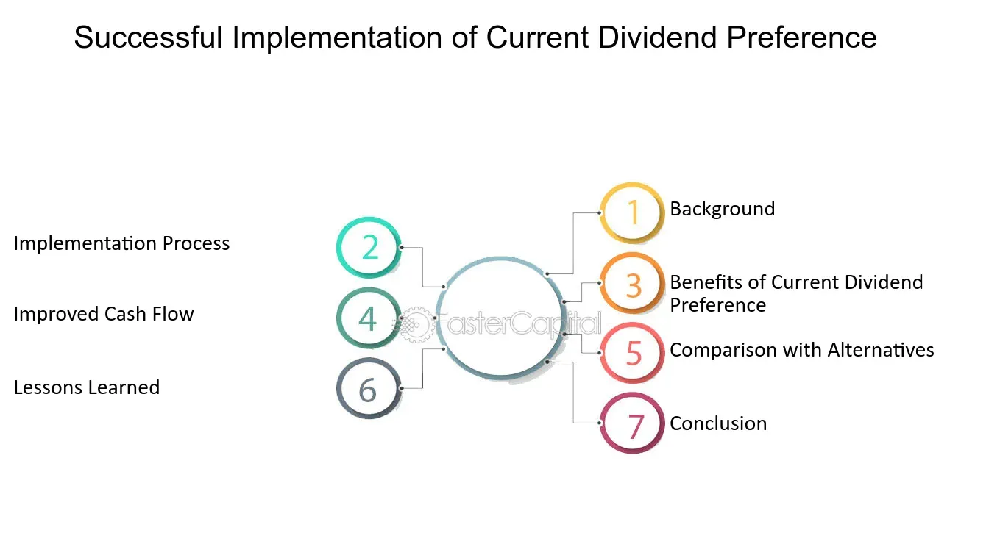

## Table of Contents

## What is a dividend?

A dividend is money that a company pays to its shareholders. It is like a reward for owning part of the company. When a company makes a profit, it can choose to share some of that profit with the people who own its stock. This payment usually happens a few times a year.

Dividends can be a good thing for investors because they provide a regular income. Instead of selling the stock to get money, shareholders can receive these payments. The amount of the dividend depends on how well the company is doing and its policy on sharing profits. Some companies give out high dividends, while others might give out less or none at all.

## What is dividend preference?

Dividend preference means that some shareholders get paid before others. This usually happens with preferred stock. People who own preferred stock get their dividends first, before people who own common stock. This is a big advantage because it makes their investment safer. If a company is struggling and can't pay all its dividends, preferred shareholders still get their money.

There are different types of dividend preferences. Some preferred stocks have a fixed dividend rate, so shareholders know exactly how much they will get each time. Other preferred stocks might have a cumulative feature. This means if the company skips a dividend payment, it has to pay it later before paying any dividends to common shareholders. This gives extra protection to preferred shareholders, making their investment even more secure.

## How does dividend preference affect shareholders?

Dividend preference gives some shareholders, usually those with preferred stock, a big advantage. It means they get their dividends before anyone else, like people with common stock. This makes their investment safer because even if the company is not doing well and can't pay everyone, preferred shareholders still get their money. This can be really important for investors who want a steady income and don't want to worry about the company's ups and downs.

There are different kinds of dividend preferences that can affect shareholders in different ways. Some preferred stocks come with a fixed dividend rate, so shareholders know exactly how much they will get each time. This can be good for planning because it's predictable. Other preferred stocks might be cumulative, which means if the company misses a dividend payment, it has to pay it later before paying any dividends to common shareholders. This extra protection can make preferred stock even more appealing to investors who want to minimize their risk.

## What are the different types of dividend preferences?

Dividend preferences come in different types, and each type can affect shareholders differently. One type is a fixed dividend rate, where preferred shareholders know exactly how much they will get each time. This is good because it's predictable and helps with planning. Another type is a participating dividend, where preferred shareholders can get extra dividends if the company does really well. This can be a nice bonus on top of the regular dividends.

Another important type of dividend preference is cumulative dividends. If a company misses a dividend payment, it has to pay it later before paying any dividends to common shareholders. This gives preferred shareholders extra protection because they know they will get their missed payments eventually. There's also non-cumulative dividends, where if a payment is missed, it's gone forever. This is riskier for shareholders because they might not get all the dividends they were expecting.

## How are dividend preferences established in a company?

Dividend preferences are set up when a company decides to issue preferred stock. This happens when the company wants to raise money, and it offers special shares that come with certain benefits. The company writes down all the rules about these shares in a document called the "articles of incorporation" or in a special agreement called the "certificate of designation." These documents explain exactly how the preferred stock works, including what kind of dividend preferences the shareholders will get.

For example, the company might say that preferred shareholders will get a fixed dividend rate of 5% every year. Or, they might say that the dividends are cumulative, so if the company can't pay one year, it has to make it up later. All these details are important because they tell investors exactly what they can expect from their investment. This way, everyone knows the rules and can make smart choices about whether to buy the preferred stock or not.

## What is the difference between cumulative and non-cumulative dividend preferences?

Cumulative dividend preferences mean that if a company misses a dividend payment, it has to pay it later before it can pay any dividends to common shareholders. This is like saving up missed payments for preferred shareholders. It's a good thing for them because they know they will get their money eventually, even if the company is having a tough time right now. This makes their investment safer and more predictable.

Non-cumulative dividend preferences are different. If the company misses a dividend payment, it's gone forever. Preferred shareholders won't get that money later. This makes non-cumulative dividends riskier because shareholders might not get all the dividends they were expecting. It's important for investors to know whether their preferred stock is cumulative or non-cumulative because it can affect how much money they get back from their investment.

## How do dividend preferences impact a company's financial strategy?

Dividend preferences can affect a company's financial strategy a lot. When a company issues preferred stock with dividend preferences, it has to make sure it can pay those dividends before it pays any dividends to common shareholders. This can be tricky if the company is not making a lot of money. The company might have to be careful with how it spends its money, making sure it saves enough to pay the preferred shareholders first. This can limit what the company can do with its profits, like investing in new projects or expanding the business.

On the other hand, offering preferred stock with dividend preferences can help a company raise money more easily. Investors might be more willing to buy preferred stock because it's safer than common stock. This can be a good way for the company to get the money it needs without taking on more debt. But the company has to balance this with the need to keep enough money to pay those dividends. If the company can't pay, it might upset the preferred shareholders and make it harder to raise money in the future.

## What are the tax implications of dividend preferences for investors?

The tax implications of dividend preferences can be different for investors depending on where they live and what type of dividends they get. In many places, dividends are taxed as income. This means that when investors get dividends from preferred stock, they have to pay taxes on that money. The tax rate can depend on how much money the investor makes overall. Sometimes, dividends from preferred stock might be taxed at a lower rate than regular income, which can be a good thing for investors.

Another thing to think about is that some countries have special rules for dividends. For example, in the United States, qualified dividends from preferred stock might be taxed at a lower rate than ordinary dividends. This can make a big difference for investors because it means they get to keep more of their money. It's important for investors to know the tax rules in their country and to talk to a tax advisor to understand how dividend preferences will affect their taxes.

## How do dividend preferences influence investment decisions?

Dividend preferences can make a big difference when people are deciding where to invest their money. If someone wants a steady income and less risk, they might choose to buy preferred stock with dividend preferences. This is because preferred shareholders get their dividends before common shareholders, which makes their investment safer. Investors who need regular money from their investments might like this because they know they will get paid first, even if the company is not doing great.

On the other hand, dividend preferences can also affect how much money investors might make. If a company has to pay preferred shareholders first, there might be less money left for common shareholders. This means that people who own common stock might not get as much in dividends, or they might get nothing at all if the company is struggling. Investors need to think about this when they are choosing between preferred and common stock, deciding if they want the safety of preferred stock or the potential for bigger rewards with common stock.

## What role do dividend preferences play in corporate governance?

Dividend preferences can affect how a company is run because they set rules about who gets paid first. When a company has preferred stock with dividend preferences, it has to make sure it can pay those dividends before paying any money to common shareholders. This means the company's leaders have to be careful with how they use the company's profits. They need to save enough money to pay the preferred shareholders, which can limit what they can do with the rest of the money. This can influence big decisions like whether to start new projects or expand the business.

Having dividend preferences also means the company has to think about what investors want. If the company can't pay the preferred dividends, it might upset those investors. This can make it harder for the company to raise money in the future because investors might not trust it anymore. So, the people in charge have to balance the needs of preferred shareholders with the overall goals of the company. This can shape how they make decisions and plan for the future, making sure they keep everyone happy while trying to grow the business.

## How have recent economic changes affected dividend preference policies?

Recent economic changes, like the ups and downs from things like the global health crisis and inflation, have made companies think harder about their dividend preference policies. When times are tough, companies might not make as much money, so they have to be careful about paying dividends. Some companies might decide to cut back on dividends for preferred shareholders to save money for other important things, like keeping the business running smoothly. This can be a big deal for investors because they might not get the steady income they were expecting.

On the other hand, some companies might stick to their dividend preference policies to keep investors happy, even if it means they have less money for other things. This can be important for keeping the trust of investors, especially those who rely on the income from preferred stock. But it's a tricky balance because if a company pays out too much in dividends and then runs into more financial trouble, it could hurt the business in the long run. So, companies have to think carefully about how to handle dividend preferences during tough economic times.

## What advanced strategies can companies use to optimize dividend preferences for growth and stability?

Companies can use smart strategies to make the most out of dividend preferences while also growing and staying stable. One way is to use a tiered dividend structure, where they pay different rates for different types of preferred stock. This can attract more investors because it gives them options based on how much risk they want to take and how much income they need. For example, a company might offer a higher dividend rate for non-cumulative preferred stock to attract investors who are okay with more risk, while offering a lower rate but with cumulative features for those who want more safety. This way, the company can balance the need to pay dividends with keeping enough money for growth.

Another strategy is to use dividend reinvestment plans (DRIPs) for preferred shareholders. Instead of getting cash dividends, investors can choose to get more shares of the company. This can help the company save cash while still rewarding shareholders. It also helps the company grow because more shares in the hands of investors can increase the company's value over time. By offering these options, the company can keep investors happy and use the money that would have gone to dividends for things like new projects or paying down debt, which can help the company stay stable and grow in the long run.

## What are the financial considerations and how do they impact decision-making?

Financial decision-making is integral to constructing and managing an investment portfolio, with the balance between risk and return being a pivotal consideration. One fundamental aspect of this process is understanding the role of dividend preferences, particularly for risk-averse investors who prioritize stable returns. Preferred stocks, which often offer fixed dividends, are an attractive option for such investors because they come with the advantage of priority over common stocks in dividend distribution. This predictability in cash flows makes preferred stocks a valuable component of a conservative investment strategy.

Dividend preferences can significantly influence portfolio composition. For instance, preferred shares with fixed dividends appeal to investors seeking a stable income stream, especially in uncertain market conditions. These shares usually yield higher dividends than common stocks but offer less capital appreciation potential. Consequently, investors must evaluate the risk-return trade-off when considering preferred stocks. They provide a safety net through consistent dividends but may underperform in terms of capital gains compared to common stocks.

Comparatively, preferred shares are juxtaposed with bonds and common equities in terms of risk and return. While bonds offer fixed interest payments with a higher claim than preferred shares in case of liquidation, they generally have lower yields compared to preferred dividends. On the other hand, common equities provide dividends at the discretion of the company and offer the possibility of capital gains, albeit with greater exposure to market [volatility](/wiki/volatility-trading-strategies).

Market trends and economic indicators profoundly impact dividend policies and the stability of returns from dividend-preferred securities. Factors such as [interest rate](/wiki/interest-rate-trading-strategies) fluctuations, inflation, and economic growth rates can influence a company’s ability to pay dividends. For example, in a low-interest-rate environment, companies might opt to increase dividend payouts to attract investors. Conversely, during economic downturns, dividend cuts may occur as companies conserve cash, affecting the reliability of dividend income.

To mathematically analyze the impact of dividend preferences, consider the Dividend Discount Model (DDM), which estimates the price of a dividend-paying stock as follows:

$$
P = \frac{D}{r - g}
$$

Where:
- $P$ is the price of the stock.
- $D$ is the expected annual dividend.
- $r$ is the required rate of return.
- $g$ is the growth rate of the dividend.

This formula illustrates the sensitivity of stock prices to changes in dividends and the required rate of return, emphasizing the importance of stable dividends in maintaining stock value.

In conclusion, dividend preferences are a critical [factor](/wiki/factor-investing) in financial decision-making, particularly for investors seeking to balance risk and return through income stability. Understanding these dynamics allows investors to strategically allocate resources across various financial instruments to achieve their financial goals.

## References & Further Reading

[1]: Bergstra, J., Bardenet, R., Bengio, Y., & Kégl, B. (2011). ["Algorithms for Hyper-Parameter Optimization."](https://dl.acm.org/doi/10.5555/2986459.2986743) Advances in Neural Information Processing Systems 24.

[2]: ["Advances in Financial Machine Learning"](https://www.amazon.com/Advances-Financial-Machine-Learning-Marcos/dp/1119482089) by Marcos Lopez de Prado

[3]: ["Evidence-Based Technical Analysis: Applying the Scientific Method and Statistical Inference to Trading Signals"](https://www.amazon.com/Evidence-Based-Technical-Analysis-Scientific-Statistical/dp/0470008741) by David Aronson

[4]: ["Machine Learning for Algorithmic Trading"](https://github.com/stefan-jansen/machine-learning-for-trading) by Stefan Jansen

[5]: ["Quantitative Trading: How to Build Your Own Algorithmic Trading Business"](https://www.amazon.com/Quantitative-Trading-Build-Algorithmic-Business/dp/1119800064) by Ernest P. Chan