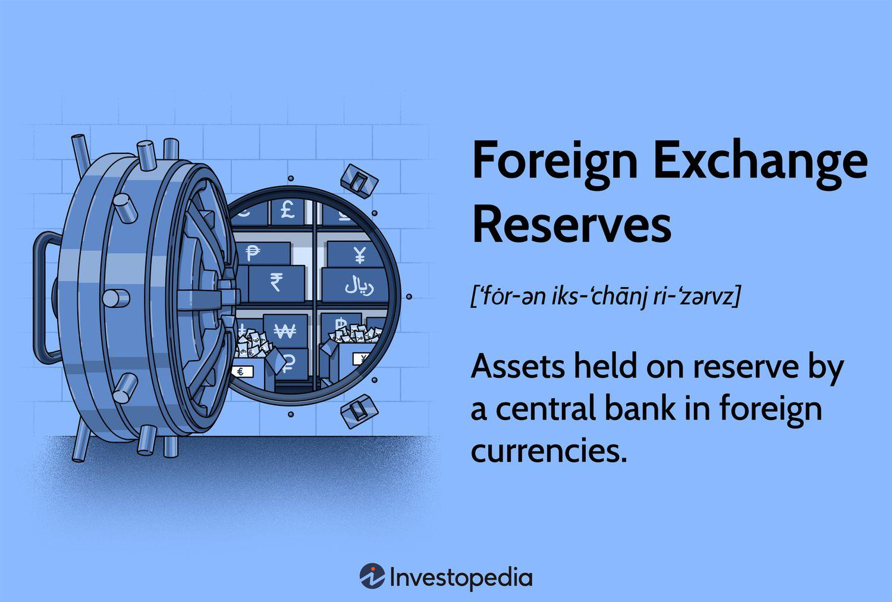

## Table of Contents

## What are economic reserves?

Economic reserves are the amounts of natural resources, like oil, gas, or minerals, that can be profitably extracted from the earth. These reserves are important because they help countries and companies plan their future activities and investments. To be considered an economic reserve, the cost of extracting the resource must be less than the price it can be sold for. This means that economic reserves can change over time as technology improves or as the prices of resources go up or down.

For example, if the price of oil goes up, it might become profitable to extract oil from places that were too expensive before. This could turn what was once just a resource into an economic reserve. On the other hand, if new technology makes it cheaper to extract resources, more deposits might become economic reserves. Governments and businesses keep track of these reserves to make sure they can meet the demand for these resources and to plan for the future.

## Why are economic reserves important for a country?

Economic reserves are important for a country because they help the country plan for the future. When a country knows how much oil, gas, or minerals it can use and sell, it can make better decisions about how to use its money and resources. For example, if a country has a lot of oil reserves, it might decide to invest in more oil wells or in technology to extract the oil more cheaply. This can help the country's economy grow and create jobs for people.

Also, economic reserves can affect a country's energy security. If a country has enough reserves of resources like oil and gas, it doesn't have to rely on other countries to meet its energy needs. This can make the country stronger and less likely to be affected by problems in other parts of the world. For example, if there is a war or a problem in a country that supplies oil, a country with its own reserves can keep its energy supply stable. This helps keep the country's economy running smoothly and its people safe.

## How are economic reserves measured?

Economic reserves are measured by looking at how much of a resource, like oil or minerals, can be taken out of the ground and sold for a profit. To figure this out, experts first estimate how much of the resource is in the ground. They use special tools and methods, like drilling and taking samples, to get a good idea of the size of the deposit.

Next, they calculate the costs of getting the resource out of the ground. This includes the money needed for drilling, equipment, and workers. They compare these costs to the price the resource can be sold for. If the selling price is higher than the cost of extraction, the resource is considered an economic reserve. This way, countries and companies know how much they can use and sell without losing money.

## What are the different types of economic reserves?

Economic reserves can be divided into different types based on how sure we are about them and how easy it is to get them out of the ground. One type is called "proven reserves." These are the amounts of resources that we know for sure are there and can be taken out profitably with today's technology and prices. Another type is "probable reserves." These are resources that we think are there but we're not as sure about. They might need more study or better technology to be sure we can get them out at a profit.

There are also "possible reserves." These are resources that might be there, but we're even less sure about them than probable reserves. They need a lot more study and might need new technology or higher prices to be worth getting out of the ground. All these types help countries and companies plan for the future, but they use proven reserves the most because they are the surest and easiest to use.

## Can you explain the difference between foreign exchange reserves and gold reserves?

Foreign exchange reserves are the money a country keeps in foreign currencies, like US dollars or euros. These reserves are important because they help a country pay for things it buys from other countries, like oil or cars. If a country's own currency is weak, it can use its foreign exchange reserves to buy the things it needs without having to worry about the exchange rate. Countries usually keep these reserves in big, safe banks in other countries to make sure they can get to them when they need them.

Gold reserves are different. They are the amount of gold a country keeps in its central bank. Gold has been seen as a valuable and safe thing to keep for a long time because it doesn't lose its value easily. Countries keep gold reserves as a way to protect their money and to have something valuable in case of emergencies. Unlike foreign exchange reserves, gold reserves don't change with the ups and downs of currency values, which makes them a stable part of a country's wealth.

## How do economic reserves impact a country's currency value?

Economic reserves, like oil or minerals, can affect a country's currency value. When a country has a lot of these reserves, it can sell them to other countries. This brings in foreign money, which can make the country's currency stronger. For example, if a country sells a lot of oil, it gets paid in dollars or euros. This means more foreign money is coming into the country, which can make its own currency more valuable.

But it's not just about having the reserves. It's also about how much people want to buy them. If the price of oil goes up, the country's currency might get stronger because people want to buy more oil. But if the price goes down, or if people find other ways to get energy, the currency might get weaker. So, economic reserves can help a country's currency, but it depends on what's happening in the world.

## What role do economic reserves play in times of economic crisis?

During an economic crisis, economic reserves can be very important for a country. If a country has a lot of oil, gas, or minerals that it can sell, it can use these reserves to bring in money from other countries. This can help the country pay for things it needs, like food or medicine, and keep its economy going even when times are tough. For example, if a country's own money is weak, it can sell its reserves to get stronger foreign money, which can help it buy what it needs.

But having economic reserves doesn't always solve all the problems in a crisis. If the price of the reserves goes down, or if people don't want to buy them as much, the country might not get as much help from its reserves. Also, if everyone is trying to sell their reserves at the same time during a crisis, it might not be easy to find buyers. So, while economic reserves can be a big help in tough times, they need to be managed carefully and used in the right way to really make a difference.

## How do countries build up their economic reserves?

Countries build up their economic reserves by finding and using their natural resources like oil, gas, and minerals. They do this by exploring their land and sea areas to see what resources are there. Once they find these resources, they start to take them out of the ground. This process needs a lot of money and technology, so countries often work with big companies to do this. As they take out more resources, they sell them to other countries and use the money to grow their reserves.

Another way countries build up their economic reserves is by saving money from what they earn. If a country makes a lot of money from selling its resources, it can choose to save some of that money instead of spending it all. This saved money can be used to buy more resources or to keep as foreign exchange reserves. By doing this, the country makes sure it has enough resources and money for the future, which helps keep its economy strong.

## What are the risks associated with holding large economic reserves?

Holding large economic reserves can be risky because the value of these reserves can change. If the price of oil or minerals goes down, the country might not be able to sell them for as much money as before. This can make the country's money weaker and cause problems for its economy. Also, if everyone tries to sell their reserves at the same time, like during a crisis, it can be hard to find buyers. This means the country might not be able to use its reserves to help when it really needs to.

Another risk is that countries might spend too much money trying to find and take out more resources. Exploring for oil or minerals can be very expensive, and there's no guarantee they will find anything. If a country spends a lot of money and doesn't find new reserves, it can end up with less money and fewer resources than before. This can make it harder for the country to take care of its people and keep its economy strong.

## How do international organizations like the IMF affect a country's economic reserves?

The International Monetary Fund (IMF) can affect a country's economic reserves by giving loans or advice. If a country is having money problems, the IMF can give it a loan. This loan can help the country buy things it needs without having to use up its own reserves. But, the IMF usually asks the country to make changes to its economy in return for the loan. These changes can affect how the country uses its reserves and how it plans for the future.

The IMF also gives advice to countries on how to manage their economic reserves. It might tell a country to save more of its money or to find new ways to use its resources. This advice can help a country keep its economy strong and make sure it has enough reserves for the future. But sometimes, following the IMF's advice can be hard for a country, especially if it means making big changes to how it does things.

## Can you discuss a case study of a country that effectively managed its economic reserves?

Norway is a good example of a country that managed its economic reserves well. Norway found a lot of oil and gas in the North Sea in the 1960s and 1970s. Instead of spending all the money they made from selling oil and gas, Norway decided to save some of it. They created a special fund called the Government Pension Fund Global, often called the Oil Fund. This fund helps Norway save money for the future and take care of its people when they get older.

Norway uses the money in the Oil Fund to invest in things like stocks and bonds all over the world. This helps the fund grow over time, so Norway can keep using the money even after its oil and gas run out. By saving and investing the money from its oil and gas, Norway made sure it would have enough money to keep its economy strong and take care of its people. This smart way of managing its economic reserves has helped Norway become one of the richest countries in the world.

## What are the latest trends and strategies in managing economic reserves globally?

Around the world, countries are using new ways to manage their economic reserves. One big trend is using technology to find and take out resources better. Countries are using things like drones and satellites to look for oil, gas, and minerals. This helps them find more reserves and get them out of the ground without spending as much money. Another trend is saving more of the money they make from selling resources. Countries are putting more money into special funds, like Norway's Oil Fund, to make sure they have enough for the future. This helps them keep their economy strong even when prices go up and down.

Another strategy countries are using is working together more. They are making deals with other countries to share technology and money to find and use resources. This can help them get more out of their reserves and make more money. Also, countries are thinking more about the environment. They are trying to find ways to use their reserves without hurting the planet too much. This includes using cleaner ways to take out resources and finding new kinds of energy that are better for the environment. By doing these things, countries hope to keep their economic reserves strong and help their people have a better future.

## References & Further Reading

[1]: ["The Economics of Money, Banking, and Financial Markets"](https://www.pearsonhighered.com/assets/preface/0/1/3/4/0134855388.pdf) by Frederic S. Mishkin

[2]: ["Advances in Financial Machine Learning"](https://www.amazon.com/Advances-Financial-Machine-Learning-Marcos/dp/1119482089) by Marcos Lopez de Prado

[3]: ["Quantitative Finance and Risk Management: A Physicist's Approach"](https://www.amazon.com/QUANTITATIVE-FINANCE-RISK-MANAGEMENT-PHYSICISTS/dp/9814571237) by Jan W. Dash

[4]: ["Machine Learning for Asset Managers"](https://github.com/emoen/Machine-Learning-for-Asset-Managers) by Marcos Lopez de Prado 

[5]: ["Algorithmic Trading and DMA: An introduction to direct access trading strategies"](https://archive.org/details/algorithmictradi0000john) by Barry Johnson