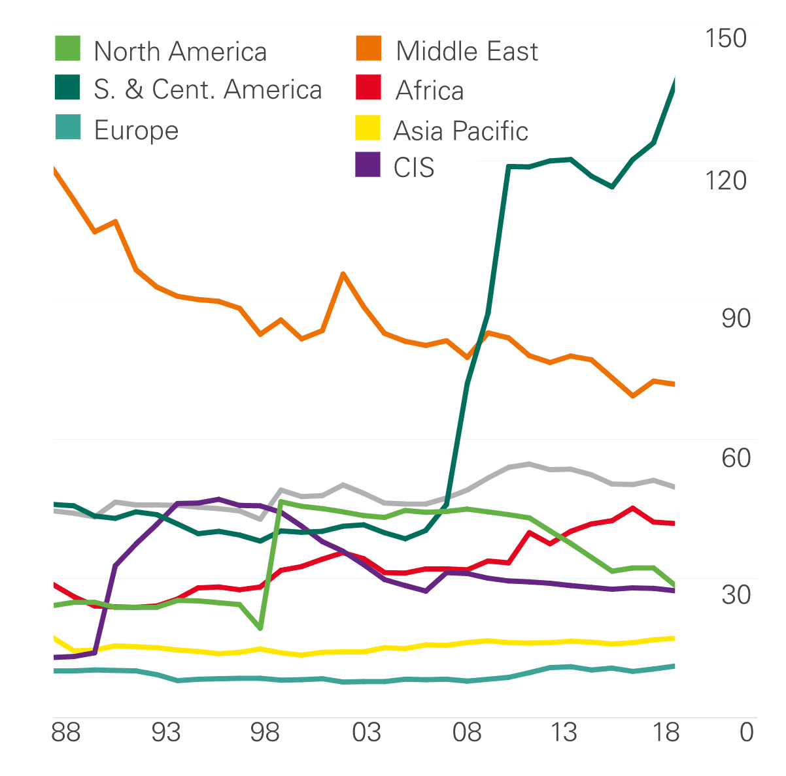

Understanding the interplay between economic reserves, contemporary financial assets, and algorithmic trading is crucial in shaping modern financial markets. Economic reserves are critical in ensuring liquidity and stability within the financial system. They serve as a buffer for central banks and financial institutions to back up their liabilities and guarantee the availability of funds. These reserves influence monetary policy, impacting the overall supply of money in an economy and affecting market dynamics.

Contemporary financial assets, encompassing a diverse array of instruments such as stocks, bonds, cryptocurrencies, and exchange-traded funds (ETFs), are integral components of today's market landscape. These assets offer various opportunities for investment and wealth management. The valuation and performance of these financial assets are closely linked to monetary policies, including reserve requirements, highlighting the importance of understanding their characteristics and roles.

Algorithmic trading, which utilizes sophisticated algorithms for automating trading decisions, has revolutionized the way trades are executed. Its ability to analyze extensive datasets at high speed allows investors to exploit market opportunities quickly and efficiently. Nonetheless, this form of trading can lead to both the stabilization and destabilization of market conditions due to its significant speed and volume, presenting potential challenges and rewards.

The interconnectedness of economic reserves, contemporary financial assets, and algorithmic trading requires comprehensive understanding to effectively navigate and succeed in financial markets. Staying informed of these components is imperative for investors, policymakers, and financial analysts as technology and monetary policies evolve. By comprehensively managing these elements, market participants can enhance market dynamics and refine investment strategies, contributing to long-term stability and growth in financial markets.

## Table of Contents

## Understanding Economic Reserves

Economic reserves are a critical element of the banking system, serving as the backbone for maintaining liquidity and stability within financial markets. Central banks and financial institutions hold these reserves to back up their liabilities, which include deposits, loans, and other financial obligations, ensuring the continued availability of funds. The primary role of economic reserves is to function as a buffer against unpredictable economic fluctuations and financial shocks. 

Contemporaneous reserves are a specific type of reserve management where financial institutions hold enough reserves to cover recent deposits on hand. This approach is utilized to handle short-term monetary fluctuations, ensuring that banks can meet their immediate obligations without disruption. The contemporaneous reserve requirement can influence how financial institutions adjust their monetary strategies, and thus plays a key role in the overall liquidity of the financial system.

The Federal Reserve's policies on reserves have historically evolved, reflecting a series of strategic adjustments aimed at stabilizing the economy. One notable policy shift was the transition between contemporaneous and lagged reserve requirements. Under the contemporaneous reserve requirement system, banks are required to hold reserves based on the deposits reported in the same period. Conversely, the lagged reserve requirement system allows banks to base their reserve holdings on deposits from a previous period, offering a more predictable and less turbulent environment for banks to manage their reserve levels.

Understanding the dynamics of these reserves is essential for grasping how banks manage monetary policy and influence the overall supply of money in the economy. As central banks adjust reserve requirements, they can indirectly control interest rates, influence inflation, and stabilize economic growth. By modulating the [volume](/wiki/volume-trading-strategy) of reserves in the banking system, central banks can either encourage lending during periods of economic downturns or restrain it when there is an overheating economy. These strategic adjustments have a profound impact on economic stability and are integral to effective monetary policy management. 

Economic reserves not only uphold the integrity of individual financial institutions but also fortify the broader economic landscape. They play a pivotal role in averting bank runs, enabling smooth payment systems, and underpinning confidence in the financial system. As such, a comprehensive understanding of economic reserves and their management is vital for financial analysts, policymakers, and investors aiming to navigate and prosper in the complex world of finance.

## Contemporary Financial Assets

Contemporary financial assets encompass a diverse array of instruments such as stocks, bonds, cryptocurrencies, and exchange-traded funds (ETFs). These assets serve as the backbone of financial markets, providing investment and wealth management options to market participants. 

Stocks represent ownership in a company, offering potential capital appreciation and dividends. Bonds, as fixed-income securities, provide periodic interest payments and return of principal upon maturity, serving as a counterbalance to the typically higher-[volatility](/wiki/volatility-trading-strategies) of stocks. Cryptocurrencies, though relatively new, have emerged as digital assets based on blockchain technology, offering decentralized transaction capabilities and investment prospects. ETFs, meanwhile, are investment funds traded on stock exchanges, combining the diversification of a mutual fund with the flexibility of stock trading.

A comprehensive understanding of the characteristics and roles of these financial assets is paramount for constructing diversified investment strategies. Diversification helps mitigate risks and balance potential returns, as different assets react differently to market conditions. Analyzing historical performance, risk metrics such as beta and standard deviation, and the correlation between different asset classes are critical steps in forming a resilient portfolio.

Monetary policy significantly influences the valuation and performance of these assets. Central banks' decisions on interest rates and reserve requirements impact the cost of capital and the yield environment, thereby affecting asset prices. For example, lower interest rates tend to increase the present value of future earnings, boosting stock prices, while also lowering yields on newly issued bonds. Conversely, higher rates might sour investor sentiment toward equities and increase bond yields, thus impacting their market values.

Investors must weigh the opportunities and risks inherent in contemporary financial assets, particularly amidst volatile market conditions. Equities may offer higher returns, but they come with higher volatility and risk, while bonds, despite providing stable returns, are subject to [interest rate](/wiki/interest-rate-trading-strategies) risk. Cryptocurrencies pose unique challenges with their high volatility and regulatory uncertainties, yet they also present significant upside potential. ETFs provide a middle ground by offering diversified exposure and tradability but may also track volatile sectors or indexes.

Staying informed and adapting to changing monetary policies and market conditions is critical for navigating the risks and capitalizing on opportunities within contemporary financial assets. As the financial landscape continues to evolve, incorporating advancements in technology and financial theories will be essential for achieving optimized investment outcomes.

## Algorithmic Trading: Transforming Financial Markets

Algorithmic trading is a technology-driven process that employs complex algorithms to automate trading decisions, enhancing the speed and efficiency with which trades are executed. This approach leverages computational algorithms to analyze vast datasets rapidly, enabling investors to identify and capitalize on market opportunities with minimal human intervention. The efficiency of [algorithmic trading](/wiki/algorithmic-trading) lies in its ability to process and react to market signals in fractions of a second, far quicker than traditional manual trading methods.

One of the core advantages of algorithmic trading is the ability to handle large volumes of trade at high speed, thus significantly increasing market [liquidity](/wiki/liquidity-risk-premium). However, the sheer magnitude of trades executed can also introduce volatility. Algorithmic trading can stabilize markets by arbitraging pricing differentials and executing trades that smooth out fluctuations. Conversely, it can exacerbate market instability during periods of economic stress or unexpected events, as automated algorithms might react similarly, creating cascading effects often referred to as "flash crashes."

The integration of algorithmic trading with modern financial reserve strategies offers opportunities to optimize asset management and enhance trading results. For instance, the use of algorithms can align trading activities with reserve management policies efficiently. This alignment is critical as it helps ensure that trades executed are within the constraints and objectives set by reserve strategies, thus maximizing returns and minimizing risks.

Stakeholders in financial markets must be acutely aware of the potential benefits and risks inherent in algorithmic trading. The primary advantage is the ability to improve market efficiency and potentially enhance returns through rapid and informed decision-making. However, algorithmic trading also brings challenges, particularly concerning market stability. During periods of economic change, the synchronization of these trading systems can lead to unintended and potentially adverse market movements.

In practice, deploying algorithmic trading strategies requires a deep understanding of both the technological and financial aspects. Algorithms must be meticulously designed to consider market conditions, historical data, and predictive analytics to ensure robust performance. Moreover, regulatory frameworks are essential to mitigating risks associated with algorithmic trading, ensuring transparency, and promoting fair market practices. 

The ongoing evolution of financial technology and regulatory landscapes will likely shape the future of algorithmic trading, underscoring the need for continuous adaptation and monitoring. As financial markets become more complex and interconnected, the role of algorithmic trading will undoubtedly expand, making it vital for market participants to develop strategies that responsibly harness the power of technology to optimize trading outcomes.

## Interaction of Reserves, Financial Assets, and Algo Trading

The interaction between economic reserves, financial assets, and algorithmic trading represents a critical axis within the financial markets. Central banks play a pivotal role through their management of economic reserves, which directly impacts market liquidity and investment decisions. For instance, adjustments in reserve requirements can alter the supply of money, influencing interest rates and thus the attractiveness of various financial assets.

Algorithmic trading, characterized by its reliance on complex algorithms, can significantly modify market dynamics. By executing trades at high speed and volume, algorithmic trading can quickly respond to shifts in reserve policies. For example, an increase in reserve requirements might lead to tighter liquidity conditions, which algorithmic systems could detect and react to by reallocating investments, thereby affecting asset prices and market stability.

A balanced approach that harmonizes the management of reserves with algorithmic trading strategies can lead to enhanced market efficiency and stability. This involves setting reserve policies that ensure sufficient liquidity without causing unnecessary inflation. Simultaneously, algorithmic trading must be employed responsibly to avoid excessive market volatility. Policymakers and investors must closely monitor the feedback loop created by these elements, as algorithmic responses can either amplify or dampen market reactions to policy changes.

Understanding the synergy between economic reserves, financial assets, and algorithmic trading is vital for portfolio management. Investors and financial analysts need to account for how central bank policies might influence asset prices and trading environment shifts caused by algorithmic strategies. By doing so, they can more effectively navigate the complexities of modern financial markets, tailoring strategies that mitigate risks and capitalize on market opportunities.

## Conclusion

The dynamics of economic reserves, contemporary financial assets, and algorithmic trading are crucial components of modern financial systems. Their interaction, when effectively managed, can lead to significant improvements in market stability, efficiency, and growth. Economic reserves provide the necessary liquidity and stability for financial markets by backing up liabilities and ensuring the availability of funds. This foundational aspect supports the overall stability of the financial system, which is essential for market participants.

Contemporary financial assets, including stocks, bonds, cryptocurrencies, and ETFs, offer a diverse array of investment opportunities. The effective management of these assets is influenced by economic reserves and monetary policies, which in turn affect asset valuation and performance. By understanding the characteristics of different financial assets, investors can develop diversified strategies that mitigate risks while capitalizing on potential returns.

Algorithmic trading has introduced a transformative element into the financial markets, allowing for rapid data analysis and trade execution with minimal human intervention. This technology has the capacity to both stabilize and destabilize markets due to its speed and volume. By integrating reserve management strategies with algorithmic trading, market participants can enhance asset management, optimizing both returns and market conditions.

As financial markets evolve, it is essential for investors and regulators to remain informed about these components. Future advancements in technology and shifts in monetary policy will continue to shape the interactions between reserves, financial assets, and algorithmic trading. Embracing innovation while maintaining robust strategies is crucial for achieving long-term financial success. By doing so, market participants can ensure that they are well-positioned to navigate the complexities and opportunities that lie ahead in the financial landscape.

## References & Further Reading

[1]: ["The Economics of Money, Banking, and Financial Markets"](https://www.pearsonhighered.com/assets/preface/0/1/3/4/0134855388.pdf) by Frederic S. Mishkin

[2]: ["Advances in Financial Machine Learning"](https://www.amazon.com/Advances-Financial-Machine-Learning-Marcos/dp/1119482089) by Marcos Lopez de Prado

[3]: ["Quantitative Finance and Risk Management: A Physicist's Approach"](https://www.amazon.com/QUANTITATIVE-FINANCE-RISK-MANAGEMENT-PHYSICISTS/dp/9814571237) by Jan W. Dash

[4]: ["Machine Learning for Asset Managers"](https://github.com/emoen/Machine-Learning-for-Asset-Managers) by Marcos Lopez de Prado 

[5]: ["Algorithmic Trading and DMA: An introduction to direct access trading strategies"](https://archive.org/details/algorithmictradi0000john) by Barry Johnson