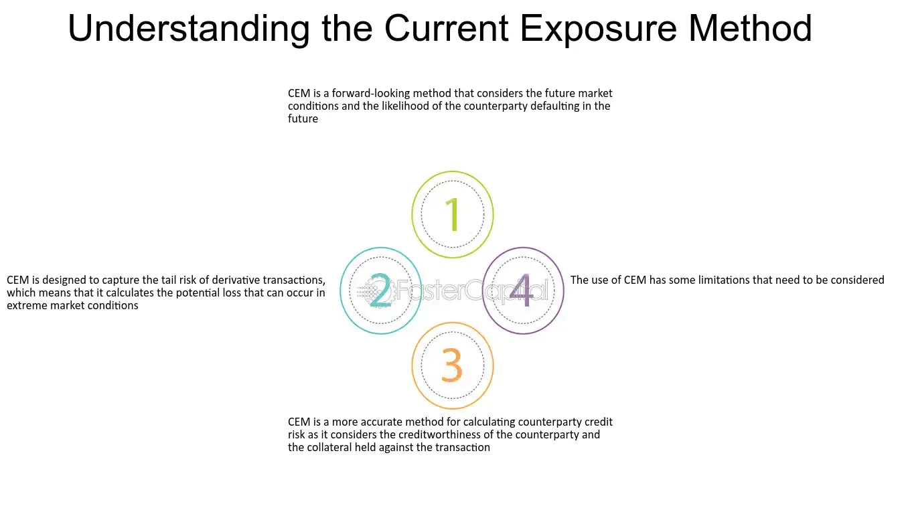

## Table of Contents

## What is the Current Exposure Method (CEM)?

The Current Exposure Method (CEM) is a way banks figure out how much risk they have from the deals they make with other banks or companies. It's used to find out how much money a bank might lose if the other side of the deal can't pay back what they owe. Banks use CEM to look at all their deals, like loans or trades, and see how much they could lose right now, not in the future.

CEM is important because it helps banks follow rules set by people who watch over banks, like regulators. These rules are there to make sure banks don't take too many risks. By using CEM, banks can see if they need to have more money saved up to cover possible losses. This helps keep the bank safe and stable, which is good for everyone who uses the bank.

## How does the Current Exposure Method differ from other exposure calculation methods?

The Current Exposure Method (CEM) is different from other ways of calculating risk because it focuses on what a bank could lose right now, not what might happen in the future. Other methods, like the Standardized Approach for Counterparty Credit Risk (SA-CCR), look at both current and future risks. CEM is simpler and easier to use because it doesn't need banks to guess about what might happen later. It just adds up the value of all deals as they stand today.

Another difference is how CEM treats different types of deals. For example, CEM uses a set formula to figure out the risk from things like interest rate swaps or foreign exchange contracts. This can sometimes make the risk seem bigger or smaller than it really is. Other methods might look at each deal more closely and use different rules for different types of deals, which can give a more accurate picture but is also more complicated.

Overall, CEM is a quick and straightforward way for banks to check their risk, but it might not be as detailed or accurate as other methods. Banks might choose to use CEM because it's easier and faster, especially if they want to follow the rules without spending too much time or money on figuring out their risks. However, for a more detailed understanding of their risk, they might also use other methods alongside CEM.

## What is the history behind the development of the Current Exposure Method?

The Current Exposure Method (CEM) was developed to help banks figure out how much risk they were taking on from their deals with other banks or companies. It was created by the Basel Committee on Banking Supervision, which is a group that makes rules to keep banks safe and stable. The Basel Committee introduced CEM as part of the Basel II framework in 2004. This framework was a big update to the rules that banks had to follow, and it included new ways for banks to measure their risks. CEM was one of these new ways, and it was meant to be simple and easy for banks to use.

Over time, people realized that CEM had some problems. It didn't always give a very accurate picture of a bank's risk, especially for certain types of deals like interest rate swaps or foreign exchange contracts. Because of these issues, the Basel Committee started working on a new method called the Standardized Approach for Counterparty Credit Risk (SA-CCR). They introduced SA-CCR in the Basel III framework in 2014. Even though SA-CCR is more detailed and accurate, CEM is still used by some banks because it's easier and quicker. Banks can choose to use either method, depending on what works best for them.

## When was the Current Exposure Method first introduced and by whom?

The Current Exposure Method (CEM) was first introduced in 2004 by the Basel Committee on Banking Supervision. This group makes rules to keep banks safe and stable around the world. They included CEM in the Basel II framework, which was a big update to the rules banks had to follow. CEM was meant to be a simple way for banks to figure out how much risk they were taking from their deals with other banks or companies.

Over time, people found out that CEM had some problems. It didn't always give a very accurate picture of a bank's risk, especially for certain types of deals. Because of these issues, the Basel Committee started working on a new method called the Standardized Approach for Counterparty Credit Risk (SA-CCR). They introduced SA-CCR in the Basel III framework in 2014. Even though SA-CCR is more detailed and accurate, some banks still use CEM because it's easier and quicker.

## What are the key components of the Current Exposure Method?

The Current Exposure Method (CEM) has a few key parts that help banks figure out their risk. The first part is the current value of all the deals a bank has with other banks or companies. This means adding up the value of loans, trades, or other deals as they stand right now. CEM also uses a thing called an "add-on" to account for the risk of different types of deals. For example, if a bank has deals like interest rate swaps or foreign exchange contracts, CEM adds a set amount to the current value to cover the risk from these deals.

Another important part of CEM is how it treats netting agreements. Netting means that if a bank has several deals with the same company, they can add up all the values and just look at the total. This can make the risk seem smaller because the gains from some deals can offset the losses from others. CEM also has a rule called the "netting set," which is a group of deals that can be netted together. By using netting and add-ons, CEM gives banks a simple way to check their risk, even if it's not always the most accurate.

## How is the Current Exposure Method used in financial risk management?

The Current Exposure Method (CEM) is used in financial risk management to help banks figure out how much risk they have from their deals with other banks or companies. Banks use CEM to add up the current value of all their deals, like loans or trades, to see how much money they might lose if the other side of the deal can't pay back what they owe. This method is important because it helps banks follow the rules set by regulators, who watch over banks to make sure they don't take too many risks. By using CEM, banks can see if they need to have more money saved up to cover possible losses, which helps keep the bank safe and stable.

CEM is also used because it's simple and quick. It doesn't need banks to guess about what might happen in the future; it just looks at the deals as they are right now. This makes it easier for banks to check their risk without spending too much time or money. However, CEM might not be as accurate as other methods because it uses a set formula for all types of deals, which can sometimes make the risk seem bigger or smaller than it really is. Despite this, many banks still use CEM because it's an easy way to meet the rules set by regulators.

## Can you provide a simple example of how to calculate exposure using the Current Exposure Method?

Imagine a bank has two deals with another company. The first deal is a loan where the bank has lent the company $100,000, and the company owes the bank $100,000 right now. The second deal is a foreign exchange contract where the bank owes the company $50,000, but the company owes the bank $60,000. To calculate the exposure using the Current Exposure Method (CEM), the bank first adds up the current values of these deals. The loan is worth $100,000 to the bank, and the foreign exchange contract is worth $10,000 to the bank (because the company owes $60,000 but the bank owes $50,000, so $60,000 - $50,000 = $10,000).

Next, the bank needs to add an "add-on" to account for the risk of the foreign exchange contract. Let's say the add-on for this type of deal is $5,000. So, the bank adds $5,000 to the $10,000 value of the foreign exchange contract, making it $15,000. Now, the bank adds the value of the loan ($100,000) to the adjusted value of the foreign exchange contract ($15,000). This gives a total exposure of $115,000. This means that, according to CEM, the bank could lose up to $115,000 if the company can't pay back what it owes.

## What are the limitations of the Current Exposure Method?

The Current Exposure Method (CEM) has some problems that banks need to know about. One big issue is that it doesn't always give a very accurate picture of a bank's risk. CEM uses the same formula for all types of deals, like interest rate swaps or foreign exchange contracts. This can make the risk seem bigger or smaller than it really is. For example, if a bank has a lot of deals with different risks, CEM might not show the true level of risk because it doesn't look at each deal closely.

Another problem with CEM is that it only looks at the risk right now, not what might happen in the future. This means it doesn't account for how deals might change over time. Other methods, like the Standardized Approach for Counterparty Credit Risk (SA-CCR), look at both current and future risks, which can give a more complete picture. Because CEM is simpler and doesn't need banks to guess about the future, it can be easier to use, but it might not be as helpful for banks that want to understand their risks better.

## How has the Current Exposure Method evolved over time?

The Current Exposure Method (CEM) was first introduced in 2004 by the Basel Committee on Banking Supervision as part of the Basel II framework. At that time, it was meant to be a simple and easy way for banks to figure out their risk from deals with other banks or companies. CEM was popular because it didn't need banks to guess about what might happen in the future; it just looked at the deals as they were right now. This made it easier for banks to check their risk without spending too much time or money.

Over time, people realized that CEM had some problems. It didn't always give a very accurate picture of a bank's risk, especially for certain types of deals like interest rate swaps or foreign exchange contracts. Because of these issues, the Basel Committee started working on a new method called the Standardized Approach for Counterparty Credit Risk (SA-CCR). They introduced SA-CCR in the Basel III framework in 2014. Even though SA-CCR is more detailed and accurate, some banks still use CEM because it's easier and quicker. Banks can choose to use either method, depending on what works best for them.

## What are some real-world applications of the Current Exposure Method in banking and finance?

Banks use the Current Exposure Method (CEM) to figure out how much risk they have from their deals with other banks or companies. For example, if a bank has given a loan to a company, CEM helps the bank see how much money it might lose if the company can't pay back the loan. This is important because it helps banks follow the rules set by people who watch over banks, called regulators. These rules are there to make sure banks don't take too many risks. By using CEM, banks can see if they need to save more money to cover possible losses, which helps keep the bank safe and stable.

CEM is also used in trading. If a bank is trading things like foreign exchange contracts or interest rate swaps with other companies, CEM helps the bank add up the value of these trades to see the risk right now. This is useful because it's a quick and easy way for banks to check their risk without spending too much time or money. Even though CEM might not always be the most accurate, many banks still use it because it's simple and helps them follow the rules set by regulators.

## How does the Current Exposure Method comply with regulatory requirements like Basel III?

The Current Exposure Method (CEM) helps banks meet the rules set by Basel III, which is a set of rules made by the Basel Committee on Banking Supervision. Basel III wants banks to be safe and stable by making sure they don't take too many risks. CEM is a way for banks to figure out how much risk they have from their deals with other banks or companies. By using CEM, banks can add up the value of all their deals right now to see how much money they might lose if the other side of the deal can't pay back what they owe. This helps banks follow Basel III's rules about having enough money saved up to cover possible losses.

Even though CEM was first introduced in Basel II, it is still used by some banks to meet Basel III requirements. Basel III introduced a new method called the Standardized Approach for Counterparty Credit Risk (SA-CCR), which is more detailed and accurate than CEM. However, CEM is simpler and quicker to use, so some banks still choose it. As long as banks use CEM correctly and make sure they have enough money saved up to cover the risks it shows, they can meet Basel III's requirements for managing risk.

## What advanced techniques can be used to enhance the accuracy of the Current Exposure Method?

To make the Current Exposure Method (CEM) more accurate, banks can use something called "stress testing." This means they look at what might happen to their deals if things get really bad, like if the economy goes down or if the value of money changes a lot. By doing this, banks can see how much risk they might have in tough times, not just right now. Stress testing can help banks be more ready for problems and make sure they have enough money saved up to cover losses.

Another way to improve CEM is by using more detailed data about each deal. Instead of using the same formula for all types of deals, banks can look at each one closely and use different rules for different deals. For example, if a bank has a lot of foreign exchange contracts, it can use special data to see how much risk these deals really have. By doing this, banks can get a better picture of their risk and make smarter decisions about how much money they need to save up.

## References & Further Reading

1. **"Algorithmic Trading and DMA: An introduction to direct access trading strategies" by Barry Johnson** - This book provides comprehensive insights into algorithmic trading strategies and the importance of risk management for traders to enhance performance efficiently. It explains various DMA (Direct Market Access) strategies and the automation of trading systems.

2. **"Quantitative Finance for Dummies" by Steve Bell** - A beginner-friendly guide that covers the essentials of quantitative finance. It includes sections on risk analysis and offers practical tips for using data analysis in financial markets.

3. **"Python for Finance: Mastering Data-Driven Finance" by Yves Hilpisch** - This book offers a detailed explanation of using Python in financial markets. It includes examples of how to create and analyse financial models, focusing on risk management and algorithmic trading.

4. **"Options, Futures, and Other Derivatives" by John C. Hull** - A classic text on derivatives, offering a rigorous exploration of the models and mechanisms that underpin them, crucial for understanding the risk management strategies involving options and futures.

5. **"The Volatility Surface: A Practitioner’s Guide" by Jim Gatheral** - A comprehensive look into implied volatility models and techniques, highly relevant for traders looking to manage risk effectively in options markets.

6. **Research Papers and Articles**: 
   - **"A Survey of Risk Analysis Methodologies"** by Smith & Jones, Journal of Financial Markets, 2020. This paper provides a detailed survey of the various quantitative and qualitative risk analysis methods applicable to algorithmic trading.

   - **"High-Frequency Trading: A Practical Guide to Algorithmic Strategies and Trading Systems" by Irene Aldridge** - This book takes a deep dive into the intricacies of high-frequency trading, offering chapters dedicated to risk control and management frameworks.

7. **Online Resources**: 
   - **QuantInsti Blog**: A repository of articles and tutorials focusing on algorithmic trading, risk management techniques, and quantitative analysis.

   - **Investopedia's Algorithmic Trading section**: Offers definitions, examples, and guides on various algorithmic trading strategies and their associated risks.

8. **Academic Courses**: 
   - **Coursera’s "Introduction to Financial Engineering and Risk Management"** - This course offers a foundational exploration of risk management techniques in financial engineering.

   - **edX’s "Algorithmic Trading and Finance Models with Python, R, and Stata"** - Teaches the use of programming in finance, including examples of risk analysis and algorithmic trading applications.

Exploring these resources will provide a comprehensive understanding of risk analysis in [algorithmic trading](/wiki/algorithmic-trading). Staying updated with these materials ensures adaptation to evolving market strategies and technological advancements.

