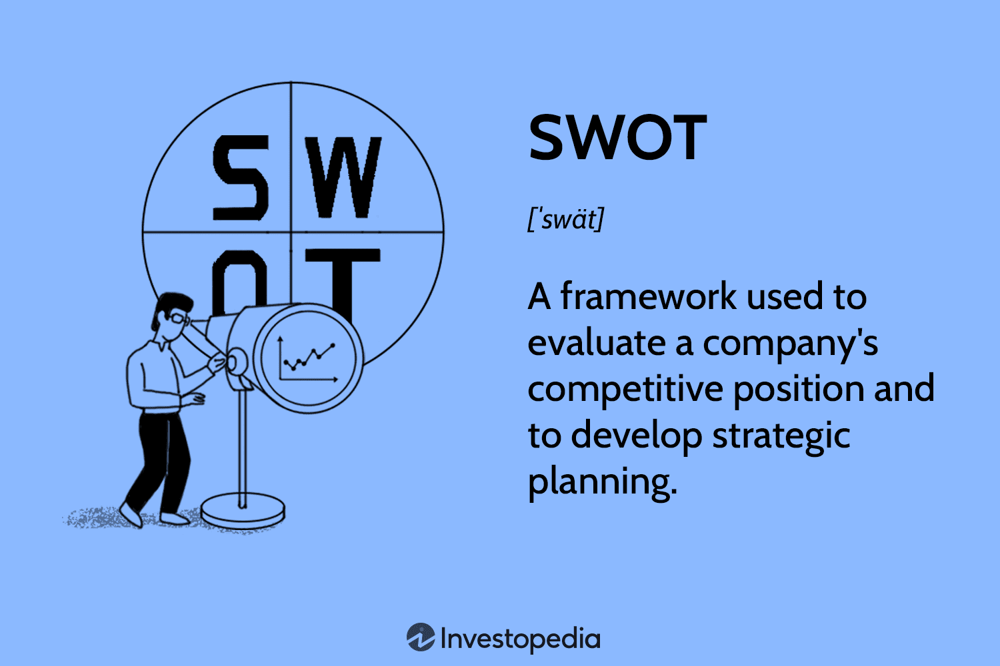

In the rapidly-evolving world of finance, algorithmic trading, often referred to as algo trading, has become an essential tool for traders and financial institutions. Algo trading utilizes computer algorithms to automate trade executions with remarkable speed and precision. As financial markets grow increasingly complex, a firm grasp of the benefits and methodologies of algo trading provides a significant competitive edge.

A key element in algo trading is throughput, which assesses how efficiently a trading system processes transactions. High throughput is particularly crucial in high-frequency trading environments where even microsecond delays can significantly impact profitability. Evaluating throughput allows traders to optimize their systems to execute trades swiftly and effectively.



Another important concept in trading strategies is the 'current face' of mortgage-backed securities (MBS). The current face indicates the remaining principal balance of a mortgage loan pool, providing insights into the performance and health of these investments. Monitoring the current face helps investors assess prepayment risks and adjust their valuation assumptions accordingly.

This article explores the interplay between throughput, current face calculations, and the broader advantages of algo trading. By examining these concepts, traders and investors can enhance their strategic approaches, ensuring improved market decisions and potentially higher returns. Through understanding and integrating these elements, participants in financial markets can better navigate the challenges of modern trading environments.

## Table of Contents

## Understanding Current Face in Mortgage-Backed Securities

Current face, an essential metric for mortgage-backed securities (MBS), designates the present par value, or outstanding principal amount, of a pool of mortgages within the security. It provides investors a clear view of the current value and performance of an MBS by indicating how much of the initial principal remains unpaid. The calculation of current face is direct yet vital for tracking financial health and anticipated returns of the security.

Initially, when an MBS is issued, the current face is equivalent to its original face value, representing the total amount of unpaid principal within the pool of mortgages. As mortgage holders make monthly payments, the current face value declines, reflecting the amortization of the underlying mortgages. Specifically, with each payment made, a portion is directed towards reducing the principal, consequently decreasing the current face. This gradual reduction impacts the total interest that investors earn, as it aligns directly with the outstanding balance.

One critical aspect of the current face is its role in assessing investment assumptions and adjusting risk evaluations. By comparing the declining current face value against initial projections, investors can identify whether their assumptions regarding mortgage prepayments—early repayments that exceed scheduled amounts—and valuation terms were accurate. For instance, accelerated prepayments can lead to a faster decrease in the current face than anticipated, affecting the income from interest payments and potentially signaling a need for portfolio rebalancing.

Understanding the nuances of current face also aids in evaluating the [volatility](/wiki/volatility-trading-strategies) and reliability of cash flows derived from MBS investments. Given that mortgage prepayments can result from varying [interest rate](/wiki/interest-rate-trading-strategies) environments or borrower inducements, monitoring current face helps in managing risk and forecasting future returns. Accordingly, investors can employ sophisticated financial models to simulate different scenarios, ensuring more robust investment strategies and informed decision-making. 

Ultimately, knowing the current face of an MBS allows for strategic adjustments in investment portfolios, effectively measuring the impact of principal repayments on anticipated cash flows and ensuring alignment with financial goals.

## The Calculations Behind Current Face

Calculating the current face of a mortgage-backed security (MBS) is essential for understanding its current value and assessing potential investment outcomes. The current face is determined by multiplying the current pool [factor](/wiki/factor-investing) by the MBS's original face value. Initially, the pool factor is set to one, indicating that the entire principal amount is outstanding. As the underlying mortgages in the pool are repaid over time, the pool factor decreases, representing the reduction in principal.

The formula for calculating the current face value $CF$ of an MBS is given by:

$$
CF = PF \times OFV
$$

where:
- $CF$ is the current face value,
- $PF$ is the current pool factor,
- $OFV$ is the original face value of the MBS.

This calculation provides critical insights for investors, enabling them to evaluate whether the expected returns on the MBS align with their initial forecasts. For instance, a faster-than-expected decrease in the current face value may suggest higher prepayment rates, potentially reducing the anticipated interest income. Conversely, a slower decline could indicate lower prepayment rates, which might prolong the receipt of interest payments.

Investors utilize this calculation to assess deviations from expected prepayment rates, which is crucial for risk management. Prepayment risk can significantly impact the interest income of an MBS, as borrowers may refinance or pay off their mortgages earlier than expected, leading to a quicker return of principal. Understanding the current face helps investors make informed decisions about buying, holding, or selling mortgage-backed securities, allowing them to navigate changes in interest rates and macroeconomic conditions effectively.

## Benefits of Understanding Current Face

Understanding the current face of mortgage-backed securities (MBS) is pivotal for investors aiming to evaluate valuation assumptions and prepayment risks accurately. This knowledge enables more informed decision-making, which is essential in the dynamic context of financial markets.

Monitoring the current face provides investors with a precise measure of the remaining principal of a mortgage pool, which is crucial for anticipating future cash flows. Having an accurate sense of cash flows allows investors to manage their portfolios more effectively, ensuring that they align with financial goals and risk tolerance. For instance, by knowing the current face, an investor can predict future interest income and principal repayments with greater accuracy.

In addition to evaluating cash flow predictions, the current face allows traders to discern the market valuation of an MBS. This involves comparing the current face value against current market conditions to determine whether a security is undervalued or overvalued. If the current face suggests that the MBS is undervalued, traders might see an opportunity for profit by purchasing the asset. Conversely, if the security appears overvalued, they might consider selling or hedging to mitigate potential losses.

An example with basic Python can illustrate how calculating the current face might be integrated into automated trading systems to enhance decision-making:

```python
class MortgageBackedSecurity:
    def __init__(self, original_face, pool_factor):
        self.original_face = original_face
        self.pool_factor = pool_factor

    def calculate_current_face(self):
        return self.original_face * self.pool_factor

# Example usage
mbs = MortgageBackedSecurity(original_face=1000000, pool_factor=0.8)
current_face_value = mbs.calculate_current_face()
print(f"Current Face Value: ${current_face_value}")
```

This script initializes an MBS with an original face value and a pool factor, then calculates the current face, demonstrating how technology can assist in ongoing assessment and execution of strategies based on current market insights.

In conclusion, understanding the current face is not merely an exercise in accounting; it's a strategic tool that helps investors navigate the complexities of MBS markets, managing opportunities and risks more effectively.

## Algorithmic Trading: Enhancing Throughput and Efficiency

Throughput is a fundamental performance metric in [algorithmic trading](/wiki/algorithmic-trading), reflecting the efficiency with which a trading system processes transactions within a specific timeframe. This measure is vital for traders and financial institutions seeking competitive advantages, particularly in high-frequency trading ([HFT](/wiki/high-frequency-trading-strategies)) environments. HFT requires systems that not only execute trades swiftly but also manage large volumes of data with minimal latency.

In high-frequency trading, even microsecond delays can result in missed opportunities or financial losses. Therefore, achieving high throughput is essential for successful trade execution. A trading system with high throughput can process a vast array of transactions, quickly updating positions and responding to market changes. This capability allows traders to capitalize on fleeting opportunities, such as [arbitrage](/wiki/arbitrage), where rapid execution is crucial.

Algorithmic trading systems with high throughput provide several advantages. Firstly, they optimize trade executions by ensuring that buy and sell orders are carried out promptly, reducing slippage and enhancing pricing precision. Secondly, they support the handling of substantial data flows, enabling sophisticated data analysis and strategy evaluations in near real-time. This is particularly important in markets where price movements are driven by intricate patterns that require advanced computational techniques for detection and response.

To achieve high throughput, several technological and infrastructural components must be considered. Efficient data handling is imperative, ensuring that market data is rapidly ingested, processed, and acted upon. This requires robust data management frameworks that can seamlessly integrate with algorithmic trading strategies. Furthermore, optimizing network configurations can significantly reduce latency. High-speed connections, such as fiber-optic cables, are often employed to minimize transit time between trading systems and exchanges.

Additionally, the architecture of trading systems plays a crucial role in throughput optimization. Modern systems often utilize parallel processing techniques and distributed computing frameworks to improve computational efficiency. By distributing the workload across multiple processors or nodes, the system can manage numerous transactions concurrently, preventing bottlenecks and enhancing overall system performance.

In conclusion, throughput is a pivotal factor in algorithmic trading that directly influences a system's ability to execute trades efficiently and competitively. By employing strategies that enhance throughput, traders can not only optimize execution timing and pricing but also gain a significant edge in the financial markets. High throughput systems are indispensable in high-frequency trading, enabling traders to navigate complex markets with speed and precision.

## Factors Influencing Throughput in Algo Trading

Several factors influence throughput in algorithmic trading systems, including network latency, data processing speed, and system architecture. These components are crucial for ensuring optimal performance and timely execution of trades.

Network latency pertains to the time delay between initiating a data transfer and its completion. Minimizing this delay is essential in maintaining high throughput, as even fractions of a second can impact trade outcomes significantly. To mitigate latency, financial institutions often use advanced technologies like fiber-optic connections which offer higher data transfer speeds. Parallel processing frameworks also play a role in enhancing data transfer by allowing simultaneous data processing, thus reducing the time taken for executing trades.

Data processing speed is another critical factor. Efficient data handling ensures quick access and processing of vast volumes of market data, which is necessary for making timely trading decisions. Leveraging high-performance computing (HPC) resources and optimized algorithms can accelerate data processing. For instance, algorithms should be designed to minimize computational complexity, thereby reducing the time taken for processing trade data. Using languages like Python, developers can implement optimized algorithms. For example, parallelizing code to run on multiple processors can enhance throughput:

```python
from joblib import Parallel, delayed
import numpy as np

def process_data(data):
    # Simulate complex data processing
    return np.mean(data)

data_chunks = [np.random.rand(1000) for _ in range(10)]
results = Parallel(n_jobs=4)(delayed(process_data)(chunk) for chunk in data_chunks)
```

This Python code showcases how parallel processing can be used to improve data handling, thus enhancing throughput.

System architecture also significantly impacts throughput. A well-designed architecture can process multiple transactions efficiently by utilizing resources effectively. It is important for trading systems to incorporate scalable architectures that can expand resources based on demand. This scalability ensures that as the [volume](/wiki/volume-trading-strategy) of trades increases, the system can handle the additional load without compromising performance.

In conclusion, optimizing throughput in algorithmic trading involves focusing on reducing network latency, enhancing data processing speed, and designing efficient system architectures. These improvements ensure that algorithmic trading systems operate swiftly and reliably, facilitating successful trade execution in fast-paced financial markets.

## Conclusion: Integrating Current Face and Throughput in Trading Strategies

In today's complex financial markets, synthesizing concepts like current face and throughput in trading strategies can greatly enhance decision-making capabilities. For investors dealing with mortgage-backed securities (MBS), understanding the current face of these securities is crucial. It provides a window into the cash flow characteristics of an investment by indicating the remaining principal balance of the loans backing the security. Accurate insight into this metric enables investors to make informed predictions concerning future cash flows and any deviations due to prepayments.

In contrast, algorithmic trading, empowered by robust systems with high throughput, ensures that traders can seize market opportunities with unprecedented speed and accuracy. High throughput systems process large volumes of data swiftly, which is essential in fast-paced trading environments known for extreme sensitivity to time delays. By optimizing system architecture, and employing advanced data handling and low-latency technologies, algorithmic traders can achieve expedited trade executions.

Merging the understanding of current face with high-frequency trading strategies enhances the capacity to evaluate and react to market trends effectively. This synergy allows for risk mitigation and the maximization of returns. As trading environments evolve, the ability to integrate detailed asset information with adaptive, high-speed execution strategies becomes increasingly indispensable. By doing so, market participants can position themselves advantageously, reducing exposure to risks while increasing the potential for gains in a landscape where precision and speed dictate success.

## References & Further Reading

[1]: Adrian, T., & Shin, H. S. (2010). ["The Changing Nature of Financial Intermediation and the Financial Crisis of 2007-09."](https://www.newyorkfed.org/medialibrary/media/research/staff_reports/sr439.pdf) National Bureau of Economic Research.

[2]: Vayanos, D., & Woolley, P. (2013). ["An Institutional Theory of Momentum and Reversal."](https://personal.lse.ac.uk/vayanos/Papers/ITMR_RFS13.pdf) The Journal of Finance, 68(1), 113-158.

[3]: Fabozzi, F. J. (2001). ["The Handbook of Mortgage-Backed Securities."](https://academic.oup.com/book/7943) McGraw-Hill Education.

[4]: Aldridge, I. (2013). ["High-Frequency Trading: A Practical Guide to Algorithmic Strategies and Trading Systems."](https://www.amazon.com/High-Frequency-Trading-Practical-Algorithmic-Strategies/dp/1118343506) John Wiley & Sons.

[5]: Tse, Y., & Zhang, X. (2017). ["High Frequency Trading, Slow Information, and the Probability of Informed Trading."](https://www.sciencedirect.com/science/article/pii/S1062976922000321) Journal of Financial Markets, 34, 80-99.

[6]: Gürkaynak, R. S., & Wright, J. H. (2012). ["Macroeconomics and the Term Structure."](https://www.jstor.org/stable/23270023) Journal of Economic Literature, 50(2), 331-367.