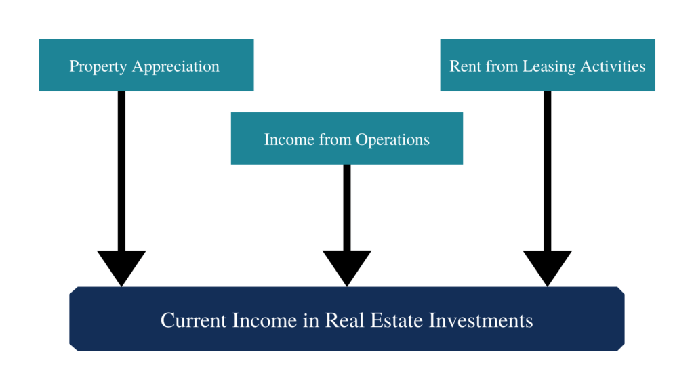

## Table of Contents

## What is current income?

Current income is the money you earn or receive regularly at the present time. This can come from different places like your job, investments, or even rental properties. For example, if you have a job, your current income would be your salary or wages that you get every month or week.

Knowing your current income is important because it helps you plan your spending and saving. If you know how much money you are getting regularly, you can make a budget to make sure you can pay your bills and save some money for the future. It's like knowing how much water is coming into your bucket so you can plan how to use it without running out.

## How is current income different from total income?

Current income is the money you get right now, like your weekly or monthly salary from your job, or the interest from your savings account this month. It's what you have coming in at the moment. Total income, on the other hand, is all the money you've earned over a longer time, like a year. It includes everything you've made, not just what you're getting right now.

Think of current income like the water flowing into your bucket today. Total income is like how much water has filled your bucket over the whole year. Knowing your current income helps you plan your spending for this month, while knowing your total income can help you see how well you did over the year and plan for bigger things, like buying a house or going on a big trip.

## What are the common sources of current income?

Common sources of current income include money from jobs, where you get paid a salary or wages for working. This can be from a full-time job, part-time job, or even freelance work. Another big source is money from investments, like the interest you earn from a savings account or dividends from stocks you own. If you own rental properties, the rent you collect each month is also part of your current income.

Other sources can include government benefits, like social security or unemployment benefits, which you receive regularly. If you get money from a pension or retirement account, that's another type of current income. Sometimes, people also get money from side gigs or hobbies, like selling things online or doing odd jobs for neighbors. All these different places add up to make your current income, which is the money you have coming in right now.

## How can someone calculate their current income?

To calculate your current income, you need to add up all the money you get regularly right now. This means looking at your payslip if you have a job, to see how much you earn each week or month. If you get money from other places like interest from a savings account, dividends from stocks, or rent from a property, you should add those amounts too. Don't forget to include any government benefits, like social security or unemployment payments, and any money from side gigs or hobbies.

Once you have all these numbers, just add them up to find your total current income. For example, if you earn $2,000 a month from your job, $100 from interest on your savings, and $300 from renting out a room, your current income would be $2,400 a month. It's important to keep track of all these sources because they all add up to the money you have coming in right now, which helps you plan your spending and saving.

## Why is understanding current income important for financial planning?

Understanding your current income is really important for planning your money because it tells you how much money you have coming in right now. When you know this, you can make a budget to see how much you can spend on things like food, bills, and fun stuff, and how much you can save for the future. If you don't know your current income, it's like trying to fill a bucket without knowing how much water is coming in—you might run out too soon or not use it wisely.

Also, knowing your current income helps you make smart choices about big things like buying a house or going back to school. If you see that your current income is not enough to cover these big steps, you might decide to look for ways to earn more money or cut back on spending. This way, you can plan better and make sure you can reach your goals without stressing about money.

## What are the tax implications of current income?

When you earn money, you have to pay taxes on it. This means that part of your current income goes to the government. The amount you pay depends on how much you earn and the tax rules where you live. If you have a job, your employer usually takes out some money for taxes before you get your paycheck. This is called withholding. If you get money from other places like interest from savings or rent from a property, you might need to pay taxes on that too, but you might have to figure out how much to pay and send it to the government yourself.

Understanding the tax on your current income is important because it affects how much money you actually get to keep. If you don't pay the right amount of taxes, you might have to pay extra later, plus a fine. But if too much is taken out, you might get some money back when you file your taxes. Knowing about taxes helps you plan better because you can figure out how much of your current income you can really use for your budget and savings.

## How does current income affect eligibility for loans or credit?

When you want to get a loan or credit, like a credit card or a car loan, the people giving you the money, like a bank, will look at your current income. They want to know if you earn enough money right now to pay back the loan or credit card bill. If your current income is high, they might think you are more likely to pay them back, so they might give you the loan or credit. But if your current income is low, they might worry that you won't be able to pay, and they might say no or give you less money than you asked for.

Your current income also helps decide how much you can borrow and what interest rate you will get. If you have a good, steady current income, you might get a bigger loan and a lower interest rate because the bank thinks you are a safe bet. But if your current income is not so high or it changes a lot, the bank might give you a smaller loan or charge you a higher interest rate because they see you as riskier. So, knowing your current income is important when you are trying to get a loan or credit.

## What strategies can be used to increase current income?

One way to increase your current income is by asking for a raise or finding a better-paying job. If you've been doing a good job at work, you might talk to your boss about getting paid more. If that doesn't work, you could look for a new job that pays more money. Another way is to learn new skills that can help you earn more. You could take classes or get training in something that's in demand, like computer programming or healthcare. This can open up better-paying job opportunities.

Another strategy is to start a side gig or a small business. You could do something you enjoy, like making crafts, tutoring, or driving for a ride-share service. This extra work can bring in more money each month. You could also rent out a room in your home or sell things you don't need anymore. All these little things can add up to increase your current income.

Lastly, you can look at your investments. If you have money saved, you could put it into things that pay you more, like stocks that give dividends or a savings account with a higher interest rate. This way, the money you already have can start working harder for you, bringing in more current income without you having to do extra work.

## How do fluctuations in current income impact budgeting?

Fluctuations in current income can make budgeting harder. When your income changes a lot, it's tough to know how much money you'll have each month. If you earn less one month, you might have to cut back on spending or dip into your savings. This can mess up your plans and make it hard to pay for things you need, like rent or food. On the other hand, if you earn more one month, you might be tempted to spend more, but it's smart to save that extra money for times when your income might drop again.

To handle these ups and downs, you can make a flexible budget. This means setting aside some money each month for unexpected changes in income. You can also keep a close eye on your spending and adjust it when your income goes up or down. By saving a bit when you earn more and being careful when you earn less, you can keep your budget on track even when your income fluctuates.

## What role does current income play in investment decisions?

Your current income helps you decide how much money you can put into investments. If you have a lot of money coming in each month, you might be able to save more and invest it in things like stocks, bonds, or real estate. This can help your money grow over time. But if your current income is low, you might not have much left over after paying for your needs, so you might not be able to invest as much or at all. Knowing how much money you have coming in right now is key to figuring out how much you can put into investments without messing up your budget.

Also, your current income can affect what kinds of investments you choose. If your income is steady and you feel safe about your money coming in, you might be okay with riskier investments that could give you bigger returns, like stocks. But if your income changes a lot and you're worried about having enough money, you might pick safer investments, like a savings account or bonds, so you don't lose what you put in. By understanding your current income, you can make smarter choices about where to put your money to reach your financial goals.

## How can current income be stabilized or secured against economic downturns?

To keep your current income stable during tough economic times, you can try to save money when things are going well. Think of it like putting extra water in your bucket when it's raining, so you have some to use when it's dry. By saving a little bit of your income each month, you can build up an emergency fund. This fund can help you cover your bills if you lose your job or if your income drops because of a downturn. It's also smart to have different ways to earn money, like a side job or investments that pay you regularly. This way, if one source of income goes down, you still have others to fall back on.

Another way to secure your current income is by learning new skills or getting more education. This can make you more valuable at work, so you're less likely to lose your job during hard times. Also, if you can, try to work in a field that's always needed, like healthcare or education. These jobs are usually more stable because people always need them, no matter what's happening with the economy. By planning ahead and being ready to adapt, you can help keep your income steady even when times get tough.

## What advanced metrics or tools can be used to analyze and forecast changes in current income?

To analyze and forecast changes in your current income, you can use advanced metrics like trend analysis and regression models. Trend analysis looks at your past income to see if there are patterns, like if your income goes up or down at certain times of the year. This can help you predict what might happen in the future. Regression models use math to find out how different things, like the economy or your job performance, affect your income. By putting in data about these factors, the model can guess how your income might change if those factors change.

Another useful tool is a financial forecasting software, like Quicken or Microsoft Excel with advanced features. These programs can help you keep track of your income and expenses, and use that data to make predictions. They can also create charts and graphs that make it easier to see trends and patterns. If you want to get even more detailed, you can use economic indicators, like unemployment rates or inflation, to see how big economic changes might affect your income. By combining all these tools and metrics, you can get a clearer picture of what might happen to your income in the future and plan accordingly.

## References & Further Reading

[1]: Bergstra, J., Bardenet, R., Bengio, Y., & Kégl, B. (2011). ["Algorithms for Hyper-Parameter Optimization."](https://dl.acm.org/doi/10.5555/2986459.2986743) Advances in Neural Information Processing Systems 24.

[2]: ["Advances in Financial Machine Learning"](https://www.amazon.com/Advances-Financial-Machine-Learning-Marcos/dp/1119482089) by Marcos Lopez de Prado

[3]: ["Evidence-Based Technical Analysis: Applying the Scientific Method and Statistical Inference to Trading Signals"](https://www.amazon.com/Evidence-Based-Technical-Analysis-Scientific-Statistical/dp/0470008741) by David Aronson

[4]: ["Machine Learning for Algorithmic Trading"](https://github.com/stefan-jansen/machine-learning-for-trading) by Stefan Jansen

[5]: ["Quantitative Trading: How to Build Your Own Algorithmic Trading Business"](https://github.com/LucindaYa/quant-resources/blob/master/Quantitative%20Trading%20How%20to%20Build%20Your%20Own%20Algorithmic%20Trading%20Business.pdf) by Ernest P. Chan