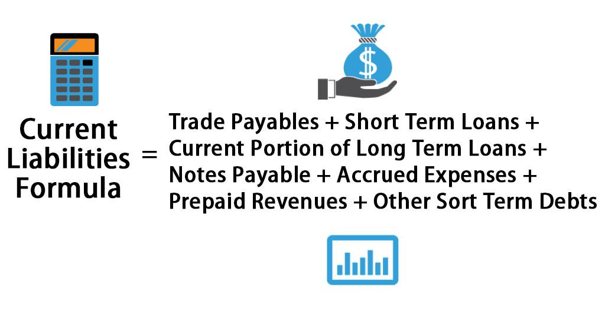

Financial accounting is a fundamental process that involves the identification, measurement, and communication of financial information. Central to this discipline is the management of liabilities, which form a crucial part of a company's balance sheet. Understanding liabilities is essential for businesses as they represent obligations that must be managed effectively to ensure ongoing financial stability.

Current liabilities represent short-term financial obligations that a company is required to settle within a year. These might include accounts payable, short-term loans, wages, taxes owed, and other payables. Efficient calculation and management of current liabilities are critical for maintaining liquidity—ensuring a company can meet its immediate obligations without affecting its long-term viability.



The dynamic nature of modern financial markets has introduced sophisticated techniques such as algorithmic trading, traditionally associated with investment management. However, algorithmic trading can also enhance liability management. By leveraging automated and pre-programmed trading strategies, companies can optimize the timing for settling liabilities, thus minimizing costs and improving cash flow management. Proper handling of these short-term obligations is essential to uphold financial health and mitigate risks associated with liquidity shortages.

This article will explore the methods for calculating current liabilities, the role of accounting practices in managing these obligations, and the potential for algorithmic trading to optimize financial liability management. By examining these elements, businesses can gain insights into maintaining robust financial health in today's fast-paced economic environment.

## Table of Contents

## Understanding Current Liabilities

Current liabilities are defined as financial obligations that a company is obligated to settle within one year or within its normal operating cycle, whichever is longer. These liabilities can include various types of commitments, each of which plays a crucial role in the financial structuring and daily operations of a business. Key examples of current liabilities include accounts payable, short-term debts, and dividends payable. Additionally, items like accrued liabilities, customer deposits, and other immediate financial obligations fall under this category.

Accounts payable represent the money a company owes to its suppliers for goods and services purchased on credit. This liability is a typical component of current liabilities and must be monitored closely to maintain good supplier relationships and avoid late payment penalties. Short-term debts, also known as notes payable, involve loans taken by the company that are due for repayment within the fiscal year. Such debts require careful scheduling to align with the company's cash flow capabilities.

Dividends payable are another example and refer to the declared dividends that have been approved by a company's board of directors but not yet paid to shareholders. Payment of dividends is typically conducted in the short term and represents a financial commitment that must be honored to uphold shareholder trust.

The management of these current liabilities is essential because they are typically settled using current assets, such as cash or accounts receivable. Efficient management ensures the company maintains adequate [liquidity](/wiki/liquidity-risk-premium), thus safeguarding financial solvency. Failure to manage these liabilities effectively can result in liquidity crises, leading to potential default events and a loss of creditworthiness.

The ability to manage current liabilities is a critical aspect of financial health, as it impacts a company's ability to meet short-term obligations without straining its resources. Proper management involves maintaining a balance between current assets and current liabilities, often analyzed through liquidity ratios such as the current ratio and quick ratio. These metrics provide insights into the company's capacity to cover its liabilities with its available assets. 

Ensuring that current liabilities are well-managed requires diligent financial planning and continuous monitoring to preempt any potential cash flow issues. By doing so, companies can preserve their financial stability and sustain their operational success.

## Importance of Calculating Current Liabilities

Accurate calculation of current liabilities is vital for effective financial planning and budgeting. It provides a cornerstone for evaluating a company's ability to meet short-term obligations and navigate cash flow challenges efficiently. Current liabilities, typically encompassing accounts payable, short-term loans, accrued expenses, and other imminent financial commitments, are crucial indicators of a company's operational and financial stability.

To assess a business's ability to manage these obligations, certain financial ratios and tools are commonly employed. The current ratio is one such tool and is calculated as follows:

$$
\text{Current Ratio} = \frac{\text{Current Assets}}{\text{Current Liabilities}}
$$

This ratio provides insights into whether a company has enough current assets to cover its current liabilities, thereby indicating its short-term financial health. A ratio of greater than one is generally preferred, as it signifies that the company has more current assets than liabilities.

Another useful metric is the quick ratio (or acid-test ratio), which offers a more stringent assessment by excluding inventory from current assets. It is calculated by:

$$
\text{Quick Ratio} = \frac{\text{Current Assets} - \text{Inventory}}{\text{Current Liabilities}}
$$

Calculating current liabilities and employing these ratios help investors and creditors assess the financial health and creditworthiness of a company. For investors, a comprehensive understanding of a company's liabilities is crucial when evaluating potential investment risks and returns. For creditors, it determines the likelihood of being repaid. These calculations enable businesses to anticipate financial constraints and make informed decisions to ensure stability and growth.

Implementing precise calculations for current liabilities and employing predictive tools can offer significant advantages, thus supporting strategic planning that aligns with the company's financial goals.

## Algorithmic Trading and Liability Management

Algorithmic trading involves the use of complex algorithms and automated systems to execute trading instructions at high speeds and volumes, which are beyond the capability of human traders. This technology is predominantly used to manage investments and hedge against various financial risks, but its application extends to managing financial liabilities as well.

By leveraging [algorithmic trading](/wiki/algorithmic-trading), companies can optimize the timing for transactions associated with the settlement of liabilities. This is achieved through predictive analytics and advanced data processing methods, which allow for precise forecasting of cash flows. Consequently, firms can align their liability settlements with periods of optimal cash inflow, thus minimizing the risk of liquidity shortfalls.

For example, an algorithm might be programmed to monitor cash account balances in real time and execute transactions when a set threshold is exceeded or to take advantage of favorable market conditions. This ensures that liabilities are covered efficiently without unnecessarily tying up working capital.

Furthermore, algorithmic trading techniques can assist in simulations and stress testing to anticipate future cash flow challenges and evaluate contingency plans. By using data-driven strategies, companies could predict their liability coverage needs under various economic scenarios, leading to more informed decision-making.

Moreover, integrating algorithmic trading with liability management can facilitate a dynamic response to market movements, allowing companies to adjust their liability strategies in response to changing conditions. This agility reduces the risk of default and enhances overall financial stability.

In Python, a simple representation of such a mechanism might involve functions to predict optimum transaction points based on incoming cash flows or market conditions:

```python
import numpy as np
from scipy.optimize import minimize

# Predict cash flow and liabilities function
def predict_cash_flow(current_cash, expected_inflows):
    return current_cash + sum(expected_inflows)

def optimize_liability_settlement(cash_flows, liabilities):
    # Objective function to minimize
    def objective(x):
        return np.abs(predict_cash_flow(x[0], x[1]) - liabilities)

    # Initial guess
    x0 = [0,0]  # Starting guess

    # Optimize to find the best transaction time
    result = minimize(objective, x0, method='SLSQP', bounds=[(0, None), (0, None)])

    return result.x

# Example usage
current_cash = 1000
expected_inflows = [200, 300, 400]
liabilities = 1800

optimum_points = optimize_liability_settlement(expected_inflows, liabilities)
print(f"Optimize Cash Flow: {optimum_points}")
```

In this script, using mathematical optimization techniques, firms can explore different scenarios to maintain necessary liquidity for covering liabilities at the optimal times, reflecting how algorithmic trading principles might be applied to liability management.

## Current Liabilities: Calculation Techniques

To calculate current liabilities, companies meticulously compile all short-term obligations that fall due within their fiscal year. This involves accounting for various financial components such as accounts payable, short-term debt, accrued liabilities, and other impending financial commitments. To ensure comprehensive accounting, several techniques and methods are utilized.

### Accounts Payable and Short-Term Debt

Accounts payable represents the obligations a company owes to its suppliers and creditors for goods and services received. Calculating this requires a detailed ledger that documents each transaction, the payment terms, and any outstanding balances as of the balance sheet date. Similarly, short-term debt incorporates all financial borrowings that require repayment within one year, such as promissory notes and short-term bank loans.

### Accrued Liabilities

Accrued liabilities consist of expenses that have been incurred but not yet paid by the end of the fiscal period. This includes wages that are due to employees, interest payable on loans, and taxes that are owed but not yet settled. The accurate calculation of accrued liabilities involves projecting incurred expenses over the accounting period and adjusting entries to reflect these obligations.

### Common Evaluation Metrics

Two prevalent metrics for assessing current liabilities are the current ratio and the quick ratio. These ratios provide insight into a company's liquidity, that is, its ability to fulfill short-term obligations efficiently.

1. **Current Ratio**: This is calculated as the ratio of current assets to current liabilities. 
$$
   \text{Current Ratio} = \frac{\text{Current Assets}}{\text{Current Liabilities}}

$$

   A current ratio greater than 1 indicates that a company has more current assets than its current liabilities, signifying good short-term financial health.

2. **Quick Ratio**: Also known as the acid-test ratio, this is a more stringent measure as it excludes inventory from current assets, focusing on the most liquid assets only.
$$
   \text{Quick Ratio} = \frac{\text{Current Assets} - \text{Inventory}}{\text{Current Liabilities}}

$$

   The quick ratio provides a more conservative view of a company's liquidity by assessing its ability to meet obligations without relying on the sale of inventory.

### Python Implementation Example

To automate these calculations, Python can be employed, allowing for efficient and error-free computation. Below is a simplistic example of how one might calculate these ratios using Python:

```python
def calculate_ratios(current_assets, inventory, current_liabilities):
    # Current Ratio
    current_ratio = current_assets / current_liabilities

    # Quick Ratio
    quick_ratio = (current_assets - inventory) / current_liabilities

    return current_ratio, quick_ratio

# Example data
current_assets = 50000
inventory = 15000
current_liabilities = 30000

current_ratio, quick_ratio = calculate_ratios(current_assets, inventory, current_liabilities)
print(f"Current Ratio: {current_ratio:.2f}")
print(f"Quick Ratio: {quick_ratio:.2f}")
```

By implementing these methods and leveraging computational tools, businesses can precisely assess their current liabilities and maintain robust financial oversight, ensuring sustained operational stability.

## Examples and Case Studies

Case studies provide valuable insights into how businesses navigate the management of current liabilities and the potential benefits of integrating algorithmic trading into their financial operations. A notable example of successful liability management is Walmart Inc., a multinational retail corporation, which effectively manages its current liabilities through strategic payment terms with suppliers, leveraging economies of scale, and optimizing cash flows. Walmart's proactive approach ensures liquidity and operational stability, primarily by maintaining a balanced ratio of current assets to current liabilities.

Walmart employs a meticulous inventory management system to facilitate just-in-time ordering, minimizing the amount of capital tied up in unsold stock. The company’s financial team uses sophisticated data analytics to project cash flow needs accurately, ensuring that liabilities such as accounts payable and accrued expenses are settled without affecting overall liquidity. This method significantly reduces the reliance on external funding sources for short-term obligations and enhances financial health.

On the other hand, the fall of Enron Corporation serves as a cautionary tale about poor liability management. Enron's failure in 2001 was largely due to deceptive accounting practices that masked true financial health, including off-balance-sheet liabilities that went unnoticed by investors and analysts. This resulted in a lack of transparency regarding Enron's actual current liabilities, which contributed to its eventual bankruptcy. The inability to meet these liabilities triggered a loss of investor confidence, highlighting the consequence of insufficient financial oversight and inaccurate liability reporting.

In contrast, the role of algorithmic trading in enhancing liability management is exemplified by Goldman Sachs. The financial institution employs algorithmic trading to optimize its liquidity by adjusting trading strategies according to market conditions. Algorithmic trading enables Goldman Sachs to hedge against potential market risks, ensuring that liability obligations are met without significant disruptions. By using algorithms, the firm can execute trades at optimal times, maximizing returns, and securing necessary cash flows to cover current liabilities efficiently.

In summary, proper management of current liabilities is crucial for financial stability as demonstrated by Walmart's successful strategy and Enron's failure. The integration of algorithmic trading, as seen in Goldman Sachs, can provide additional layers of precision and resilience in meeting financial obligations, proving indispensable in today's dynamic financial landscape.

## Conclusion

Efficient management and calculation of current liabilities are instrumental in maintaining a company's liquidity and ensuring its operational success. These short-term financial obligations, if not managed diligently, can jeopardize a firm's ability to cover immediate expenses, therefore undermining its financial stability. By accurately calculating these liabilities, companies can better manage their cash flows, align their financial strategies with business goals, and portray a sound financial position to investors and creditors.

Algorithmic trading, typically associated with investment optimization, also offers considerable potential in managing financial liabilities. Through automation and the utilization of sophisticated algorithms, businesses can optimize the timing of transactions involved in settling liabilities. This technology aids in forecasting cash flows more precisely, ensuring that coverage for liabilities is met efficiently and reducing the associated financial risks. Additionally, algorithmic solutions can [carry](/wiki/carry-trading) out adjustments swiftly in response to market changes, providing a dynamic approach to liability management that traditional methods may lack.

Businesses are compelled to continuously innovate their accounting practices to remain competitive in today's rapidly evolving financial landscape. The integration of advanced computing techniques such as algorithmic trading within liability management represents a strategic advancement, converging cost reduction, precision, and enhanced financial oversight. As companies embrace these innovations, they not only reinforce their financial health but also position themselves effectively in a market characterized by increasing complexity and speed.

## References & Further Reading

[1]: Fabozzi, F. J., Focardi, S. M., & Kolm, P. N. (2010). ["Quantitative Equity Investing: Techniques and Strategies."](https://www.semanticscholar.org/paper/Quantitative-Equity-Investing%3A-Techniques-and-Fabozzi-Focardi/1c49a2a53919f7e65cb96f16691b8ff726fd3cd7) John Wiley & Sons.

[2]: Schwatrz, R. A., Byrne, J. A., & Weber, B. W. (2006). ["The New NASDAQ Marketplace: From Dealer Market to Electronic Order Book."](https://psycnet.apa.org/record/1986-98707-000) Springer.

[3]: Hull, J. C. (2018). ["Options, Futures, and Other Derivatives."](https://www.semanticscholar.org/paper/Options%2C-Futures%2C-and-Other-Derivatives-Hull/89bdee500c8623864fc9eb7a471546aa713acc44) Pearson.

[4]: Hendershott, T., & Mende, G. G. (2015). ["Information and Liquidity."](https://www.semanticscholar.org/paper/Algorithmic-Trading-and-Information-Hendershott-Riordan/992bb61fe2a9861310118f9f68ad98433e75eefd) Journal of Finance, 70(5), 2197-2235.

[5]: Patel, S. A., & Wolfe, C. R. (2014). ["Algorithmic Trading: Pros and Cons."](https://www.semanticscholar.org/paper/Self-employment-and-allostatic-load-Patel-Wolfe/173122fce9c4dd01009bd491f521b536191f446e) Journal of Economic Perspectives, 28(2), 25-44.