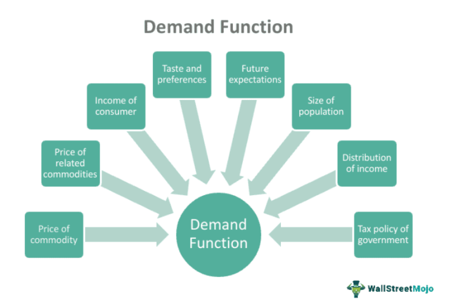

The concept of Current Market Value (CMV) is crucial in financial markets as it indicates the present resale value of a financial instrument or asset. By providing an accurate representation of an asset's worth at any given time, CMV serves as a vital tool for investors and traders. This understanding allows for the assessment of whether the market is valuing an asset correctly compared to its intrinsic value. Thus, mastery of CMV is integral for making informed trading and investment decisions, helping market participants to strategize effectively.

Algorithmic trading, which involves using computer algorithms to execute trades at speeds and frequencies beyond human capability, is a burgeoning field within finance that heavily relies on real-time CMV data. The precision of CMV offers traders and algorithms insights into market trends, enabling them to react swiftly to price movements. In this article, the exploration centers on the interaction between CMV and market valuation processes, as well as their combined impact on trading algorithms.



Understanding these dynamics is essential for those interested in harnessing technology to capitalize on market opportunities. Algorithmic trading strategies, when integrated with accurate CMV, empower traders to optimize asset pricing models and refine their trading methodologies. By examining the nexus of CMV and algorithmic trading, this article provides a comprehensive look at how advanced financial technologies are shaping market landscapes and decision-making processes.

## Table of Contents

## Understanding Current Market Value (CMV)

Current Market Value (CMV) represents the present worth or resale value of a financial instrument or asset in the open market. It reflects the price at which an asset would trade between a willing buyer and a willing seller under normal market conditions. In finance, CMV is crucial as it helps investors and financial professionals assess the current state of their investments, enabling them to make informed decisions regarding buying, selling, or holding particular assets.

CMV is significantly connected to the liquidity of markets and assets. Liquidity refers to the ease with which an asset can be converted into cash without affecting its market price. Highly liquid assets, such as stocks of companies with large market capitalizations or government bonds, typically have a CMV that closely approximates their last traded price due to frequent trading activity and narrow bid-ask spreads. Conversely, less liquid assets, such as real estate or collectibles, might have a CMV that is more challenging to determine due to infrequent transactions and broader bid-ask spreads. Liquidity is a crucial factor that influences CMV, as assets with higher liquidity tend to have more stable and predictable market values.

CMV is instrumental in establishing fair market prices for transactions. It serves as a benchmark for assessing whether the price of an asset is overvalued, undervalued, or fairly valued. Accurate CMV determination helps buyers and sellers negotiate prices that reflect the asset's true market worth. For instance, in the stock market, CMV is often derived from the most recent transaction price, which represents the consensus value at a given time. 

In the management of brokerage accounts, especially concerning margin investing, CMV plays a pivotal role. When investors borrow funds from a broker to purchase securities, they must maintain a minimum level of equity in their account, known as the maintenance margin. The brokerage employs CMV to regularly evaluate the value of the securities held within the account. If the CMV of the securities falls below the required maintenance margin, the investor may face a margin call, compelling them to deposit additional funds or sell assets to meet the margin requirements.

Examples of CMV application can be observed in both liquid and non-liquid markets. In liquid markets such as the stock exchange, CMV is frequently updated to reflect the most recent trading prices and volumes. For non-liquid markets like real estate, CMV is less straightforward to ascertain. Real estate CMV often relies on recent comparable sales, appraiser evaluations, and market trends to arrive at an estimated value. While these methods may lack the immediacy of data available in stock markets, they still strive to mirror the asset's fair market value at a given time.

In conclusion, Current Market Value is a crucial component in the financial sector, guiding transactions, facilitating [liquidity](/wiki/liquidity-risk-premium) assessments, and playing a vital role in brokerage account management. Its ability to reflect real-time market conditions ensures that financial decisions are grounded in accurate and relevant market assessments.

## Market Valuation and Its Implications

Market valuation is the process of determining the present value of an asset or a company. It plays a crucial role in the financial sector by providing a measurable perspective on the economic worth of stocks, assets, or market segments at any given time. By analyzing market valuation, investors and analysts can gauge whether a security or market is underpriced, fairly priced, or overpriced. This measurement is vital for making informed investment decisions and understanding the broader economic climate.

#### Snapshot of Economic Health or Overvaluation

Market valuation offers a snapshot of an economic entity's health or potential overvaluation by assessing current pricing against various benchmarks and indicators. A market deemed overvalued may suggest impending price corrections, while one undervalued might present investment opportunities. Economic indicators assessed in market valuation can include earnings reports, balance sheets, market trends, and geopolitical factors, all of which collectively shape investors' perceptions of market health.

#### Methods Used for Market Valuation

Several methods are employed to achieve accurate market valuation. Common techniques include:

- **Price-to-Earnings Ratio (P/E Ratio)**: This ratio evaluates a company's current share price relative to its per-share earnings, helping investors understand if a stock is over or undervalued.

- **Discounted Cash Flow (DCF) Analysis**: DCF estimates the value of an investment based on its expected future cash flows, adjusted for time value of money.

- **Book Value**: This approach assesses a company's fundamental value through assets and liabilities, often used in liquidation scenarios.

- **Buffett Indicator**: Named after Warren Buffett, this indicator compares the overall value of a nation's publicly traded stocks to its GDP. It suggests overvaluation when market cap exceeds GDP, indicating that the market's value is higher than the country’s economic output. 

```python
def buffett_indicator(market_cap, gdp):
    return market_cap / gdp

# Example usage
market_cap = 30000000000  # Total market capitalization
gdp = 25000000000  # Gross Domestic Product
buffett_ratio = buffett_indicator(market_cap, gdp)
print("Buffett Indicator Ratio:", buffett_ratio)
```

#### Implications of Market Valuation

Market valuation significantly influences investor sentiment and strategy. When valuations are high, investors might perceive the market as risky, leading to conservative investment strategies or divestment. Conversely, low valuations can present buying opportunities, sparking increased market activity. Additionally, extreme valuations might lead to market corrections or bubbles, as seen in historical financial crises. Understanding these dynamics is essential for managing portfolios, anticipating market movements, and devising strategic approaches to mitigate risks or capitalize on potential growth. 

Valuation metrics guide monetary policy decisions and corporate strategies, impacting everything from interest rates to capital expenditure planning. Therefore, market valuation is not merely a static measure but a dynamic, influential [factor](/wiki/factor-investing) in the financial ecosystem.

## Algorithmic Trading and CMV

Algorithmic trading refers to the use of computer algorithms to automate the trading of financial instruments. These algorithms make decisions based on a pre-defined set of rules that can include timing, price, quantity, or other mathematical models. The rise of [algorithmic trading](/wiki/algorithmic-trading) has transformed modern markets, allowing traders to execute large volumes of trades at speeds and frequencies that human traders cannot match.

Current Market Value (CMV) data plays a central role in algorithmic trading strategies. By providing up-to-date information on the resale value of assets, CMV allows algorithms to make real-time decisions that optimize trading performance. Algorithms use CMV to identify [arbitrage](/wiki/arbitrage) opportunities, execute market-making strategies, and manage risk by continuously assessing the fair value of assets. For instance, if an algorithm detects that an asset's market price diverges significantly from its CMV, it might initiate trades to capitalize on the expected reversion to its fair value.

The advantages of utilizing CMV in real-time asset pricing are substantial. Algorithmic trading platforms that leverage accurate CMV data can enhance pricing models, ensuring trades are executed based on the most relevant and current market conditions. This real-time approach helps minimize delays and slippage, which are critical in high-frequency trading environments where speed is paramount.

However, integrating CMV data into trading algorithms presents challenges. Consistency and accuracy of CMV data are vital, as discrepancies can lead to flawed trading decisions and financial losses. Moreover, maintaining the quality of CMV data is a continuous challenge due to market [volatility](/wiki/volatility-trading-strategies) and the dynamic nature of asset values.

Several case studies highlight the significant influence of CMV on algorithmic trading outcomes. For instance, during the 2020 market disruption caused by the COVID-19 pandemic, algorithms that efficiently integrated CMV data were able to adjust their trading strategies to mitigate risks and capitalize on market volatility. These algorithms successfully leveraged shifts in supply and demand reflected in CMV data, identifying opportunities in price dislocations and executing trades more effectively than counterparts relying on less dynamic data inputs.

In summary, algorithmic trading relies heavily on CMV to achieve optimal trading performance. The ability to process and react to real-time CMV data offers tremendous benefits but also requires overcoming significant data integration challenges. The continuous evolution of algorithmic trading highlights the importance of robust data strategies, including the use of CMV, to maintain a competitive edge in modern financial markets.

## The Interplay Between CMV, Market Valuation, and Algo Trading

Current Market Value (CMV) and market valuation are integral to algorithmic trading, a field that relies on data-driven strategies for executing trades. CMV represents the real-time value of an asset, while market valuation provides a broader assessment of market conditions, often using comprehensive metrics like price-to-earnings ratios or market capitalization.

**Interaction in Algorithmic Trading**

In algorithmic trading, the interaction between CMV and market valuation can significantly influence trading decisions. CMV offers algorithms immediate insights into the value of assets, allowing for timely trades based on current market conditions. Market valuation, on the other hand, provides context for these trades, helping to assess whether assets are overvalued or undervalued.

For instance, an algorithm might use CMV to set thresholds for buy/sell orders, while the overarching market valuation could contextualize these thresholds within broader economic trends. This dual approach can optimize trade entries and exits, increasing the likelihood of profitability.

**Impact on Decision-Making and Market Dynamics**

This interplay affects decision-making by equipping traders with both immediate and contextual data. Algorithms that incorporate CMV can rapidly respond to market changes, enhancing trade efficiency. However, combining this with market valuation data can temper this speed with prudence, ensuring trades are not only fast but strategically sound.

Market dynamics are also shaped by this interaction. As algorithms optimize decisions based on CMV and market valuation, they contribute to liquidity and market depth. This can stabilize markets, as rational decision-making based on current data reduces the likelihood of erratic price movements.

**Risks and Rewards of Using CMV in Algorithms**

The reliance on CMV in algorithmic trading presents both risks and rewards. A primary risk is the potential for reliance on inaccurate or delayed CMV data, which can lead to suboptimal trading decisions. Algorithms are only as good as the data they receive, and any discrepancies in CMV can lead to significant financial losses.

On the reward side, precise CMV integration can lead to superior asset pricing and execution timing, enhancing profitability. When accurately implemented, CMV-based algorithms can outperform traditional trading strategies by capitalizing on short-lived market opportunities.

**Future Trends in CMV Adoption**

The adoption of CMV in trading technologies is likely to grow, driven by advancements in data analytics and [machine learning](/wiki/machine-learning). Future trends may include the development of more sophisticated algorithms that can synthesize CMV with predictive modeling to anticipate market movements.

Moreover, as data integration technologies advance, there will likely be a push towards creating more comprehensive trading platforms that offer seamless access to real-time CMV data. This could enhance the decision-making capabilities of algorithms, making them more responsive to market changes and less susceptible to errors caused by outdated data.

In conclusion, the intersection of CMV, market valuation, and algorithmic trading offers both challenges and opportunities. Traders and investors must remain vigilant, ensuring that the data they rely on is accurate and contextually relevant to maximize the potential benefits while minimizing associated risks.

## Challenges and Criticisms

Current Market Value (CMV) serves as a cornerstone for numerous financial activities, yet it is not without its criticisms. One major criticism of CMV is its reliability and accuracy, often questioned due to market volatility and data collection challenges. Market conditions can change rapidly, causing the CMV to fluctuate drastically within short periods. This volatility can lead to discrepancies between the calculated CMV and the actual value at the time of transaction, impacting decisions made by traders and investors.

The utilization of CMV in market valuation and trading also faces scrutiny. Critics argue that CMV might not always reflect the true or intrinsic value of an asset, especially in illiquid or volatile markets where trading volumes are low. In such scenarios, CMV could be skewed by few transactions that do not represent broader market consensus. This can lead to inaccurate estimations of an asset’s worth, potentially misleading investors who rely heavily on CMV data.

Maintaining up-to-date and precise CMV data poses another significant challenge. With the rapid pace of market dynamics, continuous updates are essential to ensure CMV remains relevant. However, obtaining real-time data necessitates robust technological infrastructure and consistent data feeds, which can be costly and resource-intensive. Furthermore, discrepancies in data collection methods and sources can introduce variability and inaccuracy into CMV computations.

Algorithmic trading, heavily reliant on CMV, can encounter several limitations and potential biases. Algorithms may execute trades based on outdated or erroneous CMV data, leading to suboptimal trading decisions. The dependency on CMV assumes that the value accurately represents current market conditions, which might not always be the case in fast-moving or manipulated markets. Additionally, biases can seep into algorithmic models if the underlying CMV data is skewed or does not capture the complete market picture.

To address these challenges, financial institutions need to invest in advanced data collection and processing technologies that enhance the timeliness and accuracy of CMV data. Furthermore, incorporating additional factors and indicators beyond CMV into algorithmic models can help mitigate potential biases and lead to more informed trading decisions.

## Conclusion

Current Market Value (CMV) plays a pivotal role in the financial sector, influencing trading strategies and investment decisions significantly. This measurement provides a current snapshot of an asset's worth, influencing how these assets are traded and perceived in various markets. Understanding CMV is essential for both traders and investors as it informs their decision-making processes, allowing them to assess the profitability and risk associated with their trades accurately.

The utilization of CMV in algorithmic trading presents immense potential for future market developments. Algorithmic trading strategies that incorporate CMV data benefit from more accurate real-time asset pricing, making them more competitive in fast-paced financial environments. This integration allows for the development of sophisticated algorithms that can adapt to market changes swiftly and make informed decisions, potentially enhancing profit margins and improving market efficiency.

Further exploration and adaptation of CMV in diverse trading frameworks are encouraged to leverage its benefits fully. This involves enhancing the precision and accessibility of CMV data, addressing challenges in its application, and exploring innovative ways to incorporate it into algorithmic models. Such advancements could lead to more robust trading frameworks that optimize market movements and mitigate associated risks.

In conclusion, CMV's role in the financial landscape is indisputably significant. By embracing its potential, traders and investors can refine their strategies, capitalize on market opportunities, and contribute to the evolution of trading technologies.

## References & Further Reading

[1]: Bergstra, J., Bardenet, R., Bengio, Y., & Kégl, B. (2011). ["Algorithms for Hyper-Parameter Optimization."](https://dl.acm.org/doi/10.5555/2986459.2986743) Advances in Neural Information Processing Systems 24.

[2]: ["Advances in Financial Machine Learning"](https://www.amazon.com/Advances-Financial-Machine-Learning-Marcos/dp/1119482089) by Marcos Lopez de Prado

[3]: ["Evidence-Based Technical Analysis: Applying the Scientific Method and Statistical Inference to Trading Signals"](https://www.amazon.com/Evidence-Based-Technical-Analysis-Scientific-Statistical/dp/0470008741) by David Aronson

[4]: ["Machine Learning for Algorithmic Trading"](https://github.com/stefan-jansen/machine-learning-for-trading) by Stefan Jansen

[5]: ["Quantitative Trading: How to Build Your Own Algorithmic Trading Business"](https://github.com/LucindaYa/quant-resources/blob/master/Quantitative%20Trading%20How%20to%20Build%20Your%20Own%20Algorithmic%20Trading%20Business.pdf) by Ernest P. Chan