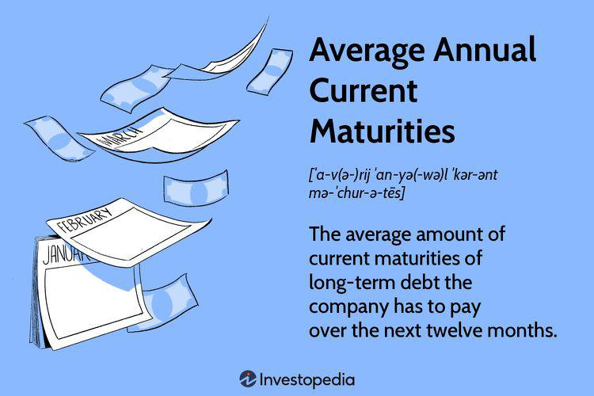

Understanding financial maturity is crucial for investors and traders aiming to maximize returns and manage risks effectively. Financial maturity, representing the scheduled end date of a financial instrument, plays a pivotal role in both asset valuation and investment management. For investors in fixed-income securities, financial maturity dictates when they can expect the return of their principal alongside accrued interest, thereby impacting their financial planning and liquidity management. Similarly, for traders, financial maturity affects the pricing and yield of bonds and derivatives, influencing market strategies and investment decisions.

In addition, financial maturity is a significant parameter in algorithmic trading. This advanced trading methodology employs computer algorithms to execute trades based on predefined criteria, including maturity data. By integrating complex data analysis and predictive modeling, algorithmic trading transforms the traditional landscape of managing financial instruments, allowing investors to respond dynamically to market fluctuations and optimize their portfolios.



The integration of algorithmic solutions, hence, provides a framework for aligning maturity profiles with strategic investment goals. As financial markets continue to evolve with technological advancements, understanding and effectively managing financial maturity becomes increasingly essential for achieving long-term financial success. This article will explore these concepts, notably examining current maturity, financial maturity in algorithmic trading, and the broader implications for strategic investment. Through these insights, investors can enhance their ability to navigate the financial markets with precision and effectiveness.

## Table of Contents

## What is Financial Maturity?

Financial maturity signifies the predetermined date on which a financial instrument's principal amount, alongside any accrued interest, must be repaid. This concept is fundamental to a variety of financial instruments, including bonds, loans, and derivatives, each with specified maturity dates that significantly influence their investment performance and strategic applications.

In bonds, maturity dates are crucial because they determine the period over which the bondholder will receive interest payments, typically called coupon payments, along with the principal repayment at the end. The yield of a bond is directly linked to its maturity, with longer maturities generally presenting higher interest rates to compensate for increased risk exposure over time. For instance, a bond with a maturity of 10 years usually offers a higher yield compared to one with a maturity of 2 years, given the extended duration risk involved.

Loans, similar to bonds, also possess defined maturity periods. These periods are essential for both lenders and borrowers to establish the timeline for interest payments and principal repayment. The maturity of a loan affects both the interest rate and the amortization schedule, thus impacting the cash flow and financial planning of the involved parties.

Derivatives, such as options and futures, also feature expiration dates, which serve as their maturity points. These instruments derive their value from underlying assets, and their maturity dates dictate the timeframe for which the derivative remains valid. The closer a derivative approaches its maturity date, the more its time value diminishes, influencing its pricing and the strategic choices of investors.

Maturity serves as a pivotal element for issuing entities in their financial strategy and operations planning. For companies, the maturity profile of their debts or obligations influences their credit ratings and the management of refinancing risks. Having a well-structured maturity schedule enables corporations to optimize their capital structure by balancing short-term and long-term liabilities and ensuring sufficient [liquidity](/wiki/liquidity-risk-premium) for ongoing operations and investments.

Investors, too, must consider maturity as a critical [factor](/wiki/factor-investing) in their portfolio management. Aligning the maturities of investments with financial goals and cash flow needs is imperative for maximizing returns and managing risks. Investors may employ strategies such as laddering maturities to evenly spread out [interest rate](/wiki/interest-rate-trading-strategies) exposure and reduce reinvestment risk.

In summary, financial maturity is an essential concept that shapes the characteristics and strategies associated with financial instruments. By understanding and effectively managing maturity dates, issuing entities and investors can optimize their financial operations and investment portfolios for enhanced profitability and risk mitigation.

## Current Maturity in Fixed-Income Investments

Current maturity in fixed-income investments refers to the period remaining until the bond or financial instrument reaches its maturity date. This term plays a significant role in determining both a bond's valuation and the yield it offers to investors. The concept of current maturity is crucial for assessing liquidity, calculating interest incomes, and strategizing investment decisions.

### Calculating Current Maturity
The current maturity of a bond is calculated as the difference between the bond's issuance date and its maturity date. This period indicates the time left before the principal amount is due. The formula for calculating current maturity can be expressed as:

$$
\text{Current Maturity} = \text{Maturity Date} - \text{Current Date}
$$

### Impact on Valuation and Yield
The maturity of a bond affects its sensitivity to interest rates, which is a key determinant of its price and yield. Bonds with a shorter maturity generally have less interest rate risk compared to long-term bonds, as they are less sensitive to rate changes. This inverse relation is captured in the yield-to-maturity (YTM), which simplifies investors' comparisons across bonds with different maturities.

### Effects on Financial Obligations and Debt Recognition

1. **Financial Obligations**: Companies often stagger the maturity dates of their debt instruments, which helps in maintaining balanced cash flows. The obligations reflected by these maturities can influence business decisions, including refinancing and capital expenditures.

2. **Long-term Debt Recognition**: Current maturity also affects how a company's debts are recognized on balance sheets. As bonds approach maturity, they transition from long-term liabilities to current liabilities, impacting financial ratios and potentially influencing borrowing costs.

### Examples and Market Evaluations

Consider a bond issued with a maturity of 10 years. After 7 years, its current maturity is reduced to 3 years. This remaining duration affects not only the bond's valuation but also the issuer’s strategic decisions in managing debt.

Here is a Python example to compute the current maturity of a bond:

```python
from datetime import datetime

def calculate_current_maturity(issue_date, maturity_date):
    current_date = datetime.now().date()
    return (maturity_date - current_date).days / 365  # Convert days to years

# Example usage
issue_date = datetime(2010, 1, 1).date()
maturity_date = datetime(2020, 1, 1).date()
print(f"Current Maturity: {calculate_current_maturity(issue_date, maturity_date)} years")
```

In this example, you can easily adjust the `issue_date` and `maturity_date` to assess the current maturity of different bonds.

### Investment Decisions
Investors consider current maturity alongside other metrics such as credit rating and coupon rate to make informed investment choices. Generally, as a bond's maturity decreases, its price approaches par value, assuming there are no defaults or significant interest rate changes.

Short-term bonds might be chosen by investors seeking to minimize exposure to interest rate [volatility](/wiki/volatility-trading-strategies), whereas longer-term bonds might be favorable for higher returns, albeit at increased risk. Understanding current maturity enables investors to anticipate interest rate movements and align their portfolios with their risk appetite and income needs.

Current maturity is therefore essential for both valuing investment opportunities and managing financial reporting and debt strategies within companies.

## Algorithmic Trading and Its Influence on Financial Maturity

Algorithmic trading, often referred to as algo trading, leverages computer programs and sophisticated algorithms to execute trades at speeds and frequencies far beyond human capability. A critical aspect of these algorithms is their ability to incorporate financial maturity data, optimizing trade execution based on predefined criteria concerning maturity dates.

By integrating maturity dates into trading algorithms, these programs can adeptly predict changes in valuations, adjusting strategies dynamically to capitalize on potential market movements. For instance, an algorithm can be programmed to sell certain fixed-income securities approaching maturity if the projected interest rate environment is unfavorable. This ability to adjust positions based on maturity data helps to minimize risk and optimize returns.

A key mathematical tool utilized in algo trading is the present value formula, which helps determine the current worth of an investment in light of its remaining time to maturity. The formula is expressed as:

$$
\text{PV} = \frac{C}{(1+i)^n}
$$

where $PV$ is the present value, $C$ is the cash flow at maturity, $i$ is the interest rate, and $n$ is the time to maturity. Algorithms use such calculations to evaluate whether holding a financial instrument is beneficial compared to reinvestment opportunities.

Several trading platforms have incorporated these capabilities, enhancing trading strategies with sophisticated algorithms that analyze financial maturity data. For example, platforms like MetaTrader 5 and QuantConnect offer traders tools to develop complex strategies using Python or C++. These platforms provide APIs that allow traders to write custom algorithms that account for maturity dates, predict valuation shifts, and execute trades automatically.

In Python, a simple algorithm could look like this:

```python
import numpy as np

def calculate_present_value(cash_flow, interest_rate, time_to_maturity):
    return cash_flow / (1 + interest_rate)**time_to_maturity

# Example parameters
cash_flows = [1000, 1050, 1100]  # Cash flows at maturity years
interest_rate = 0.05  # 5% annual interest rate
maturities = [1, 2, 3]  # Maturity years

# Calculate present values
present_values = [calculate_present_value(cf, interest_rate, t) for cf, t in zip(cash_flows, maturities)]
valued_investments = sum(present_values)

print(f"Total valued investments: {valued_investments}")
```

This Python snippet calculates the present values for different cash flows based on their maturities and interest rates, a foundational analysis characteristic of algo trading. By utilizing such methods, [algorithmic trading](/wiki/algorithmic-trading) transforms how financial maturities are managed, allowing for more informed and strategically timed investment decisions.

## Implications of Maturity in Investment Strategies

Understanding the implications of maturity is crucial for crafting effective investment strategies. Maturity directly influences the risk-return profile of various financial instruments, which necessitates aligning maturity profiles with investment objectives.

One popular strategy is the bond ladder approach. This technique involves purchasing bonds with staggered maturity dates. It allows investors to manage bond reinvestment risks and maintain a steady cash flow. For example, consider a bond ladder comprising bonds with maturities of one, three, and five years. As each bond matures, the principal can be reinvested into a new five-year bond, thereby extending the ladder and maintaining exposure to potentially higher long-term yields. This strategy helps mitigate interest rate risks because not all bonds are subject to the same market conditions at once.

Another effective strategy is the barbell approach, which combines short-term and long-term bonds. In doing so, investors protect against interest rate fluctuations while also aiming for growth from longer-term investments. Short-term bonds can be rapidly adjusted to changing interest rates, providing liquidity. Meanwhile, long-term bonds can offer higher yields to compensate for their greater interest rate exposure.

Maturity significantly impacts how investors weather interest rate changes and economic shifts. When interest rates rise, the prices of existing fixed-income securities generally fall. The relationship is mathematically expressed by the duration formula, which estimates the sensitivity of a bond's price to interest rate changes. Maintaining a diversity of maturities can reduce the overall portfolio volatility, dispersing risk across various time frames. 

Furthermore, economic changes can influence maturity decisions. During economic downturns, longer maturities might pose a higher risk due to potential defaults or downgrades, making shorter maturities a safer choice. Conversely, in stable or growing economies, extending maturities could allow investors to lock in higher yields, maximizing returns.

In sum, aligning investment maturity with strategic goals requires understanding and leveraging various fixed-income strategies. By utilizing bond ladders and barbell approaches, investors can optimize their portfolios for yield, risk management, and liquidity, effectively navigating the complexities introduced by fluctuating interest rates and economic changes.

## Challenges and Considerations in Maturity Management

Managing maturity within financial portfolios presents several challenges that investors and traders must navigate. Key among these are reinvestment risk and interest rate risk. Reinvestment risk arises when an investor must reinvest the funds from a maturing investment at a lower rate of return than the original investment. This is particularly problematic in a declining interest rate environment where high-yielding investments become scarce, potentially reducing the expected returns of a portfolio over time. To mitigate reinvestment risk, investors may use strategies such as bond ladders, which stagger the maturity dates of bonds, allowing for reinvestment at potentially varying interest rates.

Interest rate risk, on the other hand, refers to the potential for investment losses due to fluctuations in interest rates. For fixed-income securities, when interest rates rise, the value of existing bonds decreases, potentially impacting the valuation of portfolios holding these securities. Managing interest rate risk involves monitoring economic indicators and adjusting the duration of bond portfolios accordingly, which can include shifting investments into shorter-duration bonds or interest rate derivative instruments.

Technological advancements, specifically algorithmic trading, have increasingly influenced the management of financial maturities. Algorithms can analyze large datasets to model interest rate movements and optimize the timing of trades to exploit maturity-related opportunities. These technologies depend heavily on factors such as the quality of input data, computational power, and the sophistication of algorithm design. However, even with advanced algorithms, the financial markets' inherent volatility presents challenges. Algorithms must be designed to respond to rapid price changes and external economic shocks, necessitating robust volatility mitigation techniques, such as dynamic hedging strategies and scenario testing.

Despite the efficiencies of algorithmic trading, human oversight remains crucial. Algorithms can efficiently process and react to quantifiable data, but they can struggle with qualitative factors like regulatory changes, geopolitical events, and market sentiment, which are often less predictable. Human oversight ensures that trading strategies remain aligned with broader investment goals and adaptability to changing market conditions. Investors and managers must therefore strike a balance, leveraging the computational strengths of algorithms while maintaining the strategic insight and adaptability that human decision-makers provide.

In conclusion, successfully managing financial maturities involves navigating reinvestment and interest rate risks while addressing the technological intricacies and limitations associated with algorithmic trading. The integration of advanced data processing techniques with human expertise is essential for optimizing portfolio performance and achieving financial objectives.

## Conclusion

Understanding financial maturity is essential for aligning investments with one's financial goals. It involves recognizing the implications of maturity dates on investment decisions and effectively managing both current and future financial obligations. Successful investors leverage this knowledge to navigate complex markets and enhance their portfolios' performance.

Algorithmic trading has significantly transformed how financial maturities are managed and optimized within investment strategies. By employing sophisticated algorithms, traders can efficiently analyze data related to maturity dates, facilitating timely and informed decision-making. These computer-driven strategies allow for the prediction of valuation changes and the execution of trades with precision. Algorithms can simulate various scenarios, helping investors anticipate market movements and adjust their portfolios in accordance with shifts in interest rates or economic conditions.

Despite the advancements in technology, it's crucial for investors and traders to blend these tools with traditional financial management practices. While algorithms provide an edge in processing large volumes of data and executing trades rapidly, human oversight remains vital in interpreting complex market signals and making strategic decisions that align with broader financial objectives. By integrating technological tools with established investment principles, investors can achieve a comprehensive approach to managing their financial maturities, thereby maximizing returns and minimizing risks.

In conclusion, understanding financial maturity plays a pivotal role in achieving financial objectives. Algorithmic trading has transformed investment management by optimizing strategies around maturity dates. Investors are encouraged to combine technological advancements with traditional methods to enhance financial outcomes and ensure robust portfolio management.

## References & Further Reading

1. **Fabozzi, Frank J. (Editor). _Fixed Income Analysis_ (CFA Institute Investment Series).**  
   This comprehensive guide offers a deep dive into the nuances of fixed-income instruments, including an analysis of maturity's impact on investment strategies. It provides a solid foundation for understanding the role of financial maturity in portfolio management.

2. **Chincarini, Ludwig B., and Kim, Daehwan. _Quantitative Equity Portfolio Management: An Active Approach to Portfolio Construction and Management._**  
   This book explores the intersection of quantitative methods and equity portfolio management, highlighting how advances in algorithmic trading affect maturity strategies and decisions.

3. **Durbin, Michael. _All About High-Frequency Trading._**  
   An insightful resource for understanding how high-frequency and algorithmic trading are reshaping investment landscapes. It provides context on the strategic use of maturity data for improving trading outcomes.

4. **Hull, John C. _Options, Futures, and Other Derivatives._**  
   This authoritative textbook covers a wide range of financial instruments and techniques, providing insights into the mechanics of derivatives, including the significance of maturity dates in pricing and trading strategies.

5. **Harris, Larry. _Trading and Exchanges: Market Microstructure for Practitioners._**  
   This text investigates into market microstructure and the functionality of different exchanges, including the role of maturity in trading financial instruments, contributing to a better understanding of strategic investment practices.

6. **Website: Investopedia - "Understanding Bond Maturity Dates"**  
   A concise online resource explaining the basics of bond maturity dates and their implications for investors. Available at: [Investopedia](https://www.investopedia.com/terms/m/maturitydate.asp)

7. **Journal Articles:**
   - **"Algorithmic Trading and the Impacts of Algorithmic Trading Strategies on Stock Prices"** by Chaboud, Alain, Ben S. Chiquoine, Erik Hjalmarsson, and Clara Vega. Published in the Journal of Finance.  
   This research paper offers insights into the effects of algorithmic trading on stock prices, with a focus on how the integration of maturity data can result in more strategic trading decisions.

   - **"Liquidity and Microstructure: The Fundamentals of Liquidity"** by Lasse H. Pedersen. Published in the Journal of Financial Markets.  
   This article provides a foundational understanding of market liquidity and its relationship with trading practices and investment strategies that incorporate financial maturity.

These resources are designed to enhance your understanding of financial maturity, its impact on various investment strategies, and the transformative role of algorithmic trading in modern finance.